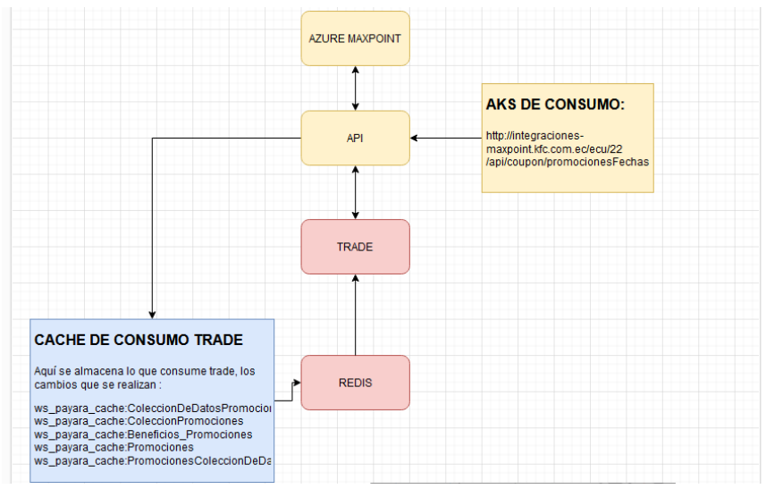

# Consumo de API de Cupones
## Prueba

Para consumir la API de cupones, utilizamos las siguientes herramientas:

- Postman
- Redis

### En Postman se va a trabajar con el siguiente AKS:

> > Citemos a Julio Cortazar
>
> > Los paradigmas son tan penetrantes e invisibles que se confunden fácilmente con la verdad.
>

- Elemento1
- Elemento2
- Elemento3

1. Elem1
2. Elem2
3. Elem3

```
class(Mainwindow):

```

***
---
- - -

*cursiva*  
**negrita**  
***negrita***  

[The Haunting Of Hill House](https://carlosjeguren.com/critica-la-maldicion-de-hill-house-shirley-jackson/)

Resumen del libro: https://carlosjeguren.com/critica-la-maldicion-de-hill-house-shirley-jackson/

`Class(MainWindow):`  
`def __init__`


Aquí se genera el JSON de cupones, esto es la información que está en Azure:
http://integraciones-maxpoint.kfc.com.ec/ecu/22/api/coupon/promocionesFechas

- ### Configurar en Postman:

Para extraer la información se cambia las fechas y se genera el JSON de los cupones.


### Estructura de JSON de Sincronización

El JSON de sincronización tiene la siguiente estructura:

- **Configuración del Cupón**: Datos del cupón.
- **Categoria promoción**: Medio en el que será visible, en este caso, AUTORAPIDO.
- **Beneficios**: Puede ser algún descuento.
- **Productos_requeridos**: Producto que está atado al cupón.
- **Restaurantes**: En que tienda van a ser aplicados.
- **Canales**: APP

## Configuración del Cupón
```json
{
  "id_Promociones": "EB1580D4-2F64-4E35-87C4-E10CAFF7E4D7",
  "cdn_id": 10,
  "codigo_externo": "7E4D7000000851",
  "nombre": "COMBO KCS CRISPY BBQ 40 OFF CUPON APP",
  "nombre_imprimible": "1 KENTUCKY CRISPY BBQ + PAPA FRITA REG - BEBIDA BOTELLA",
  "codigo_amigable": "",
  "limite_canjes_total": 50000,
  "limite_canjes_cliente": 0,
  "total_canjeados": 0,
  "caduca_con_tiempo": 0,
  "tiempo_validez": 0,
  "unidad_tiempo_validez": "",
  "activo_desde": "2024-01-12",
  "activo_hasta": "2024-04-27",
  "requiere_productos": 0,
  "requiere_forma_pago": 0,
  "puntos_acumulables": 0,
  "saldo_acumulable": 0,
  "bruto_minimo_factura": 0,
  "bruto_maximo_factura": 0,
  "cantidad_minima_productos_factura": 0,
  "permite_otras_promociones": 0,
  "maximo_canje_multiple": 0,
  "requiere_dias": 1,
  "dias_canjeable": "5",
  "requiere_horario": 0,
  "horario_canjeable": "",
  "requiere_rango_edad": 0,
  "rango_edad": "",
  "requiere_genero": 0,
  "genero": "",
  "tiene_codigo_unico": 0,
  "activo": 1,
  "motivo_inactivacion": "",
  "permite_descuento_sobre_descuento": 0,
  "concatenador_beneficios": "AND",
  "concatenador_plus_promocion": "AND",
  "requiere_canal": 0,
  "requiere_restaurante": 1,
  "fechacreacion": "2024-01-11T15:45:21.567",
  "lastUser": "3CE99964-D7ED-ED11-800F-C89665503CDF",
  "lastUpdate": "2024-01-11T15:45:21.567",
  "prioridad": 1
  
}
```
## Categoría Promoción:
```json
"categoria_promocion": {
"idcategoria": "9E0DB689-660A-4503-8A30-55C98EE236F1",
"descripcion": "Autorápido",
"categoria_destacada": 0,
"cdn_id": 10
} 
```
## Beneficios:
```json
"beneficios": [
{
"plu_id": 58698,
"cantidad": 1,
"plu_descripcion": "COMBO KCS CRISPY BBQ 40 OFF CUPON APP",
"monto_descuento": 0,
"porcentaje_descuento": 0,
"monto_descuento_factura": 0,
"porcentaje_descuento_factura": 0
}
] 
```
## Productos Requeridos
```json
"productos_requeridos": [
{
"plu_id": 58698,
"cprn_id": 1,
"plu_descripcion": "COMBO KCS CRISPY BBQ 40 OFF CUPON APP",
"plu_num_plu": 58698,
"plu_tipo": "1",
"cdn_id": 10,
"plu_anulacion": 0,
"plu_impuesto": 1,
"plu_codigo_barras": "",
"replica": 1,
"plu_gramo": 0,
"plu_qsr": 0,
"cantidad": 1,
"tiempo_preparacion": 0,
"IDClasificacion": "10049503-85CF-E511-80C6-000D3A3261F3",
"IDStatus": "8E039503-85CF-E511-80C6-000D3A3261F3",
"impuesto1": 0,
"impuesto2": 0,
"impuesto3": 1,
"impuesto4": 0,
 "impuesto5": 0,
"nivel": 0,
"idIntegracion": 0,
"lastUser": "C2C009F0-01B1-E611-80C5-000D3A330947",
"lastUpdate": "2024-01-11T10:54:20.503"
}
]
```
## Restaurantes
```json
{
"rst_id": 1,
"ciu_id": 5,
"cdn_id": 10,
"rst_cod_tienda": "K002",
"rst_descripcion": "9 DE OCTUBRE",
"rst_direccion": "GUAYAS / GUAYAQUIL / AV. 9 DE OCTUBRE 423 Y CHIMBORAZO",
"rst_fono": "023920070",
"rst_serie": "015",
"rst_puntoemision": "050",
"rst_numpiso": 1,
"rst_categoria": "0C049503-85CF-E511-80C6-000D3A3261F3",
"rst_localizacion": "GUAYAQUIL",
"rst_tipo_servicio": "A3039503-85CF-E511-80C6-000D3A3261F3",
"rst_mid": "000000KFC002",
"rst_tiempopedido": 300000,
"rst_horarioatencion": 0,
"rst_num_mesas": 20,
"rst_servicio": 0,
"rst_tipo_cantidad": 1,
"rst_num_personas": 1,
"rst_retoma_orden": null,
"rst_cancelar_pago": 1,
"rst_cajon_fin_transaccion": 1,
"replica": 1,
"IDTipoFacturacion": "A0039503-85CF-E511-80C6-000D3A3261F3", 
"IDStatus": "71039503-85CF-E511-80C6-000D3A3261F3",
"nivel": 0,
"lastUser": "C2C009F0-01B1-E611-80C5-000D3A330947",
"lastUpdate": "2020-05-22T17:46:20.280"
}, 
```
## Redis y su uso:


**Aquí podemos validar los siguientes servicios de cupones que tenemos:**


El Redis es donde se almacena toda la información que consumió Trade con los cambios 
realizados. 

## ENVIO DE SYNCRONIZACION: 
**Tenemos 4 puntos en consideración antes del envío:**
1. Solicitar autorización de Jaime Rodriguez y Mychael Castro
2. Verificar que el cambio solicitado por MKT este realizado en Azure 
3. Notificar a Trade (Bryan Medina – Chat Cupones APP) ya que luego del envío el 
proveedor debe consumir nuestra data.
4. Realizar el borrado de cache de Redis con la siguiente URL desde Postman: 
http://20.75.102.76:8080/ecu/22/api/coupon/cupones/sincronizarCache

Realizando este proceso se va a eliminar todo lo que tenemos en Redis y se actualizará
con el nuevo envió.

## ARQUITECTURA DE ESTE FLUJO:
