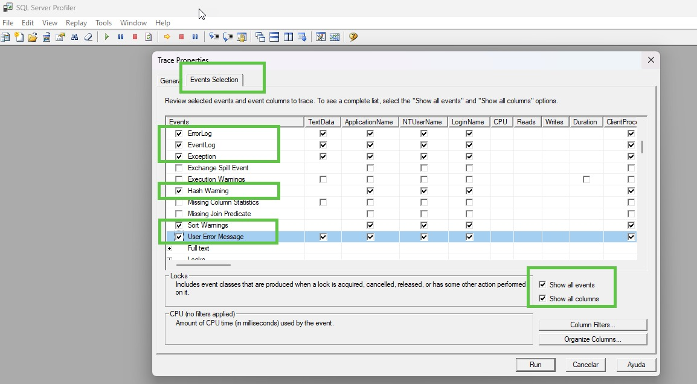
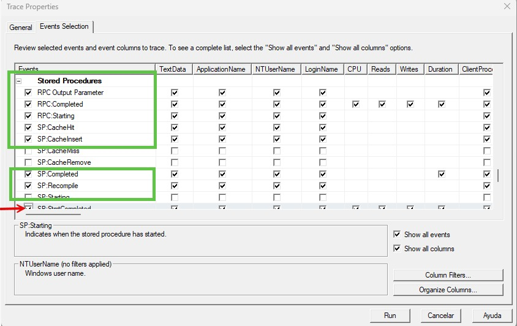

# Debuggear En SQL Server Profiler  
  
Al ser una soporte de canales digitales, nos encargamos de verificar el canal de domicilio y el de kiosco.

## Paso 1

Ingresamos a Microsoft SQL Server Management Studio

Se nos va a deplegar la siguiente pantalla:

Colocamos los campos con las contraseñas requeridas y le damos clic a conectar

## Paso 2 

Vamos a la parte de Tools y nos vamos hasta la opción de SQL Server Profile  

  
  
## Paso 3  
  
Al desplegarse la nueva pantalla de Trace Properties vamos hasta **Events Selection** y escogemos los dos ítems de show, continuando por los demás ítems seleccionados:  
  
 
  
En Store Procedures seleccionamos los siguientes ítems:  
  
 

En TSQL seleccionamos los siguientes ítems:  
  
  
  
En Transactions seleccionamos los siguientes ítems y le damos clic a **Run** y nos muestra los resultados.
  
  
   
Si existiera algún error nos reflejaría en el cuadro de texto en la parte baja con letras rojas.  

  
