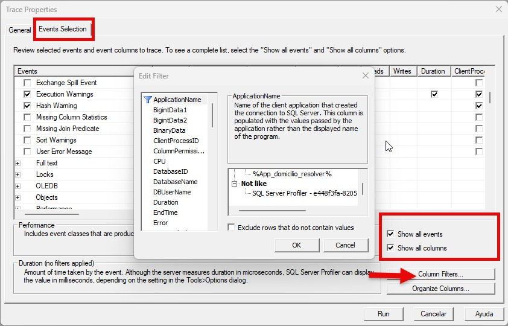

# Debuggear En SQL Server Profiler  
  
Al ser una soporte de canales digitales, nos encargamos de verificar el canal de domicilio y el de kiosco.

## Paso 1

Ingresamos a Microsoft SQL Server Management Studio

Se nos va a deplegar la siguiente pantalla:

Colocamos el **Server name, authentication, login y contraseña** requerida y le damos clic a **conectar**

## Paso 2 

Dentro de **SQL Server Management** vamos a la parte de Tools y luego damos clic sobre la opción de **SQL Server Profile**  

  
  
## Paso 3  
  
Al desplegarse la nueva pantalla de Trace Properties vamos hasta **Events Selection** y escogemos los dos ítems: **Show all events y Show all columns** luego contiuamos por Column Filters:  
  
 

Dentro de **Column Filters** ingresamos las siguientes líneas en like para filtar también con esa información.  
  
  
  
  
  
  
  
En **Errors and Warnings** selccionamos los siguientes ítems:  

  
  
 
En **Store Procedures** seleccionamos los siguientes ítems:  
  
 
  
  

En TSQL seleccionamos los siguientes ítems:  
  
  
  
En **Transactions** seleccionamos los siguientes ítems y le damos clic a **Run** y nos muestra los resultados.
  
  
   
Si existiera algún error nos reflejaría en el cuadro de texto en la parte baja con letras rojas.  

  
