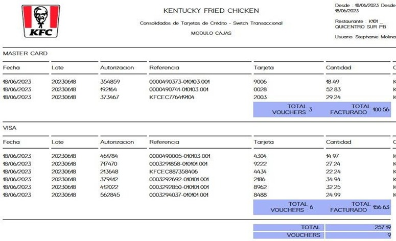

# Reporte Switch Datafast
## Desarrollo

**Paso 1**  
   
La información de datafast corresponde a pagos de datafono realizados por los locales, el reproceso de esta pasarela so lo puede realizar varias veces al día si fuera necesario.  

**Paso 2** 
 
https://auditoria-sw-transaccional.kfc.com.ec/ seleccionamos la opción Datafast y procedemos al reproceso.  
  
   
   
**Paso 3**  

El reproceso de datafast lo realiza en los siguientes horarios:  

  
  
  
**Paso 4**  

Una vez ejecutado procedemos con las validaciones en el reporte Switch generado en el SIR.  
  

