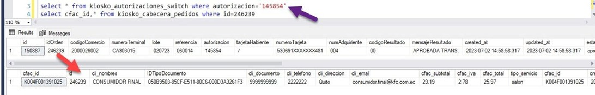
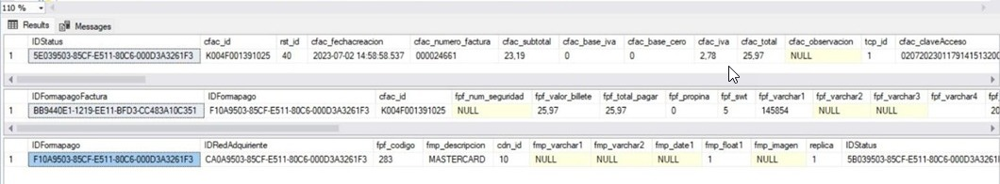
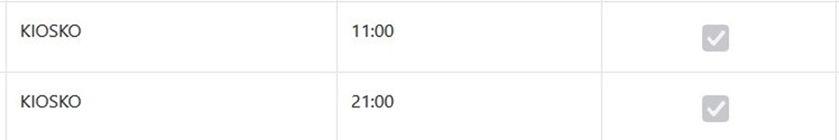

# Reporte Switch Kioscos  
  

## Antecedentes  

Los avances tecnológicos y la digitalización han llevado a la automatización de procesos en el sector de la restauración, incluyendo la implementación de kioscos de autoservicio. La recopilación de datos de facturación y su gestión eficiente son cruciales para el seguimiento y análisis de las ventas, la toma de decisiones y la mejora de la rentabilidad en los negocios de alimentos y bebidas.  
  
## Objetivo General  
  
Desarrollar un manual que guíe el uso adecuado de los kioskos de KFC para el ingreso de datos de facturación hacia una base de datos y su posterior visualización, con el fin de optimizar la gestión de ventas y mejorar la toma de decisiones.  
  
## Objetivos Específicos  
  
-	Explicar paso a paso como utilizar los kioscos de KFC para ingresar datos de facturación, incluyendo la selección de productos, personalización de pedidos y registro de pagos. 

-	Detallar el proceso de almacenamiento y transferencia de datos de facturación desde los kioscos hacia una base de datos centralizada, garantizando la integridad y seguridad de la información. 

-	Mostrar cómo acceder y utilizar la plataforma de visualización de datos para analizar y extraer información relevante, como ventas diarias, productos más vendidos y tendencias de consumo, facilitando la toma de decisiones basada en datos.  
  
### Paso1  
  

**Verificamos que el local se encuentre creado dentro de la base nacional del SIR.**  

  
  
  
  
**Si no está creado se procede a insertar**  
  

```
--USE [GerenteNacional_23]  
--GO  
      
--INSERT INTO [dbo].[KioskoWs]  
--           ([idLocal])  
--           ,[direccion]  
--           ,[email]  
--           ,[clave]  
--           ,[puerto]  
--           ,[token_acceso]  
--           ,[token_fecha_caduca]  
--           ,[token_fecha_creado])  
--     VALUES  
--           (280,'10.101.100.20','reporteskiosko@kfc.com.ec', 'r3port3s.KFC',890,'eyJ0eXAi0iJKV1QiLCJhbGci0iJIUz1NiJ9.eyJzdWIi0jIsImlzcyI6Imh0dHA6Ly8xMC4xMDEuM'  
--          '2023-06-30 14:57:23.000','2023-06-23 14:57:23.000'')  
--GO
```
  
### Paso 2  
  
**Verificamos que se visualice la información dentro de nuestro sp.**  
Colocamos la fecha que necesitamos realizar la consulta con el siguiente formato (año/mes/día).  
  
  
  
`exec[dbo].[kiosko_reporteSwitch] '20230702', '20230702'`  
  
  
```
SET DATAFORM DMY;  
  
SELECT cf.rst_id                                            AS Merchantid,
       CAST(p.prd_fechaapertura AS DATE)                    AS Fecha_Transaccion,
       CAST(sw.created_at AS TIME)                          AS Hora_transaccion,
       0                                                    AS Estado,
       sw.lote                                              AS Numero_Lote,  
       CAST(ISNULL(pf.fpf_total_pagar, 0) AS DECIMAL(15,2)) AS Face_Value,
       fp.fmp_descripcion                                   AS Id_Grupo_Tarjeta,
       'DATAFAST'                                           AS Id_Adquirente,
       sw.numeroTarjeta                                     AS numero_tarjeta_mask,
       sw.autorizacion                                      AS Numero_Autorizacion,
       sw.referencia                                        AS Numero_Referencia,
       '01'                                                 AS Tipo_Transaccion,
       0                                                    AS Resultado_externo,
       1                                                    AS Tipo_Switch,
       3                                                    AS Origen_Transaccion
FROM dbo.kiosko_autorizaciones_switch           AS sw
INNER JOIN dbo.kiosko_cabecera_pedidos          AS cp ON sw.idOrden = cp.id 
INNER JOIN dbo.Cabecera_Factura                 AS cf ON cf.cfac_id = cp.cfac_id
INNER JOIN dbo.Formapago_Factura                AS pf ON pf.cfac_id = cf.cfac_id
INNER JOIN dbo.Formapago                        AS fp ON fp.IDFormapago = pf.IDFormapago
INNER JOIN dbo.Periodo                          AS p  ON cf.IDPeriodo = p.IDPeriodo  
  
      --- Se cambia el filtro debido a que las transacciones se cargaban en otro periodo  
WHERE CONVERT (DATE, p.prd_fechaapertura) BETWEEN @fechaInicio AND @FechaFin
      --CONVERT(DATE, sw.created_at) BETWEEN @fechaInicio AND @fechaFin
      --Se agrega este filtro para no mostrar las facturas anuladas
      AND cf.IDStatus = config.fn_estado ('Facturacion', 'Entregada')
      --Las tarjetas de prueba de Datafast, contienen este texto, por eso no se toman en cuenta para el reporte  
      AND UPPER (tarjetaHabiente) NOT LIKE '%PRUEBA%'  
      --Se agrega este filtro a partir de la version de kioscos al implementar anulaciones en kiosco  
      AND sw.estado = 'aprobada'  
      --Filtro para que no incluya  los pedidos de Pickup  
      NAD cp.tipo_servcio not like '%Pickup%';  
        
    END   
```
  
### Paso 3  
**Verificamos que la orden ingrese a las siguientes tablas.**
**Podemos visualizar esto mediante el número de autorización.**  
```  
select * from kiosko_autorizaciones_switch where autorizacion = '145854'  
select cfac_id, * from kiosko_cabecera_pedidos where id = 246239 
```
  
  
Aquí **idOrden** en la tabla **kiosko_autorizaciones_switch** se enlaza con el campo id en
la tabla **kioskos_cabecera_pedidos.**  
  
### Paso 4  
**Una vez comprobemos que la información se encuentre completa y el estado de la factura sea ENTREGADA**

Podemos visualizar toda la información dentro de las siguientes tablas mediante
**cfac_id** en la tabla **Cabecera_Factura** y la tabla **Formapago_Factura.** 

```
select IDStatus, * from Cabecera_Factura where cfac_id = 'K004F00131391025'  
select * from Formapago_Factura where cfac_id = 'K004F00131391025'  
select * from Formapago where IDFormapago = 'F10A9503-85CF-E511-80C6-00003A3261F3'  
```
  
  
**OBSERVACIÓN:**  
En el caso de no poder visualizar el pago dentro del reporte switch del SIR podemos
**REPROCESAR** la información (el reproceso no se realiza de forma específica sino
de forma general).  
  
  
  
Los horarios que tienen kioscos para realizar su **CARGA DE INFORMACIÓN** son los
siguientes, este proceso se realiza a día caído (la información del día se carga al día
siguiente).  
  
 
