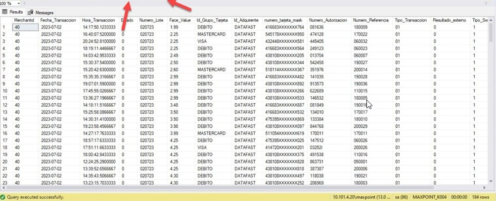
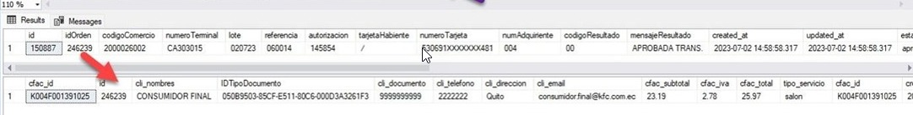

# Reporte Switch Kioscos  
  

## Antecedentes  

Los avances tecnológicos y la digitalización han llevado a la automatización de procesos en el sector de la restauración, incluyendo la implementación de kioscos de autoservicio. La recopilación de datos de facturación y su gestión eficiente son cruciales para el seguimiento y análisis de las ventas, la toma de decisiones y la mejora de la rentabilidad en los negocios de alimentos y bebidas.  
  
## Objetivo General  
  
Desarrollar un manual que guíe el uso adecuado de los kioskos de KFC para el ingreso de datos de facturación hacia una base de datos y su posterior visualización, con el fin de optimizar la gestión de ventas y mejorar la toma de decisiones.  
  
## Objetivos Específicos  
  
-	Explicar paso a paso como utilizar los kioscos de KFC para ingresar datos de facturación, incluyendo la selección de productos, personalización de pedidos y registro de pagos. 

-	Detallar el proceso de almacenamiento y transferencia de datos de facturación desde los kioscos hacia una base de datos centralizada, garantizando la integridad y seguridad de la información. 

-	Mostrar cómo acceder y utilizar la plataforma de visualización de datos para analizar y extraer información relevante, como ventas diarias, productos más vendidos y tendencias de consumo, facilitando la toma de decisiones basada en datos.  
  
### **Paso1**  
  

**Verificamos que el local se encuentre creado dentro de la base nacional del SIR.**  

  
  
  
  
**Si no está creado se procede a insertar**  
  
 
  
### **Paso 2**  
  
**Verificamos que se visualice la información dentro de nuestro sp.**  
Colocamos la fecha que necesitamos realizar la consulta con el siguiente formato (año/mes/día).  
  
  
  
  
  
  
  
### **Paso 3**  
**Verificamos que la orden ingrese a las siguientes tablas.**
**Podemos visualizar esto mediante el número de autorización.**
  
  
  
Aquí idOrden en la tabla kiosko_autorizaciones_switch se enlaza con el campo id en
la tabla kioskos_cabecera_pedidos.  
  
### **Paso 4**  
**Una vez comprobemos que la información se encuentre completa y el estado de la factura sea ENTREGADA**

Podemos visualizar toda la información dentro de las siguientes tablas mediante
cfac_id en la tabla Cabecera_Factura y la tabla Formapago_Factura.  
  
  
  
**OBSERVACION**  
En el caso de no poder visualizar el pago dentro del reporte switch del SIR podemos
REPROCESAR la información (el reproceso no se realiza de forma especifica sino
de forma general).  
  
  
  
Los horarios que tienen kioscos para realizar su CARGA DE INFORMACION son los
siguientes, este proceso se realiza a día caído (la información del día se carga al día
siguiente)  
  
 
