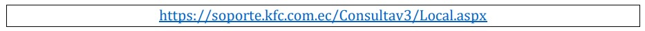
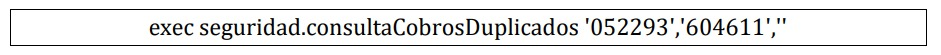
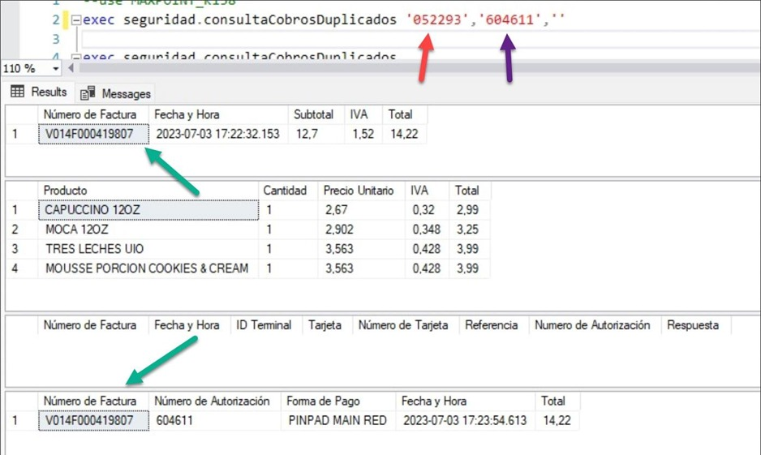
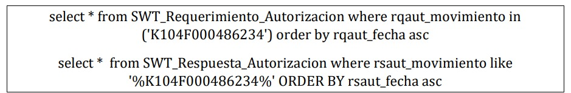
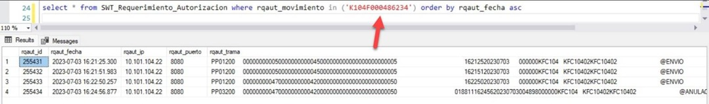
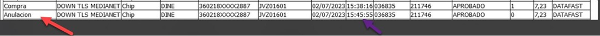
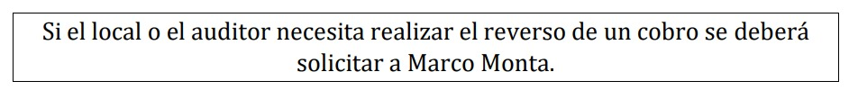

# Switch  
  
## Antecedentes  
  
Los locales manejan un alto volumen de transacciones y pagos diarios, lo
que requiere un sistema eficiente de registro y consulta de pagos.  

La visualización y consulta adecuada de los pagos realizados en los locales
es fundamental para garantizar la precisión y la transparencia en la gestión
financiera.  
  
## Objetivo General  
  
El objetivo general de este manual es proporcionar una guía clara y
concisa sobre los procesos de visualización en base de datos y consulta de
pagos en los locales, con el fin de mejorar la eficiencia y la precisión en la
gestión de pagos.  
  
## Objetivos Específicos
  
- Describir el sistema de base de datos utilizado en los locales de KFC para el registro y almacenamiento de información de pagos, incluyendo su estructura y funcionamiento.  

- Explicar el proceso de consulta de pagos en la base de datos de KFC,
detallando los criterios de búsqueda utilizados y las herramientas o
interfaces utilizadas por los empleados para acceder a la información.  

- Proporcionar instrucciones paso a paso sobre cómo visualizar y
obtener informes de pagos específicos en la base de datos de KFC,
incluyendo la selección de los campos relevantes, la aplicación de
filtros y la generación de informes.  
  
### **Paso 1**  

Realizamos la consulta de las transacciones dentro de la página del Switch.  
  

  
  
  
  
Dentro de esta página podemos realizar estas consultas por: 
- Local  
- Referencia  
- Valor  
- Entre Fechas.  
  
Para el ingreso de la fecha para la consulta el formato es (año/mes/día) y en Caja ingresamos el nombre y número del local.  
  
  
  
### Paso 2 
  
Podemos visualizar la transacción dentro de la base del local con el siguiente sp  
  

  
  
Aquí colocaremos el número de Referencia en la primera instancia y el número de Autorización en la segunda instancia.  
  
  

### Paso 3  

Una vez realizamos la consulta anterior con el número de factura podemos realizar las siguientes consultas.  

  
  
  
  
Aquí podemos visualizar las tramas de los cobros con tarjeta realizados en el local.  
  
### - Reversos 

En el caso de que se genere un Reverso del pago (tiempo en el que se realiza el reverso: 70 segundos).  

Se visualizará en nuestra página de esta manera:  
  
 

Y en nuestra base de datos de la siguiente manera:  
  
  
  
(en este caso podemos ver que se realizó el envió de la orden y seguido se procede a realizar el reverso de ésta)  
  
### - Anulación  

En el caso de que se genere una anulación.
(Sólo el local puede realizar la anulación desde la caja).  

Se visualizará en nuestra página de esta manera:  
  
  
  
(en este caso podemos ver que se realizó el envío de la orden y seguido se procede a realizar la anulación de éste)  

## OBSERVACION  

  
 

