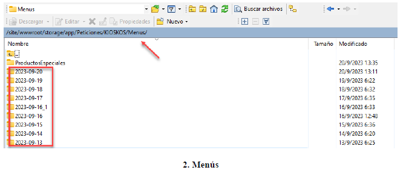
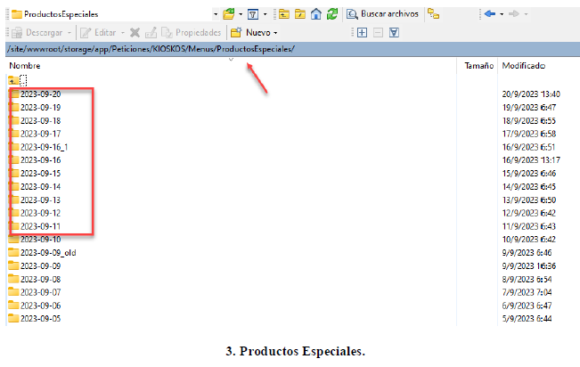

# Sincronización Creación En Aranda

 **Manual de Usuario - Sistema 2023 - Soporte App**

 
### Introducción
La sincronización entre proveedores, en un contexto tecnológico generalmente se refiere
a la coordinación de datos entre entidades que ofrecen productos, servicios o información
esto se aplica en la integración de sistemas, la colaboración entre empresas o la
transferencia de datos entre proveedores de servicios.
### Sincronización Ecuador
Al verificar la sincronización utilizamos: WinSCP es un cliente SFTP (Protocolo de
transferencia segura de archivos)
Debemos tener en cuenta la conexión a el grupo en este caso SINCRONIZACION MENU
V3.
Aquí observamos dos carpetas Peticiones y Respuestas, en las cuales están integradas:

- Tiendas
- Menú y dentro de esta carpeta estos productos especiales.

En el WinScp revisamos si viajo la sincronización y podemos presentar **3 escenarios:**
* **Existe cambios y la sincronización viaja sin errores:**
Se va generar respuestas de acuerdo al cambio que se genere por parte de 1 requerimiento de MKT, quien gestiona el requerimiento siendo área de configuraciones.
Recordar que en una sync correcta siempre va viajar P.E.
[MANUAL DE USUARIO 2023] Grupo KFC
Sistemas de Información
4
* **Existe cambios (tienda, menú, p.e), pero por un error en el log de sincronización no viajo:**
Se va generar una respuesta, pero no completa ya que puede que no se sincronizo el cambio ya sea en tienda, menú o productos especiales.
:::warning Este proceso hay que verificar:
1. Contactarse con configuraciones validar si existe no cambios.
2. Verificar si existió error en log de sync.
3. Verificar que es lo que no viajo en sync, y así solicitar la autorización correspondiente y enviar nuevamente.
4. Proceso de sync se lo debe coordinar con Trade.
:::

- **No Existe cambios en el canal (no tenemos peticiones ni respuesta de la fecha actual.) y no viajo P.E.
Cuando no existe cambios, pero existió un error:**

:::warning
Este proceso hay que verificar:
1. Si existió cambios con el área de configuraciones.
2. verificar que error se generó en log de sync.
3. Validar con trade la mejor solución en conversación y tomar las mejores oportunidades y tomar una decisión de sync ya que si no existe cambios debería tomar la última sync enviada a nuestro proveedor. 
:::

###  Creación Casos en Aranda

En Aranda siempre vamos a generar un caso por cada Sincronización revisada. Cuando se revisa la sincronización será categorizada como requerimiento.

Si existiera un error en la sincronización se categorizará como incidente.
Esto quiere decir que cuando haya una re sincronización vamos a registrar de acuerdo a los canales que se envió nuevamente.

Por ejemplo si tenemos que enviar a Peya, Uber, Rappi, Kiosko,Kfc_APP, Multimarca, Xone, Kfc_Xone, JuanValdez App, Español Web,Menu_De_Una, será caso por cada canal y como incidente.

Conclusiones:
- Proceso de sincronización para tomar una decisión se debe tener comunicación configuraciones, trade y tomar la mejor solución al evento presentado.

- Los casos a registrar en aranda nos permitirá llevar un control de los eventos que se presente en la sincronización y asi ver las oportunidades de mejora en este proceso.