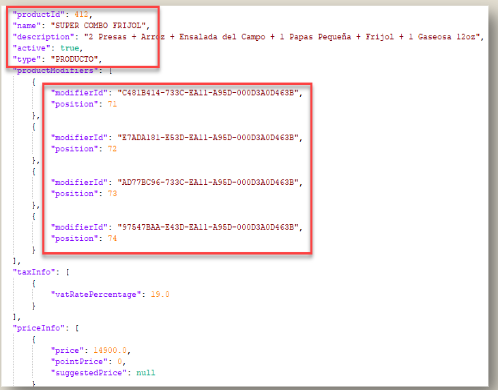
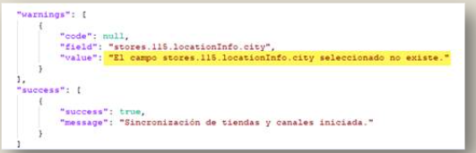
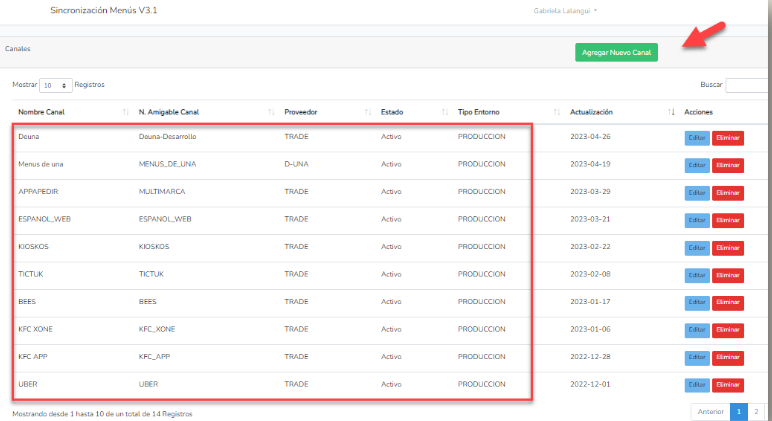
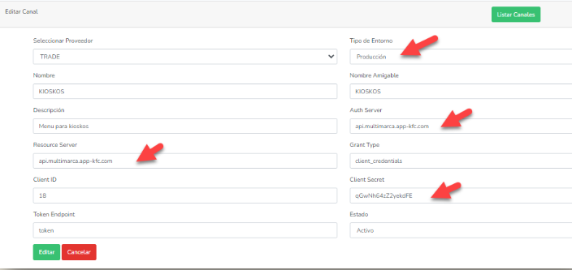
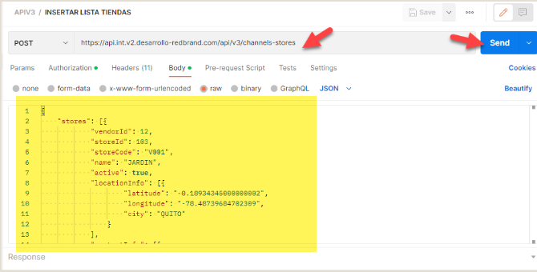

# Sincronización Colombia

**Manual de Usuario - Sistema 2023 - Soporte App**

### WinSCP

- WinSCP es un cliente SFTP (Protocolo de transferência segura de archivos), gráfico para Windows que emplea SSH.

- También se puede seguir usando la versión anterior del protocolo.

### CONEXIÓN A SINCRO V3 COLOMBIA

### PETICIONES

- En esta carpeta tenemos los json generados por los cambios generados por el área de CONFIGURACIONES.
- JSON MENU
- JSON PRODUCTOS ESPECIALES
- JSON CADENA

### RESPUESTAS

- Son json de respuestas que se recibe cuando ya finaliza Sincronización

- Cuando la sincronización viajo sin problema se tiene el siguiente mensaje

- Si mantiene algún error, se va generar de la siguiente manera, en este caso significa que la geolocalización de una tienda no está configurada correctamente

## SINCRONIZACION MANUAL

### PANTALLA SINCRONIZACION V3

- Esta es la pantalla que contiene múltiples opciones como:
  - Sincronizacion Manual
  - Sincronizacion Productos
  - Configuraciones
    - Horarios
    - Canales
    - Token
    - Menu
    - Logs
- Para realizar este proceso tiene que estar debidamente aprobado

### Sincronización Manual

- En esta pantalla es para realizar una sincronización en el momento, de determinado Canal

### Sincronización Productos

- Esta Pantalla como su nombre mismo lo indica, es por Productos

- Aquí muestra el canal, y que tipo de Producto es para que este sea enviado

### Horarios

- Aquí muestra, los horarios de envíos de acuerdo al horario de Ecuador
- Aquí también se puede editar la hora para enviar nuevamente una sincronización
- Además, si realiza un cambio siempre tomar en cuenta dejar como estaba configurado

### Canales

- En la siguiente pantalla, se puede configurar para los canales que deseen, tanto para ambiente de desarrollo como producción
- Se tiene un archivo donde contiene toda la información para realizar este proceso

### Ambiente de Produccion yDesarrollo

- Aquí esta la pantalla donde tiene que estar configurado ya sea para producción o desarrollo
- Se tiene un documento donde esta esta información, misma que se enviara para que se pueda realizar pruebas.

### Inyección por postman y sincronización

- Se abre la Aplicación Postman la misma que pueden descargarla de internet
- Adjunto Url para la inyección a donde debe de enviarse
- URL para enviar Lista Menu
  - https://api.v2.dev2.desarrollo-redbrand.com/api//v3/lists*
- URL para enviar Menu
  - https://api.int.v2.desarrollo-redbrand.com/api/v3/channels-stores

### Ejemplo de Inyección con Json de una Cadena

