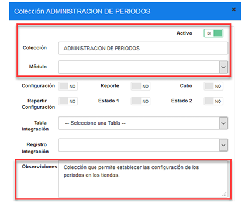
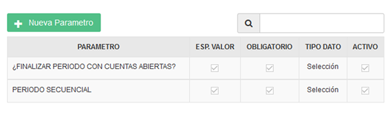
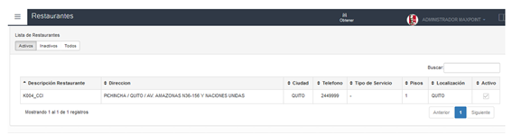
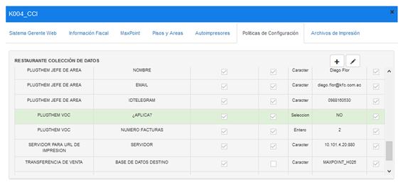
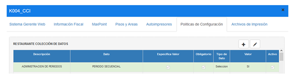
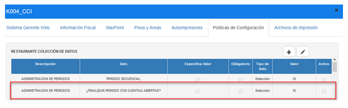

# 1 ANTECEDENTES 
Actualmente en el sistema MaxPoint punto de venta; se desea realizar la apertura de periodos secuenciales, es decir, del siguiente día.

# 2 OBJETIVO GENERAL 
Permitir la apertura de un período secuencial. 

### 2.1 Objetivos específicos 
* Crear una política de configuración a nivel de restaurante.

# 3 POLÍTICAS DE CONFIGURACIÓN 
### 3.1 Datos Generales 
En este manual se detalla cómo realizar la configuración de la política a nivel de restaurante 
para permitir la apertura de períodos secuenciales. 

### 3.2 Pantalla de Políticas 
Ingresar al sistema MaxPoint backoffice con credenciales de administrador sistemas y 
seleccionar la cadena a la cual se realizará las configuraciones. 

En el menú que se encuentra en la parte izquierda no dirigimos a la opción 
SEGURIDADES y seleccionamos POLÍTICAS, seguidamente presionamos sobre el 
botón Ir a Administración Políticas en el cual abrirá una nueva pestaña en el navegador. 

### 3.3 Restaurante 
#### 3.3.1 Colección Restaurante – Administración de Periodos 
Antes de crear las políticas de configuración; como primer paso se debe verificar que no se 
encuentren creadas, de ser el caso validar que cada colección contenga los parámetros 
establecidos en este manual. 

En la opción Restaurante presionar sobre el botón Nueva Colección, se abrirá una modal 
para su creación ingresando los siguientes datos: 

Tabla 1. Datos Colección Restaurante 

| N°  | Colección  | Descripción |
| :---| :------------:| -------------:|
| 1 | ADMINISTRACION DE PERIODOS | Colección que permite establecer las configuración de los períodos en las tiendas. |

 **Nota:** NO puede contener espacios en blanco al inicio y final del nombre de la colección; 
debe ser escrita tal y como se especifica en la tabla 1.

**Colección:** Nombre de la colección que se especifica en la tabla 1. 

**Módulo:** No aplica. 
**Observaciones:** Una descripción de la función que realizara dicha colección.

Una vez que se haya ingresado y seleccionado la información establecida procedemos a **Guardar.**

#### 3.3.2 Parámetro de Colección  
Antes de agregar los parámetros de configuración, como primer paso se debe verificar que 
no se encuentren creados, de ser el caso validar que cada parámetro contenga los valores 
establecidos en este manual. 

Una vez creada la colección se debe proceder a crear los parámetros de configuración y 
para ello seleccionamos la colección y presionamos sobre el botón **Nuevo Parámetro** en la 
cual se abrirá una modal para su creación e ingresamos los siguientes datos: 

Tabla 2. Datos Parámetros de Colección Restaurante 

| N° | Colección                  | Parámetro                                |Esp. Valor | Obligatorio | Tipo Dato  |
| --| ----------------------------| ---------------------------------------- |---------- | ----------- | -----------|
| 1 | ADMINISTRACION DE PERIODOS  | PERIODO SECUENCIAL                       | SI        | SI          | Selección  |
| 2 | ADMINISTRACION DE PERIODOS  | ¿FINALIZAR PERIODO CON CUENTAS ABIERTAS? | SI        | SI          | Selección  |

 **Nota:** NO puede contener espacios en blanco al inicio y final del parámetro; deben ser 
escritos tal y como se especifica en la tabla 2.

**Parámetro:** Nombre del parámetro que se especifica en la tabla 2. 

**Tipo de Dato:** Se especifica en la tabla 2. 

**Especifica Valor:** Se especifica en la tabla 2. 

**Obligatorio:** Se especifica en la tabla 2. 
Una vez que se haya ingresado y seleccionado la información establecida procedemos a **Guardar.** 

Se deben crear todos los parámetros de configuración establecidos en la tabla 2 y se debe 
tener lo siguiente:

### 3.4 Restaurante Colección de Datos 
En el menú nos dirigimos a **RESTAURANTE** y seleccionamos la opción 
**RESTAURANTE**, seguidamente seleccionamos el restaurante al cual se habilitará la 
configuración.

Con un doble click se abrirá una modal con la información del restaurante, seleccionamos 
la opción de la pestaña **Políticas de Configuración**. 

Para la configuración se debe presionar sobre el botón agregar “+”; el cual abrirá una 
modal, seguidamente buscaremos la colección creada y agregamos el valor en los 
parametros solicitados.

#### 3.4.1 Administración de Periodos – Período Secuencial 
En la tabla 3, se especifica los valores que deben ser configurados por cada parámetro 
colección. 

Tabla 3. Valores de los parámetros de colección

|    |Colección: ADMINISTRACION DE PERIODOS         |  |               |
| ---|----------------------------------------------  |---------- |--- |
| **N°**| **Parámetro**          | **Tipo Dato**| **Valor a ingresar**|
| 1  | PERIODO SECUENCIAL        | Selección    | SI                  |

Al realizar la configuración de todos los parámetros se debe tener lo siguiente: 

#### 3.4.2 Administración de Periodos – Cuentas Abiertas 
En la tabla 4, se especifica los valores que deben ser configurados por cada parámetro 
colección. 

Tabla 4. Valores de los parámetros de colección.

|    |Colección: ADMINISTRACION DE PERIODOS       |   |               |
| ---|----------------------------------------------  |--------- |--- |
| **N°**| **Parámetro**          | **Tipo Dato**| **Valor a ingresar**|
| 1  | ¿FINALIZAR PERIODO CON CUENTAS ABIERTAS? | Selección    | SI   |

Al realizar la configuración de todos los parámetros se debe tener lo siguiente: 

# 4 REPLICAR 
Como siguiente paso se debe realizar las respectiva replica de todas las configuraciones 
hacia la tienda. 

