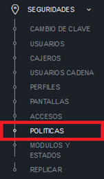
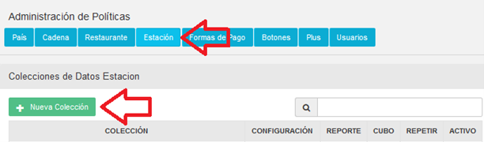
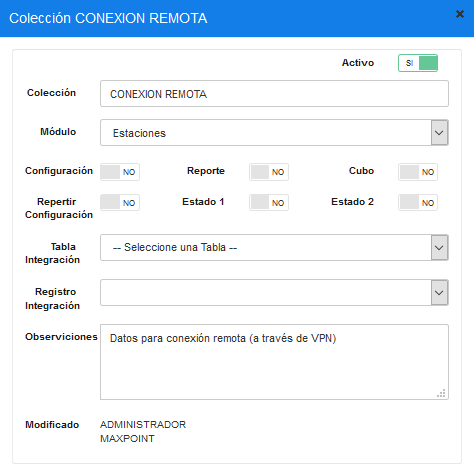
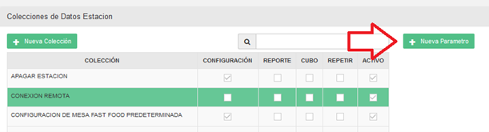
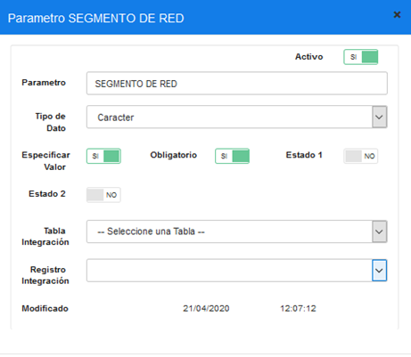
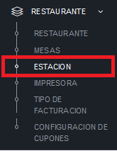
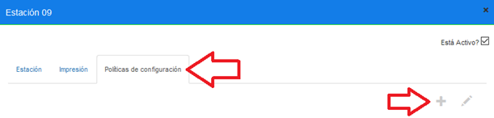
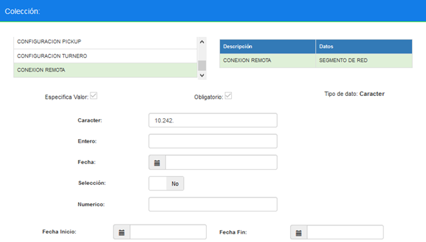

# 1. Antencedentes
Al conectarse a la VPN, se genera una IP que es dinámica y cambia cada vez que se realiza una nueva conexión, dificultando utilizar la configuración de MaxPoint.

# 2.	OBJETIVO GENERAL 
Permitir conectarse remotamente a través de VPN, validando el segmento de red del usuario en vez de la IP exacta.

## 2.1.	Objetivos específicos 
* Crear una política de configuración a nivel de estación.

# 3. POLÍTICAS DE CONFIGURACIÓN 
## 3.1.	Colección Estación
Ingresar a la pantalla de administración de políticas:

Ingresar a la pestaña “Estación”, y presionar en el botón “Nueva Colección”:

Crear una política con la siguiente información:
* **Colección:** CONEXION REMOTA
* **Módulo:** Estaciones
* **Observaciones:** Datos para conexión remota (a través de VPN)

## 3.2.	Colección de Datos de Estación
Una vez creada la colección, presionar el botón “Nuevo Parametro”:

Crear un parámetro con la siguiente información:
* **Parámetro:** SEGMENTO DE RED
* **Tipo de Dato:** Caracter
* **Especificar Valor:** Si
* **Obligatorio:** Si

## 3.3.	Política de Configuración de Estación
Ingresar a la pantalla de Estación:

Seleccionar el restaurante de la lista, y seleccionar la estación a la cual se desea configurar la conexión remota.

 **Nota:** para el correcto funcionamiento de esta funcionalidad, solo una estación puede tener habilitada la conexión remota, por lo cual debe haber un máximo de una estación con la política de conexión remota por restaurante.

Una vez abierta la pantalla de la estación, seleccionar la pestaña “Políticas de configuración”, y presionar en el botón “+”:

Crear una configuración con la siguiente información:
* **Colección de Estación:** CONEXION REMOTA
* **Colección de Datos de Estación:** SEGMENTO DE RED
* **Carácter:** 10.242. 	[tomar en cuenta el punto al final]

