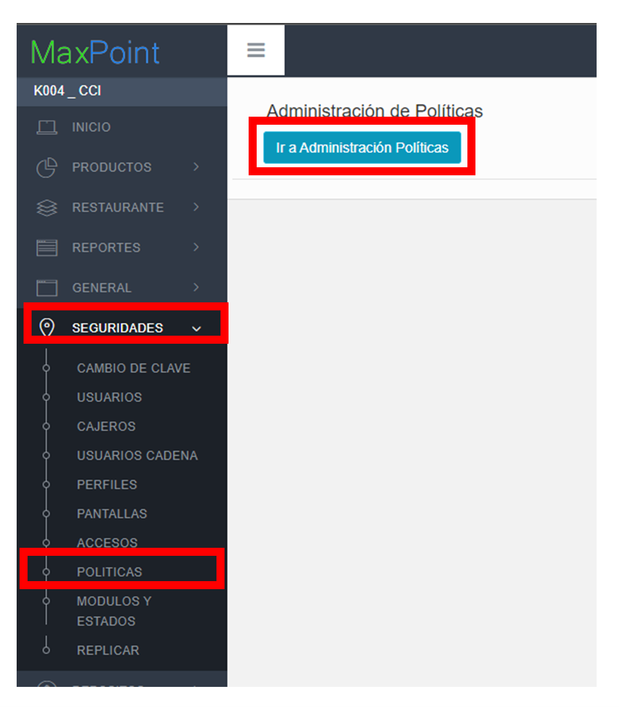
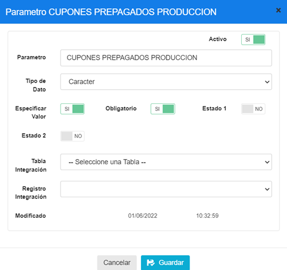
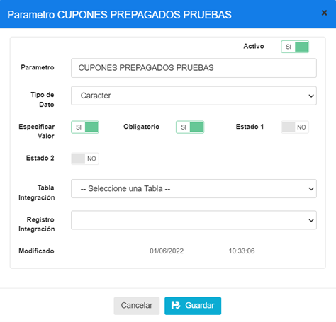
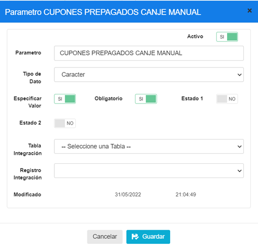
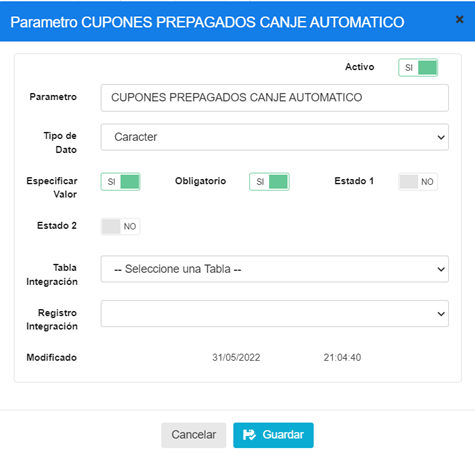
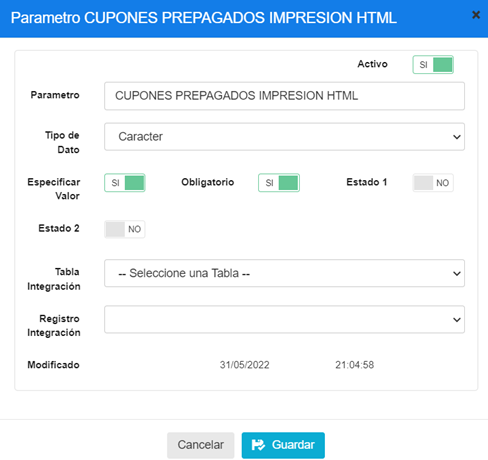
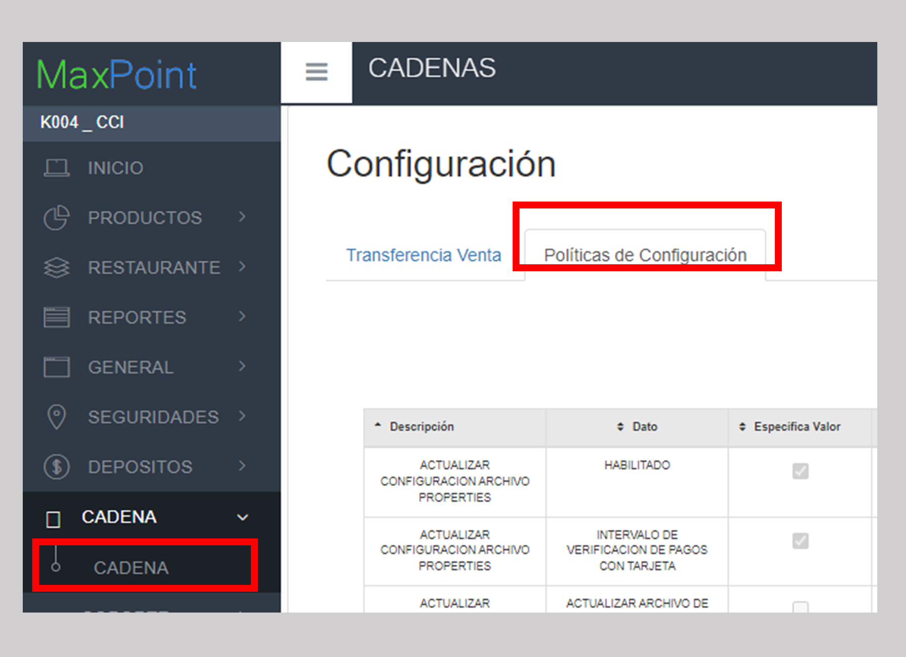
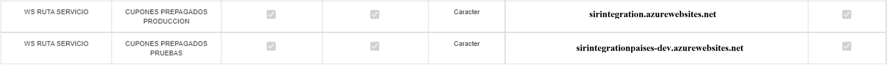
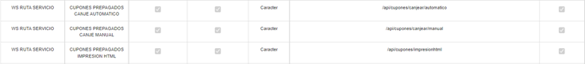

# Manual de politicas-CanjeCuponPrepagados
## 1	ANTECEDENTES

El sistema Back office de MaxPoint recibirá una nueva funcionalidad que le permitirá ejecutar el proceso de canje de cupones pre-pagados. Para este efecto, será necesario crear y configurar las políticas correspondientes en el sistema.

## 2	OBJETIVO GENERAL
Crear y configurar las políticas y parámetros para la integración con la funcionalidad.

### 2.1	Objetivos específicos
* Crear las políticas y parámetros a nivel de Cadena.
* Configurar los parámetros de las políticas creadas.

## 3	POLÍTICAS DE CONFIGURACIÓN
### 3.1	Datos Generales
En este manual se detalla cómo crear las políticas y parámetros de estas a nivel de cadena, que permitirán integrarse con la funcionalidad.

### 3.2	Pantalla de Políticas
Ingresar al sistema MaxPoint BackOffice con credenciales de administrador sistemas.
En el menú que se encuentra en la parte izquierda no dirigimos a la opción **SEGURIDADES** y seleccionamos **POLÍTICAS**, seguidamente presionamos sobre el botón **Ir a Administración Políticas** en el cual abrirá una nueva pestaña en el navegador.

### 3.3	Cadena
#### 3.3.1	Parámetro de Colección 
Antes de agregar los parámetros de configuración mostrados en la tabla 3, se debe verificar si ya encuentren creados. De ser el caso validar que cada parámetro contenga los valores establecidos en este manual.

Si alguno de los parámetros NO existe dentro de la *Colección* especificada en la Tabla 3, se debe crearla así:

Seleccionamos la colección y presionamos sobre el botón **Nuevo Parámetro** en la cual se abrirá una venta para su creación y para cada Parámetro ingresamos los siguientes datos:

Tabla 3. Datos Parámetros de Colección de Datos Cadena

| N° | Colección        | Parámetro                         | Tipo Dato |Esp. Valor | Obligatorio |Estado 1 |Estado 2 |
| -- | ---------------- | --------------------------------- |---------- |---------- |------------ |-------- |-------- |
| 1  | WS SERVIDOR      | CUPONES PREPAGADOS PRODUCCION     | Caracter  | SI        | SI          | NO      | NO      |
| 2  | WS SERVIDOR      | CUPONES PREPAGADOS PRUEBAS        | Caracter  | SI        | SI          | NO      | NO      |
| 3  | WS RUTA SERVICIO | CUPONES PREPAGADOS CANJE          | Caracter  | SI        |SI           | NO      | NO      |
| 4  | WS RUTA SERVICIO | CUPONES PREPAGADOS CANJE MANUAL   | Caracter  | SI        |SI           | NO      | NO      |
|5   | WS RUTA SERVICIO | CUPONES PREPAGADOS IMPRESION HTML | Caracter  | SI        |SI           | NO      | NO      |

**Nota:** NO puede contener espacios en blanco al inicio y final del parámetro; deben ser escritos tal y como se especifica en la tabla 3.

**Parámetro:** Nombre del parámetro que se especifica en la tabla 3.

**Tipo de Dato:** Se especifica en la tabla 3.

**Especificar Valor:** Se especifica en la tabla 3.

**Obligatorio:** Se especifica en la tabla 3.

**Estado 1:** Se especifica en la tabla 3.

**Estado 2:** Se especifica en la tabla 3.

Una vez que se haya ingresado y seleccionado la información establecida procedemos a **Guardar.**

Se deben crear todos los parámetros de configuración establecidos en la tabla 3. Se presentan los modales de configuración de cada parámetro a continuación:

  
  
  
  
 

#### 3.3.2	Cadena Colección de Datos
En el menú principal del BackOffice de MaxpOint, nos dirigimos a **Cadena** y seleccionamos la opción **CADENA**, seguidamente seleccionamos la pestaña **Políticas de configuración**. 

Para la configuración se debe presionar sobre el botón agregar “+”; el cual abrirá una ventana, seguidamente buscaremos la colección creada y agregamos el valor en los parametros solicitados.

Para cada uno de los parametros 

‘CUPONES PREPAGADOS PRODUCCION’

‘CUPONES PREPAGADOS PRUEBAS’

‘CUPONES PREPAGADOS CANJE AUTOMATICO’

‘CUPONES PREPAGADOS CANJE MANUAL’

‘CUPONES PREPAGADOS IMPRESION HTML’

Crearlos y llenar sus valores como se muestra en la tabla a continuación:

Tabla 4. Parámetros de la colección

| N° | Dato                                | Valor                                      |
| -- | ----------------------------------- | ------------------------------------------ |
| 1  |CUPONES PREPAGADOS PRODUCCION        | sirintegration azurewebsites.net           |
| 2  | CUPONES PREPAGADOS PRUEBAS          | sirintegrationpaises-dev.azurewebsites.net |
| 3  | CUPONES PREPAGADOS CANJE AUTOMATICO | /api/cupones/canjear/automatico            |
| 4  | CUPONES PREPAGADOS CANJE MANUAL     | /api/cupones/canjear/manual                | 
| 5  | CUPONES PREPAGADOS IMPRESION HTML   | /api/cupones/impresionhtml                 | 

  

#### 3.3.3	Puntos a considerar
1.	Cada uno de los parámetros deben configurarse (escribirse) **exactamente**como está en este manual, respetando mayúsculas y minúsculas.
