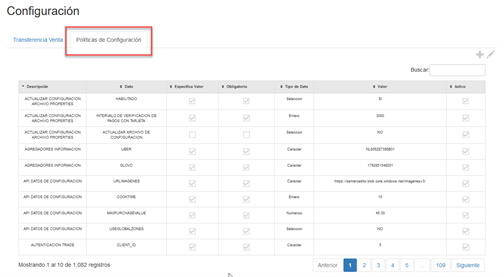
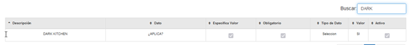
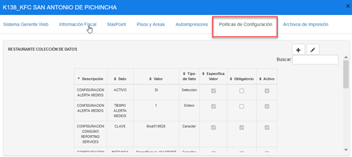
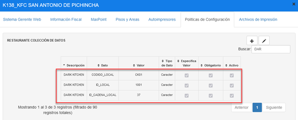
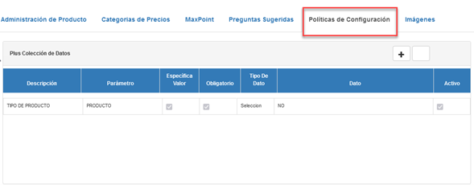
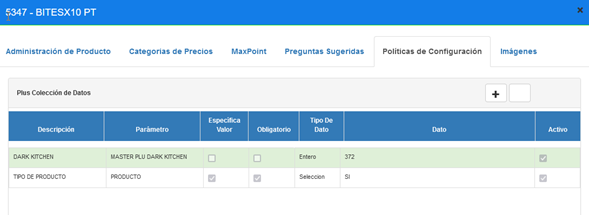

# Manual-Configuracion Dark Kitchen

## 1	ANTECEDENTES
Actualmente en el sistema MaxPoint, se tiene la necesidad de vender productos de otras cadenas en una cadena diferente como, por ejemplo; productos de Cinnabon en tiendas de KFC a esto se lo denomina Dark Kitchen.

## 2	OBJETIVO GENERAL
Crear y configurar las políticas necesarias para Dark Kitchen

### 2.1	Objetivos específicos
* Configurar la política y parámetros a nivel cadena
* Configurar la política y parámetros a nivel restaurante 
* Configurar la política y parámetros a nivel plus

## 3	POLÍTICAS DE CONFIGURACIÓN
### 3.1	Datos Generales
En este manual se detalla cómo realizar la configuración de políticas que permitirán establecer los parámetros a ser utilizados en Dark Kitchen.
* Las políticas deben ser creadas en la cadena que venderán los productos de otras marcas, para este manual como ejemplo será en la cadena KFC con productos de Cinnabon

### 3.2	Pantalla de Políticas
En Azure ingresar al sistema MP backoffice con credenciales de administrador sistemas y seleccionar la cadena a la cual se realizará las configuraciones.

En el menú que se encuentra en la parte izquierda no dirigimos a la opción **SEGURIDADES** y seleccionamos **POLÍTICAS**, seguidamente presionamos sobre el botón **Ir a Administración Políticas** en el cual abrirá una nueva pestaña en el navegador.

### 3.3	Cadena
#### 3.3.1	Colecciones Cadena
Antes de crear las políticas de configuración; como primer paso se debe verificar que no se encuentren creadas, de ser el caso validar que cada colección contenga los parámetros establecidos en este manual.

En la opción **Cadena** presionar sobre el botón **Nueva Colección**, se abrirá una modal para su creación ingresando los siguientes datos:

Tabla 1. Colección Cadena

| N° | Colección    | Descripción   |
|--- | :-----------:| -------------:|
| 1  | DARK KITCHEN | Colección que permite establecer los parámetros de configuración para determinar que cadenas aplican Dark Kitchen. |

**Nota**: NO puede contener espacios en blanco al inicio y final del nombre de la colección; debe ser escrita tal y como se especifica en la tabla 1.

**Colección**: Nombre de la colección que se especifica en la tabla 1.

**Módulo**: No aplica.

**Observaciones**: Una descripción de la función que realizara dicha colección.
Una vez que se haya ingresado y seleccionado la información establecida procedemos a **Guardar**.

#### 3.3.2	Parámetro de Colección Cadena 
Antes de agregar los parámetros de configuración, como primer paso se debe verificar que no se encuentren creados, de ser el caso validar que cada parámetro contenga los valores establecidos en este manual.

Una vez creada la colección se debe proceder a crear los parámetros de configuración y para ello seleccionamos la colección y presionamos sobre el botón **Nuevo Parámetro** en la cual se abrirá una venta para su creación e ingresamos los siguientes datos:

Tabla 2. Datos Parámetros de Colección Cadena

| N° | Colección    | Parámetro |Esp. Valor | Obligatorio | Tipo Dato |
| -- | ------------ | --------- |---------- |------------ |---------- |
| 1  | DARK KITCHEN | ¿APLICA?  | SI        | SI          | Selección |

>**Nota**: NO puede contener espacios en blanco al inicio y final del parámetro; deben ser escritos tal y como se especifica en la tabla 2.

**Parámetro**: Nombre del parámetro que se especifica en la tabla 2.

**Tipo de Dato**: Se especifica en la tabla 2.

**Especifica Valor**: Se especifica en la tabla 2.

**Obligatorio**: Se especifica en la tabla 2.

Una vez que se haya ingresado y seleccionado la información establecida procedemos a **Guardar**.

#### 3.3.3	Cadena Colección de Datos
En el menú nos dirigimos a **Cadena** y seleccionamos la opción **CADENA**, y seguidamente seleccionamos la pestaña **Políticas de configuración**.

Para la configuración se debe presionar sobre el botón agregar “+”; el cual abrirá una ventana, seguidamente buscaremos la colección creada y agregamos el valor en los parametros solicitados.

#### 3.3.4	Dark Kitchen
En la tabla 3, se especifica los valores que deben ser configurados por cada parámetro colección.

Tabla 3. Valores de los parámetros de colección

|    | Colección:               |  DARK     |    KITCHEN       |             | 
|----|--------------------------|-----------|------------------|-------------|
|**N°** | **Parámetro** | **Tipo Dato** | **Valor a ingresar** | 
|
| 1     |¿APLICA?       |Selección      | SI                   |

Al realizar la configuración de todos los parámetros se debe tener lo siguiente:

### 3.4	Restaurante
#### 3.4.1	Colección Restaurante
Antes de crear las políticas de configuración; como primer paso se debe verificar que no se encuentren creadas, de ser el caso validar que cada colección contenga los parámetros establecidos en este manual.

En la opción **Restaurante** presionar sobre el botón **Nueva Colección**, se abrirá una modal para su creación ingresando los siguientes datos:

Tabla 4. Colección Restaurante

| N° | Colección    | Descripción   |
|--- | :-----------:| -------------:|
| 1  | DARK KITCHEN | Colección que permite establecer los parámetros de configuración a usar en cada restaurante para Dark Kitchen |

Nota: NO puede contener espacios en blanco al inicio y final del nombre de la colección; debe ser escrita tal y como se especifica en la tabla 4.

**Colección**: Nombre de la colección que se especifica en la tabla 4.

**Módulo**: No aplica.

**Observaciones**: Una descripción de la función que realizara dicha colección.

Una vez que se haya ingresado y seleccionado la información establecida procedemos a **Guardar**.

#### 3.4.2	Parámetros Colección Restaurante
Antes de agregar los parámetros de configuración, como primer paso se debe verificar que no se encuentren creados, de ser el caso validar que cada parámetro contenga los valores establecidos en este manual.

Una vez creada la colección se debe proceder a crear los parámetros de configuración y para ello seleccionamos la colección y presionamos sobre el botón **Nuevo Parámetro** en la cual se abrirá una venta para su creación e ingresamos los siguientes datos:

Tabla 5. Datos Parámetros de Colección Restaurante

| N° | Colección    | Parámetro      | Esp. Valor | Obligatorio |Tipo Dato |
| -- | ------------ | -------------- |----------- |------------ |--------- |
| 1  | DARK KITCHEN | CODIGO_LOCAL   | SI         | SI          | Carácter |
| 2  | DARK KITCHEN | ID_LOCAL       | SI         | SI          | Carácter |
| 3  | DARK KITCHEN| ID_CADENA_LOCAL | SI         | SI          | Carácter | 

**Nota**: NO puede contener espacios en blanco al inicio y final del parámetro; deben ser escritos tal y como se especifica en la tabla 5.

**Parámetro**: Nombre del parámetro que se especifica en la tabla 5.

**Tipo de Dato**: Se especifica en la tabla 5.

**Especifica Valor**: Se especifica en la tabla 5.

**Obligatorio**: Se especifica en la tabla 5.

Una vez que se haya ingresado y seleccionado la información establecida procedemos a **Guardar**.

#### 3.4.3	Restaurante Colección de Datos
En el menú nos dirigimos a **Restaurante** y seleccionamos la opción **RESTAURANTE**, buscamos la tienda a ser configurada y seguidamente seleccionamos la pestaña **Políticas de configuración**.

Para la configuración se debe presionar sobre el botón agregar “+”; el cual abrirá una ventana, seguidamente buscaremos la colección creada y agregamos el valor en los parametros solicitados.

#### 3.4.4	Dark Kitchen
En la tabla 6, se especifica los valores que deben ser configurados por cada parámetro colección.

Tabla 6. Valores de los parámetros de colección

|    | Colección                |  DARK     |    KITCHEN       |             | 
|----|--------------------------|-----------|------------------|-------------|
| **N°** | **Parámetro**       | **Tipo Dato** | **Valor a ingresar** | **Descripción** |
|
| 1  | CODIGO_LOCALN   | Carácter    | CK01              | Se debe ingresar el código establecido a cada tienda. |
| 2  | ID_LOCAL        | Carácter    | 1001              | Se debe ingresar el id establecido a cada tienda.  |
| 3  | ID_CADENA_LOCAL | Carácter    | 37              | Se debe especificar el id de la cadena al cual pertenecen los productos que serán vendidos para esta caso el id es de la marca Cinnabon |

Al realizar la configuración de todos los parámetros se debe tener lo siguiente:

### 3.5	Plus
#### 3.5.1	Colección Plus
Antes de crear las políticas de configuración; como primer paso se debe verificar que no se encuentren creadas, de ser el caso validar que cada colección contenga los parámetros establecidos en este manual.

En la opción **Plus** presionar sobre el botón **Nueva Colección**, se abrirá una modal para su creación ingresando los siguientes datos:

Tabla 7. Colecciones Plus

| N°  | Colección  | Descripción |
| :---| :---------:| -----------:|
| 1 | DARK KITCHEN | Colección que permite establecer los productos que serán configurados como Dark Kitchen. |

Nota: NO puede contener espacios en blanco al inicio y final del nombre de la colección; debe ser escrita tal y como se especifica en la tabla 7.

**Colección**: Nombre de la colección que se especifica en la tabla 7.

**Módulo**: No aplica.

**Observaciones**: Una descripción de la función que realizara dicha colección.

Una vez que se haya ingresado y seleccionado la información establecida procedemos a **Guardar**.

#### 3.5.2	Parámetros de Colección Plus
Antes de agregar los parámetros de configuración, como primer paso se debe verificar que no se encuentren creados, de ser el caso validar que cada parámetro contenga los valores establecidos en este manual.

Una vez creada la colección se debe proceder a crear los parámetros de configuración y para ello seleccionamos la colección y presionamos sobre el botón **Nuevo Parámetro** en la cual se abrirá una venta para su creación e ingresamos los siguientes datos:

Tabla 8. Datos Parámetros de Colección Plus

| N° | Colección    | Parámetro                | Esp. Valor | Obligatorio |Tipo Dato |
| -- | ------------ | ------------------------ |----------- |------------ |--------- |
| 1  | DARK KITCHEN | MASTER PLU DARK KITCHEN  | SI         | SI          | Entero   |

Nota: NO puede contener espacios en blanco al inicio y final del parámetro; deben ser escritos tal y como se especifica en la tabla 8.

**Parámetro**: Nombre del parámetro que se especifica en la tabla 8.

**Tipo de Dato**: Se especifica en la tabla 8.

**Especifica Valor**: Se especifica en la tabla 8.

**Obligatorio**: Se especifica en la tabla 8.

Una vez que se haya ingresado y seleccionado la información establecida procedemos a **Guardar**.

#### 3.5.3	Plus Colección de Datos
En el menú nos dirigimos a **Plus** y seleccionamos la opción **NUEVA PRODUCTOS**, buscamos el o los productos a ser configurados y seguidamente seleccionamos la pestaña **Políticas de configuración**.

Para la configuración se debe presionar sobre el botón agregar “+”; el cual abrirá una ventana, seguidamente buscaremos la colección creada y agregamos el valor en los parametros solicitados.

#### 3.5.4	Dark Kitchen
En la tabla 9, se especifica los valores que deben ser configurados por cada parámetro colección.

Tabla 9. Valores de los parámetros de colección

|    | Colección                |  DARK     |    KITCHEN       |             | 
|----|--------------------------|-----------|------------------|-------------|
| **N°** | **Parámetro**              | **Tipo Dato** | **Valor a ingresar** | **Descripción** |
|
| 1  | MASTER PLU DARK KITCHEN | Entero     | 372              | Se debe ingresar el num_plu del producto que será vendido como Dark Kitchen, para este caso es el num_plu del producto de la cadena Cinnabon |

Al realizar la configuración de todos los parámetros se debe tener lo siguiente:

# 4	REPLICAR
Como siguiente paso se debe realizar las respectiva replica de todas las configuraciones hacia la tienda.
