# 
 Pantalla de Administración de Descuentos 

A continuación se detalla el funcionamiento y uso de la pantalla de administración de descuentos.

La pantalla está ubicada en el módulo General -> Descuentos:

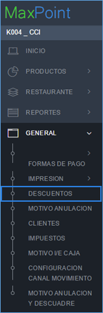

En el inicio se muestra un listado de todos los descuentos configurados en el sistema.

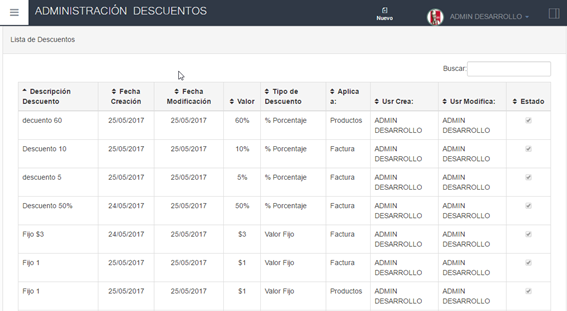

## Agregar un Descuento
El botón para agregar descuentos “Nuevo”  se encuentra en la parte superior de la pantalla.

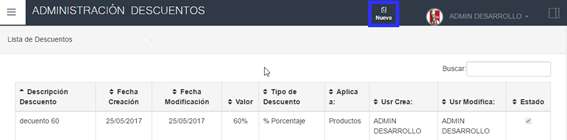

Al presionarlo se desplegará una ventana con los campos necesarios para configurar el descuento que se va a ingresar, con tres pestañas Configuración General, Productos a Aplicar y Tiendas a Aplicar.

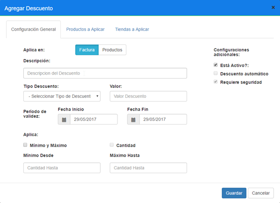

Los campos que se configuran son los siguientes:

## Pestaña “Configuración General”

- **Aplica en**: Configura la forma de aplicacion del descuento en la transacción
  - **Factura**: El descuento se aplicará  al monto neto de la factura, se debe tomar en cuenta que si se aplican descuentos de monto fijo y de porcentaje en la misma factura, primero se aplicará el descuento de monto fijo y luego el descuento de porcentaje.
  - **Producto**:  El descuento se aplicará al monto neto del producto seleccionado, aplica la misma lógica que en caso de Factura 

- **Tipo Descuento**: Permite escoger si el descuento se aplicará como un valor fijo o como un porcentaje
    - **Valor Fijo**._ Se descuenta un valor predefinido
    - **% Porcentaje**._ Se descuenta un valor calculado en base al monto neto

- **Valor del descuento**

- **Descripción**._ Texto descriptivo del descuento, se mostrará en la pantalla de facturación.

- **Periodo**: Permite configurar las fechas durante las cuales se podrá activar el descuento

- **Aplica**
    - **Minimo y máximo**
    - **Cantidad**

- **Monto mínimo**._ Se configura para controlar la restricción de Minimo y máximo

- **Monto máximo**._ Se configura para controlar la restricción de Minimo y máximo

- **Configuraciones adicionales**:Estos campos son solo informativos, se rellenan automáticamente según la forma de aplicación del descuento.
    - **Descuento automático**: Configura si el descuento requiere interacción del usuario para ser aplicado, cuando este campo esté seleccionado el descuento se agregará automáticamente a los montos (de factura o producto según el campo tipo de aplicación). Los valores correspondientes serán calculados por el sistema.
    Si el descuento se configura para aplicarse a la factura, este campo estará sin selección, si se aplica al producto este campo estará seleccionado

    - **Requiere Seguridad**: Configura si se requiere realizar un ingreso de clave para autorizar la aplicación del descuento.
Si el descuento se configura para aplicarse a la factura, este campo estará seleccionado, si se aplica al producto este campo estará sin selección.

## Pestaña Productos a aplicar

En esta pestaña se agregan los productos que serán afectados por el descuento 

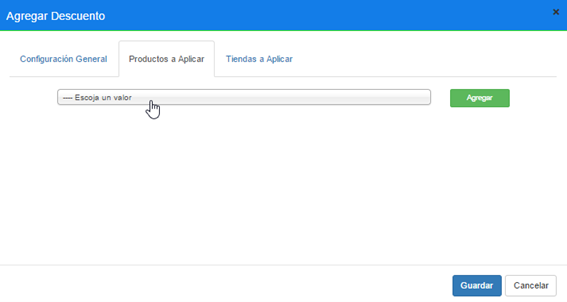

Los productos se pueden buscar mediante el nombre, o mediante el número de plu, una vez seleccionado el plu que queremos agregar,  se debe dar clic en el botón “Agregar”.

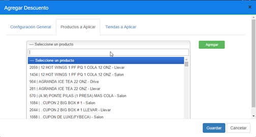
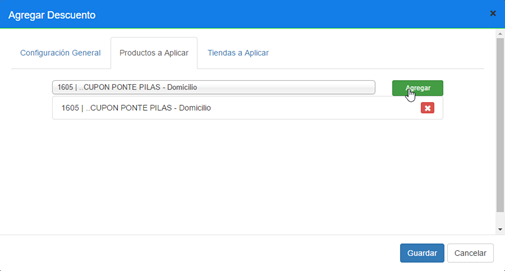

Si el producto ya se encuentra listado, se mostrará una alerta: 

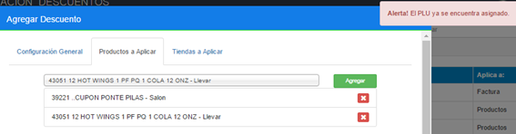

Si el producto ya se encuentra configurado en otro descuento, se mostrará una alerta, indicando el nombre de dicho descuento, y no se agregará al listado.

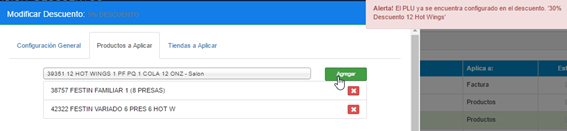

Si el producto tiene configuraciones de Transferencia de Venta, Se mostrará un mensaje de alerta, ya que estos productos no pueden ser configurados para ser utilizados en descuentos.

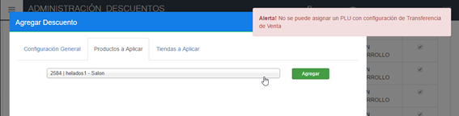

Se puede quitar un producto del descuento haciendo clic en el botón rojo  ubicado en  la parte derecha del producto

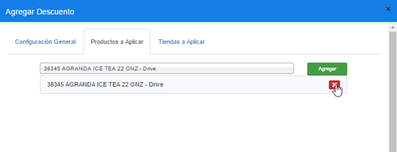

## Pestaña Tiendas a Aplicar	
En esta pestaña se agregan los locales en los cuales estará disponible el descuento, cada local tiene campos de fecha de inicio y fecha de finalización, para controlar la caducidad del descuento

Inicialmente la pestaña se muestra de la siguiente manera

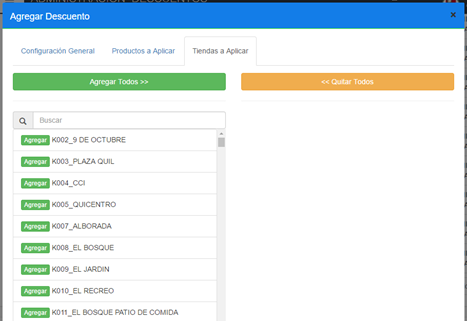

Para agregar un Restaurante se hace clic en el botón Agregar que se encuentra al lado del nombre de cara restaurante.

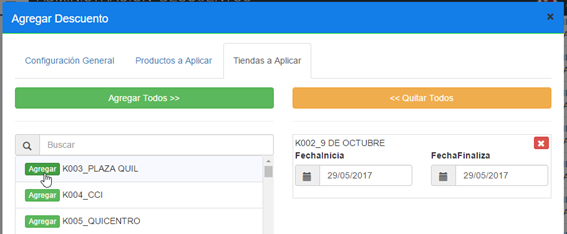

Se puede quitar un restaurante del listado haciendo clic en el botón rojo ubicado en la parte superior derecha del ítem que se desea retirar.

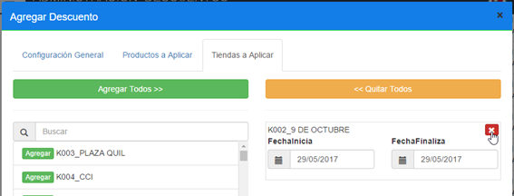

Para guardar el descuento se hace clic en el botón “Guardar” de la parte inferior del modal, con esto el nuevo descuento quedará guardado en el sistema.

## Modificar un Descuento
Para modificar un descuento se debe hacer doble clic sobre el descuento que deseamos modificar desde el listado de la pantalla principal, con esto se abrirá nuevamente la ventana modal con los datos del descuento seleccionado y el proceso será idéntico al de Agregar un descuento.
