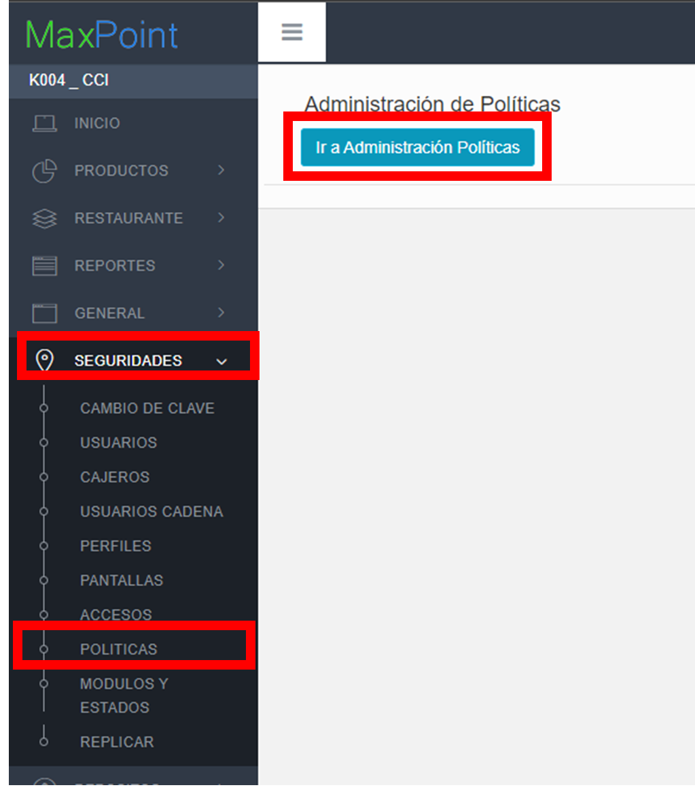
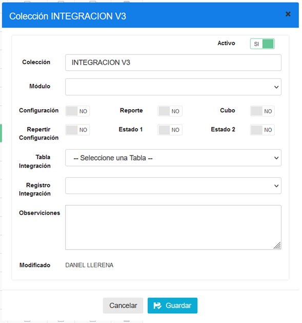
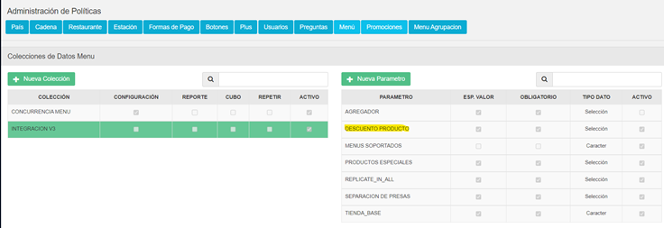
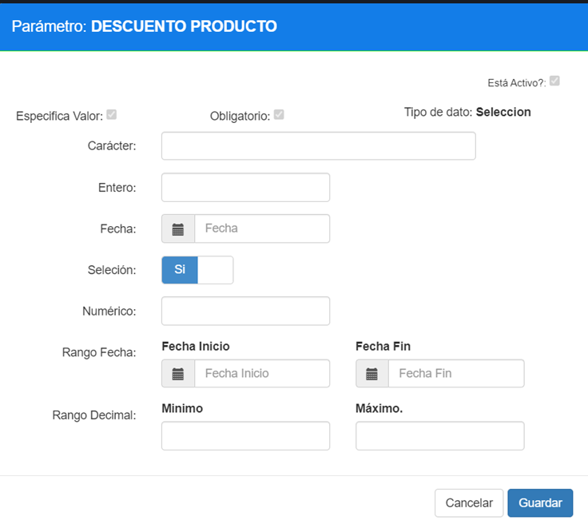
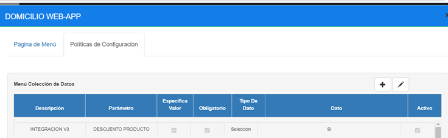

# Manual de politicas-DESCUENTOS V3

## 1	ANTECEDENTES
En el sistema Back office de MaxPoint se necesita crear una política para poder parametrizar los menús que aplican el envío de descuentos

## 2	OBJETIVO GENERAL
Crear y configurar las políticas y parámetros para realizar la sincronización de Jobs de la API V3. 

### 2.1	Objetivos específicos
* Crear las políticas y parámetros a nivel de Menú

## 3	POLÍTICAS DE CONFIGURACIÓN
### 3.1	Datos Generales
En este manual se detalla cómo crear la política correspondiente a la función para los parámetros de envío de productos especiales por Menú.

### 3.2	Pantalla de Políticas
Ingresar al sistema MaxPoint BackOffice con credenciales de administrador sistemas.

En el menú que se encuentra en la parte izquierda no dirigimos a la opción **SEGURIDADES** y seleccionamos **POLÍTICAS**, seguidamente presionamos sobre el botón **Ir a Administración Políticas** en el cual abrirá una nueva pestaña en el navegador.

### 3.3	Menú
#### 3.3.1	Colección Menú
**Se debe crear la política:**

| N°  | Colección  | Observacionesv |
| :---| :------------:| -------------:|
| 1 | INTEGRACION V3 | VALORES DE LA INTEGRACIÓN DE LA API V3 |

**Y debe visualizarse de la sig. Manera**

**Parámetros para la política INTEGRACION V3:**

| N° | Colección        | Parámetro                         | Tipo Dato |Esp. Valor | Obligatorio |Estado 1 |Estado 2 |
| -- | ---------------- | --------------------------------- |---------- |---------- |------------ |-------- |-------- |
| 1  | INTEGRACION V3   | DESCUENTO PRODUCTO                | Selección | SI        | SI          | NO      | NO      |

| Parámetro          | Tipo Dato |Esp. Valor | Obligatorio | VALOR A CONFIGURAR |
| ------------------ |---------- |---------- |------------ |------------------- |
| DESCUENTO PRODUCTO | Selección | SI        | SI          | si                 | 

#### 3.3.2. Valores parámetros de políticas
Valores parámetros de políticas
Ingresamos a PRODUCTOS – PAGINA DE MENÚ y uno de ellos.

Luego, ingresamos en la opción de políticas de configuración y agregamos **la política**.

