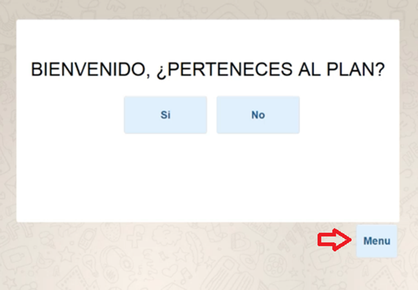
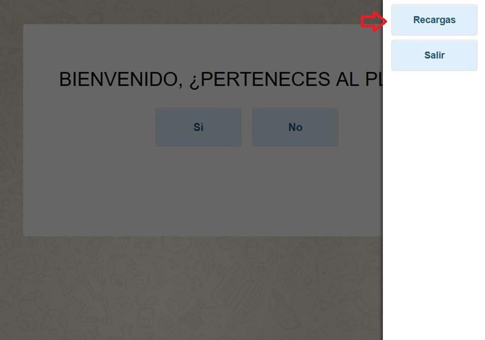
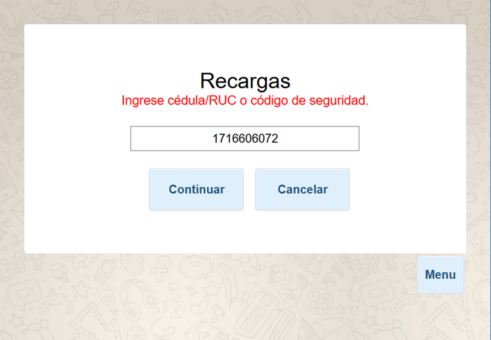
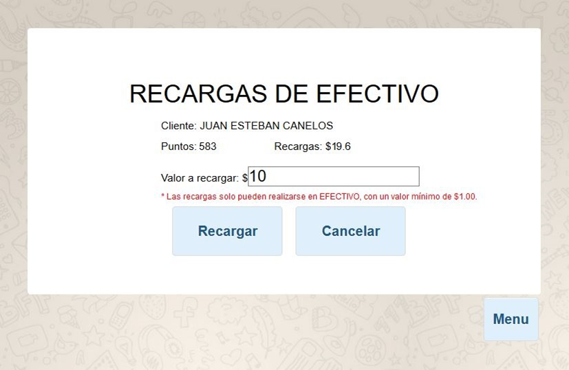
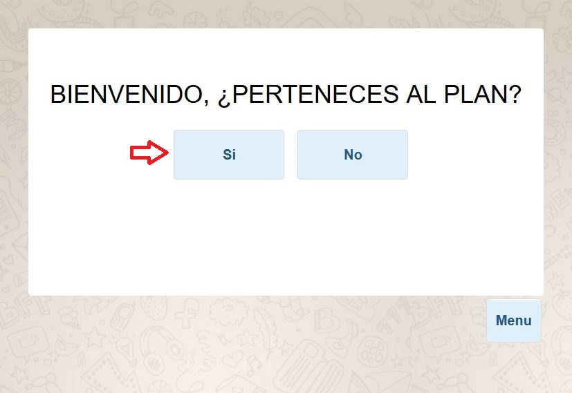
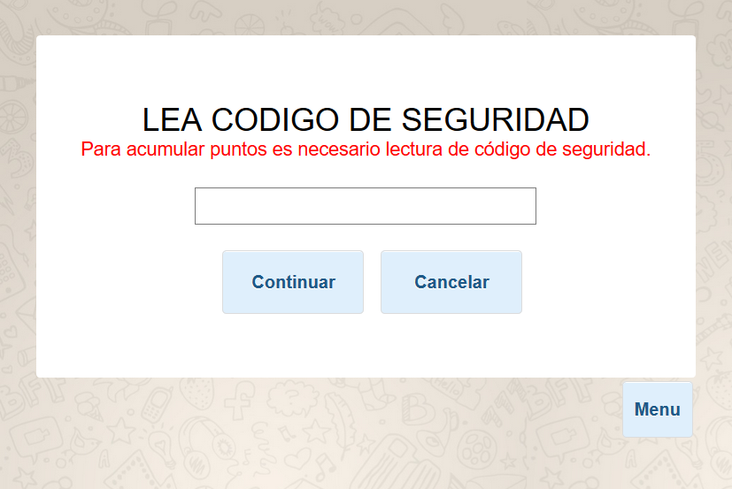
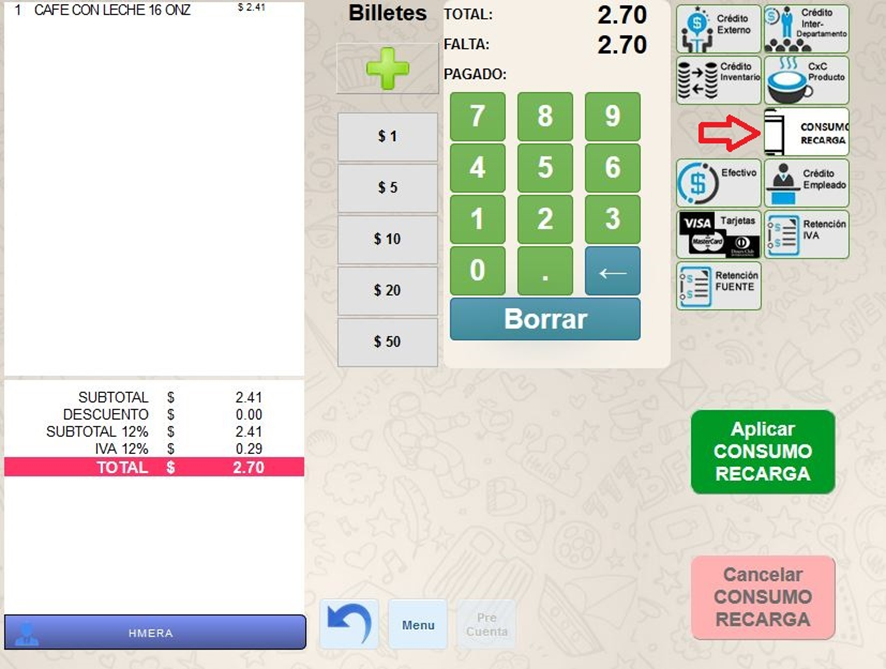
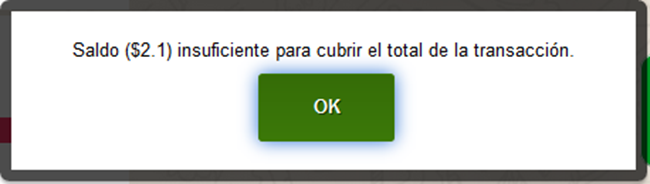
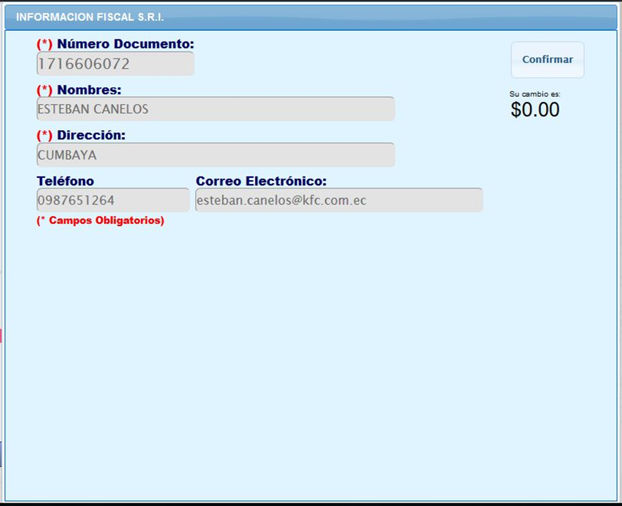

# Manual de Usuario RECARGAS Y CONSUMOS

## 1	 Realizar una Recarga
El cliente debe pertenecer al plan Amigos Juan Valdez para poder realizar una Recarga.
Para acceder a la pantalla de recarga, desde la pantalla de inicio, presionar en el botón “Menu”, ubicado en la parte inferior derecha.

A continuación, presionar el botón de “Recargas”.

Una vez en la pantalla de Recargas, ingresar la cédula del cliente y presionar “Continuar”.  También es posible escanear el código QR personal del cliente, de su aplicación Amigos Juan Valdez.

Ingresar el valor a recargar. El valor no puede ser decimal. Por defecto, el valor mínimo de las recargas son de $1. Para el pago de la recarga solo se acepta EFECTIVO.

Finalmente, el sistema confirmará si la recarga se realizó. 

## 2	Consumir el Saldo de Recargas
En la pantalla de inicio, si el cliente pertenece al plan Amigos Juan Valdez, presionar en el botón “Si”.

Escanear el código QR personal del cliente, de su aplicación Amigos Juan Valdez.

Una vez seleccionados los productos, proceder a la pantalla de cobro. Seleccionar la opción de “Consumo Recarga”.

En el caso de que el saldo de recargas del cliente no alcance a cubrir la totalidad de la factura, se mostrará una alerta.

Presionar el botón “Aplicar CONSUMO RECARGA” para realizar el pago con dicha forma de pago. En el caso de que el saldo de recargas del cliente no alcance a cubrir la totalidad de la factura, se utilizará todo el saldo disponible, y se deberá completar la transacción con otra forma de pago.
 
Finalmente, los datos del cliente aparecerán en pantalla. Presionar en “Confirmar” y validar los datos del cliente para finalizar la transacción.

