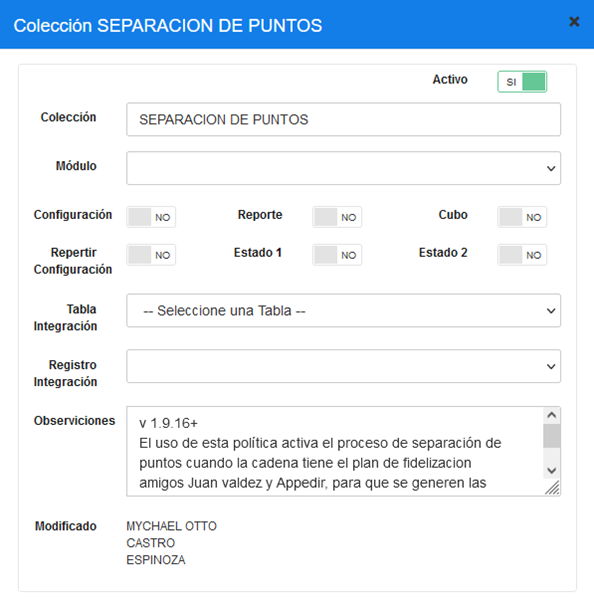
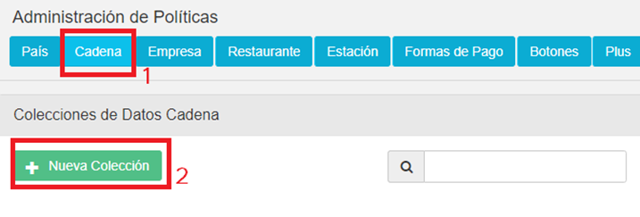
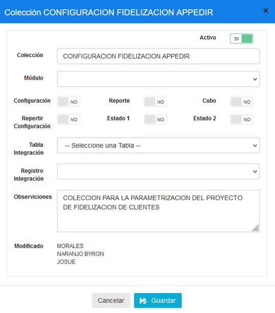
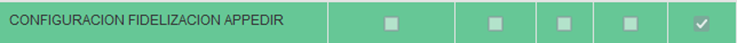

# MANUAL DE CONFIGURACION SEPARACIÓN DE PUNTOS

## 1	 DESCRIPCIÓN
Este manual se ha desarrollado para detallar el proceso de configuración respecto a las políticas de configuración necesarias para que funcione correctamente la función de separación de puntos en MaxPoint.

## 2	PROCEDIMIENTO
Para ingresar a las configuraciones de políticas iniciamos sesión en el BackOffice de MAXPOINT  

## 3	Configuración de políticas por cadena SEPARACIÓN DE PUNTOS
Nos dirigimos al módulo de SEGURIDADES y luego damos clic en la opción de POLÍTICAS.

Damos clic en “Ir a Administración Políticas”.

Nos ubicamos en las políticas por **“Cadena”**, y damos clic en botón **“Nueva Colección”**.

En descripción colocamos **“SEPARACION DE PUNTOS”**.

*Configuraciones necesarias para validar si la funcionalidad de separación de puntos debe o no ser aplicada dentro de las configuraciones.*

La política creada se muestra de la siguiente manera.

### 3.1.1	Parámetros de la política CONFIGURACIONES SEPARACIÓN DE PUNTOS

| Nombre del parámetro | Esp. Valor | Obligatorio | Tipo Dato | Valor a configurar |
|----------------------|------------|-------------|-----------|--------------------|
| ACTIVO               | SI         | SI          | Selección | SI                 |

### 3.1.2	Explicación parámetros de la política CONFIGURACIONES SEPARACIÓN DE PUNTOS

| Nombre del parámetro | Descripción                                                                                      |
|----------------------|--------------------------------------------------------------------------------------------------|
| ACTIVO               | Política que permite validar si se aplica o no la separación de puntos en la interfaz. Si el   |
|                      | valor está activo, se cambia el RUC que se sube a la interfaz; de lo contrario, se mantiene el |
|                      | mismo.                                                                                           |

## 4	Configuración de políticas por cadena FIDELIZACIÓN APPEDIR
Nos dirigimos al módulo de SEGURIDADES y luego damos clic en la opción de POLÍTICAS.

Damos clic en “Ir a Administración Políticas”.

Nos ubicamos en las políticas por **“Cadena”**, y damos clic en botón **“Nueva Colección”**.

En descripción colocamos **“CONFIGURACION FIDELIZACION APPEDIR”**.

*Configuraciones necesarias para la funcionalidad de fidelización APPEDIR realice la diferenciación de datos al momento de generar facturas o de subir a la interface, ingresando todos los datos necesarios para que esta funcione correctamente.
*

La política creada se muestra de la siguiente manera.

### 4.1.1	Parámetros de la política CONFIGURACION FIDELIZACIÓN APPEDIR

| Nombre del parámetro      | Esp. Valor | Obligatorio | Tipo Dato | Valor a configurar          |
|----------------------------|------------|-------------|-----------|-----------------------------|
| APLICA CONFIGURACION       | SI         | SI          | Selección | SI                          |
| AUTOCONSUMO RAZON SOCIAL   | SI         | SI          | Caracter  | APPFOODS S.A.               |
| AUTOCONSUMO RUC            | SI         | SI          | Caracter  | 1793047653001               |
| BIENVENIDA                 | SI         | SI          | Caracter  | BIENVENIDO, ¿PERTENECES AL PLAN? |
| DESPEDIDA                  | SI         | SI          | Caracter  | Hasta pronto, por esta compra acumulaste _puntos_pts, tienes un saldo de _total.puntos_. |
| FORMATO RIDE               | SI         | SI          | Caracter  | \<tr>\<td colspan="4" style="font-size: 12px; font-weight: bold; line-height: 1;">Felicidades! acumulaste \</td>\</tr>\<tr>\<td colspan="4" style="font-size: 16px; font-weight: bold; line-height: 1; padding: 6px 0;" align="center">\<strong>{0} puntos\</strong>\</td>\</tr>\<tr>\<td colspan="4" style="font-size: 12px; font-weight: bold; line-height: 1;">Tienes {1} puntos en total.\</td>\</tr>\<tr>\<td colspan="">Acumula puntos\</td>\</tr> |
| FORMATO VOUCHER            | SI         | SI          | Caracter  | 3                           |
| INTERFACE RAZON SOCIAL     | SI         | SI          | Caracter  | APP FOOD FIDELIZACION       |
| INTERFACE RUC              | SI         | SI          | Caracter  | 9999999999918               |
| LIMITES VALOR RECARGA      | SI         | SI          | Minimo-Maximo | 1.99 - 100.00          |
| NOMBRE PLAN                | SI         | SI          | Caracter  | AMIGOS KFC                  |
| PREGUNTA REGISTRO          | SI         | SI          | Caracter  | ¿Deseas pertenecer al plan? |
| REPORTES SEGURIDAD         | SI         | SI          | Caracter  | Pnp4ImvR5xSmm5EuKHn2xdowjXgTMyshgwKpqppu |
| SEGURIDAD                  | SI         | SI          | Caracter  | Bearer anZhbGRlejpqdmFsZGV6 |
| TITULO RIDE                | SI         | SI          | Caracter  | DATOS CLIENTE               |
| TITULO VOUCHER             | SI         | SI          | Caracter  | 2                           |
| URL WEB                    | SI         | SI          | Caracter  | descarga-appedir.com        |

### 4.1.2	Explicación parámetros de la política CONFIGURACION FIDELIZACIÓN APPEDIR

| Nombre del parámetro   | Descripción                                                                                                                             |
|-------------------------|-----------------------------------------------------------------------------------------------------------------------------------------|
| APLICA CONFIGURACION    | Política que permite validar si se aplica o no la configuración de fidelización APPEDIR.                                               |
| AUTOCONSUMO RAZON SOCIAL | Permite configurar la razón social que se visualiza con la configuración de APPEDIR.                                                   |
| AUTOCONSUMO RUC        | Se registra el RUC con el cual se guardan las facturas dentro del sistema MAXPOINT.                                                     |
| BIENVENIDA              | Mensaje de bienvenida que se muestra al cajero cuando está habilitada la fidelización en el restaurante y se ingresa a la interfaz de facturación de MAXPOINT. |
| DESPEDIDA               | Mensaje que se visualiza en la factura indicando los puntos que ha acumulado por la compra.                                            |
| FORMATO RIDE            | Contenido HTML que se muestra en la factura y que indica los puntos que se han acumulado en la compra.                                  |
| FORMATO VOUCHER         | Contenido para el voucher.                                                                                                             |
| INTERFACE RAZON SOCIAL  | Permite configurar la razón social que se visualiza con la configuración de APPEDIR al subir las ventas a la interfaz SIR.          |
| INTERFACE RUC           | Se registra el RUC con el cual se guardan las facturas al subir las ventas a la interfaz SIR.                                           |
| LIMITES VALOR RECARGA   | Límite de los valores a recargar (rango: mínimo - máximo).                                                                            |
| NOMBRE PLAN             | Nombre del plan que se muestra al cajero cuando está habilitada la fidelización en el restaurante y se ingresa a la interfaz de facturación de MAXPOINT. |
| PREGUNTA REGISTRO       | Pregunta para registro en el plan.                                                                                                     |
| REPORTES SEGURIDAD      | Valor para reporte de seguridad.                                                                                                       |
| SEGURIDAD               | Token de tipo Bearer que se maneja para seguridad.                                                                                     |
| TITULO RIDE             | Título a presentarse en el RIDE.                                                                                                       |
| TITULO VOUCHER          | Título a presentarse en el VOUCHER.                                                                                                    |
| URL WEB                 | URL donde está alojada la web.                                                                                                         |
