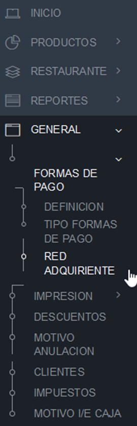

# Formas de Pago
# Creación Forma de Pago Cupón Multimarca
Para que se muestre el botón de canje de Cupones Multimarca es necesario crear en la administración una forma de pago con los siguientes datos. Es importante verificar El campo **Codigo Respuesta DLL Gerente**, el valor seleccionado Debe ser **Cupón Prepagado**.

Para ello se ingresa dentro de la administrador al menú GENERAL = FORMAS DE PAGO = DEFINICION

Y en la parte superior damos click en el botón Nuevo    

Se despliega el Modal de creación de Formas pago, 

Este Modal debe ser llenado con los siguientes datos.

