# Configuracion KDS

## ANTECEDENTES 
En el sistema MAXPOINT las ordenes de pedido que se digitan en las estaciones realiza una impresión al finalizar la 
transacción, en algunas tiendas tienen la necesitan de visualizar las ordena a despachar en un monitor de cocina por lo 
que es necesario la instalación y configuración de un servicio que permita ver las ordenes en pantalla. 

## 2 OBJETIVOS 
 Visualizar las órdenes de pedido en el monitor de cocina. 

## 3 SERVICIO KDS 
### 3.1 Datos Generales 
En este manual se detalla cómo realizar la configuración del servicio KDS que permite la visualización de las 
órdenes de pedido en el monitor de cocina, para este proceso se debe considerar lo siguiente: 

    ✔ En Azure debe estar creada la política de configuración MONITOR DE COCINA a nivel de restaurante.

    ✔ En Azure el restaurante debe estar configurada la colección MONITOR DE COCINA. 

    ✔ Validar que dicha colección y configuración del restaurante se encuentre en la tienda. 

    ✔ Tener instalado en el servidor de la tienda el ROD Gold. 

### 3.2 Colección Monitor de Cocina. 
Ingresar al sistema MAXPOINT BackOffice con credenciales de administrador sistemas y seleccionar la cadena 
a la cual pertenece el restaurante a configurar. 

Antes de configurar la colección **MONITOR DE COCINA** al restaurante, debemos verificar que dicha colección 
este creada, para ello en el menú que se encuentra en la parte izquierda no digerimos a la opción 
**SEGURIDADES** y seleccionamos **POLÍTICA**, seguidamente presionamos sobre el botón Ir a Administración 
**Políticas** en el cual abrirá una nueva pestaña en el navegador.

En la pantalla de políticas seleccionamos la opción **Restaurante** y buscaremos la colección llamada **MONITOR 
DE COCINA**.

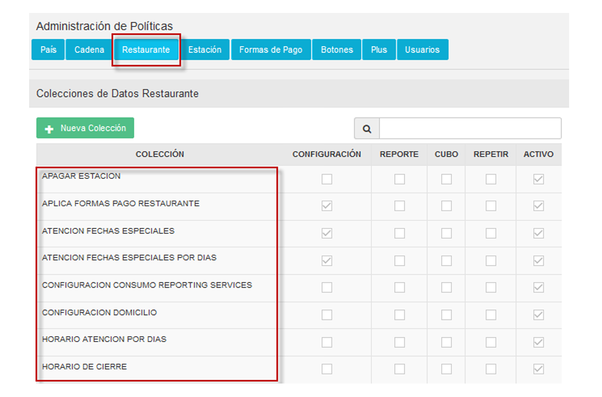

Creación de Colección 
Si no existe la colección se la debe crear, en la opción **Restaurante** presionar sobre el botón **Nueva Colección** 
en la cual se abrirá una modal para su creación.

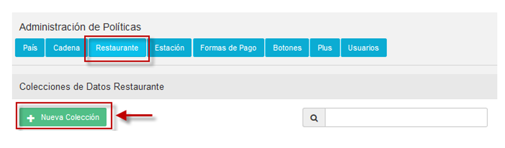

Para la creación de la colección se debe ingresar los siguientes datos:

**Colección**: MONITOR DE COCINA 

**Módulo**: Restaurante 

**Observaciones**: Una descripción de la función que realizara dicha colección. 

Una vez que se haya ingresado  y seleccionado la información establecida procedemos a **Guardar**.

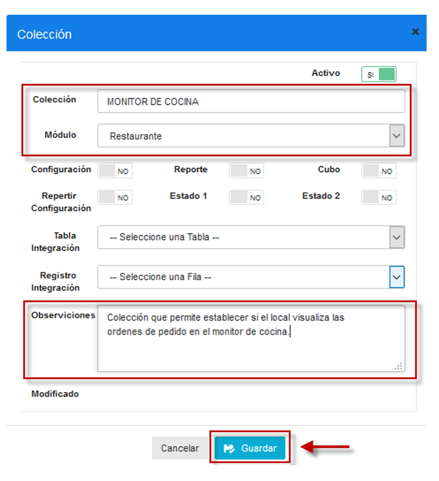

#### 3.2.2 Creación Parámetro de Colección 
Una vez creada la colección se debe proceder a crear los parámetros de configuración acorde a la operación o 
necesidad del restaurante a continuación se detallan los tipos de parámetros que puedes ser creados: 

1. Ver Orden de Pedido? 
2. Fuertes. 

Para ello seleccionamos la colección que hemos creamos y presionamos sobre el botón **Nuevo Parámetro** 
(derecha), en la cual se abrirá una modal para su creación.

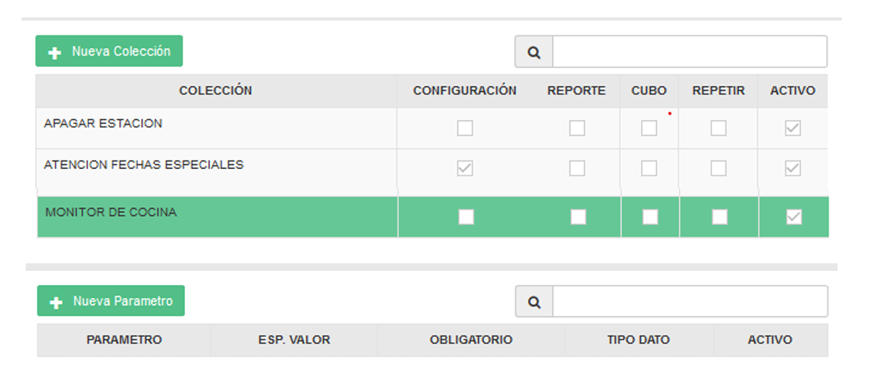

**Ver Orden de Pedido?**.- Este parámetro permitirá validar si el restaurante tiene o no KDS (Monitor de cocina) 
para la visualización de las ordenes de pedido. 

Para la creación del parámetro de configuración se debe ingresar los siguientes datos: 

**Parámetro**: Ver Orden de Pedido? 

**Tipo de Dato**: Selección. 

**Especifica Valor**: SI 

**Obligatorio**: SI 

Una vez que se haya ingresado  y seleccionado la información establecida procedemos a **Guardar**. 

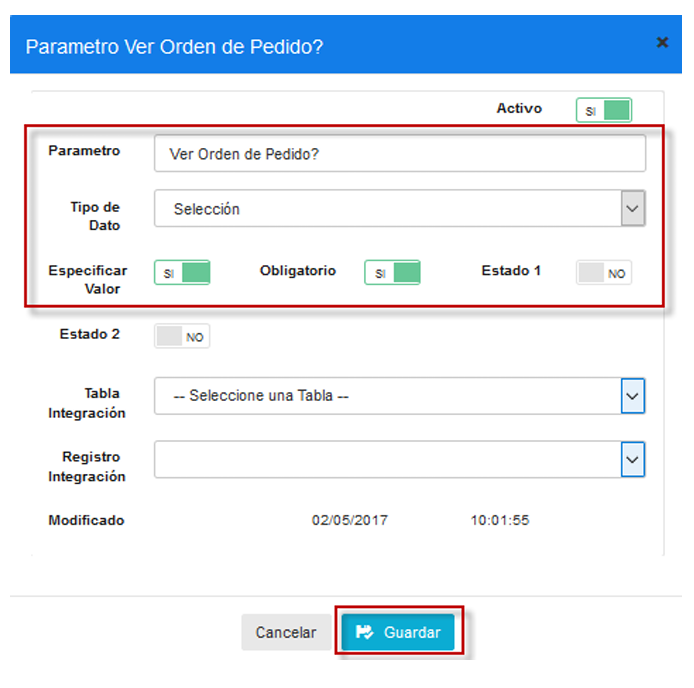

**Fuertes.-** La creación de este parámetro es opcional, se puede establecer si el local visualiza platos fuertes o ciertos 
productos, es decir en el monitor de cocina solo se visualizara los productos configurados. 

**Importante:** **Los plus deben tener configurado la opción “Se muestra en el display de cocina”, en la pantalla de 
productos.**

Para la creación del parámetro de configuración se debe ingresar los siguientes datos: 

**Parámetro:** Fuertes 

**Tipo de Dato:** Selección. 

**Especifica Valor:** SI 

**Obligatorio:** SI 

Una vez que se haya ingresado  y seleccionado la información establecida procedemos a **Guardar**.

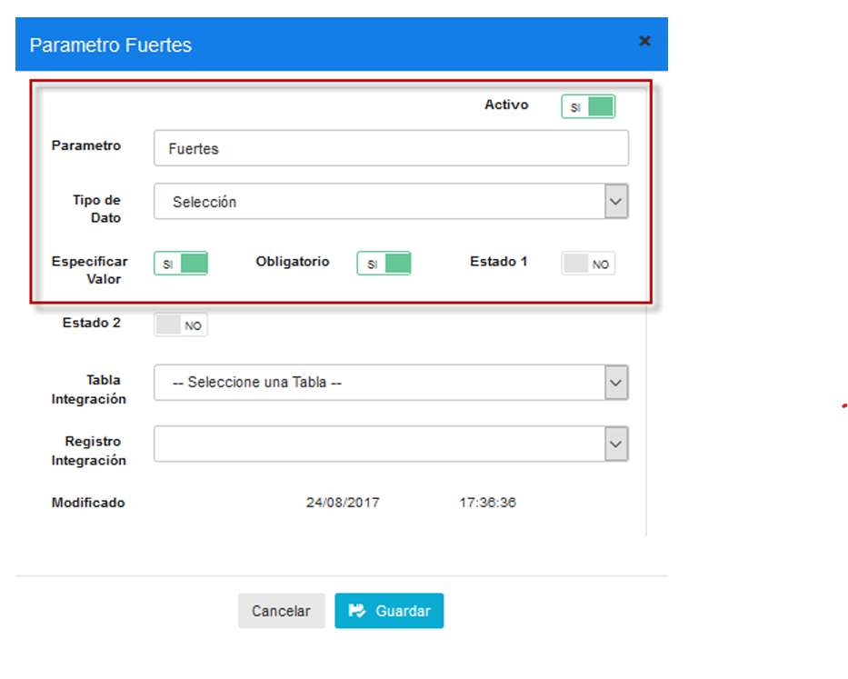

Una vez creado los tres parámetros de configuración se debe tener lo siguiente:

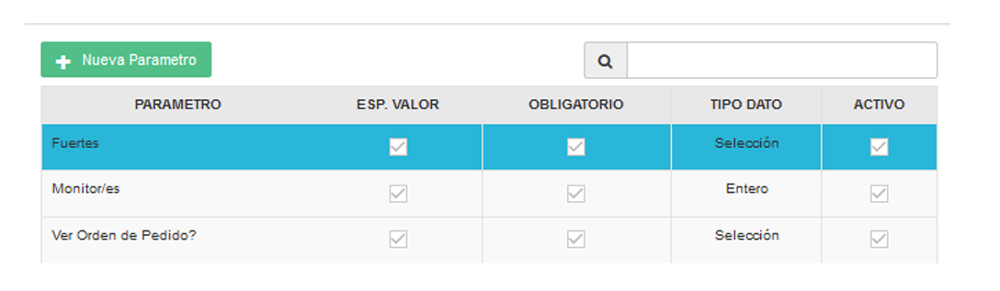

#### 3.3 Restaurante Configuración de Colección 
Una vez que se verifico que exista o se creó la colección **MONITOR DE COCNA** procedemos a realizar la configuración al 
restaurante. 

En el menú nos dirigimos a **RESTAURANTE** y seleccionamos la opción **RESTAURANTE**, seguidamente seleccionamos el 
restaurante al cual se realizara la configuración.

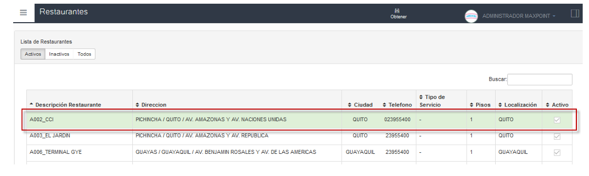

Con un doble click se abrirá una modal con la información del restaurante, seleccionamos la opción de la 
pestaña **Políticas de Configuración**.

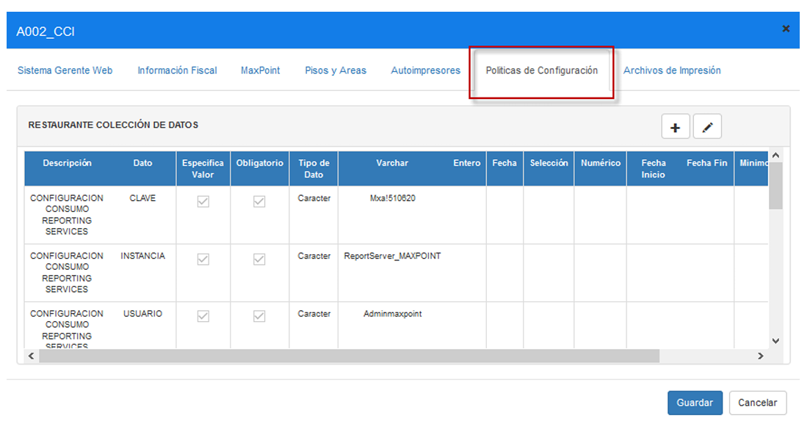

Para agregar la política de configuración **MONITOR DE COCINA**, presionamos sobre el símbolo “+”, en el cual 
se nos abrirá una pequeña modal. 

Buscamos la colección **“MONITOR DE COCINA”** (izquierda) y la seleccionamos, a su vez en la en la parte 
derecha aparecerá la opción **“Ver Orden de Pedido?”** y la seleccionamos.

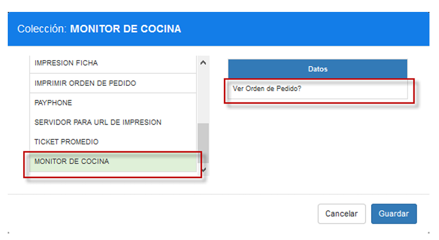

Para configurar qué el restaurante muestre las órdenes de pedido en pantalla, en la opción **Selección** debe estar en **SI**, 
seguidamente presionar el botón **Guardar**.   

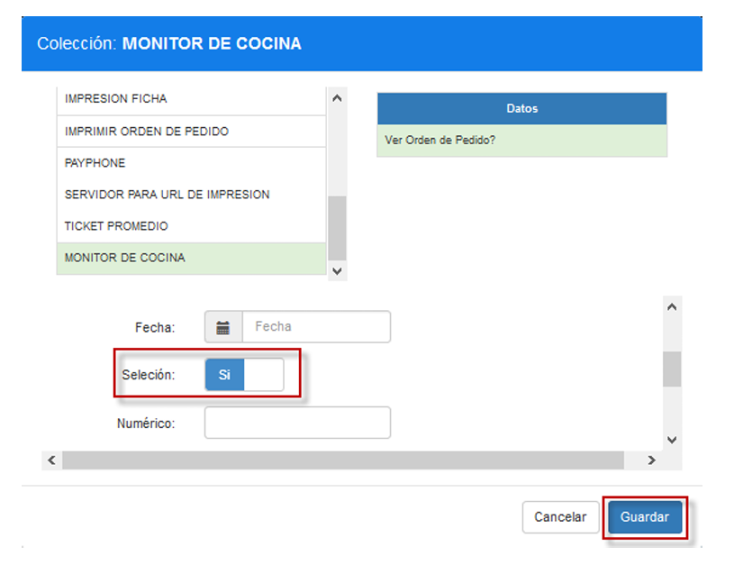

Una vez ya configurada la colección al restaurante deberá aparecer de la siguiente manera, para salir presionar **Cancelar**. 

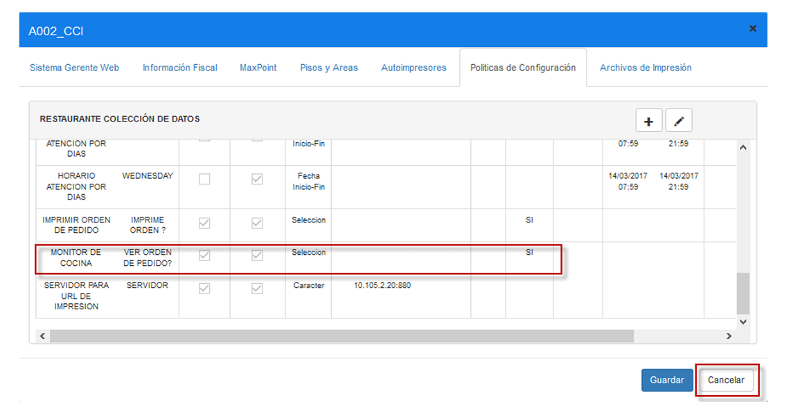
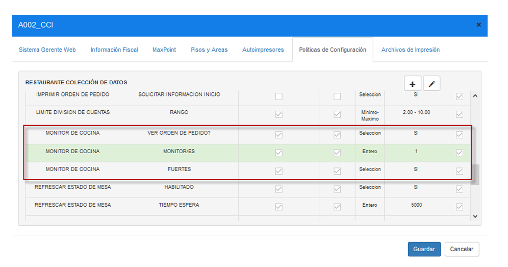

Si se desea modificar seleccionamos la colección y presionar sobre el botón editar “**lápiz**”.

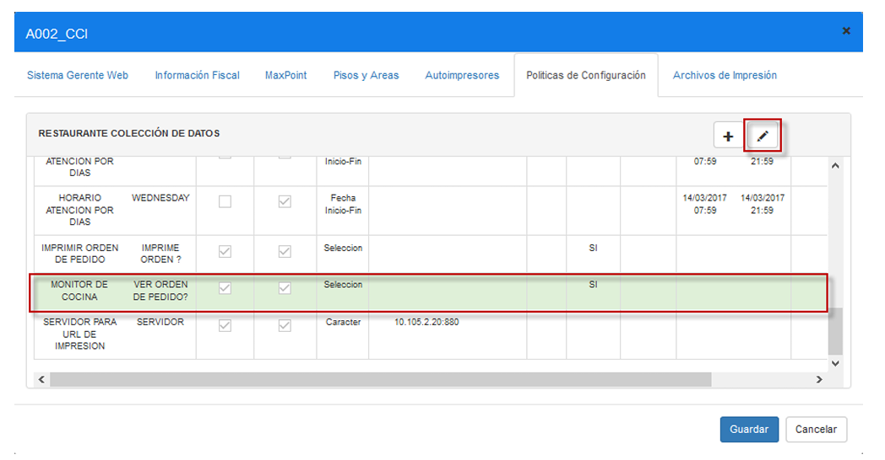

 Aquí se podrá modificar el estado de la colección es decir de activo a inactivo o viceversa, a selección SI o NO según el 
caso, seguidamente presionar **Guardar**.

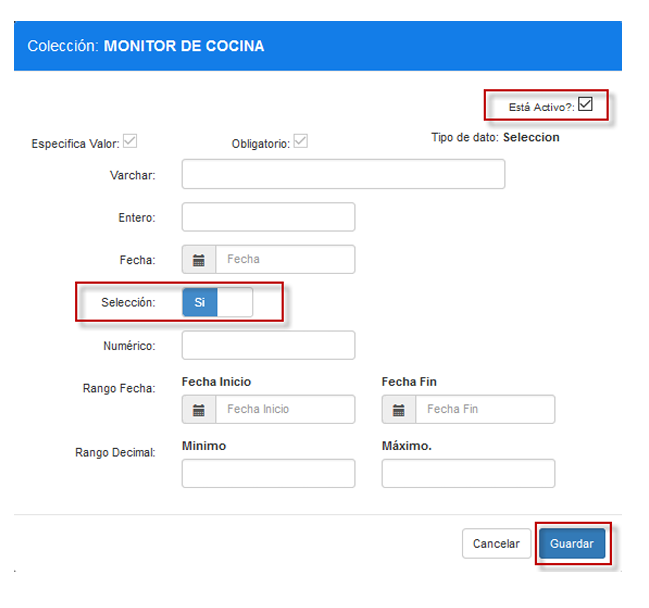

### 3.4 Configuración JAR en el Servidor del Local 
Como primer paso en el disco “**C**” del servidor del local se debe crear una carpeta llamada “**MonitorCocina**”.

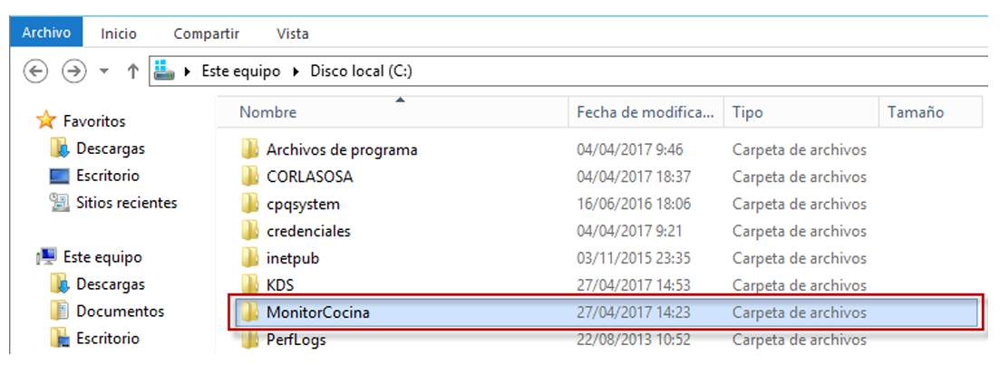

Copiar el jar de la siguiente ruta: \\192.168.101.249\Publico\Desarrollo\Desarrollo 

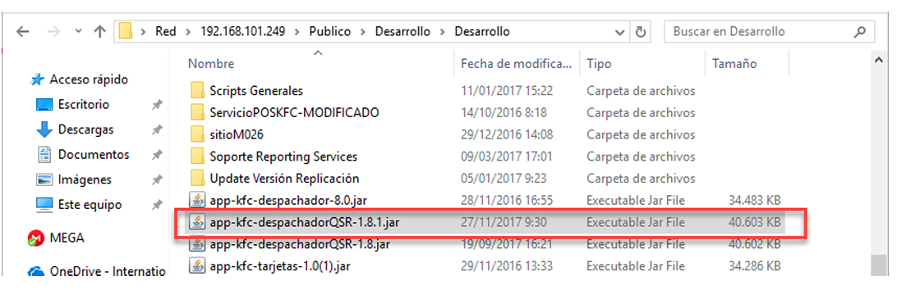

Pegarlo en la carpeta que se creó MonitorCocina. 

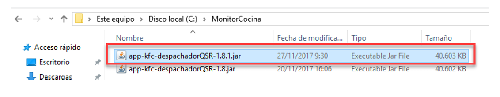

#### 3.4.1 Parámetros de Configuración JAR 
Una vez copiado el jar abrir el archivo “**application**” (abrir el jar con winrar) y configurar lo siguientes parámetros: 

Jdbc:sqlserver: // IP del servidor. 

DatabaseName: Nombre de la base de datos.  

Usuario y Contraseña de la base de datos.

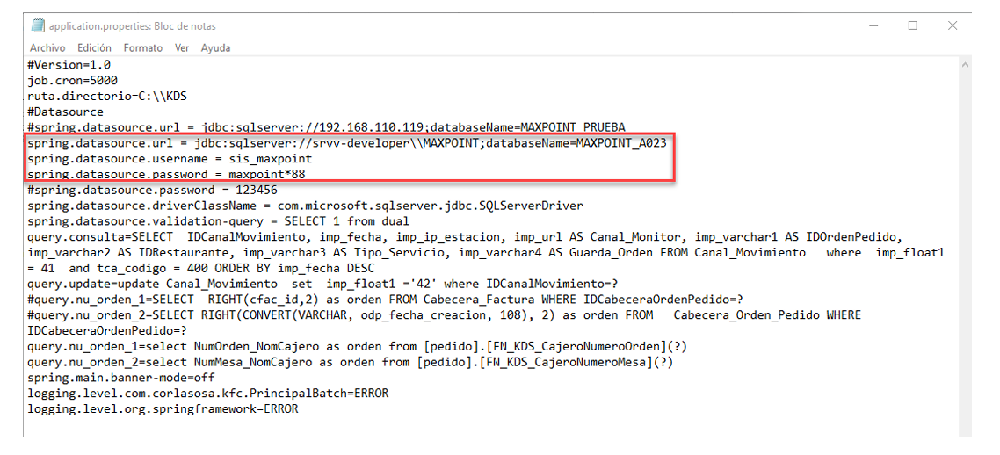

#### 3.4.2 Creación del servicio 
En el disco “**C**” del servidor del local buscar la carpeta **toolService** ingresar y ejecutar el **RunExeSvcAdmin**. 

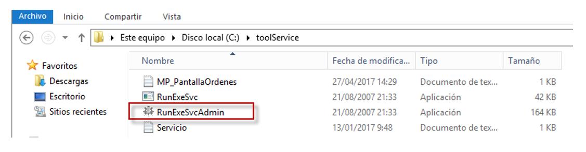

En el RunExeSvcAdmin presionar sobre New, para crear el jar como servicio.

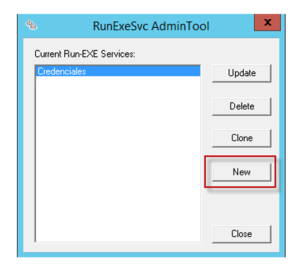

El nombre del servicio debe ser creado con el siguiente estándar: 

**Service Name:** MP_PantallaOrdenes  
**Rumetime:** debug=false 
classpath=C:\MonitorCocina;C:\MonitorCocina\app-kfc-despachadorQSR-1.0.jar 

cmdline=C:\Program Files\Java\jre1.8.0_111\bin\javaw.exe  org.springframework.boot.loader.JarLauncher 

home=C:\MonitorCocina 

Seguidamente presionar en **Create**.

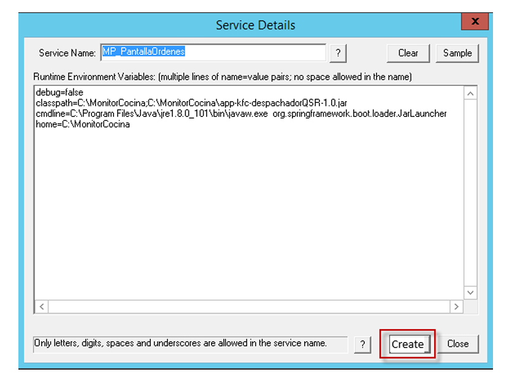

Una vez que el jar está creado como servicio nos amostrara la siguiente información, para cerrar presionar sobre el 
botón el **Close**. 

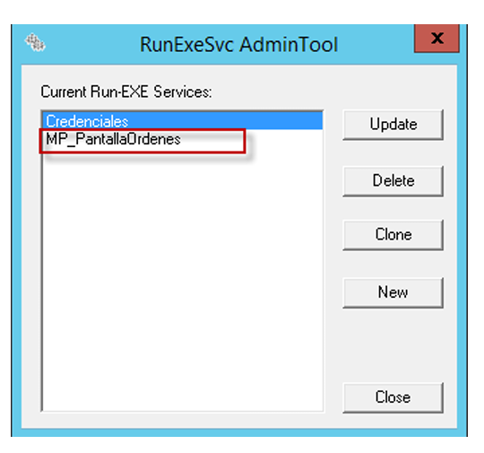

#### 3.4.3 Inicio del servicio MP_PantallaOrdenes Automático 
Para ello debemos dirigirnos a Servicios de Windows.

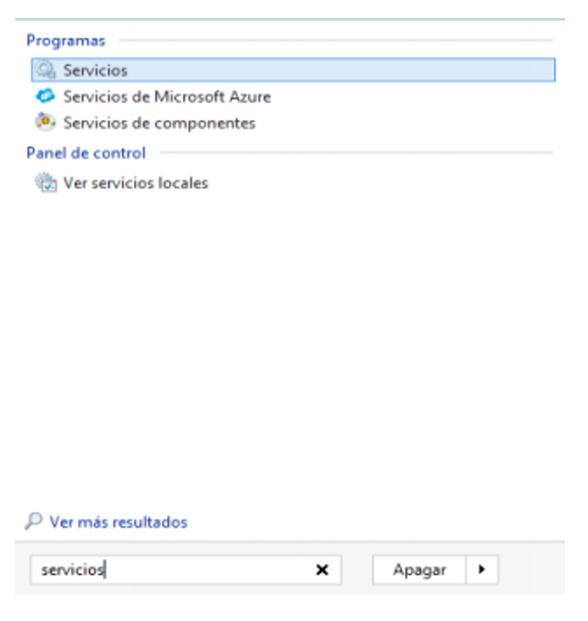

Ubicamos el servicio llamado MP_PantallaOrdenes y dar doble click sobre el mismo.

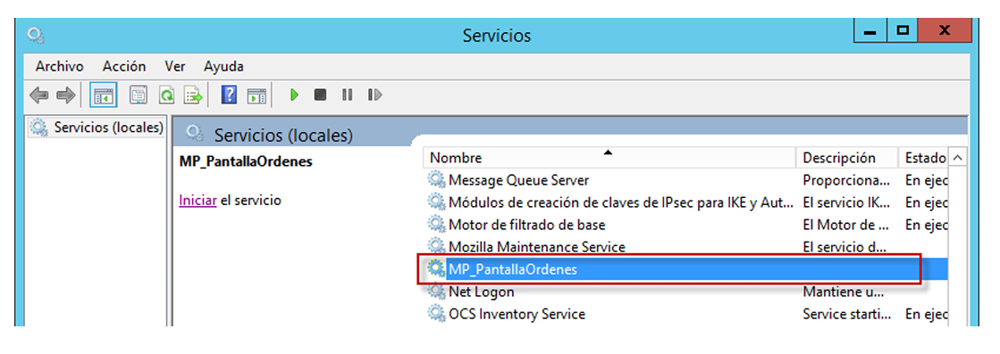

A continuación configuramos para que el servicio se inicie Automático e iniciamos el servicio. 

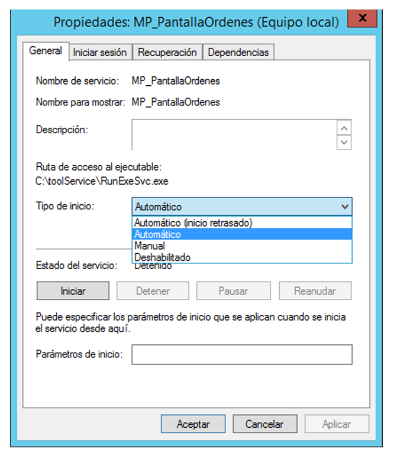

### 3.5 Configuración ROD Gold 
Una vez que el ROD Gold se encuentre instalado en el servidor del local procederemos a la configuración para el servicio. 
En el disco “**C**” crear una carpeta con el nombre “**KDS**”. 

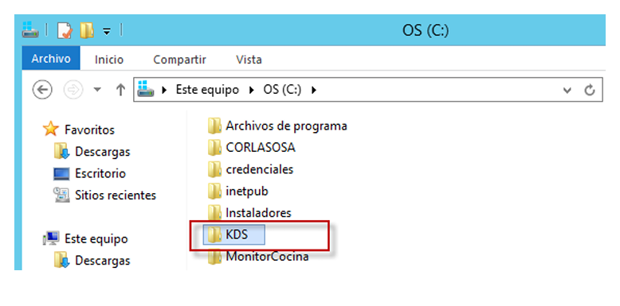

En Inicio **/ Todos los Programas** buscar la carpeta **Select Electronics Corporation** y seleccionar **ROD Gold Maintenance**.

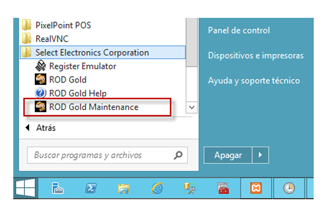

Click sobre la opción **Global Settings**.  

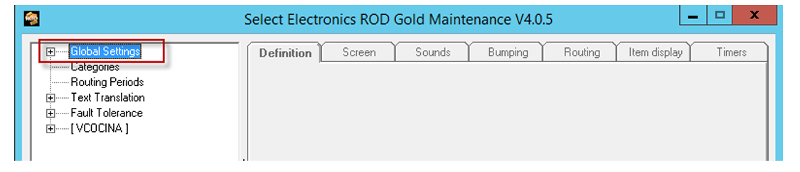

En la siguiente pantalla debemos configurar los siguientes parámetros: 

**System Type:** Seleccionar la opción **KDSWinn Compatible**. 

**Location of KDSData:** C:\KDS (la ruta en donde fue creada la carpeta KDS).

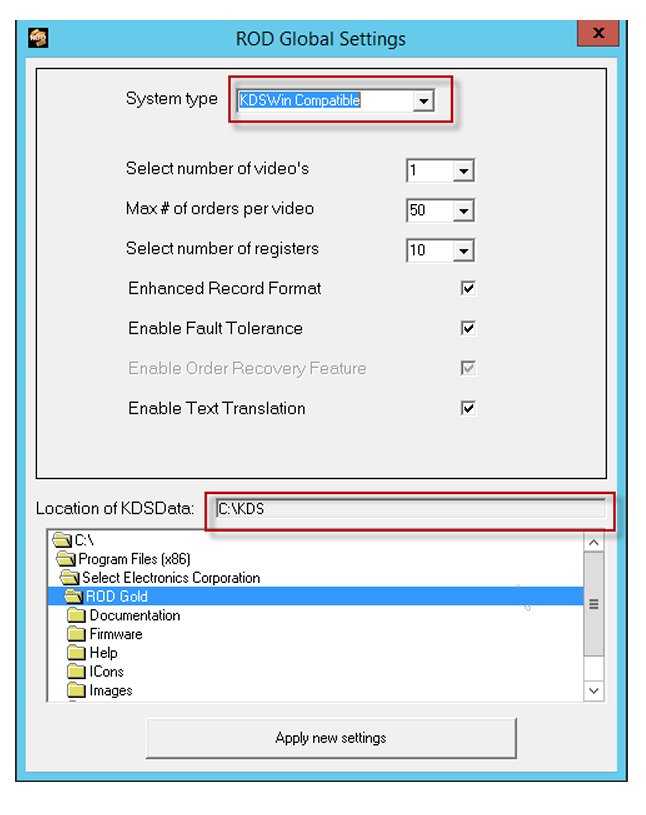

#### 3.5.1 Iniciar   ROD Gold 
En **Inicio / Todos los programas** buscar la carpeta Select Electronics Corporation y seleccionar **ROD Gold**. 

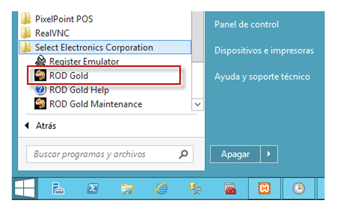

Una vez ejecutado el ROD Gold se abrirá la siguiente pantalla y presionamos en **View**.

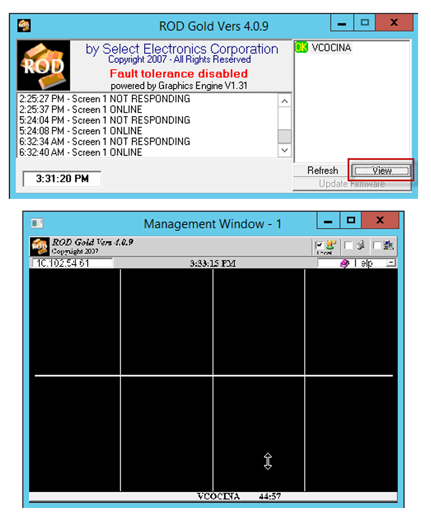

#### 3.5.2 Inicio Emulador ROD Gold 
En **Inicio / Todos los programas** buscar la carpeta **Select Electronics Corporation** y seleccionar **Register Emulador**.

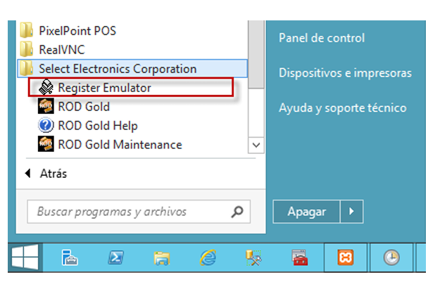

En esta pantalla seleccionamos cualquier opción del menú y presionamos **Cash Out**.

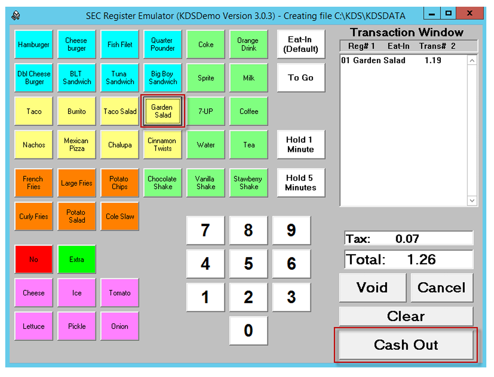

Nos deberá aparecer la orden que se seleccionó del emulador. 

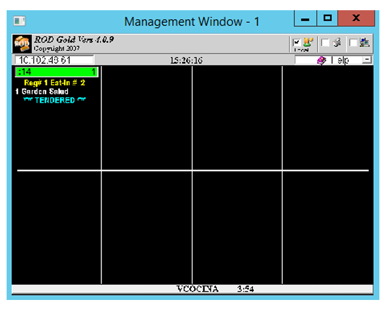

#### 3.5.3 Orden de pedido MaxPoint  
Una vez  realizadas todas las configuraciones necesarias para la visualización de las órdenes en el KDS, desde el 
MaxPoint procedemos a enviar una prueba, es decir con un periodo abierto y asignado un cajero digitamos una orden     
facturamos la transacción y la orden debe visualizarse en el monitor de cocina.

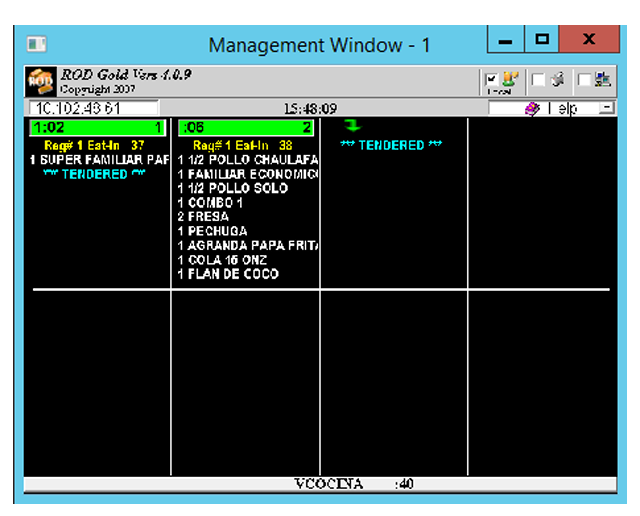

Desde el QSR borrar las órdenes y en la estación volver a digitar otras órdenes para verificar el correcto funcionamiento 
del servicio QSR. 

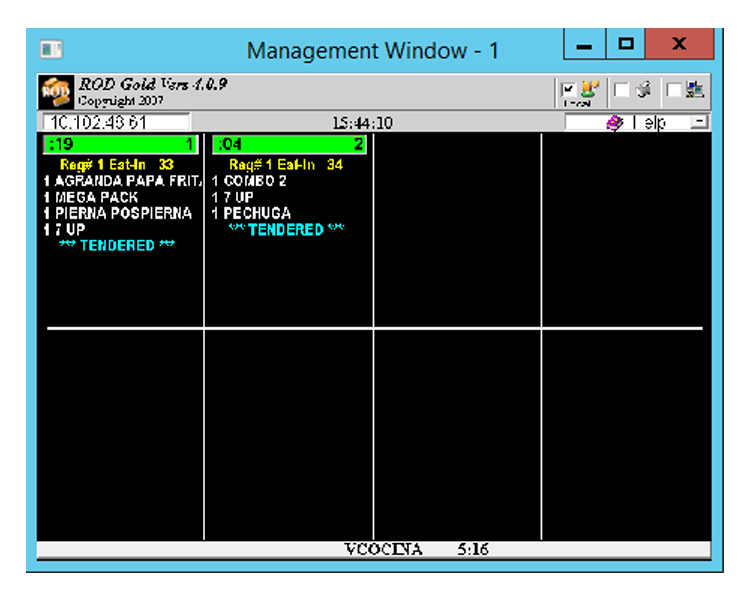

***Nota:** No cerrar la  pantalla **Register Emulador** solo minimizarla,  realizar las notas de crédito  
de las transacciones que se  hizo las pruebas..*

