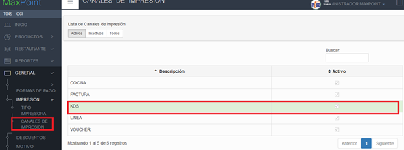
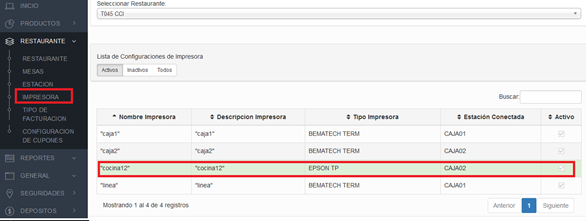
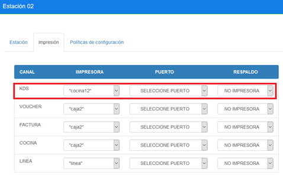
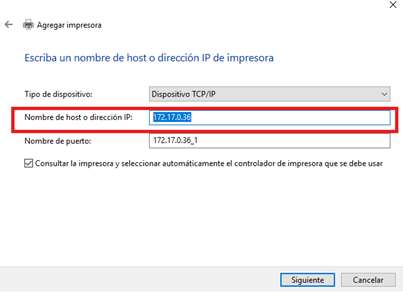
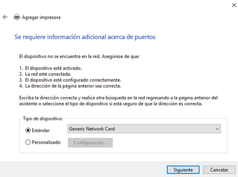
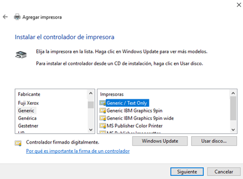
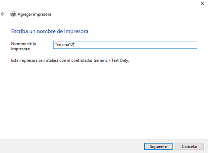
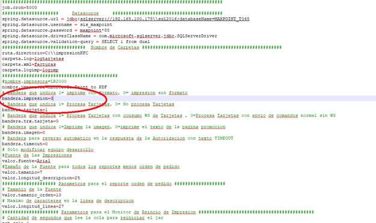

# Manual KDS CHEFTAB

## 1	OBJETIVOS
    ✔ Conocer sobre la nueva instalación de nuevo KDS CHEFTAB

## 2	PANTALLA CANAL DE IMPRESION
### 2.1	Datos Generales
Para la instalación lo primero es crear un canal de impresión llamado KDS, como se muestra en la pantalla siguiente:

Una vez creado el canal de impresión procederemos a crear una impresora con el nombre que deseemos ponerlo, debemos tomar en cuenta que el nombre con el cual creemos la impresora debe ser el mismo con el que se cree en Windows para que el servicio de impresión no tenga ningún inconveniente al momento de imprimir.

En el ejemplo anterior se creó una impresora llamada “cocina12”, la cual está ligada a la caja02 en este ejemplo. Si se requiere de configurar en ambas estaciones debemos ir a la estación luego a la pestaña de impresión y escoger la impresora ya creada.

### 2.2	CREACION DE IMPRESORA WINDOWS
Debemos crear la impresora ya antes nombrada, para eso debemos agregar una nueva impresora en Windows. La agregamos por medio de una dirección TCP/IP, para eso la Tablet debe estar conectada a la red y debemos conocer la ip. En este caso la ip de la Tablet es la siguiente: 

Se crea la impresora con las siguientes configuraciones:
1.	Estandar Generic Network Card
2.	Generic => Generic/Text Only
3.	Nombre de impresora creada en Maxpoint

### 2.3	ADMINISTRACION  CHEFTAB
* Instalar Cheftab en la Tablet

* La clave para la administración de cheftab es 9999.

* Podemos cambiar el nombre de KDS en el menú de configuración y además otras cosas, pero al principio lo dejamos por defecto.

### 2.4	CONFIGURACION DE SERVICIO DE IMPRESIÓN 

Para que el KDS muestre la información requerida se debe tener en cuenta lo siguiente y es muy importante.

Nota: Verificar que el servicio de impresión, la bandera de formato se encuentre en 0.

