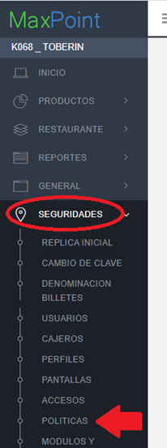
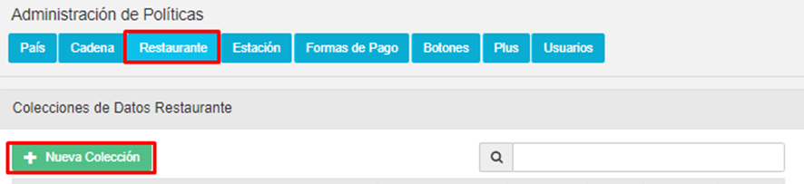
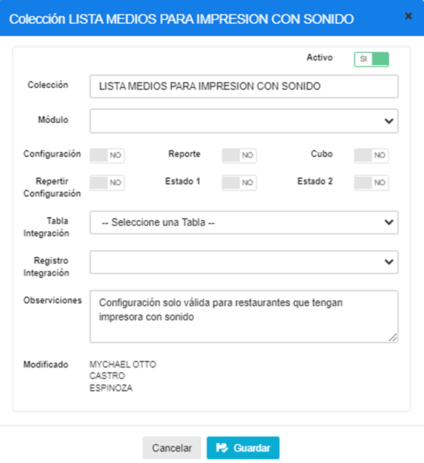
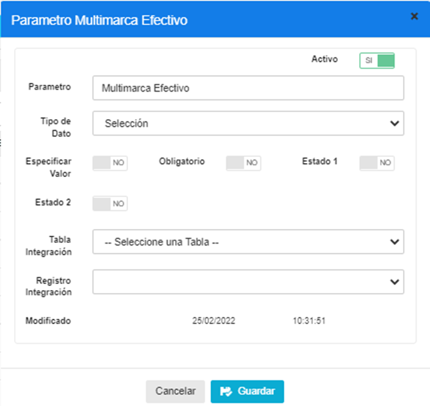
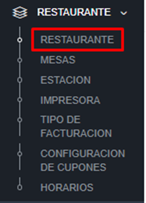
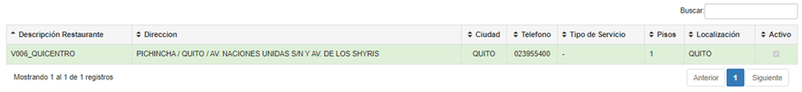
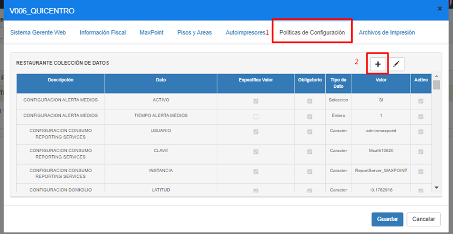
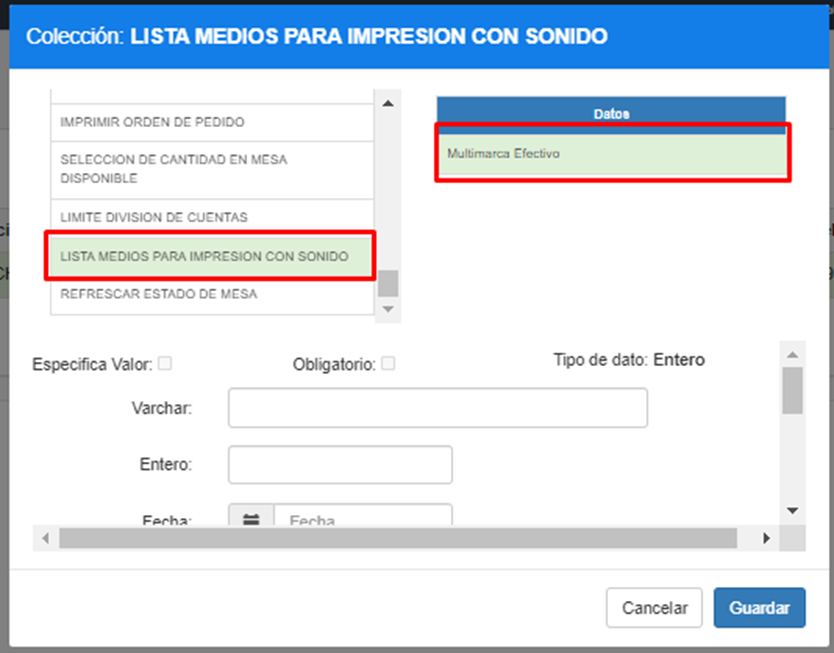
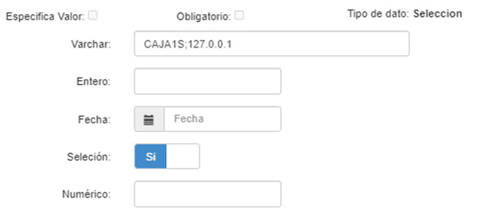

# MANUAL DE CONFIGURACION DE LISTA DE MEDIOS PARA IMPRESIÓN CON SONIDO

## 1 DESCRIPCIÓN
Este manual se ha desarrollado para detallar el proceso de configuración de políticas para el correcto funcionamiento de las impresiones recibidas de distintos medios hacia una impresora que tiene sonido.

## 2	PROCEDIMIENTO
Para ingresar a las configuraciones de políticas iniciamos sesión en el BackOffice de MAXPOINT  

## 3	Configuración de políticas por cadena
Nos dirigimos al módulo de SEGURIDADES y luego damos clic en la opción de POLÍTICAS.

Damos clic en “Ir a Administración Políticas”.

Nos ubicamos en las políticas por “Restaurante”, y damos clic en botón **“Nueva Colección”**.

/En descripción colocamos “”, en observaciones colocamos *“Configuración solo válida para restaurantes que tengan impresora con sonido” y guardamos esta configuración.*

La política creada se muestra de la siguiente manera.

### 3.1	Parámetros de la política LISTA MEDIOS PARA IMPRESION CON SONIDO
Los parámetros que se agregarán son NOMBRES DINAMICOS que equivalen a la lista de medios por los cual se reciben las ordenes, Los nombres de los parámetros agregados deben coincidir con el medio que se desea filtrar para impresión con sonido, ejemplo.

## 4	Configurar Restaurante con nueva política para generar impresiones con sonido para ciertos medios
Para poder configurar cada estación con la política nueva que se creó en el punto anterior necesitamos acceder a BackOffice en el apartado de restaurante, como es mostrado en la imagen.

Seleccionamos nuestro restaurante.

Al seleccionar el restaurante, encontraremos este menú de configuración en el cual nos dirigiremos a la sección de **“Políticas de configuración”**

Y agregaremos la política de nombre LISTA MEDIOS PARA IMPRESION CON SONIDO con su respectivo medio que queremos que se filtre para impresión con sonido.

Es importante que al asignarle sus configuraciones debamos ESPECIFICAR los siguientes datos en los siguientes campos

| Varchar* | Nombre de impresora con sonido;ipdelaimpresora (se separa con ; la ip de la impresora) |
|----------|----------------------------------------------------------------------------------------|
| **Selección*** | **Sí o No (Cuando esté activo se imprimirá a la impresora especificada en el Varchar)**     |

## 5	Lista de medios de venta disponibles para configurar
Esta lista de medios puede ir cambiando con el tiempo, pero hasta la fecha actual existen los siguientes medios de venta.
-	Uber
-	Uber Efectivo
-	Glovo
-	Glovo Efectivo
-	Rappi
-	App
-	Llamada
-	Web
-	Para Llevar
-	TicTuk
-	Operadores
-	Ventas por Cupones
-	Call Center Regional
-	Web-e
-	Multimarca 
-	Multimarca Efectivo
-	PedidosYa
