# Manual de politicas - Transferencia de venta DUNA

## 1	ANTECEDENTES
En el sistema Back office de MaxPoint se necesita crear una política para manejar la URL de la WEB SERVICE, obtener el Identity ID y de igual manera el Merchant ID, parámetros que son necesarios para el correcto consumo del EndPoint.

## 2	OBJETIVO GENERAL
Crear y configurar las políticas y parámetros para realizar la transferencia de venta.

### 2.1	Objetivos específicos
* Crear las políticas y parámetros a nivel de Cadena
* Configurar los parámetros de las políticas creadas

## 3	POLÍTICAS DE CONFIGURACIÓN
### 3.1	Datos Generales
En este manual se detalla cómo crear la política correspondiente a la función para los parámetros de transferencia de venta.

### 3.2	Pantalla de Políticas
Ingresar al sistema MaxPoint BackOffice con credenciales de administrador sistemas.

En el menú que se encuentra en la parte izquierda no dirigimos a la opción **SEGURIDADES** y seleccionamos **POLÍTICAS**, seguidamente presionamos sobre el botón **Ir a Administración Políticas** en el cual abrirá una nueva pestaña en el navegador.

### 3.3	Cadena

### 3.3.1	Colección cadena
**Se debe crear la política:**

| N° | Colección          | Observaciones                                      |
|----|--------------------|----------------------------------------------------|
| 1  | CONFIGURACION WEB  | VALORES DE LA TRANSACCIÓN DE VENTA POR WEB        |

Y debe visualizarse de la sig. Manera

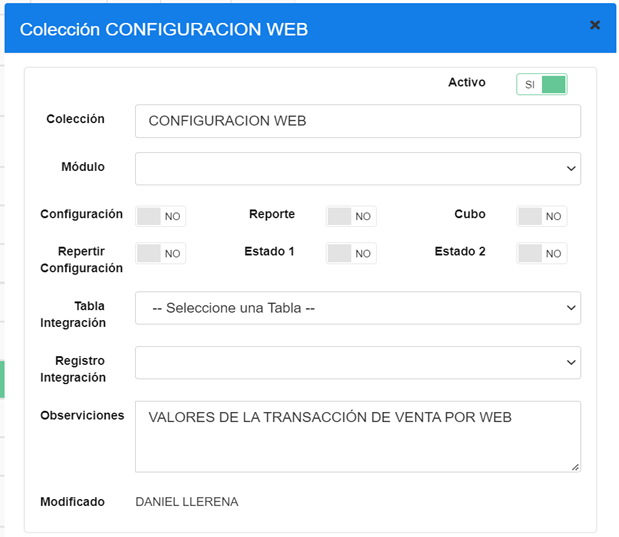

**Parámetros para la política CONFIGURACION WEB:**

| N° | Colección          | Parámetro                      | Tipo Dato | Esp. Valor | Obligatorio | Estado 1 | Estado 2 |
|----|--------------------|--------------------------------|-----------|------------|-------------|----------|----------|
| 1  | CONFIGURACION WEB  | TRANSFERENCIA IDENTITY TOKEN   | Caracter  | SI         | SI          | NO       | NO       |
| 2  | CONFIGURACION WEB  | TRANSFERENCIA MERCHANT ID      | Caracter  | SI         | SI          | NO       | NO       |

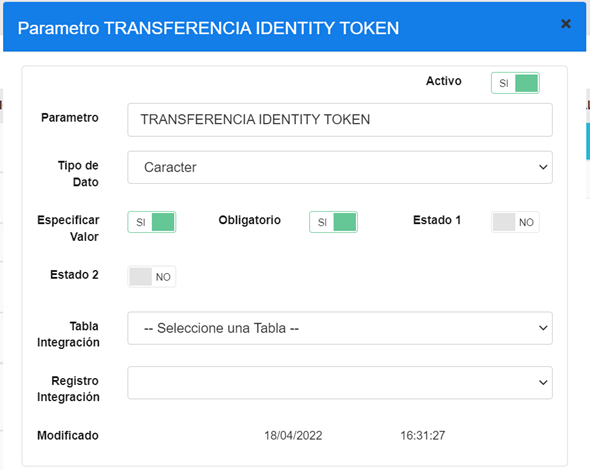

| PARAMETRO                   | TIPO DATO | ESP. VALOR | OBLIGATORIO | VALOR A CONFIGURAR |
|-----------------------------|-----------|------------|-------------|--------------------|
| TRANSFERENCIA IDENTITY TOKEN| Caracter  | SI         | SI          | eyJhbGciOiJSU0EtT0FFUC0yNTYiLCJlbmMiOiJBMTI4Q0JDLUhTMjU2In0.FfApZ9Inx4AjU11niPYMisH8XsVDhqweGZ9LroYLhCRBwgrof_6cYhOwx7erdEGe42-ZY1wAySaIzgTPsJM21Rw5h092EhMiGrj2AbzUdiGg7ZOkBS8taogWEvgpfsvssCTQjaoM3VZNsrgTayXrDHLOvHPQZwMb4RthjhnIfY1YdyHN6yGuC-C1gSv4aQsESifyM7lJ2pt1-kPjK9xzlkZ7rJUJefehiVkb9uQfKoHCkMKkCqjxFH2B7bzbJGGDAN3gaR7v99GuO5C6OVgQNSnQF_thOpitXYUrn7K8tS8El1Lryfl4Zy9Q17UNC_rCeTmqddjzUALVcZn4b7wLoPU8Abf94Pker6zTaDVqNdF_vwRNQJBC9B4KHwc3PtEdg4tJGg_asSFxTYPiCvhvMbf2t8dw3hfNJ-s3W67tX1JtDCyqARFz9NdgcBETdks65EdWEI9r_rMYgmQjckHBCeSa1o1uFNETVgvqd78pVkCD5JMJgD0E8M76OSG20rPY8IWwtaaHrk7KS9AbbBilXDdtfgJrW4FOm1YTYsno6i-TsUo0ua4cNzURKag-CbR0FurwooN2gJ72GwMY8Tnv10eaAkoUULr7iTL6djWOqFKRfj1rcyxG2OpiaaE-Fy4pluA2Il-Vfz

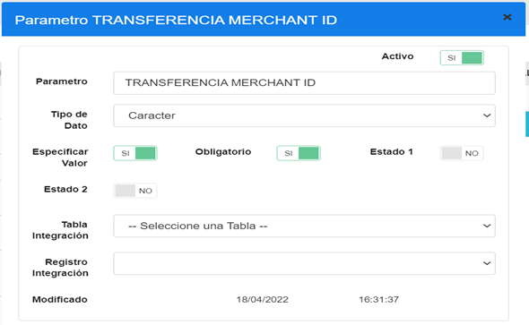

| PARAMETRO                   | TIPO DATO | ESP. VALOR | OBLIGATORIO | VALOR A CONFIGURAR        |
|-----------------------------|-----------|------------|-------------|----------------------------|
| TRANSFERENCIA MERCHANT ID   | Caracter  | SI         | SI          | 95463fb5-6279-4ec3-8ff9-fe07aacd2142 |

**Se debe modificar la política:**
Se utiliza la colección existente llamada WS SERVIDOR y agregamos parámetros con sus respectivos valores.

| N° | Colección    |
|----|--------------|
| 1  | WS SERVIDOR |

**Y debe visualizarse de la sig. Manera**

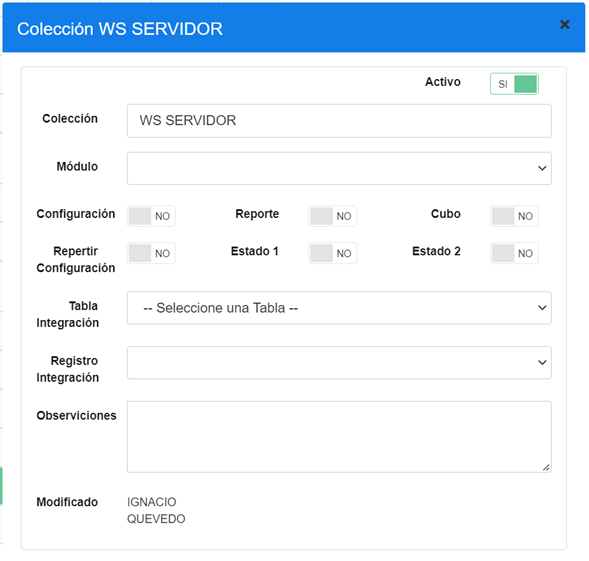

**Parámetros para la política WS SERVIDOR:**

| N° | Colección  | Parámetro        | Tipo Dato | Esp. Valor | Obligatorio | Estado 1 | Estado 2 |
|----|------------|------------------|-----------|------------|-------------|----------|----------|
| 1  | WS SERVIDOR | WEB PRUEBAS      | CARACTER  | SI         | NO          | NO       | NO       |
| 2  | WS SERVIDOR | WEB PRODUCCION   | CARACTER  | SI         | NO          | NO       | NO       |

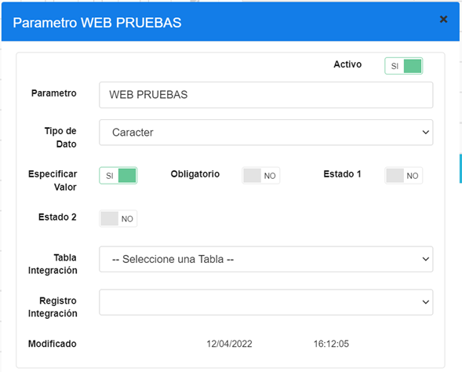

| PARAMETRO    | TIPO DATO | ESP. VALOR | OBLIGATORIO | VALOR A CONFIGURAR                |
|--------------|-----------|------------|--------------|----------------------------------|
| WEB PRUEBAS  | CARACTER  | SI         | NO           | staging-integ-api.getduna.com    |

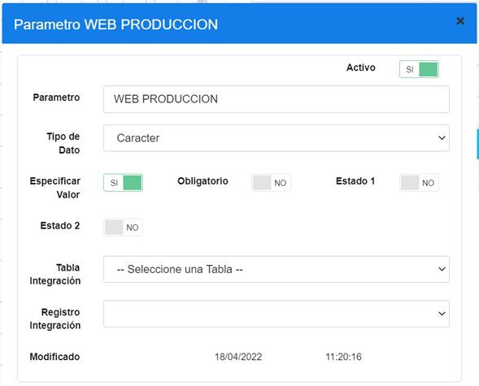

| PARAMETRO        | TIPO DATO | ESP. VALOR | OBLIGATORIO | VALOR A CONFIGURAR       |
|------------------|-----------|------------|--------------|---------------------------|
| WEB PRODUCCION   | CARACTER  | SI         | NO           | integ-api.getduna.com    |

**Se debe modificar la política:**
Se utiliza la colección existente llamada WS RUTA SERVICIO y agregamos parámetros con sus respectivos valores.

| N° | Colección        |
|----|------------------|
| 1  | WS RUTA SERVICIO |

**Y debe visualizarse de la sig. Manera**

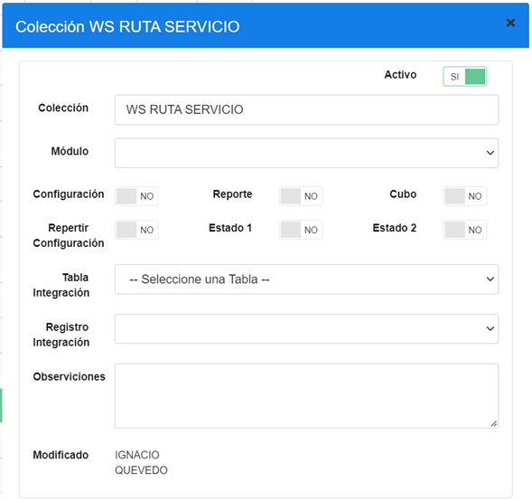

**Parámetros para la política WS RUTA SERVICIO:**

| N° | Colección        | Parámetro         | Tipo Dato | Esp. Valor | Obligatorio | Estado 1 | Estado 2 |
|----|------------------|-------------------|-----------|------------|-------------|----------|----------|
| 1  | WS RUTA SERVICIO | WEB TRANSFERENCIA | CARACTER  | SI         | NO          | NO       | NO       |

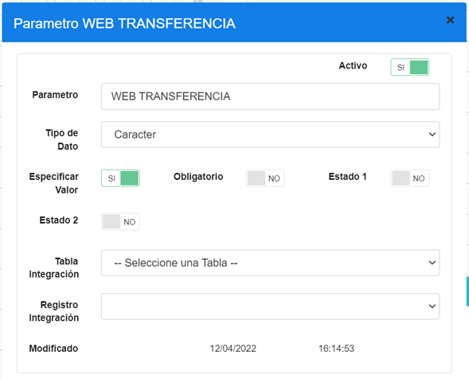

| PARAMETRO          | TIPO DATO | ESP. VALOR | OBLIGATORIO | VALOR A CONFIGURAR |
|--------------------|-----------|------------|-------------|---------------------|
| WEB TRANSFERENCIA  | CARACTER  | SI         | NO          | /api/v1/orders/     |

#### 3.3.2	Valores parámetros de políticas
Ingresamos al menú de cadena y buscamos en la pestaña de políticas, las políticas que quisiéramos configurar.

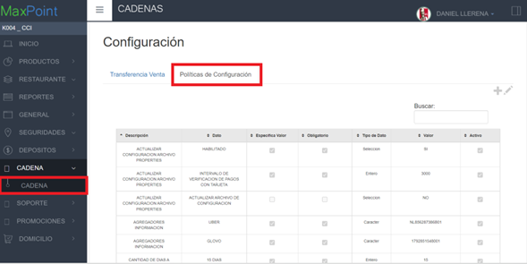
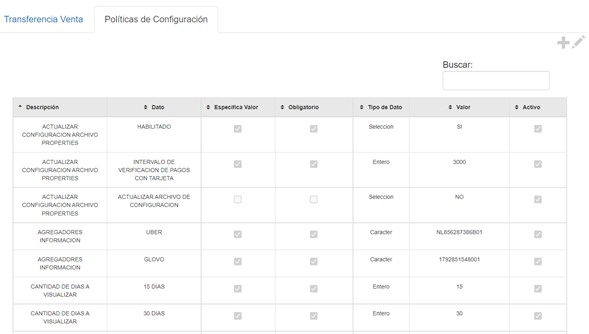

Ejemplos de configuracion:

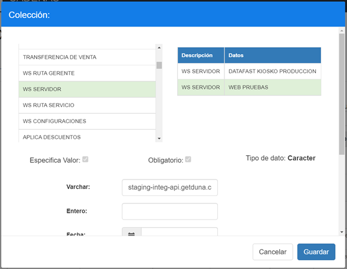

Para la politica de **WS SERVIDOR** podemos configurar 1 de los parametros por cadena.
Por ejemplo: podemos configurar en el campo **varchar** para el parametro **WEB PRUEBAS** el valor de staging-integ-api.getduna.com
