# Manual Técnico PARA CONFIGURACIÓN - TARJETAS CASHLESS

# 
 INTRODUCCION 

 Tarjetas Cashless 

**Introducción** - Este manual es para ayudar al equipo de soporte con las configuraciones necesarias para el correcto funcionamiento de Tarjetas Cashless.

## 1.	CONFIGURACIÓN DE POLÍTICA
1.	Para ingresar al módulo de **“Administración De Políticas”**, debe dar click en la opción **“Seguridades”** y en el módulo de **“Políticas”**.

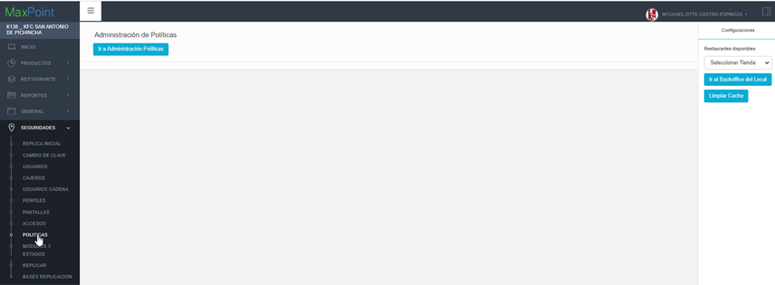

2.	 Al dar click en la opción de  , se desplegará la siguiente pestaña.

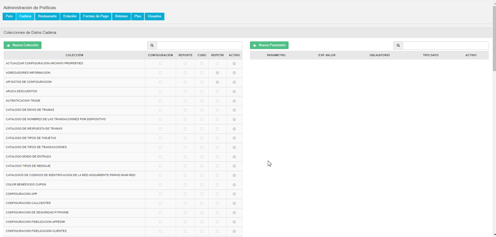

### 1.1 POLÍTICA DE RESTAURANTE

1.	Click en el boton “Restaurante” para la creacion de una colección de Restaurante

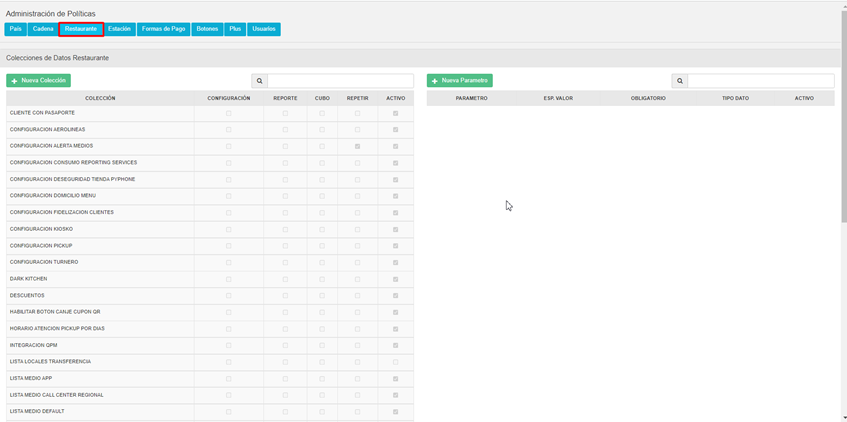

2.	Click en el boton “Nueva Colección”.
* Creamos colección a nivel de restaurante con los siguientes datos:

**Nombre de la colección:** RESTAURANTE CASHLESS

**Observación:** versión Maxpoint Back Office Ecuador 

Política a nivel de Restaurante para verificar si el Restaurante aplica PayCard. 

*  Dar click en Guardar.

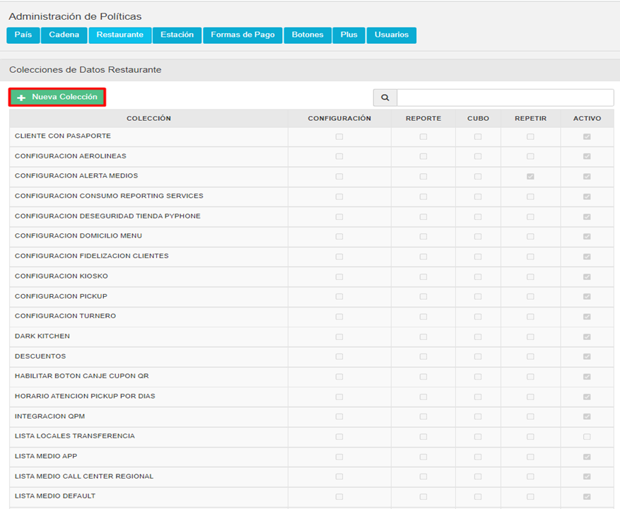
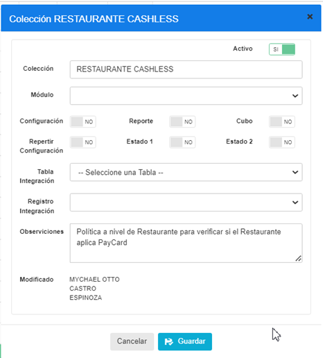

Observación: Política a nivel de Restaurante para verificar si el Restaurante aplica PayCard.

## SELECCIÓN Y CREACIÓN DE PARÁMETROS
COLECCIÓN  RESTAURANTE CASHLESS

**Selección de la Colección**
1.	Click en el ícono **“RESTAURANTE”** para seleccionar una colección de Restaurante.

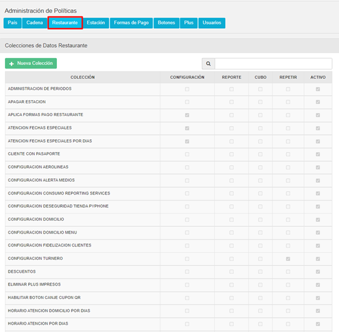

2. En la tabla izquierda de Colecciones buscar la coleccion **“RESTAURANTE CASHLESS”**  y la seleccionamos

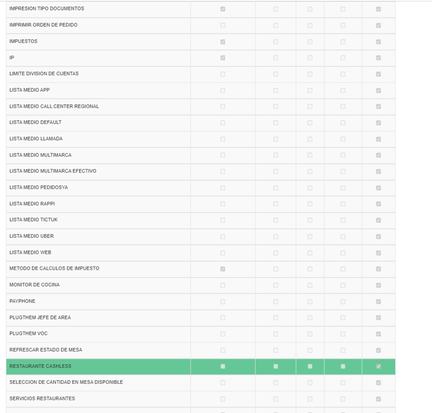 
**Creación de los Parámetros**

*A continuación, se debe crear los siguientes parámetro :  Aplica cashless, Leyenda*

Al dar click sobre el icono   , se desplegará una pantalla emergente para crear el parámetro mencionado. Ahora se detallará las configuraciones de los nuevos parametros.

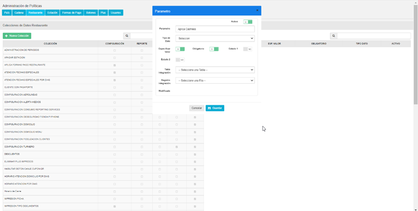
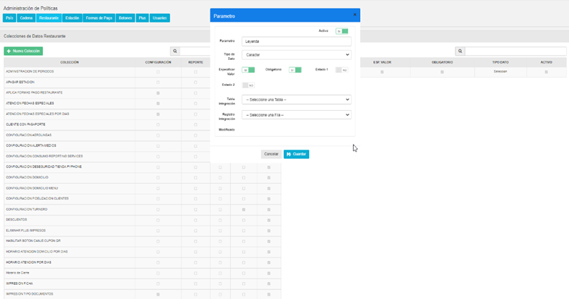

#### 1.	PARÁMETRO: APLICA CASHLESS

| PARAMETRO      | TIPO DATO | ESP. VALOR | OBLIGATORIO | VALOR A CONFIGURAR |
|----------------|-----------|------------|-------------|--------------------|
| APLICA CASHLESS | Selección | SI         | SI          | SI                 |

#### 1.	PARÁMETRO: LEYENDA

| PARAMETRO      | TIPO DATO | ESP. VALOR | OBLIGATORIO | VALOR A CONFIGURAR |
|----------------|-----------|------------|-------------|--------------------|
| LEYENDA        | CARACTER  | SI         | SI          | SI                 |

### 1.2 POLÍTICA DE CADENA

1.	Click en el botón “Cadena” para la creación de una colección de Cadena.

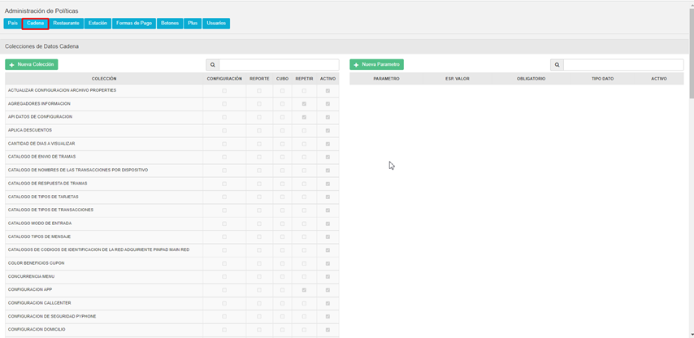

2.	 Click en el boton “Nueva Colección”.
* Creamos colección a nivel de Cadena con los siguientes datos:

**Nombre de la colección:*** WS VALIDADOR CASHLESS

 Observación:  Política a nivel de Cadena que contiene los parámetros necesarios para el consumo del Ws para validar las tarjetas Cashless.

* Dar click en Guardar.

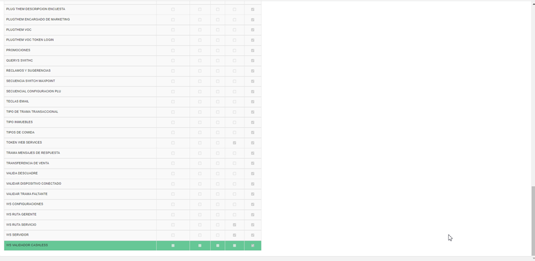
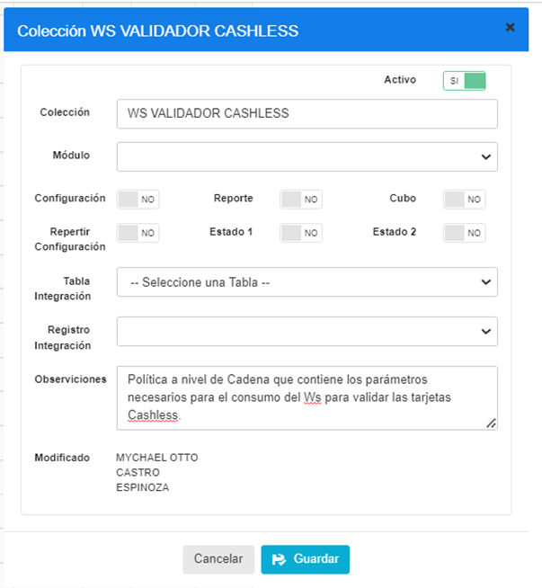

## SELECCIÓN Y CREACIÓN DE PARÁMETROS
COLECCIÓN  WS VALIDADOR CASHLESS

**Selección de la Colección**
1.	Click en el ícono **“CADENA”** para seleccionar una colección de Cadena.

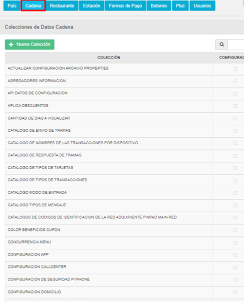

2.	En la tabla izquierda de Colecciones buscar la coleccion **“WS VALIDADOR CASHLESS”**  y la seleccionamos.

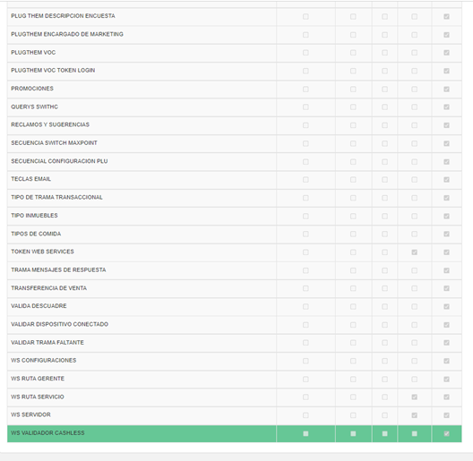

3.	Creación de los Parámetros

A continuación, se debe crear los siguientes parámetro :  *URL Cashless*

Al dar click sobre el ícono   , se desplegará una pantalla emergente para crear el parámetro mencionado. Ahora se detallará las configuraciones de los nuevos parámetros.

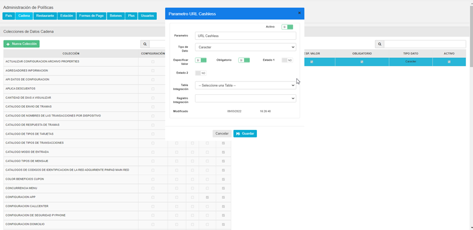

#### 1.	PARÁMETRO: URL CASHLESS

 Observación:  Política a nivel de Cadena que tiene configurado el valor del API para la 
conexión al servicio que maneja los códigos de Barra.

| PARÁMETRO      | TIPO DATO | ESP. VALOR | OBLIGATORIO | VALOR A CONFIGURAR |
|----------------|-----------|------------|-------------|--------------------|
| URL CASHLESS  | caracter  | SI         | SI          | SI                 |

### 1.3 POLÍTICA DE PLUS

1.	Click en el botón **“Plus”** para la creación de una colección de PLus.

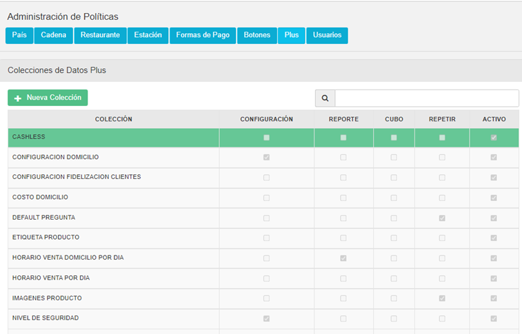

2.	Creación de los Parámetros

A continuación, se debe crear los siguientes parámetro :  *Aplica cashless, Valor 120, valor 60*

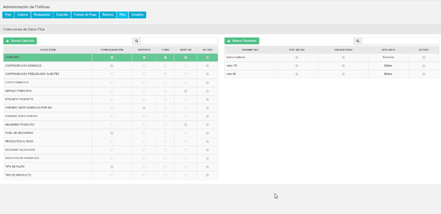

3.	Al dar click sobre el icono   , se desplegará una pantalla emergente para crear el parámetro mencionado. Ahora se detallará las configuraciones de los nuevos parametros.

#### 1.	PARÁMETRO: APLICA CASHLESS

| PARÁMETRO         | TIPO DATO  | ESP. VALOR | OBLIGATORIO | VALOR A CONFIGURAR |
|-------------------|------------|------------|--------------|---------------------|
| APLICA CASHLESS  | Selección  | SI         | SI           | SI                  |

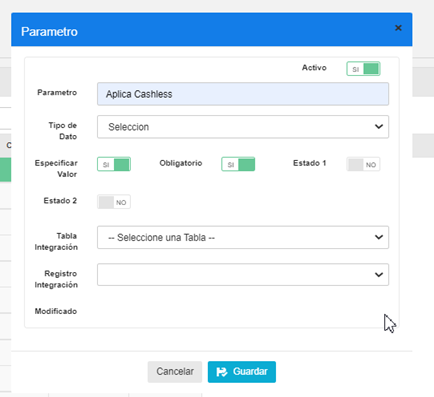

#### 2.	PARÁMETRO: VALOR 60

| PARÁMETRO         | TIPO DATO  | ESP. VALOR | OBLIGATORIO | VALOR A CONFIGURAR   |
|-------------------|------------|------------|--------------|---------------------|
| VALOR 60          | ENTERO     | SI         | SI           | SI                  |

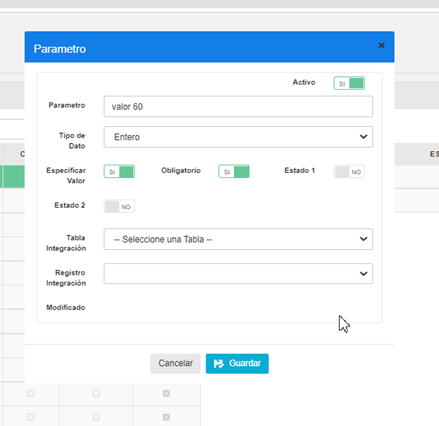

#### 3.	PARÁMETRO: VALOR 120

| PARÁMETRO         | TIPO DATO  | ESP. VALOR | OBLIGATORIO | VALOR A CONFIGURAR   |
|-------------------|------------|------------|--------------|---------------------|
| VALOR 120          | ENTERO     | SI         | SI           | SI                  |

 Observación: Política a nivel de Producto para ayudar a comprobar si un producto es cashless, así también me devuelve el valor de las tarjetas cashless.

## 2.	ACTIVACIÓN DE POLÍTICAS

El siguiente paso es asignar las políticas a los productos, dar un valor a cada parámetro

1.	Para configurar una **política de Restaurante** es necesario ingresar a la opción Restaurante, y en esta pantalla a la opción Políticas de Configuración .

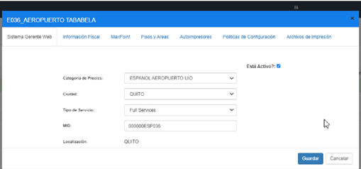

2.	Una vez ubicado en la pestaña Políticas de Configuración dar click en el botón “+” en la parte superior derecha de la tabla para añadir los parámetros.

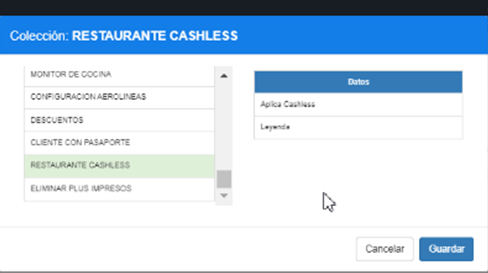

3.	Elegir la Colección, en este caso  **“ RESTAURANTE CASHLESS”**
4.	 Elegir el Parámetro “Aplica Cashless”

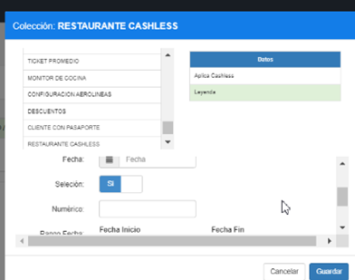

| PARÁMETRO       | TIPO DATO | VALOR |
|-----------------|-----------|-------|
| Aplica Cashless | Selección | SI    |

5.	El mismo procedimiento pero ahora para el parámetro Leyenda 

| PARÁMETRO       | TIPO DATO | VALOR |
|-----------------|-----------|-------|
| Leyenda         | Varchar   | No se acepta devolución una vez abierto el sobre |

1.	Para configurar una **política de Cadena** es necesario ingresar a la opción Cadena, y en esta pantalla a la opción Políticas de Configuración . 

2.	Una vez ubicado en la pestaña Políticas de Configuración dar click en el botón “+” en la parte superior derecha de la tabla para añadir los parámetros. Seguimos los mismos pasos que en la política de configuración de Restaurante y finalmente ingresamos el valor dado en la tabla.

| PARÁMETRO       | TIPO DATO | VALOR |
|-----------------|-----------|-------|
| URL VALIDADOR CASHLESS | Varchar | 192.168.101.29:2020/ecu/22/cahsless   |

1.	Para configurar una política de Producto es necesario ingresar a la opción Producto, y en esta pantalla a la opción Políticas de Configuración . 

2.	Una vez ubicado en la pestaña Políticas de Configuración dar click en el botón “+” en la parte superior derecha de la tabla para añadir los parámetros. Seguimos los mismos pasos que en la política de configuración de Restaurante y finalmente ingresamos el valor dado en la tabla.

| PARÁMETRO       | TIPO DATO | VALOR |
|-----------------|-----------|-------|
| Aplica Cashless | Selección | SI    |

| PARÁMETRO       | TIPO DATO | VALOR |
|-----------------|-----------|-------|
| Valor 60        | Entero    | 60    |

| PARÁMETRO       | TIPO DATO | VALOR |
|-----------------|-----------|-------|
| valor120        | Entero    | 120   |

## 3.	CREACIÓN DE MOTIVO DE INGRESO Y EGRESO DE CAJA

1.	Se debe de crear un motivo para nuestro producto cashless.

2.	Para poder crearlo nos vamos al menú General y en la opción MOTIVO I/E CAJA damos click.

3.	Este motivo cual recibirá el nombre de: Cashless, y al cual se le asignará el valor el signo + y el nivel 1 en su configuración.

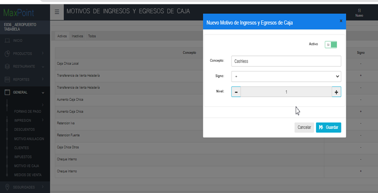

## 4.	CREACIÓN DE FORMA DE PAGO

1.	Se debe de crear una forma de Pago para nuestro producto cashless, 

2.	Para poder crearlo nos vamos al menú General y en la opción **FORMAS DE PAGO** y luego damos click en la sub-opción **TIPOS FORMAS DE PAGO**.

3.	Solamente nos pedirá que ingrese una descripción, en donde ingresaremos **CASHLESS**.

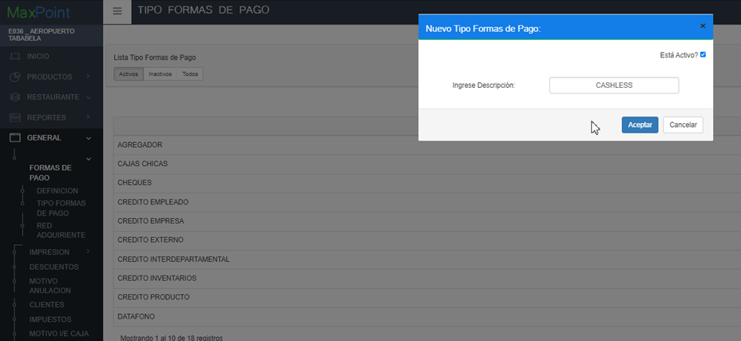

4.	Luego visualizamos la forma de Pago y podremos comprobar su configuración

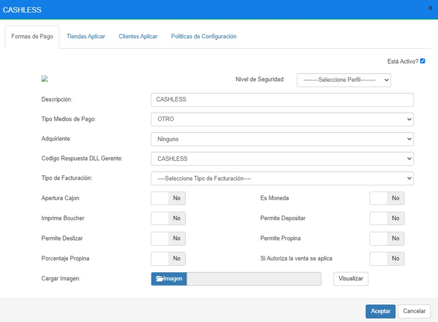

## 5.	CREACIÓN DE BOTONES PARA LAS TARJETAS CASHLESS

1.	Nos dirigimos al menú Productos, para luego dar click en la opción Botones.

2.	Luego buscamos el producto al cual queremos crearle un Botón, en este caso primero a la tarjeta de $60. 

3.	Damos click en el producto, y en su configuración podemos elegir un color para el botón y también podemos elegir la tienda a la cual queremos aplicarlo. Luego repetimos el mismo proceso para la tarjeta de $120.

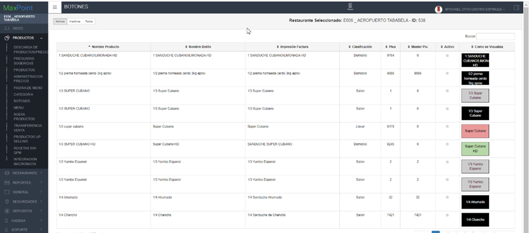
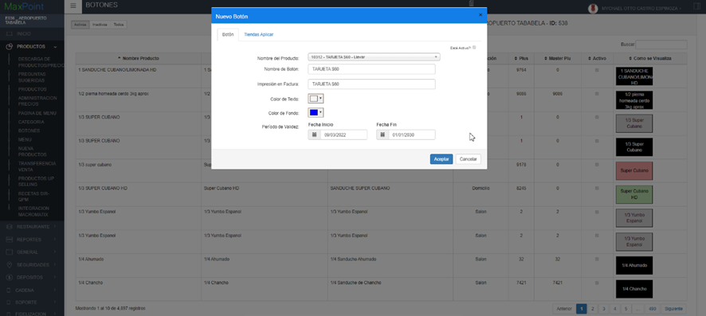

4.	Finalmente, para acabar la creación del botón debemos asignarle un Menú, para lo cual debemos buscar la opción MENÚ, para este caso será EL ESPAÑOL, luego elegimos una categoría que será CASHLESS, para finalmente elegir los productos que serían ambas tarjetas, las cuales las arrastramos a la categoría antes seleccionada.

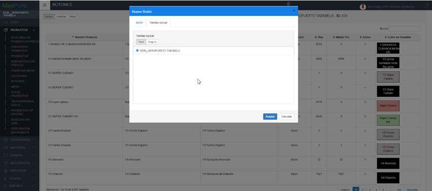
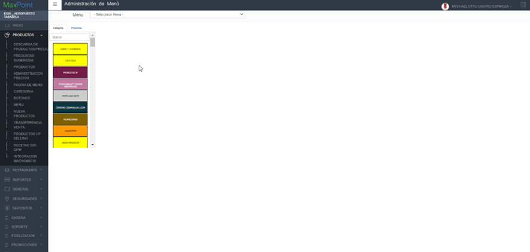
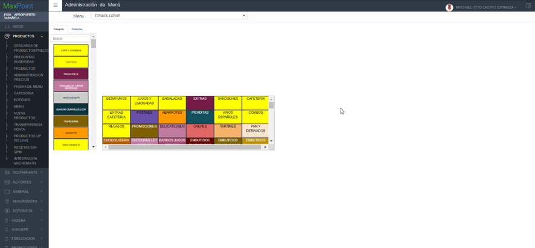
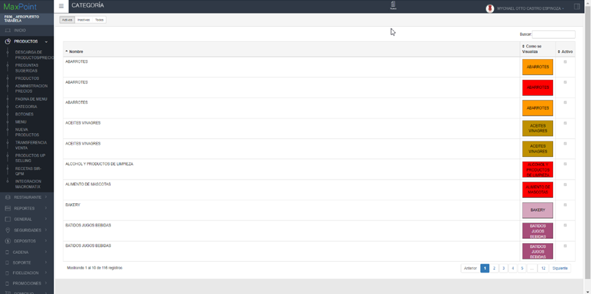
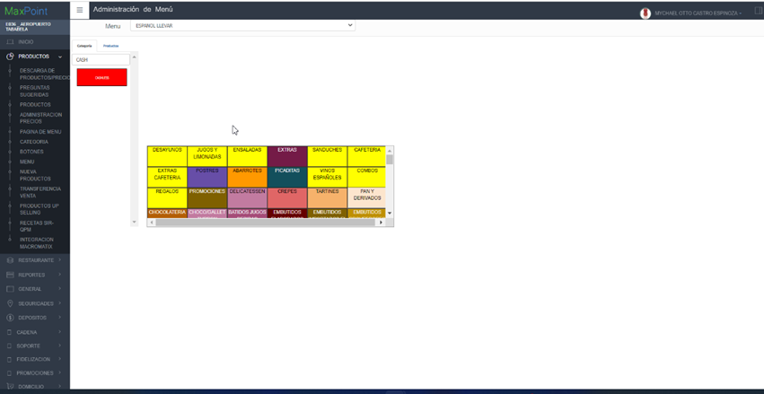
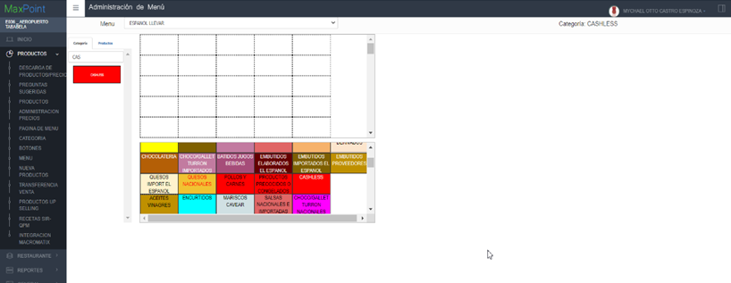
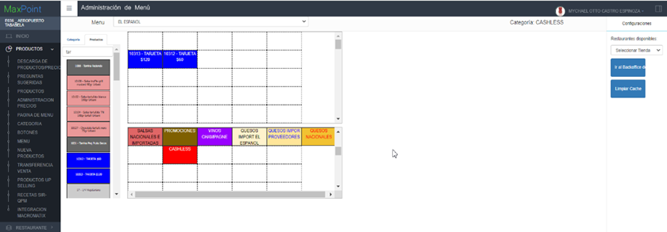