# Manual Configuracion Bringg

| AMBIENTE   | DOMINIO                  |
|------------|--------------------------|
| PRUEBAS    | admin-api.bringg.com     |
| PRODUCCIÓN | admin-api.bringg.com     |

## CONFIGURACIÓN DE POLÍTICAS
Nos dirigimos al módulo de **SEGURIDADES** a la pantalla de **POLÍTICAS**, y damos click en el botón **IR A ADMINISTRACIÓN DE POLÍTICAS**.

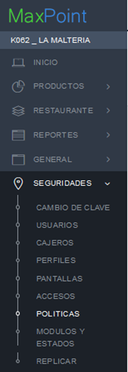
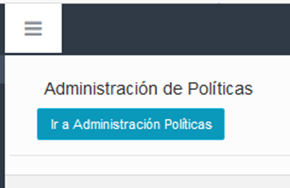

Seleccionamos las políticas por **CADENA.**

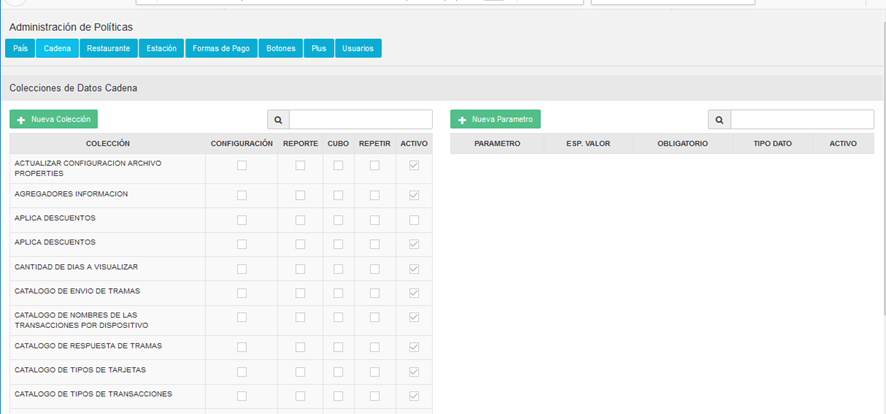

Buscamos la política WS SERVIDOR, esta política se utiliza para configurar los nombres de dominios de los servicios que se consumen de servidores externos.

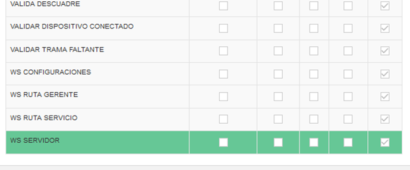

## AMBIENTE DE PRUEBAS
Presionamos el botón **NUEVO PARÁMETRO**, y configuramos el parámetro **BRINGG PRUEBAS** como se muestra en la imagen a continuación.

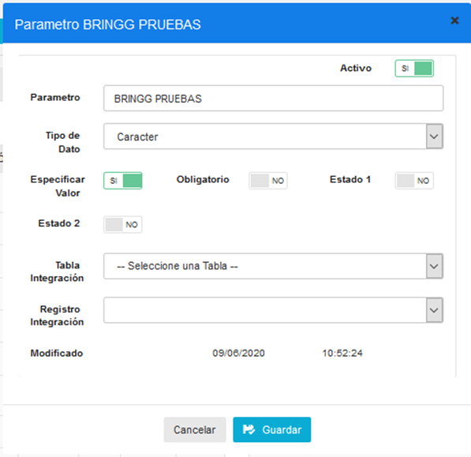

## AMBIENTE DE PRODUCCIÓN
Presionamos el botón **NUEVO PARÁMETRO**, y configuramos el parámetro **BRINGG PRODUCCION** como se muestra en la imagen a continuación.

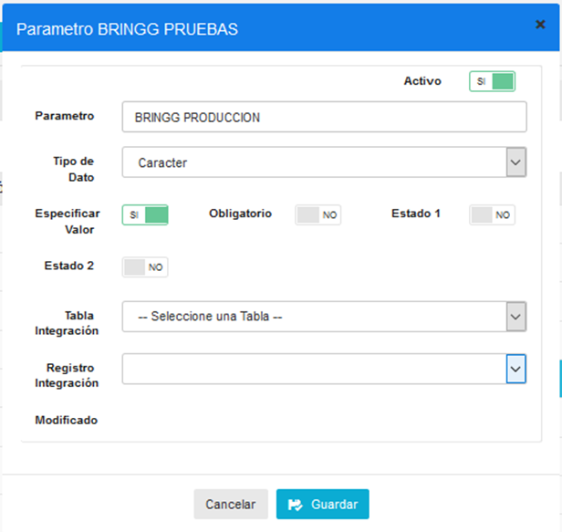

Confirmamos que los parámetros se configuraron correctamente revisando la lista de parámetros.

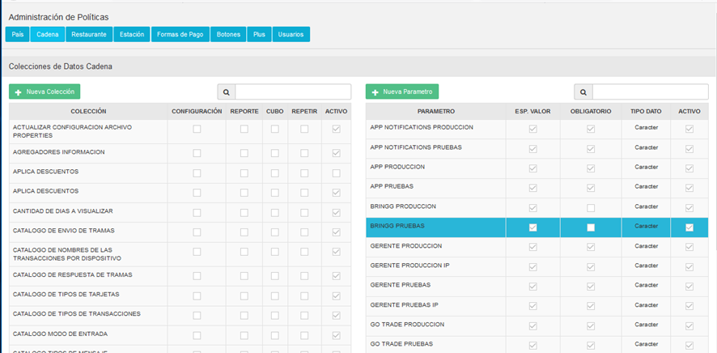

## CREAR RUTAS DE SERVICIOS
Buscamos la política WS RUTA SERVICIO, esta política se utiliza para configurar los nombres de dominios de los servicios que se consumen de servidores externos.

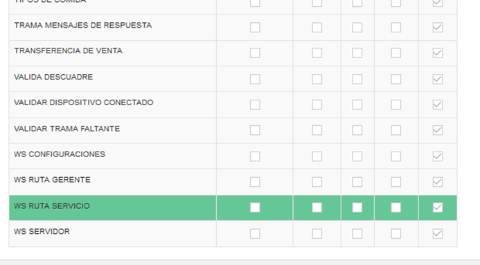

Presionamos el botón **NUEVO PARÁMETRO**, y configuramos el parámetro **BRINGG CREAR PEDIDO** como se muestra en la imagen a continuación.

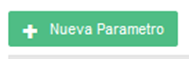

Damos click al botón GUARDAR para que se grabe la información.

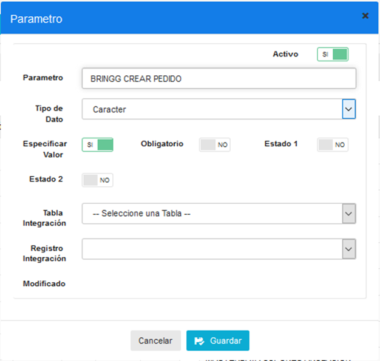

Nuevamente presionamos el botón **NUEVO PARÁMETRO**, y configuramos el parámetro **BRINGG ANULAR PEDIDO** como se muestra en la imagen a continuación.

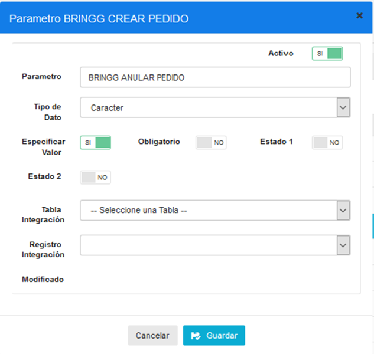

Damos click en el botón **GUARDAR** para que se grabe la información.

Confirmamos que los parámetros se crearon correctamente en la lista de parámetros, como se muestra en la siguiente imagen.

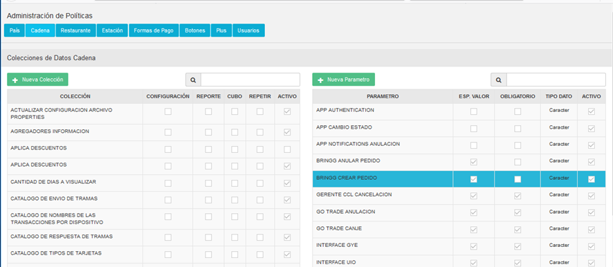

## CONFIGURACIÓN DOMINIOS
Nos dirigimos al módulo de **CADENAS**, a la pantalla **CADENA**, y damos click en la pestaña de **POLÍTICA DE CONFIGURACIÓN**.

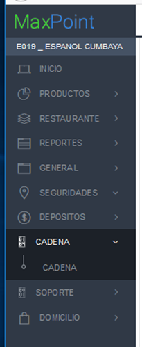

Presionamos el botón + para agregar una nueva política.

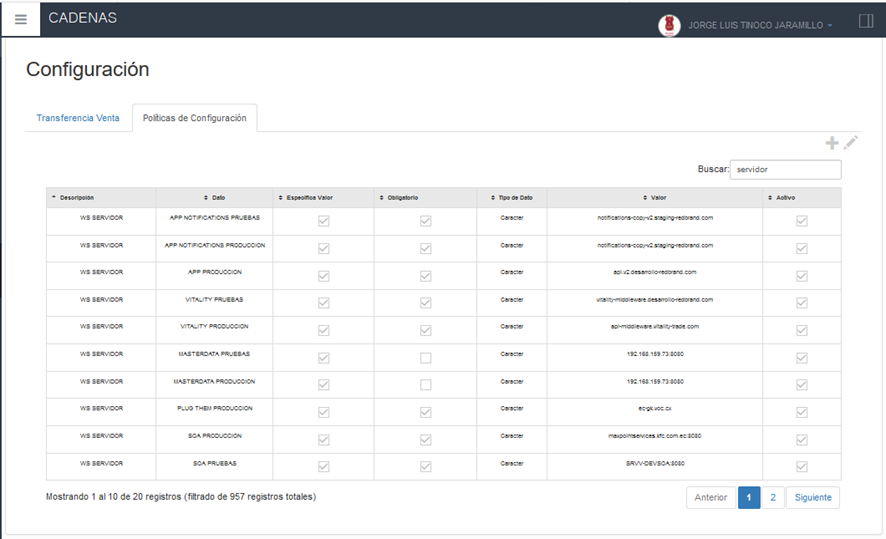

## DOMINIO DE PRUEBAS
Buscamos la política **WS SERVIDOR**, y seleccionamos el parámetro **BRINGG PRUEBAS**.

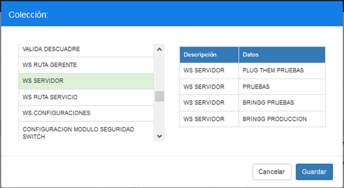

En el campo VARCHAR escribimos la siguiente URL: admin-api.bringg.com.

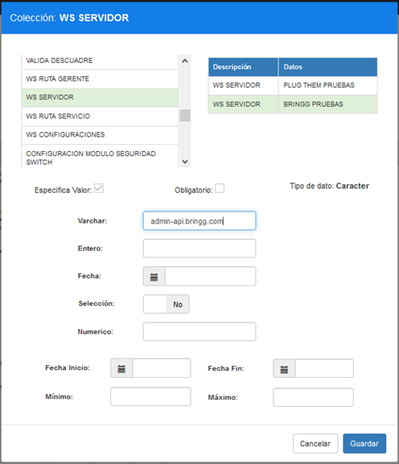

Comprobamos que la política se configuró correctamente con la tabla principal, como se muestra la siguiente imagen:

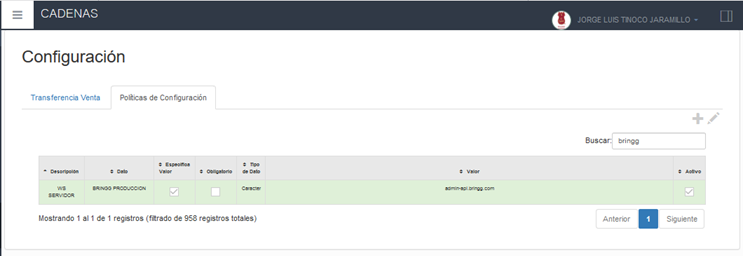

## DOMINIO DE PRODUCCIÓN
Presionamos el botón **+** para agregar una nueva política. Buscamos la política **WS SERVIDOR**, y seleccionamos el parámetro **BRINGG PRODUCCION**.

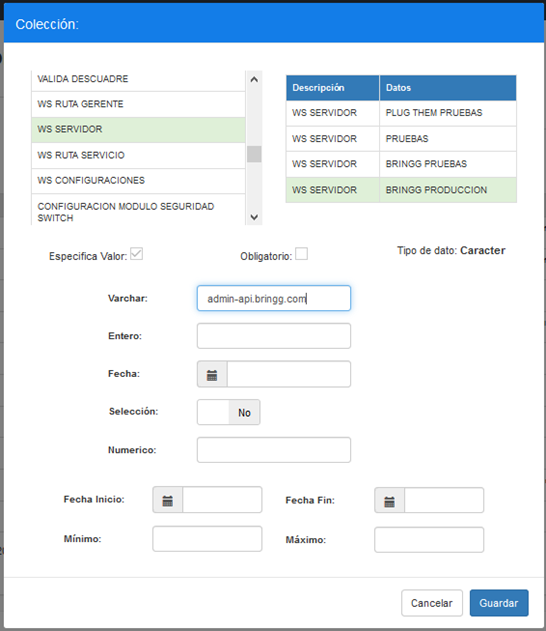

omprobamos que la política se configuró correctamente en la tabla principal, como se muestra la siguiente imagen:

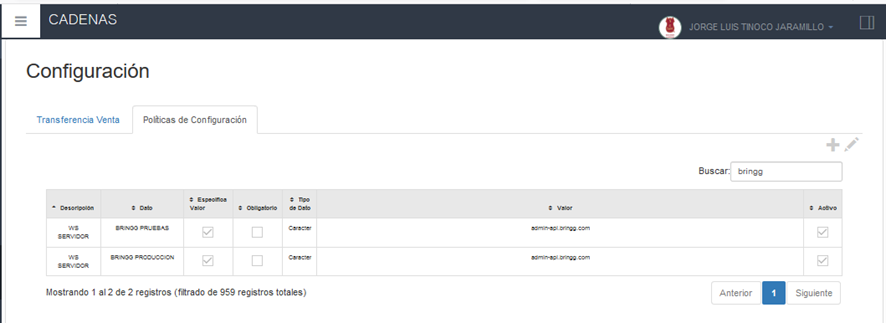

## CONFIGURACIÓN DE RUTAS
### BRINGG CREAR PEDIDOS
Presionamos el botón **+** para agregar una nueva política a la cadena que tenemos seleccionada. Buscamos la política WS RUTA SERVICIO y buscamos la función **BRINGG CREAR PEDIDO**.

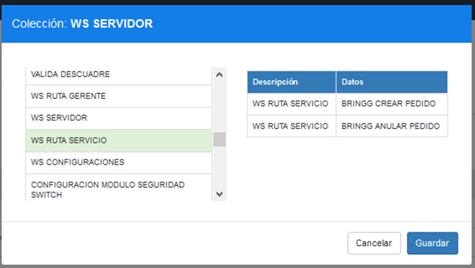

En el campo VARCHAR escribimos la siguiente ruta:

/services/6f15901b/799a84eb-5c86-44f2-bec5-0fd5b6c1e9d9/4fad2d23-8144-4918-ab7a-2a7cd5c2dbf5/

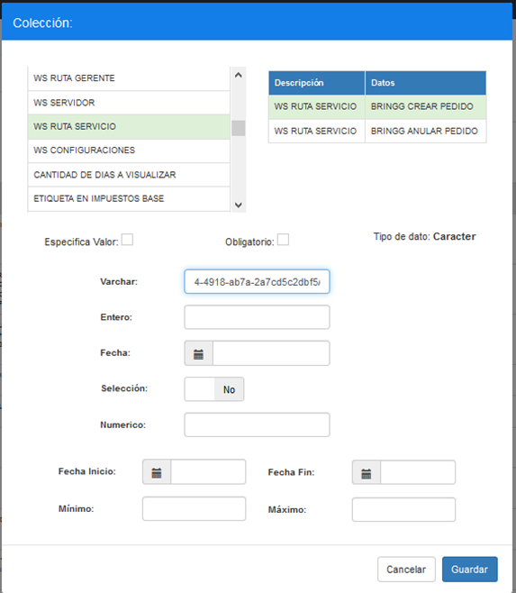

## BRINGG ANULAR PEDIDOS
Presionamos el botón **+** para agregar una nueva política a la cadena que tenemos seleccionada. Buscamos la política **WS RUTA SERVICIO** y buscamos la función **BRINGG ANULAR PEDIDO**, y agregamos en el campo **VARCHAR** la siguiente ruta:
/services/kmae04kd/194b9110-a5ce-4e41-b3b2-f39c6fc9f85d/d2e8346a-a376-408d-a6f4-c335ad9ade33/

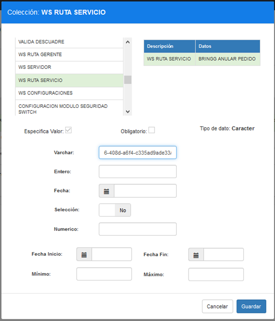

Comprobamos que la política se configuró correctamente en la tabla principal, como se muestra la siguiente imagen:

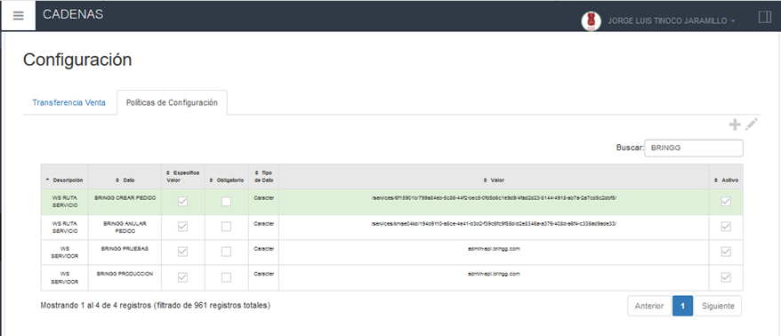