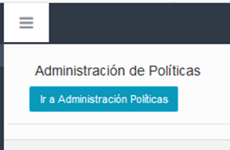
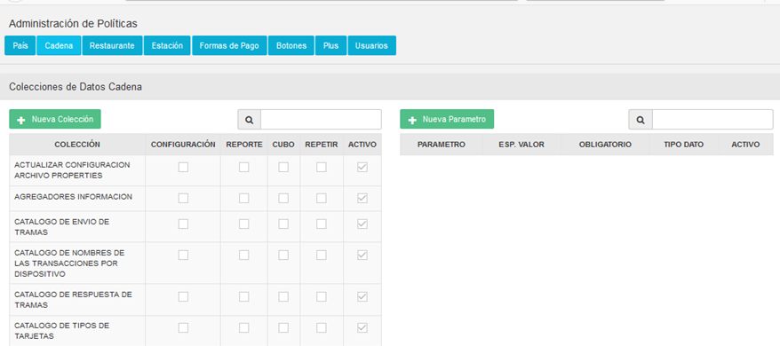
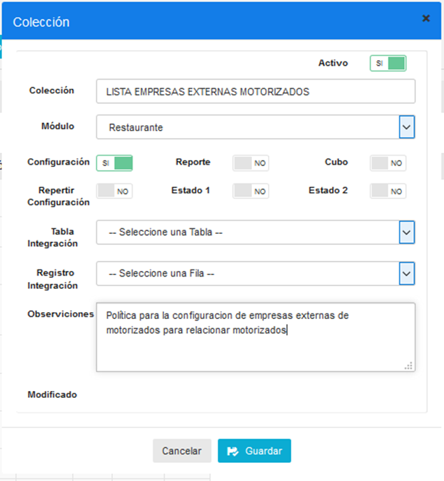
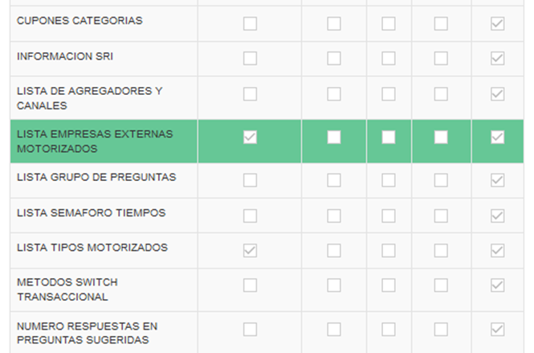
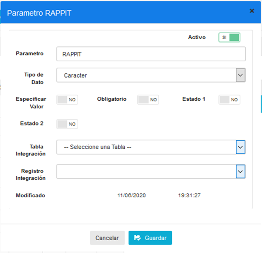
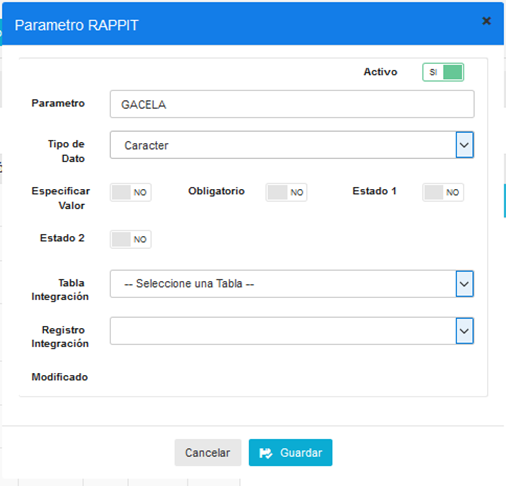
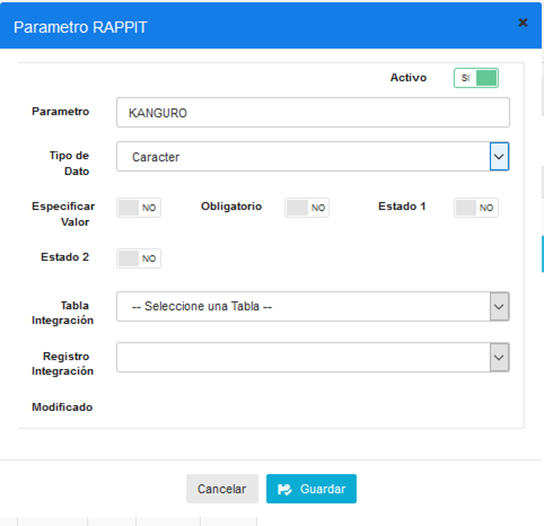
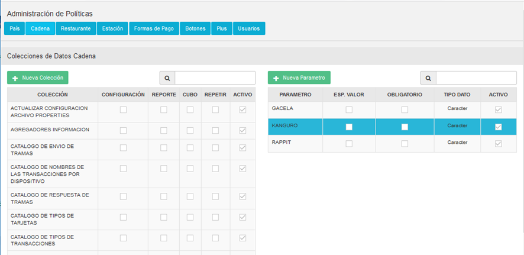

# Manual Configuracion Empresas Externas

## LISTA EMPRESAS EXTERNAS MOTORIZADOS
### CONFIGURACIÓN POLÍTICA
Nos dirigimos al módulo de **SEGURIDADES** a la pantalla de **POLÍTICAS**, y damos clic en el botón **IR A ADMINISTRACIÓN DE POLÍTICAS**.




Seleccionamos las políticas por **CADENA.** 



Presionamos el botón **NUEVA COLECCIÓN.**


Agregamos la política **LISTA EMPRESAS EXTERNAS MOTORIZADOS**, como se muestra en la siguiente imagen, y damos click en **GUARDAR** para crear la política.



Comprobamos la creación de la política en la lista de políticas, y le damos clic para seleccionarla.



## CONFIGURACIÓN DE PARÁMETROS
Presionamos el botón NUEVO PARÁMETRO para crear las empresas externas de motorizados.


A continuación, se crean las empresas externas de motorizados como se muestra en la siguiente imagen.







A continuación, verificamos que se hayan grabado los cambios en la lista de parámetros.




## COMPROBAR POLÍTICA
Podemos comprobar que la política está correctamente creada ejecutando el siguiente query en la bd, que nos devuelve la lista de empresas externas que se han creado.

``` DECLARE @IDCadena  INT = 10;
   EXEC dbo.MOT_cargar_lista_empresas_externas @IDCadena;
```
   