# Manual Configuracion Estacion - Impresion Motorizado IMPRESIÓN REPORTE FIN DE TURNO MOTORIZADO

Esta política se ha creado para definir una estación donde se realice la impresión al desasignar un motorizado por el BACKOFFICE de MaxPoint.

## CONFIGURACIÓN DE POLÍTICA
Nos dirigimos al módulo de **SEGURIDADES** a la pantalla de **POLÍTICAS**, y damos click en el botón **IR A ADMINISTRACIÓN DE POLÍTICAS**.

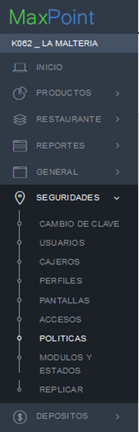
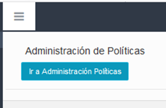

Seleccionamos las políticas por **ESTACIÓN** con un clic en el botón.

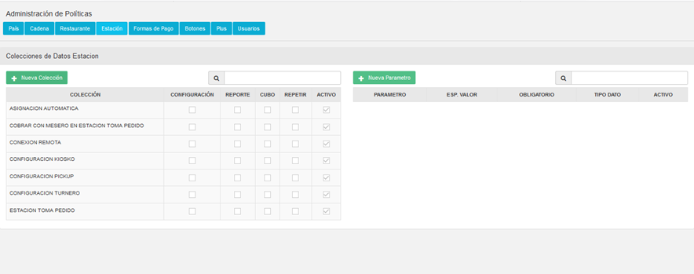

Presionamos el botón N**UEVA COLECCIÓN**.

Agregamos la política CONFIGURACIÓN APP como se muestra en la siguiente imagen, y damos clic en GUARDAR para almacenar la información.

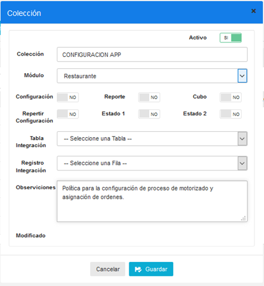

## CONFIGURACIÓN DE PARÁMETROS
Damos clic en el botón **NUEVO PARÁMETRO.**

Configuramos el parámetro IMPRESIÓN REPORTE FIN DE TURNO, para definir una estación donde se debe imprimir el reporte de motorizado cuando finaliza su turno, como se muestra en la siguiente imagen:

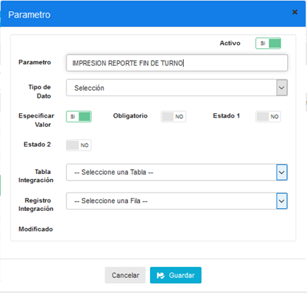

## CONFIGURACIÓN DE DATOS
Nos dirigimos al módulo de RESTAURANTE y seleccionamos la estación que requerimos configurar para que en la impresora de FACTURACIÓN se imprima el reporte de fin de turno de motorizado. 

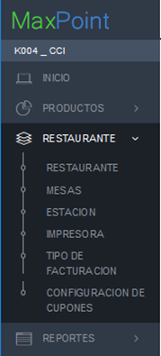
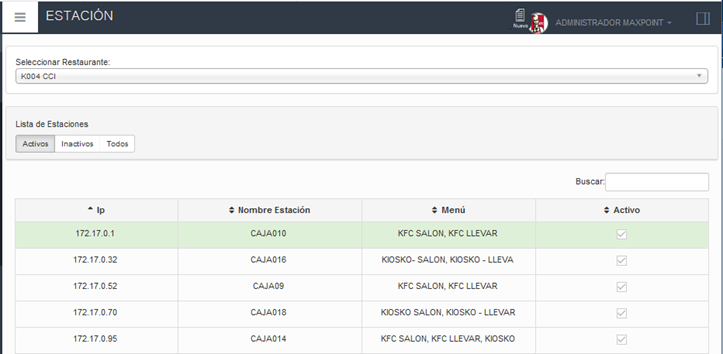

Damos doble clic sobre la estación y seleccionamos la pestaña de **POLÍTICAS DE CONFIGURACIÓN,** presionamos el botón + para agregar la configuración.

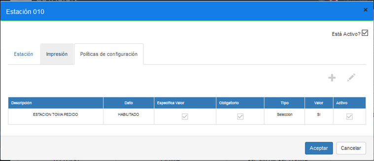

Si deseamos activar la estación en el campo **SELECCIÓN** le colocamos **SI**. Presionamos el botón **GUARDAR** para almacenar la información.

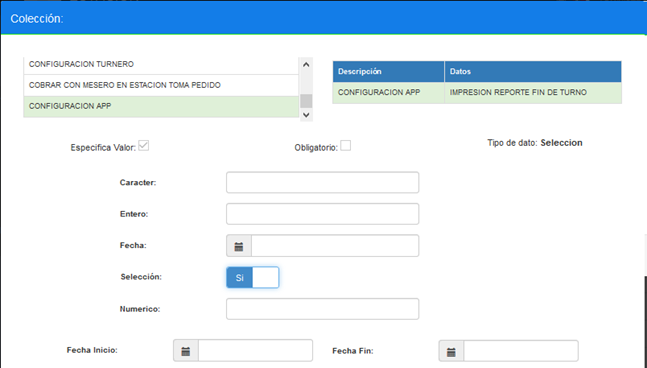

  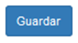     

Comprobamos la configuración en la lista de políticas que se han agregado a la estación.

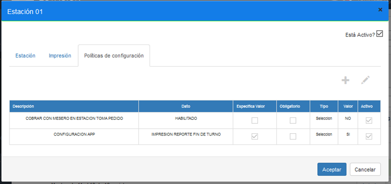