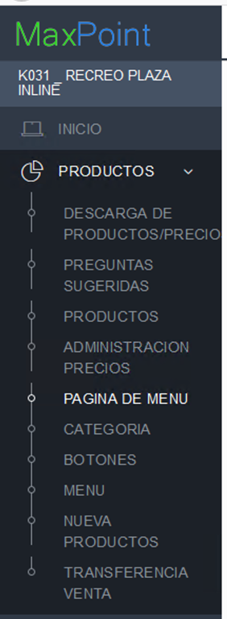
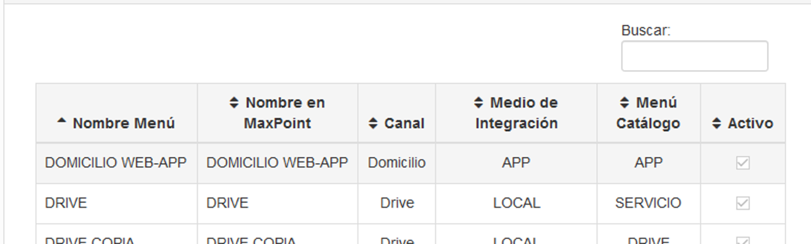
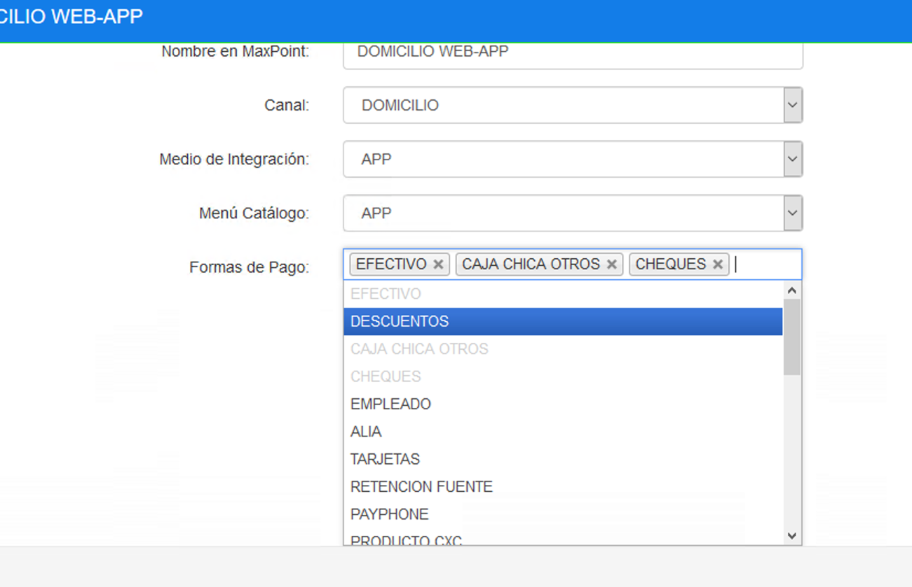
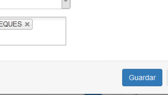

# COLECCIONMENUFB-Creacion-Politicas

## 
INTRODUCCION

 
COLECCIÓN MENU

**Introducción** - En este manual se detalla la creación de políticas que se deben configurar la versión de Maxpoint Azure para posterior despliegue en cada una de las tiendas, formando parte de las mejoras relacionadas a la identificación de canal medio menú. 

**Objetivo** – Configuración de formas de pago por menú, esto para el control de relación con respecto a los pagos y a los medios disponibles en domicilios. 

## ADMINISTRACIÓN DE POLÍTICAS

1.	Para ingresar a mantenimiento en maxpoint azure, seleccionar la cadena y a continuación menú productos, y al apartado página de menú.

 

2.	 Al dar clic en la opción pagina de menú se desplegaran los menús disponibles a los cuales ligaremos las formas de pago.

3.	A continuación, para cada uno de los menús se debe seleccionar en el selector las formas de pago que podrán estar ligadas a ese menú.

 

 Finalmente dar click en **guardar**.

 

 Con este proceso se habra creado todos los niveles concernientes a la formas de pago en la colección de menu.
