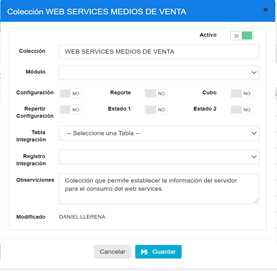
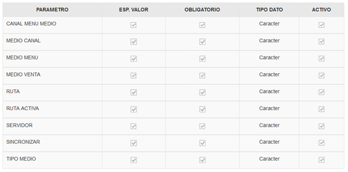
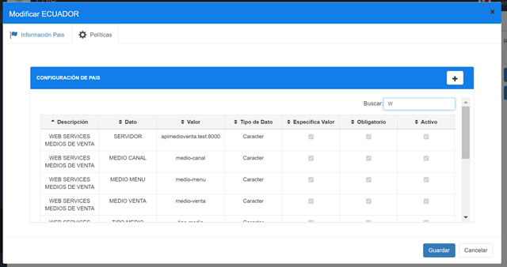
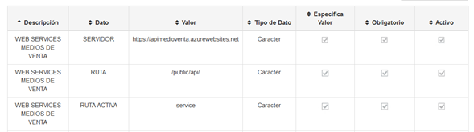
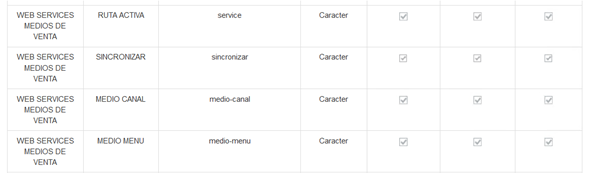
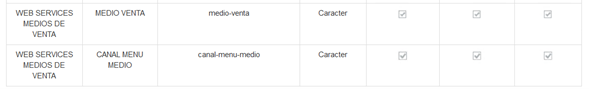

# Manual-Politicas Medios de Ventas

## 1	ANTECEDENTES
Actualmente en el sistema MaxPoint; se puede crear o modificar Medios de Venta de forma local. Ahora se necesita que los datos de Medios de Venta creados o modificados en el local se encuentren sincronizados con el Sistema Gerente lo cual se consigue mediante el consumo de un web services para sincronizar dicha información.

## 2	OBJETIVO GENERAL
Registrar y Sincronizar información de Medios de Venta en MaxPoint y Sistema Gerente.

### 2.1	Objetivos específicos
* Registrar Medios de Venta en MaxPoint.

* Registrar Medios de Venta en Sistema Gerente.

## 3	POLÍTICAS DE CONFIGURACIÓN
###  3.1	Datos Generales
En este manual se detalla cómo realizar la configuración de las políticas a nivel de país que permitirán enviar la información de MaxPoint al Sistema Gerente.

### 3.2	Pantalla de Políticas
Ingresar al sistema MP BackOffice con credenciales de administrador sistemas y seleccionar la cadena a la cual se realizará las configuraciones.

En el menú que se encuentra en la parte izquierda nos dirigimos a la opción **PAÍS** y seleccionamos **ECUADOR**, seguidamente presionamos sobre el botón **Políticas** en el modal que se nos muestra el cual nos mostrará una lista de políticas.

### 3.3	País
#### 3.3.1	Colección Cadena - WS Servidor
Antes de crear las políticas de configuración; como primer paso se debe verificar que no se encuentren creadas, de ser el caso validar que cada colección contenga los parámetros establecidos en este manual.

En la opción **País** presionar sobre el botón **Nueva Colección**, se abrirá una modal para su creación ingresando los siguientes datos:

Tabla 1. Datos Colección País

| N° | Colección                    | Descripción                                                               |
|----|------------------------------|---------------------------------------------------------------------------|
| 1  | WEB SERVICES MEDIOS DE VENTA | Colección que permite establecer la información del servidor para el consumo del web services. |

**Nota:** NO puede contener espacios en blanco al inicio y final del nombre de la colección; debe ser escrita tal y como se especifica en la tabla 1.

**Colección:** Nombre de la colección que se especifica en la tabla 1.

**Módulo:** No aplica.

**Observaciones:** Una descripción de la función que realizara dicha colección.

Una vez que se haya ingresado y seleccionado la información establecida procedemos a **Guardar**.

### 3.3.2	Parámetro de Colección- Web Services Medios de Venta 
Antes de agregar los parámetros de configuración, como primer paso se debe verificar que no se encuentren creados, de ser el caso validar que cada parámetro contenga los valores establecidos en este manual.

Una vez creada la colección se debe proceder a crear los parámetros de configuración y para ello seleccionamos la colección y presionamos sobre el botón **Nuevo Parámetro** en la cual se abrirá una modal para su creación e ingresamos los siguientes datos:

Tabla 2. Datos Parámetros de Colección Cadena

| N° | Colección                    | Parámetro       | Esp. Valor | Obligatorio | Tipo Dato |
|----|------------------------------|-----------------|------------|-------------|-----------|
| 1  | WEB SERVICES MEDIOS DE VENTA | CANAL MENU MEDIO | SI         | SI          | Carácter  |
| 2  | WEB SERVICES MEDIOS DE VENTA | MEDIO CANAL     | SI         | SI          | Carácter  |
| 3  | WEB SERVICES MEDIOS DE VENTA | MEDIO MENU      | SI         | SI          | Carácter  |
| 4  | WEB SERVICES MEDIOS DE VENTA | MEDIO VENTA     | SI         | SI          | Carácter  |
| 5  | WEB SERVICES MEDIOS DE VENTA | RUTA            | SI         | SI          | Carácter  |
| 6  | WEB SERVICES MEDIOS DE VENTA | RUTA ACTIVA     | SI         | SI          | Carácter  |
| 7  | WEB SERVICES MEDIOS DE VENTA | SERVIDOR        | SI         | SI          | Carácter  |
| 8  | WEB SERVICES MEDIOS DE VENTA | SINCRONIZAR     | SI         | SI          | Carácter  |
| 9  | WEB SERVICES MEDIOS DE VENTA | TIPO MEDIO      | SI         | SI          | Carácter  |

**Nota:**  NO puede contener espacios en blanco al inicio y final del parámetro; deben ser escritos tal y como se especifica en la tabla 2. 

**Parámetro:** Nombre del parámetro que se especifica en la tabla 2.

**Tipo de Dato:** Se especifica en la tabla 2.

**Especifica Valor:** Se especifica en la tabla 2.

**Obligatorio:** Se especifica en la tabla 2.

Una vez que se haya ingresado y seleccionado la información establecida procedemos a **Guardar**.

Se deben crear todos los parámetros de configuración establecidos en la tabla 2 y se debe tener lo siguiente:

#### 3.3.3	País Colección de datos
En el menú nos dirigimos a **PAÍS** y seleccionamos la opción **PAÍS**, en la parte izquierda se cargará una pantalla y seguidamente seleccionamos la pestaña **Políticas de configuración**.

Para realizar la configuración se debe presionar sobre la pestaña Políticas de Configuración.

Para la configuración se debe presionar sobre el botón agregar “+”; el cual abrirá una modal, seguidamente buscaremos la colección creada y agregamos el valor en los parametros solicitados.

#### 3.3.4	Web Services Medios de Venta
En la tabla 3, se especifica los valores que deben ser configurados por cada parámetro.

Tabla 3. Valores de los parámetros de colección

**Colección: WS SERVIDOR**
| N° | Parámetro          | Tipo Dato | Valor a ingresar                                                            |
|----|--------------------|-----------|------------------------------------------------------------------------------|
| 1  | SERVIDOR           | Carácter  | El valor a ser configurado en producción será enviado por el área de Desarrollo, y quienes notifiquen algún cambio en la información. |
| 2  | MEDIO CANAL        | Carácter  | medio-canal                                                                  |
| 3  | MEDIO MENU         | Carácter  | medio-menú                                                                   |
| 4  | MEDIO VENTA        | Carácter  | medio-venta                                                                  |
| 5  | TIPO MEDIO         | Carácter  | tipo-medio                                                                   |
| 6  | CANAL MENU MEDIO   | Carácter  | canal-menu-medio                                                             |
| 7  | RUTA               | Carácter  | /public/api/                                                                 |
| 8  | RUTA ACTIVA        | Carácter  | service                                                                      |
| 9  | SINCRONIZAR        | Carácter  | sincronizar                                                                  |

Al realizar la configuración de todos los parámetros se debe tener lo siguiente:

