# Manual- administracion medio de venta

## 1	ANTECEDENTES
Actualmente MaxPoint permite crear Medios de Venta en la base de datos local y por medio de un web service sincroniza los datos del local con el sistema gerente. Ahora se requiere validar si el web service está activo al momento de crear un nuevo Medio de Venta o modificar uno ya existente para garantizar que los datos del local con los del sistema gerente estén perfectamente sincronizados. 

## 2	OBJETIVOS
    ✔  Registrar Medios de Venta en MaxPoint.

    ✔  Registrar Medios de Venta en Sistema Gerente.

    ✔ Sincronizar registros de MaxPoint con Sistema Gerente.

## 3	Datos Generales
En este manual se detalla cómo se registra, modifica y sincroniza la información de Medios de Venta con el Sistema Gerente.

* Para realizar la sincronización deben estar creadas las políticas de Medios a nivel de país; de lo contrario la sincronización de la información hacia el Sistema Gerente no funcionará.

* En este manual se utiliza la palabra servicios web, que es el medio que nos ayudará a sincronizar la información en el Sistema Gerente.

* Si el servicio está activo la información se registra en MaxPoint y el Sistema Gerente; si el servicio no está activo la información se registra solo en el sistema MaxPoint.

•	Si se modifican registros y el servicio está activo se registran los cambios en el sistema MaxPoint y en el Sistema Gerente; si el servicio no está activo la información se registra solo en el sistema MaxPoint.

# 4	Inició de Sesión
Ingresar al sistema de administración MaxPoint con sus respectivas credenciales, y seleccionar General y dentro la opción MEDIOS DE VENTA.

# 5	Medios de Venta
Al seleccionar Medios de Venta el sistema los dirigirá a la página principal de Medios de Venta MaxPoint y mostrará las tablas Medio Menú y Medio Canal y en la parte superior de esta los demás apartados disponibles.

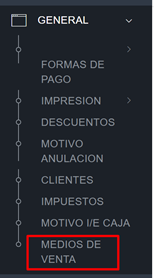

### 5.1	Pantalla –Menú Catálogo
Para el uso de la pantalla se debe seguir los siguientes pasos y tener en consideración lo siguiente:

    ✔ Para agregar un registro en caso de que el web service esté activo automáticamente al dar click en agregar se mostrará el modal para detallar y guardar el nuevo registro; en caso de que el web service se encuentre inactivo se mostrara un mensaje en el que si indica que el web service no está disponible, pero que le permite agregar en el local.

    ✔ En caso de que el web service esté inactivo y se agreguen o modifiquen registros en cualquiera de las tablas bastará con dar click en la pestaña con el nombre de la ventana en este caso puede ser Medios Venta, Menú Catálogo o Canal Menú Medio para que se sincronicen automáticamente los cambios que se hayan realizado. 

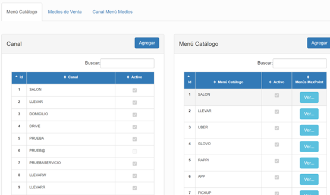

# 6	Ejemplo

### 6.1	Medio Canal

**Agregar Medio Canal**. 

En el caso de que se selecione la opción agregar y el web service este inactivo automáticamente se mostrará un mensaje en el que se indica que se puede agregar en MaxPoint, pero no en el sistema gerente debido a que el web service se encuentra inactivo. Caso contrario no se mostrará ningun mensaje

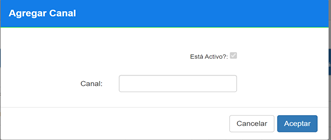

**Guardar Medio Canal.**

Al dar click en aceptar se nos mostrará un mensaje de que nuestro registro ha sido guardado con éxito en MaxPoint y en el sistema gerente en el caso de que el web service se encuentre activo, en el caso de que el web service se encuentre inactivo se mostrara un mensaje en el que se indica de que los datos han sido guardados en el local y no en el sistema gerente.

**Modificar Medio Canal.**

Para modificar un registro se debe dar doble click sobre el registro que se desea hacer algún cambio y automáticamente se mostrará el modal que le permitirá hacer un cambio.

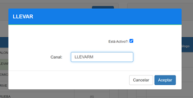

### 6.2	Menú Catálogo
**Agregar Menú Catálogo.**

En el caso de que se selecione la opción agregar y el web service este inactivo automáticamente se mostrará un mensaje en el que se indica que se puede agregar en MaxPoint, pero no en el sistema gerente debido a que el web service se encuentra inactivo. Caso contrario no se mostrará ningun mensaje

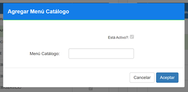

**Guardar Menú Catálogo.**

Al dar click en aceptar se nos mostrará un mensaje de que nuestro registro ha sido guardado con éxito en MaxPoint y en el sistema gerente en el caso de que el web service se encuentre activo, en el caso de que el web service se encuentre inactivo se mostrara un mensaje en el que se indica de que los datos han sido guardados en MaxPoint y no en el sistema gerente.

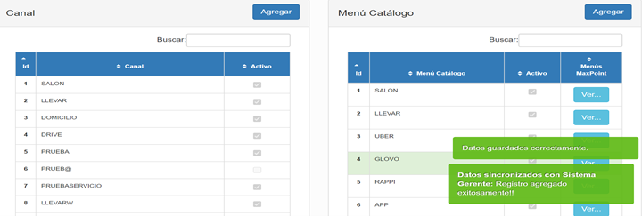

**Modificar Menú Catálogo.**

Para modificar un registro se debe dar doble click sobre el registro que se desea hacer algún cambio y automáticamente se mostrará el modal que le permitirá hacer un cambio.

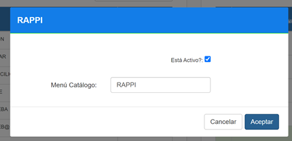

### 6.3	Tipo Medio
**Agregar Tipo Medio.** 

En el caso de que se selecione la opción agregar y el web service este inactivo automáticamente se mostrará un mensaje en el que se indica que se puede agregar en MaxPoint, pero no en el sistema gerente debido a que el web service se encuentra inactivo. Caso contrario no se mostrará ningun mensaje

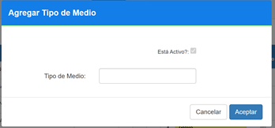

**Guardar Menú Catálogo.**

Al dar click en aceptar se nos mostrará un mensaje de que nuestro registro ha sido guardado con éxito en MaxPoint y en el sistema gerente en el caso de que el web service se encuentre activo, en el caso de que el web service se encuentre inactivo se mostrara un mensaje en el que se indica de que los datos han sido guardados en MaxPoint y no en el sistema gerente.

**Modificar Menú Catálogo.**

Para modificar un registro se debe dar doble click sobre el registro que se desea hacer algún cambio y automáticamente se mostrará el modal que le permitirá hacer un cambio.

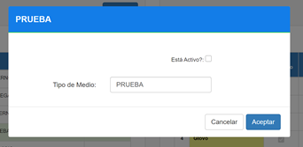

### 6.4	Medio de Venta
**Agregar Medio de Venta.**

Para agregar un medio de venta se necesitan completar varios parámetros.

**Medio Venta:** Nombre del medio.

**Domicilio:** Según cual sea el medio especificado.

**Url Estados:** En caso de que el medio disponga.

**Color Fondo:** Se escoge con una paleta de colores el que sea necesario.

**Color Texto:** Se escoge con una paleta de colores el que sea necesario.

**Tipo de Medio:** Se escoge el tipo de medio, para q el tipo de medio a seleccionar debe estar activo en la tabla de tipo medio.

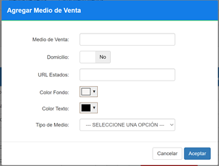

**Guardar Medio de Venta.**

Al dar click en aceptar se nos mostrará un mensaje de que nuestro registro ha sido guardado con éxito en MaxPoint y en el sistema gerente en el caso de que el web service se encuentre activo, en el caso de que el web service se encuentre inactivo se mostrara un mensaje en el que se indica de que los datos han sido guardados en MaxPoint y no en el sistema gerente.

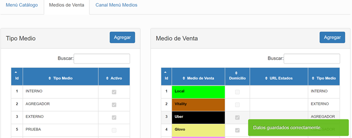

**Modificar Medio de Venta.**

Para modificar un registro se debe dar doble click sobre el registro que se desea hacer algún cambio y automáticamente se mostrará el modal que le permitirá hacer un cambio.

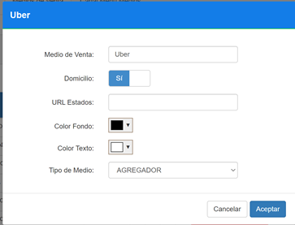

### 6.5	Canal Menú Medio
**Agregar Canal Menú Medio.**

Para agregar un canal menú medio se necesitan completar varios parámetros, los campos a seleccionar deben estar marcados como activos en las tablas en las que están registrados para que puedan aparecer en las listas de opciones.

**Canal:** Se escoge el canal.

**Menú Catálogo:** Se escoge el menú catálogo.

**Medio de Venta:** Se escoge el medio de venta de los disponibles en la lista.

**Sistema:** Se escoge el sistema de los disponibles en la lista.

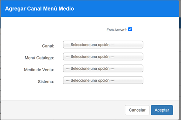

**Guardar Canal Menú Medio.**

Al dar click en aceptar se nos mostrará un mensaje de que nuestro registro ha sido guardado con éxito en MaxPoint y en el sistema gerente en el caso de que el web service se encuentre activo, en el caso de que el web service se encuentre inactivo se mostrara un mensaje en el que se indica de que los datos han sido guardados en MaxPoint y no en el sistema gerente.

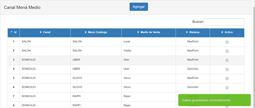

**Modificar Canal Menú Medio.**

Para modificar un registro se debe dar doble click sobre el registro que se desea hacer algún cambio y automáticamente se mostrará el modal que le permitirá hacer un cambio.

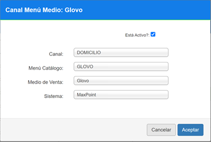

# 7	Mensajes de Confirmación

| N° | Evento                                           | Tipo       | Mensaje                                                  |
|----|--------------------------------------------------|------------|----------------------------------------------------------|
| 1  | Si los datos se guardan correctamente en MaxPoint | Exitoso    |                             |
| 2  | Si los datos se guardan correctamente en el sistema gerente | Exitoso |   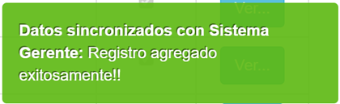                    |
| 3  | Si el web service está inactivo y se modifica un registro | Notificación |            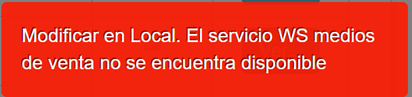        |

