# Manual de Configuración NOTIFICACIONES PIDE Y RECOGE

## 1	 DESCRIPCIÓN
Este manual se ha desarrollado para detallar el proceso de configuración de políticas para el correcto funcionamiento de la recepción de notificaciones de pedidos pickup en las estaciones.

## 2	PROCEDIMIENTO
Para ingresar a las configuraciones de políticas iniciamos sesión en el BackOffice de MAXPOINT  

## 3	Configuración de políticas por cadena
Nos dirigimos al módulo de SEGURIDADES y luego damos clic en la opción de POLÍTICAS.

Damos clic en “Ir a Administración Políticas”.

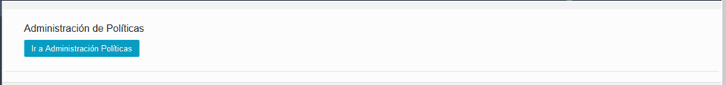

Nos ubicamos en las políticas por **“Cadena”**, y damos clic en botón **“Nueva Colección”**.

En descripción colocamos **“PICKUP NOTIFICADOS”**, en observaciones colocamos “v 1.9.16+

*Configuraciones necesarias para la funcionalidad de mercado pago” y guardamos esta configuración.*

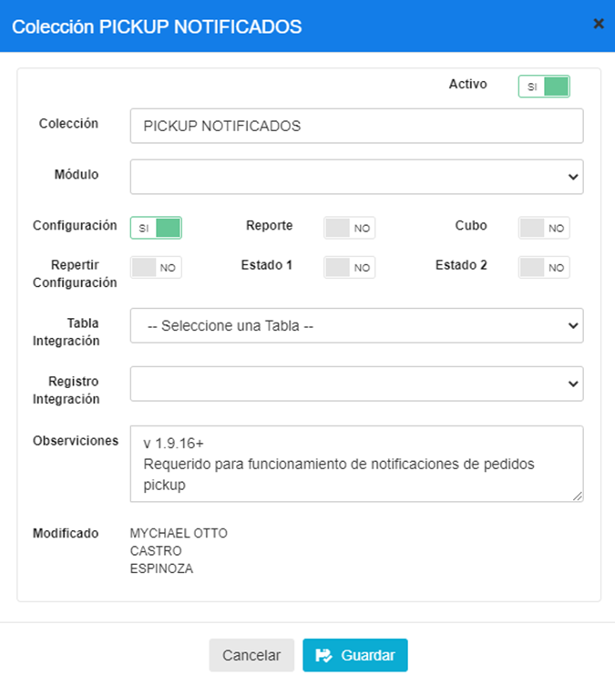

La política creada se muestra de la siguiente manera.

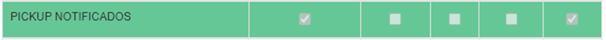

### 3.1	Parámetros de la política PICKUP NOTIFICADOS
Agregamos un parámetro de nombre **NOTIFICADO** de tipo **Caracter** el cual es mostrado en la siguiente imagen con sus respectivas configuraciones.

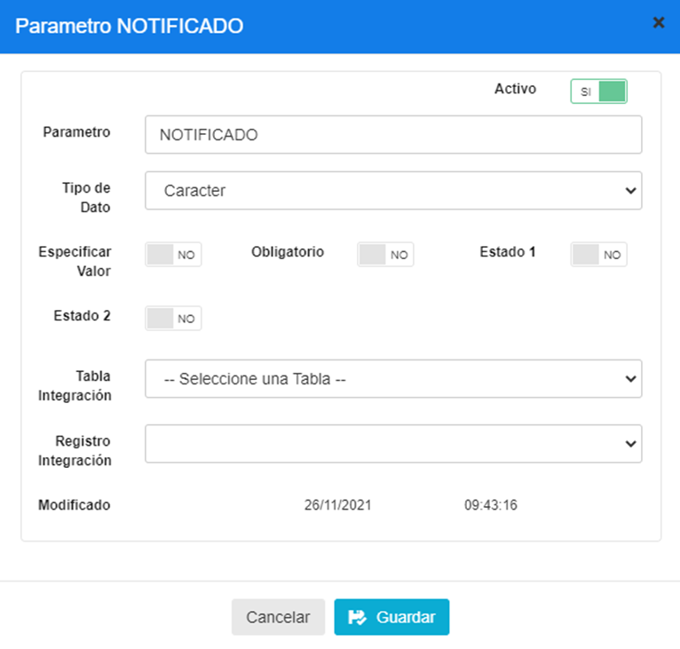

Esto permitirá el correcto funcionamiento de las notificaciones generadas por los pedidos pide y recoge pero también es necesario configurar que estaciones pueden recibir estás notificaciones para ello veamos el siguiente punto.

## 4	Configuración de políticas por Estación
Nos ubicamos en las políticas por **“Estación”**, y damos clic en botón **“Nueva Colección”**.

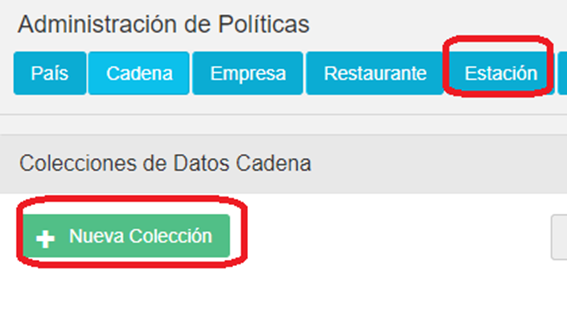

En descripción colocamos **“RECIBE NOTIFICACION DE PEDIDOS PICKUP ENTRANTES”**, en observaciones colocamos “v 1.9.16+

*Configuraciones necesarias para la funcionalidad de mercado pago” y guardamos esta configuración.*

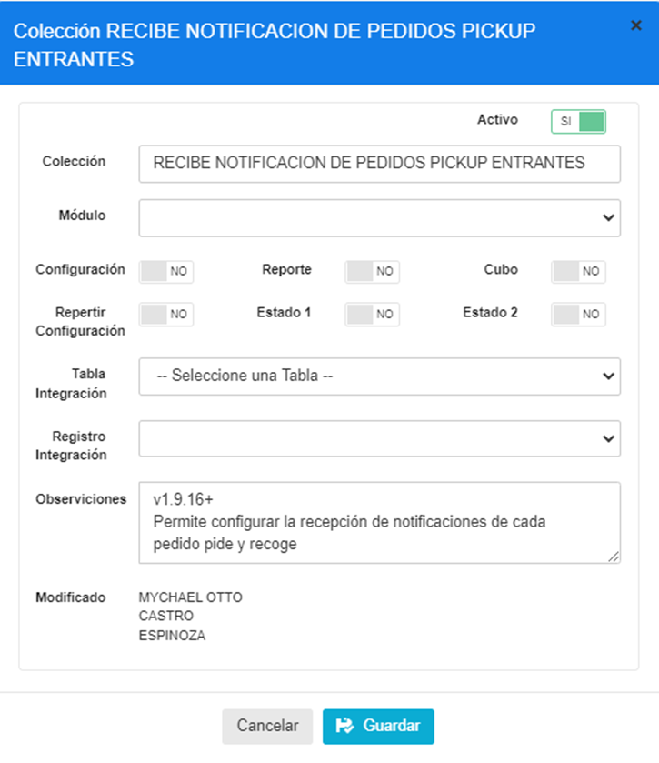

La política se muestra de la siguiente manera.

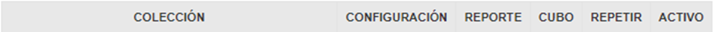

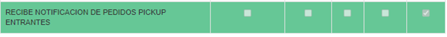

### 4.1	Parámetro de política “RECIBE NOTIFICACION DE PEDIDOS PICKUP ENTRANTES”
Este parámetro es agregado a la política Recibe Notificación de pedidos Pickup Entrantes y deberá ser de tipo de dato **Selección** con las mismas configuraciones que es mostrado en la siguiente imagen.

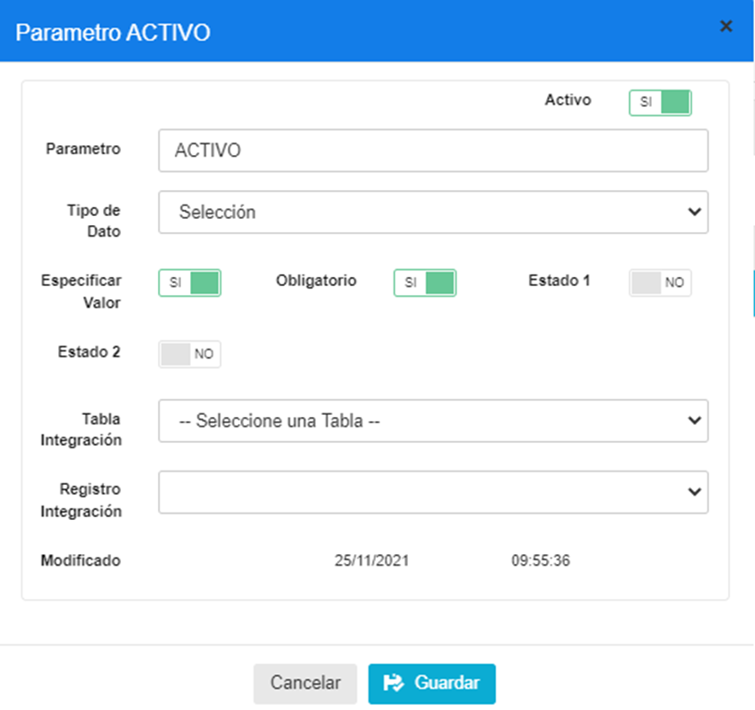

Después de guardar el parámetro tendremos disponible esta política poder configurarla desde cada estación. 

## 5	Configurar estación con nueva política para recibir notificaciones de pedidos Pickup
Para poder configurar cada estación con la política nueva que se creó en el punto anterior necesitamos acceder a BackOffice en el apartado de estaciones, como es mostrado en la imagen.

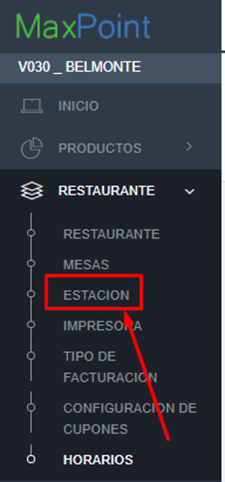

Seleccionamos nuestro restaurante y nuestra estación a configurar con la nueva política

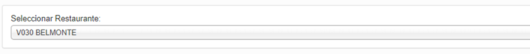

Al seleccionar la estación, encontraremos este menú de configuración en el cual nos dirigiremos a la sección de **“Políticas de configuración”**

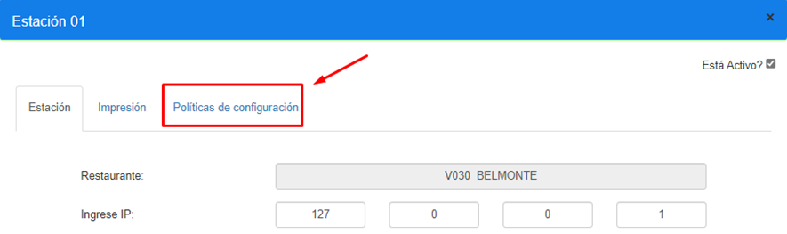

Y agregaremos una nueva política que permitirá que esta estación que estamos configurando pueda recibir las notificaciones generadas por pedidos Pide y Recoge. 

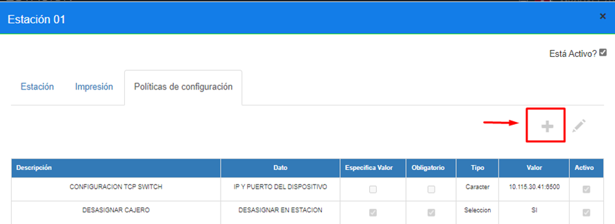

Seleccionamos la política **Recibe Notificacion de Pedidos Pickup Entrantes** 

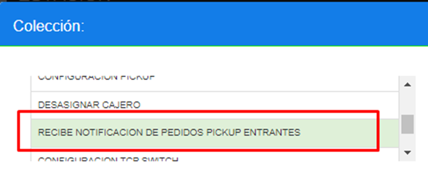

El parametro de dicha politica deberá ser configurado de igualmanera con el tipo de Dato
**Selección** para Recibir o No recibir las notificaciones de los pedidos pide y recoge.

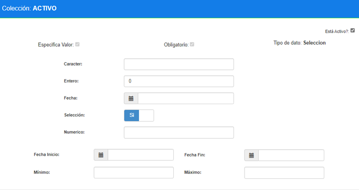
