# PICKUP-Configuracion-Politicas

##  
 INTRODUCCION 

 PICKUP 

**Introducción** - En este manual se detalla las configuraciones de políticas que se deben configurar en el BackOffice de Max-Point para el correcto funcionamiento de las políticas de Pickup. A continuación, un listado en la administración de políticas que se deben crear antes de la configuración de las políticas a nivel de Cadena, Restaurante y Estación para el proceso de Pickup. 

*	POLÍTICAS EN LA OPCIÓN DE CADENA 

| COLECCIÓN            | PARAMETRO          |
|----------------------|--------------------|
| CONFIGURACION PICKUP | PICKUP APLICA      |
|                      | PICKUP CANCELAR PEDIDO |

* 	POLÍTICAS EN LA OPCIÓN DE RESTAURANTE  

| COLECCIÓN            | PARAMETRO           |
|----------------------|---------------------|
| CONFIGURACION PICKUP | PICKUP APLICA       |
|                      | PICKUP COOKTIME     |
|                      | PICKUP TIEMPO APERTURA |
|                      | PICKUP TIEMPO CIERRE  |

*  POLÍTICAS EN LA OPCIÓN DE ESTACION 

| COLECCIÓN            | PARAMETRO                |
|----------------------|--------------------------|
| CONFIGURACION PICKUP | Pickup estación Activo? |
|                      | Pickup Nombre Cajero     |

**Objetivo** - Conocer sobre las diferentes configuraciones que se deben realizar antes de poner en producción el desarrollo del proceso Pickup, así evitar inconvenientes con Maxpoint. 

# Administración de Políticas
## CONFIGURACION DE POLÍTICAS EN CADENA 

1.	Para ingresar al módulo de Políticas de Configuración de Cadena, debe dar clic en la opción “Cadena” en el módulo de “Cadena”

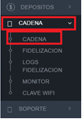

A continuación, se despliega la siguiente pantalla con dos pestañas: Transferencia de venta y Políticas de configuración. 

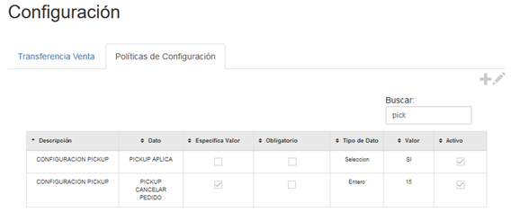

2.	Dar click sobre la pestaña de politicas de configuración y en la parte superior derecha , seleccionar  el icono   para configurar las siguientes politicas en la descripción de “CONFIGURACION PICKUP” .
 
 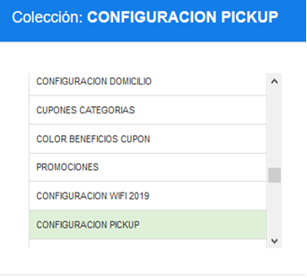

## A.	COLECCIÓN DE CONFIGURACIÓN PICKUP 
### a.	Configuracion de la politica
1.	PARAMETRO: PICKUP APLICA

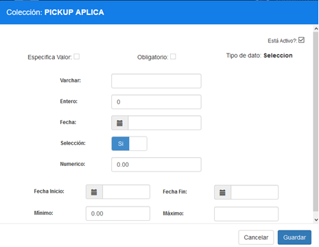

Ingrese los siguientes parametros y dar click sobre el botón Guardar. 

| Campo     | Valor | Descripción                            |
|-----------|-------|----------------------------------------|
| Selección | SI    | Activar si Pickup Aplica a la cadena   |

2.	PARAMETRO PICKUP CANCELAR PEDIDO

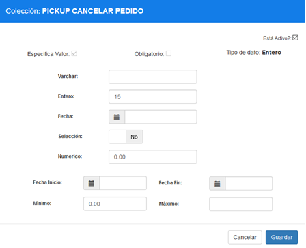

Ingrese los siguientes parametros y dar click sobre el botón Guardar

| Campo   | Valor | Descripción                                       |
|---------|-------|---------------------------------------------------|
| Entero  | 15    | Tiempo en minutos para cancelar un pedido         |

## POLÍTICAS DE RESTAURANTE 

1.	Para ingresar al módulo de Políticas de Configuración de Restaurante, debe dar clic en la opción “Restaurante” en el módulo de “Restaurante”

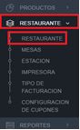

A continuación, se despliega una tabla con todos los restaurantes para la cadena seleccionada. 

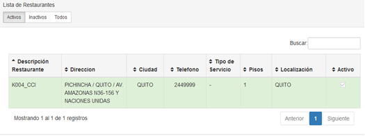

2.	Dar click sobre el restaurante deseado y una pantalla emergente se depliega. En la parte superior derecha de la pantalla emergente, seleccionar la pestaña “Políticas de configuración”
 
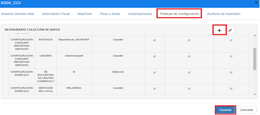

3.	seleccionar  el icono    para configurar las siguintes politicas en la descripcion de “CONFIGURACION PICKUP” .
 
 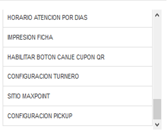

## A.	COLECCIÓN DE CONFIGURACIÓN PICKUP
### a.	Creación de los Parámetros
1.	 PICKUP PICKUP APLICA

Ingrese los siguientes parametros y dar click sobre el botón Guardar. 

| Campo     | Valor | Descripción                                       |
|-----------|-------|---------------------------------------------------|
| Selección | SI    | Activar si Pickup Aplica al restaurante           |

 **Nota :** Configuración para activar Pickup en el restaurante 

2.	PICKUP COOKTIME

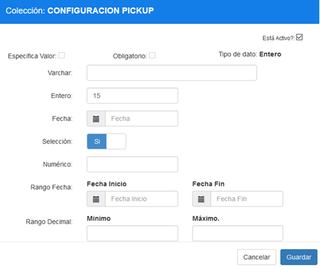

Ingrese los siguientes parametros y dar click sobre el botón Guardar. 

| Campo  | Valor | Descripción                                   |
|--------|-------|-----------------------------------------------|
| Entero | 15    | Tiempo (minutos) para despacho de pedido      |

 **Nota :** Tiempo requerido para preparar pedidos pickup 

3.	PICKUP TIEMPO CIERRE

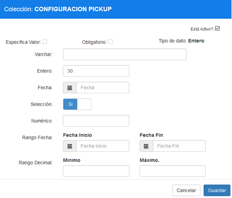

Ingrese los siguientes parametros y dar click sobre el botón Guardar. 

| Campo  | Valor | Descripción                                       |
|--------|-------|---------------------------------------------------|
| Entero | 30    | Tiempo (minutos) máximo para recibir pedidos     |

 **Nota :** Tiempo para cierre de local  

4.	PICKUP TIEMPO APERTURA

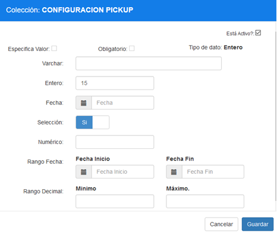

Ingrese los siguientes parametros y dar click sobre el botón Guardar. 

| Campo  | Valor | Descripción                                       |
|--------|-------|---------------------------------------------------|
| Entero | 15    | Tiempo (minutos) mínimo para recibir pedidos     |

 **Nota :** Tiempo para apertura de local  

## POLÍTICAS DE ESTACION 
### A.	COLECCIÓN DE CONFIGURACIÓN KIOSKO

1.	Para ingresar al módulo de Políticas de Configuración de Restaurante, debe dar clic en la opción “Restaurante” en el módulo de “ESTACION”

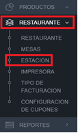

2.	Dar click sobre el restaurante deseado y una tabla con las estaciones configuradas se desplegue .

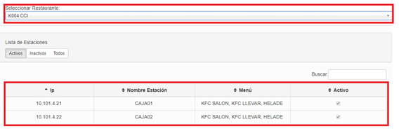

3.	Dar click sobre la estacion deseado y una pantalla emergenete se deplguea. En la parte superior derecha de la pantalla emergente, seleccionar la pestaña “Políticas de configuración” y seleccionar  el icono   para configurar las siguintes politicas .

### a.	Creación de los Parámetros
1.	PICKUP ESTACION ACTIVO?

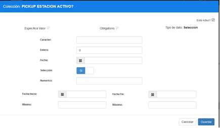

Ingrese los siguintes parametras y dar sobre sobre el button Gaurdar

| Campo     | Valor | Descripción                 |
|-----------|-------|-----------------------------|
| Selección | Si    | Si la estación está activa  |

2.	PICKUP NOMBRE CAJERO

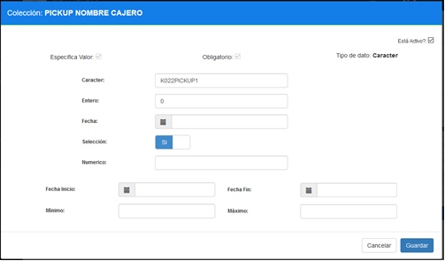

Ingrese los siguintes parametras y dar sobre sobre el button Gaurdar. 

| Campo    | Valor                     | Descripción                                               |
|----------|---------------------------|-----------------------------------------------------------|
| Caracter | K022PICKUP1               | El Nombre del Cajero Creado para PickUp (CODIGO LOCAL + PICKUP + INCREMENTAL) |
|          |                           | EJ: K022PICKUP1                                           |
