# CREACION DE POLITICAS PICKUP

# 
 INTRODUCCION 

 PICKUP

**Introducción** - En este manual se detalla la creación de políticas que se deben configurar en el BackOffice de Max-Point para el correcto funcionamiento de Pickup. A continuación, un listado de la administración de políticos que se deben configurar a nivel de Cadena, Restaurante y Estación para el proceso de Pickup. 

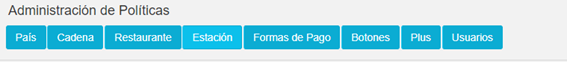

* POLÍTICAS EN LA OPCIÓN DE CADENA 

| COLECCIÓN           | PARAMETRO               | Esp. Valor | Obligatorio |
|---------------------|-------------------------|------------|-------------|
| CONFIGURACION PICKUP| PICKUP APLICA           | X          | X           |
|                     | PICKUP CANCELAR PEDIDO  |            | X           |

* POLÍTICAS EN LA OPCIÓN DE RESTAURANTE  

| COLECCIÓN           | PARAMETRO               | Esp. Valor | Obligatorio |
|---------------------|-------------------------|------------|-------------|
| CONFIGURACION PICKUP| PICKUP APLICA           | X          | X           |
|                     | PICKUP COOKTIME         |            | X           |
|                     | PICKUP TIEMPO APERTURA  |            | X           |
|                     | PICKUP TIEMPO CIERRE    |            | X           |

* 	POLÍTICAS EN LA OPCIÓN DE ESTACION 

| COLECCIÓN           | PARAMETRO               | Esp. Valor | Obligatorio |
|---------------------|-------------------------|------------|-------------|
| CONFIGURACION PICKUP| Pickup estación Activo? | X          | X           |
|                     | Pickup Nombre Cajero    | X          | X           |

**Objetivo** - Conocer sobre las diferentes configuraciones que se deben realizar antes de poner en producción el desarrollo del proceso de pickup, así evitar inconvenientes con Maxpoint. 

## ADMINISTRACIÓN DE POLÍTICAS

1.	Para ingresar al módulo de “Administración De Políticas”, debe dar clic en la opción “Seguridades” en el módulo de “Políticas

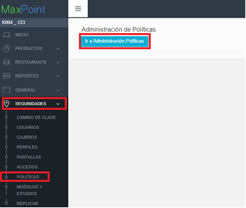

2.	 Al dar clic en la opción de 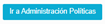 , se desplegara la siguiente pestaña

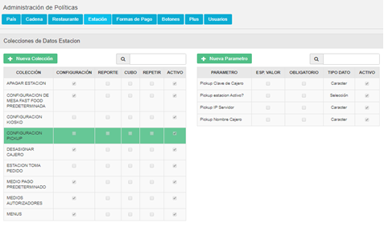

3.	A continuación, se detallará la creación de las politicas que se deben realizar para el paso a producción de PICKUP en cadena, restaurante y estación

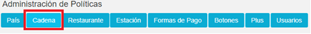

## POLÍTICAS DE CADENA 
## A.	COLECCIÓN CONFIGURACIÓN PICKUP 	
### a.	Creación de la Colección
1.	Clic en el ícono “Cadena” para agregar una colección de Cadena

2.	Dar clic en la opción  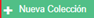  y se desplegará la siguiente pantalla emergente.    

3.	Ingrese los siguientes parametros y dar click sobre el botón Guardar. 

| Campo         | Valor                 |
|---------------|-----------------------|
| Colección     | CONFIGURACION PICKUP |
| Observaciones | Configuración de parámetros para pickup |

### b.	Creación de los Parámetros
En la nueva colección **“CONFIGURACION PICKUP”** en la pestaña de cadena , se debe crear los siguientes parámetros : PICKUP APLICA, PICKUP CANCELAR PEDIDO.

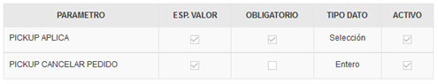

Al dar click sobre el icono   ,  una pantalla emergente se desplegará para crear los parámetros ya mencionados. 

A continacion se detallará las configuraciones de los parámetros.

1.	PARAMETRO PICKUP APLICA

| Campo       | Valor       |
|-------------|-------------|
| Parámetro   | PICKUP APLICA |
| Tipo de dato | Selección   |
| Esp. Valor  | Si          |
| Obligatorio | Si          |

2.	PARAMETRO PICKUP CANCELAR PEDIDO

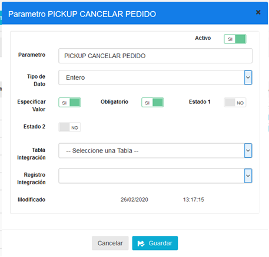

| Campo       | Valor                |
|-------------|----------------------|
| Parámetro   | PICKUP CANCELAR PEDIDO |
| Tipo de dato | Entero               |
| Obligatorio | SI                   |

## POLÍTICAS DE RESTAURANTE 
## A.	COLECCIÓN CONFIGURACIÓN PICKUP
### a.	Creación de la Colección
1.	Clic en el ícono “Cadena” para agregar una colección de Cadena

2.	Dar clic en la opción  y se desplegara la siguiente pantalla emergente 

3.	Ingrese los siguintes parametras y dar click sobre sobre el botón Guardar

| Campo       | Valor                   |
|-------------|-------------------------|
| Colección   | CONFIGURACION PICKUP    |

### b.	Creación de los Parámetros
En la nueva colección “CONFIGURACION PICKUP” en la pestana de cadena , se debe crear los siguintes parámetros : *PICKUP APLICA, PICKUP COOKTIME,  PICKUP TIEMPO APERTURA, PICKUP TIEMPO CIERRE, PICKUP USUARIO*.

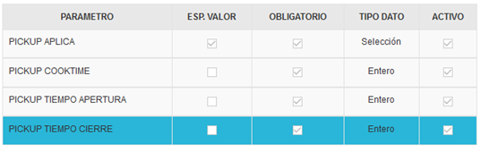

Al dar click sobre el icono  , se desplegará una pantalla emergente para crear el parámetro ya mencionado. 

A continacion se detallara las configuricaions de los parametros.

1.	PARAMETRO PICKUP APLICA

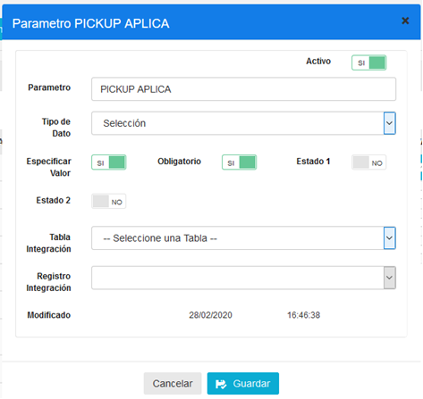

| Campo       | Valor     |
|-------------|-----------|
| Parámetro   | PICKUP APLICA |
| Tipo de dato | Selección |
| Esp. Valor  | Si        |
| Obligatorio | Si        |

2.	PARAMETRO PICKUP COOKTIME

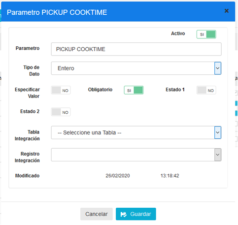

| N   |Campo         | Valor           |
|---- |--------------|-----------------|
| 1.  |Parámetro     | PICKUP COOKTIME |
| 2.  | Tipo de dato | Entero          |
| 3.  | Obligatorio  | SI              |

3.	PARAMETRO PICKUP TIEMPO APERTURA

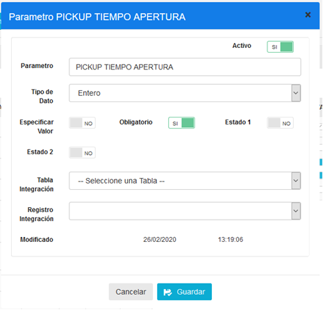

| Campo        | Valor               |
|--------------|---------------------|
| Parámetro    | PICKUP TIEMPO APERTURA |
| Tipo de dato | Entero              |
| Obligatorio  | Si                  |

4.	PARAMETRO PICKUP TIEMPO CIERRE

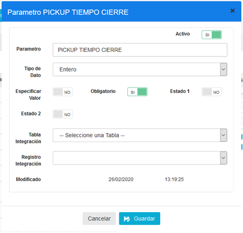

| Campo        | Valor                 |
|--------------|-----------------------|
| Parámetro    | PICKUP TIEMPO CIERRE  |
| Tipo de dato | Entero                |
| Obligatorio  | Si                    |

## POLÍTICAS DE ESTACION 
## A.	COLECCIÓN CONFIGURACIÓN PICKUP
### a.	Creación de la Colección

1.	Clic en el ícono “Estación” para agregar una colección de estación.

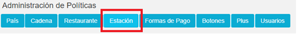

2.	Dar clic en la opción  y la siguiente pantalla emergente se desplegara.   

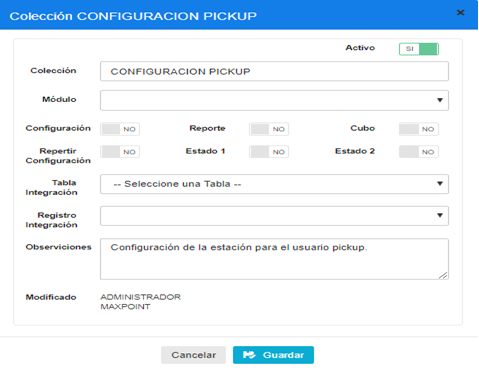

3. Ingrese los siguintes parametras y dar click sobre el botón Guardar. 

| Campo      | Valor                |
|------------|----------------------|
| Colección  | CONFIGURACION PICKUP|

### b.	Creación de los Parámetros
En la nueva colección “CONFIGURACION PICKUP” en la pestana de cadena , se debe crear los siguintes parámetros : *Pickup estacion Activo?, Pickup Nombre Cajero.*

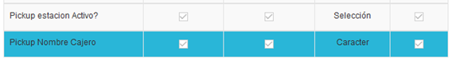

Al dar click sobre el icono   ,  se desplegará una pantalla emergente para crear el parámetro ya mencionado. 

A continuación se detallará las configuración de los parámetros.

1.	PARAMETRO Pickup estacion Activo

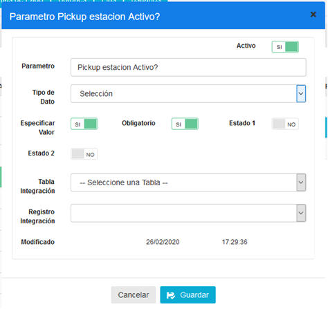

| Campo       | Valor     |
|-------------|-----------|
| Parámetro   | Pickup estacion Activo? |
| Tipo de dato| Selección |
| Esp. Valor  | Si        |
| Obligatorio | Si        |

2.	PARAMETRO Pickup Nombre Cajero

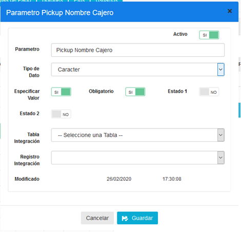

| Campo       | Valor             |
|-------------|-------------------|
| Parámetro   | Pickup Nombre Cajero |
| Tipo de dato| Caracter          |
| Esp. Valor  | Si                |
| Obligatorio | Si                |

# ANEXOS
## Colección Cadena : 

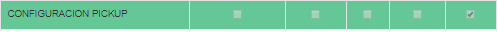

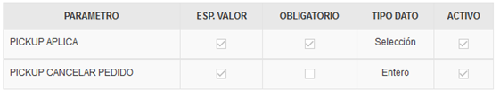

## Colección Restaurante : 

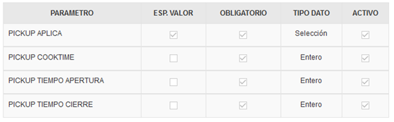

## Colección Estación : 

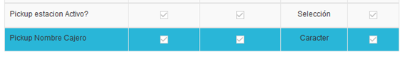