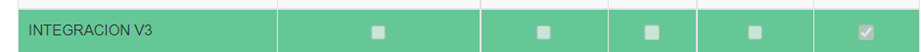
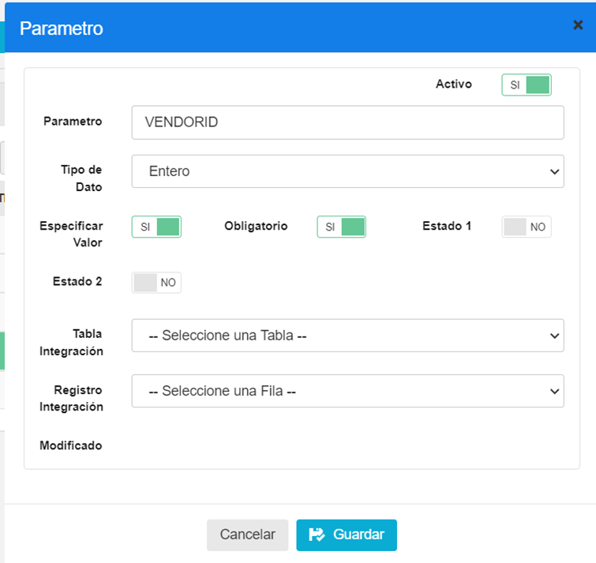
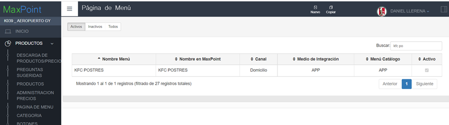
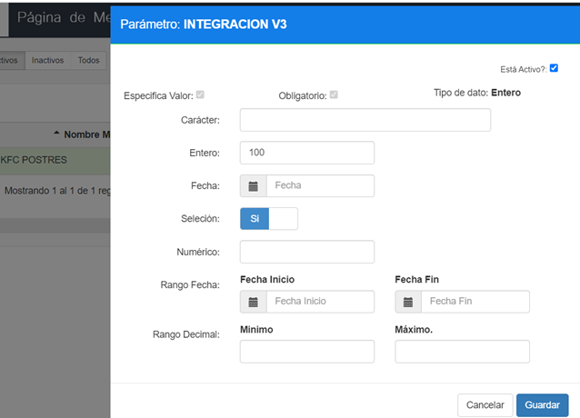
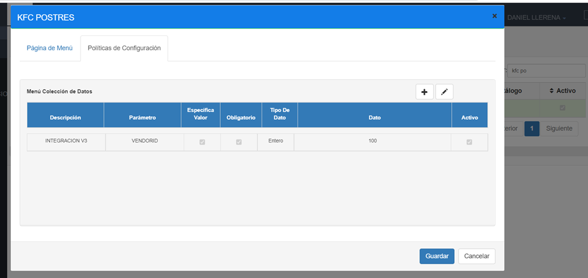

# POLÍTICA PARA COLOCAR VENDO ID PARA KFC SNACKS AGREGADORES

## 1	ANTECEDENTES
Actualmente en el sistema MaxPoint, se tiene la necesidad de poder enviar menús de cadenas ficticias mismas que permitan vender las categorías de Postres y Sanduches por separadas para que el proveedor le suba en los agregadores como cadenas nuevas

## 2	OBJETIVO GENERAL
Crear y configurar las políticas necesarias para poder enviar los menús de Postres y Sanduches como cadenas nuevas.

### 2.1	Objetivos específicos
* Configurar la política y parámetros a nivel de menú “VENDORID”

## 3	POLÍTICAS DE CONFIGURACIÓN
### 3.1	Datos Generales
En este manual se detalla cómo realizar la configuración de políticas que permitirán establecer el vendor id del menú a enviar

### 3.2	Pantalla de Políticas
En Azure ingresar al sistema MXP backoffice con credenciales de administrador sistemas y seleccionar la cadena a la cual se realizará las configuraciones.

En el menú que se encuentra en la parte izquierda no dirigimos a la opción **SEGURIDADES** y seleccionamos **POLÍTICAS**, seguidamente presionamos sobre el botón **Ir a Administración Políticas** en el cual abrirá una nueva pestaña en el navegador.

Luego de eso seleccionamos la Colección de Menú :

Una vez seleccionada se debe CREAR el parámetro :

### 3.3	Menú
### 3.3.1	Colección Menú
Antes de crear las políticas de configuración; como primer paso se debe verificar que no se encuentren creadas, de ser el caso validar que cada colección contenga los parámetros establecidos en este manual. 

En la opción Productos- **Página de Menú** presionar sobre el botón Política de Configuración, se abrirá una modal para su creación ingresando los siguientes datos:

Se debe agregar la política escogiendo el valor de **INTEGRACIÓN V3** Y LUEGO AGREGAR EL PARÁMETRO DE **VENDORID** y colocar los siguientes valores en el campo entero lo siguiente:  100- KFC POSTRES O 101- KFC SANCUCHES

Tabla 1. Colección Menú

| N°  | Colección | Descripción                                                                                     |
|-----|-----------|-------------------------------------------------------------------------------------------------|
| 1   | VENDORID  | ID DE CADENA FICTICIA QUE PERMITE EL ENVÍO DE MENÚS CON UN NÚMERO DE CADENA FICTICIA            |

 **Nota:** NO puede contener espacios en blanco al inicio y final del nombre de la colección; debe ser escrita tal y cual. 

Al realizar la configuración de todos los parámetros se debe tener lo siguiente:

