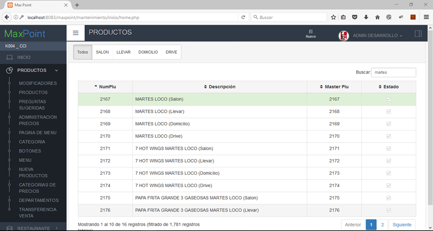
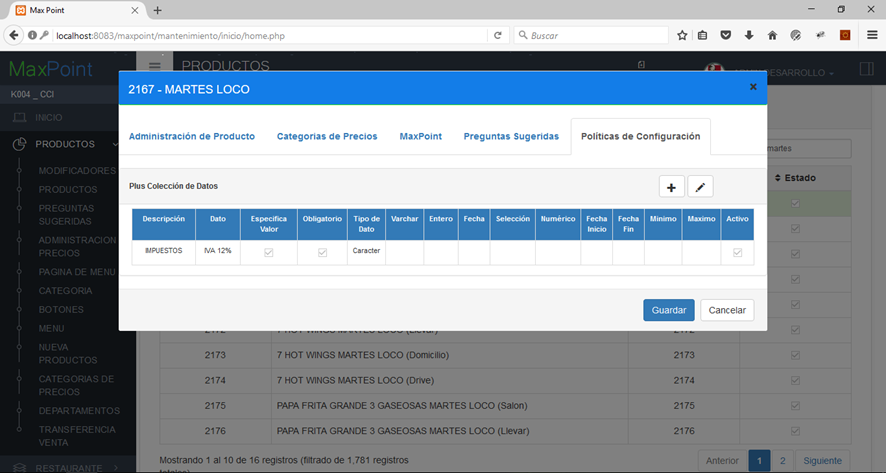
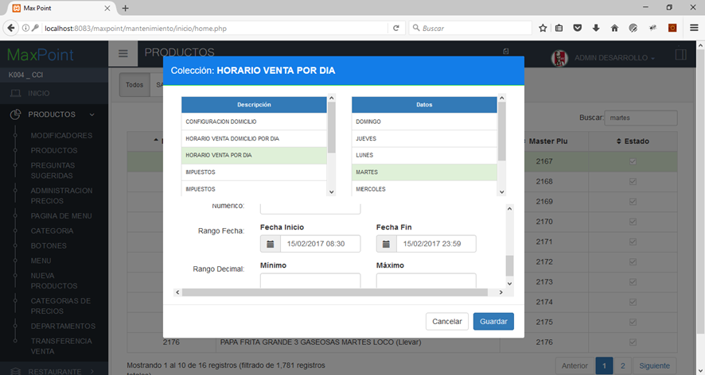

# MANUAL DE USUARIO CONFIGURACIÓN HORARIO DE VENTA DE PRODUCTOS POR DIA

1.	Para la configuración de los horarios de venta de producto se deben ubicar en el módulo de PRODUCTOS en la pantalla de PRODUCTOS, luego seleccionar el producto y dar doble clic sobre este.

2.	Nos dirigimos a la pestaña de POLÍTICAS DE CONFIGURACIÓN y damos clic en **+**.

3.	Luego seleccionamos la colección de HORARIO VENTA POR DÍA y el día que vamos a configurar. Los parámetros se configuran en los inputs RANGO DE FECHA (MÍNIMO, MAXIMO).

Para este caso del Festín Martes Loco, se debería hacer la siguiente configuración.

| DÍA        | HORA INICIO | HORA FIN |
|------------|-------------|----------|
| LUNES      | 00:00       | 00:00    |
| MARTES     | 08:30       | 23:59    |
| MIÉRCOLES  | 00:00       | 00:00    |
| JUEVES     | 00:00       | 00:00    |
| VIERNES    | 00:00       | 00:00    |
| SÁBADO     | 00:00       | 00:00    |
| DOMINGO    | 00:00       | 00:00    |

Otro ejemplo, sería la configuración de un desayuno, la tabla quedaría de la siguiente forma.

| DÍA       | HORA INICIO | HORA FIN |
|-----------|-------------|----------|
| LUNES     | 08:30       | 11:00    |
| MARTES    | 08:30       | 11:00    |
| MIÉRCOLES | 08:30       | 11:00    |
| JUEVES    | 08:30       | 11:00    |
| VIERNES   | 08:30       | 11:00    |
| SÁBADO    | 08:30       | 11:00    |
| DOMINGO   | 08:30       | 11:00    |

**Nota: Si la colección HORARIO VENTA POR DÍA no existe se deben comunicar con sistemas para que se cree esta colección personalizada para el funcionamiento de los horarios de productos.** 