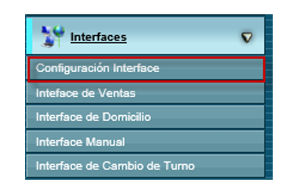
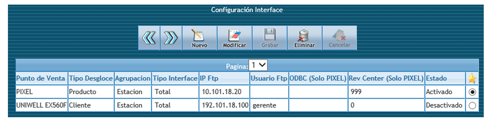
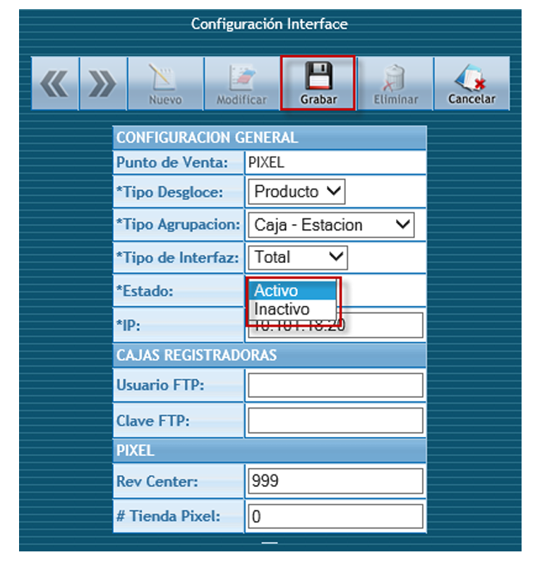
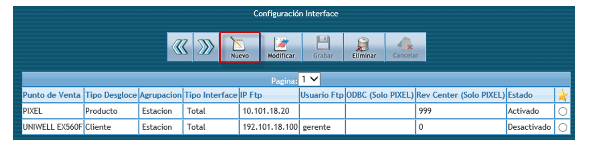
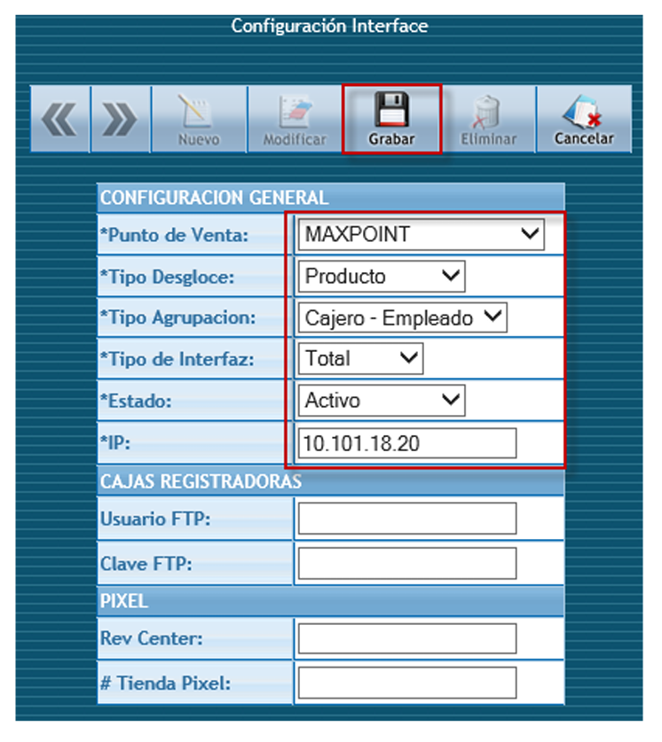
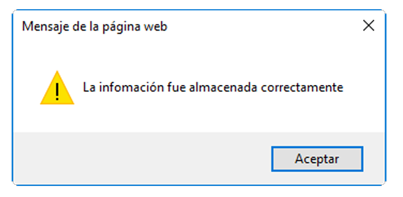
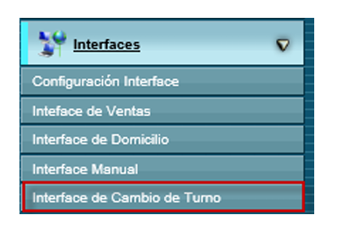
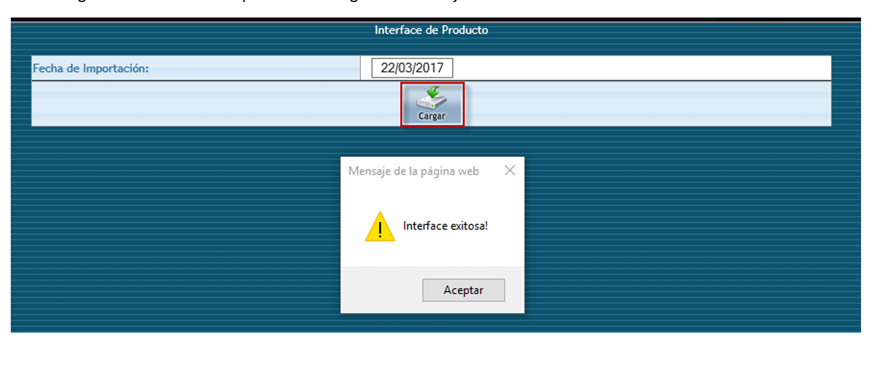

# MANUAL DE USUARIO INTERFAZ CAMBIO DE TURNO 

# 
 Interface de Cambios de Turno MaPoint  

Ingresar a la opción en la configuración Interface del Módulo Interface:

Se presentará la siguiente pantalla, seleccionamos la interface activa actualmente: 

Seleccionar el estado Inactivo y el presionar botón guardar.

Seleccionar el botón **Nuevo:** 

Ingresar los siguientes parámetros:  

Punto de Venta: MAXPOINT 

Tipo Desglose: Producto 

Tipo Agrupación: Empleado 

Tipo Interfaz: Total 

Estado: Activo 

IP: IP del servidor de la tienda que corresponda

Se presentará el mensaje de confirmación. 

Realizar la prueba en el menú:  

Si la configuración es correcto se presentara el siguiente mensaje de confirmación.

