# Manual del sistema MaxPoint (POS) ver 2 

 Manual del sistema MaxPoint para apertura y cierre de periodos, proceso de venta, proceso de anulación 

 Versión 1.5

## 1.	Apertura de periodo
1.	Al iniciar el sistema al principio del día, lo siguiente aparecerá en pantalla:

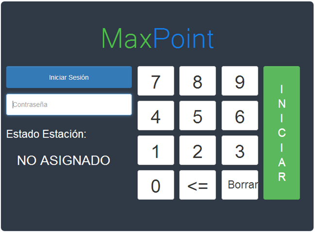

El administrador debe ingresar su contraseña utilizando los números del teclado en pantalla. El botón     borra un número a la vez, mientras que el botón    borra todos números escritos.
Una vez que la contraseña ha sido ingresada, presionar el botón “Iniciar” ubicado a la derecha.

2.	El sistema mostrará una pantalla donde se muestra la fecha, el establecimiento y la hora. 

El administrador debe confirmar que la información sea correcta, presionando el botón “La Fecha y el Tiempo son Correctos”.

El sistema confirmará que el periodo se ha grabado de forma correcta.

3.	La pantalla de inicio se actualizará con la caja y la fecha.

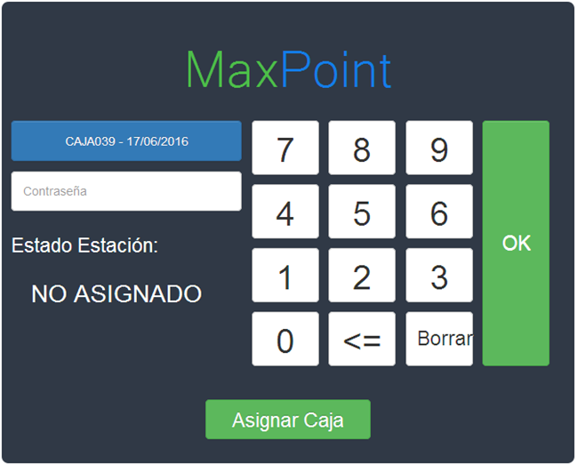

3.1.	El botón     permite ver la dirección IP y las impresoras de la caja.

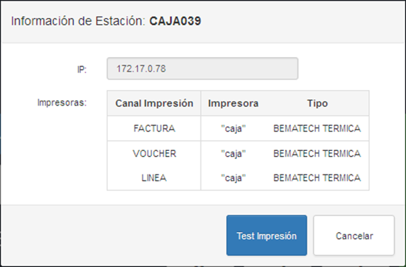

3.2.	Al tocar el botón   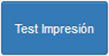  el sistema imprimirá una página de prueba con cada canal de impresión, con el fin de verificar que la impresora esté operativa y lista para facturar.

3.3.	El botón  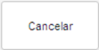   permite regresar a la pantalla principal.

4.	De vuelta en la pantalla principal, el cajero debe ingresar su contraseña utilizando los números del teclado en pantalla. 

El botón  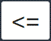   borra un número a la vez, mientras que el botón     borra todos números escritos.

Una vez que la contraseña ha sido ingresada, presionar el botón     para asignar la caja al cajero.

5.	El sistema solicitará al administrador que ingrese su contraseña.

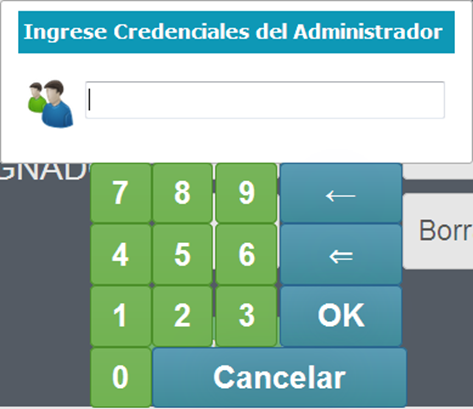

En esta pantalla, el botón     borra un número a la vez, mientras que el botón     borra todos números escritos. Para continuar, presionar el botón   .

6.	A continuación, el administrador debe ingresar el fondo que se le asignará a la caja para empezar.

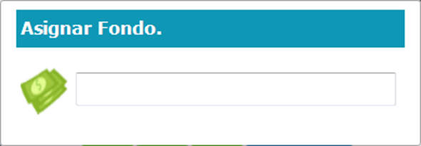

 El sistema confirmará si se desea asignar el valor ingresado.

 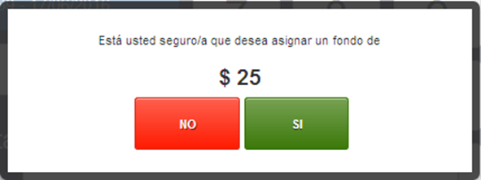

 Al presionar el botón “SI”, el sistema confirma la asignación de la caja.

 

 El estado de la estación se actualizará.

 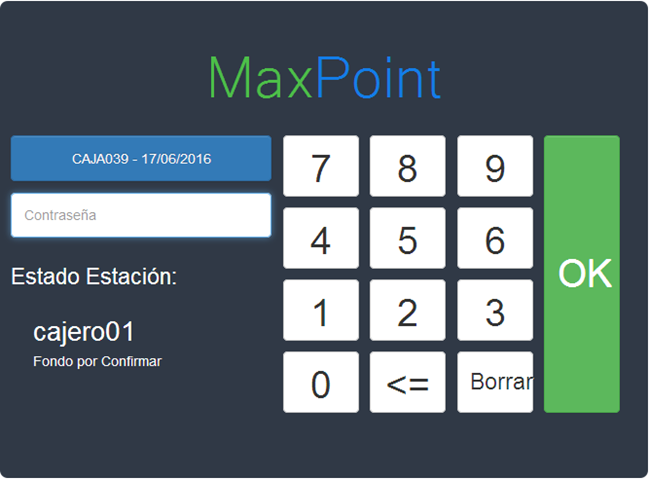

 7.	El cajero debe ingresar su contraseña utilizando los números del teclado en pantalla, y presionar el botón “OK” ubicado a la derecha.

Un mensaje aparecerá en pantalla solicitando al cajero que confirme que el fondo asignado que se ingresó es correcto.

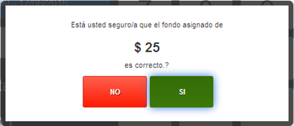

En caso de ser correcto, presionar el botón “SI”. El sistema muestra la pantalla de “Orden Pedido” y está listo para realizar ventas.

En caso de no ser correcto, presionar el botón “NO”. El sistema vuelve al estado del punto **4**.

## 2.	Cierre de periodo
1.	Desde la pantalla principal, ingresar la contraseña de administrador y presionar el botón “OK” ubicado a la derecha.

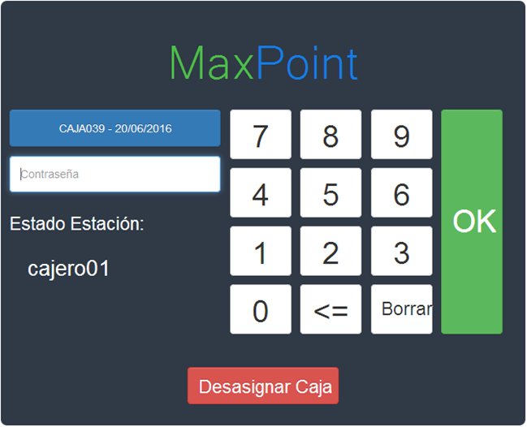

2.	Primero se debe retirar el fondo de la caja asignado al cajero. Para esto, presionar el botón de “Menú” ubicado en la parte inferior derecha. A continuación, presionar el botón “Funciones Gerente”. Después, presionar el botón “Retiro de Fondo”.

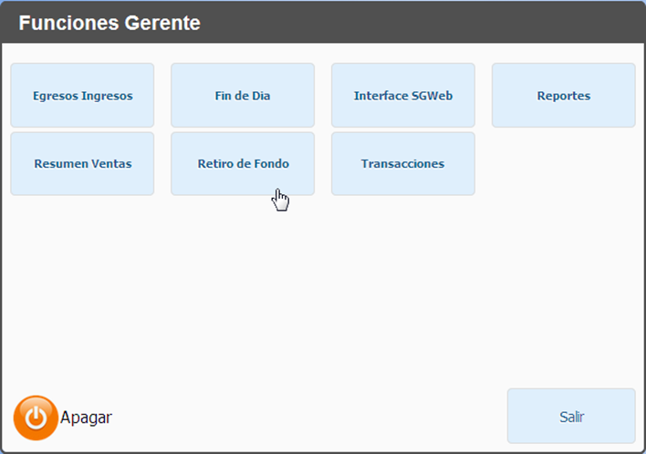

3.	Se presenta una lista de los fondos asignados, indicando sus datos y su estado.

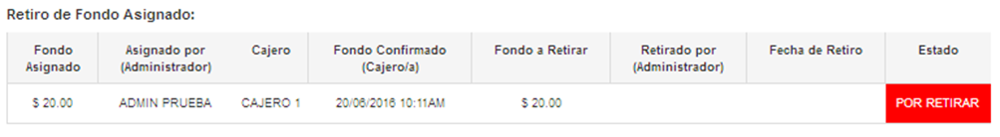

4.	Presionar el botón “Retirar Fondo”, e ingresar la contraseña de administrador.

5.	El sistema confirmará el valor del fondo asignado que se retirará y el cajero a cargo. 

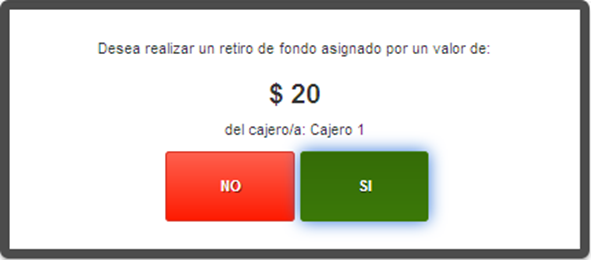

Para continuar, presionar el botón “SI”. Los datos y el estado del fondo asignado se actualizarán, y se imprimirá un reporte.

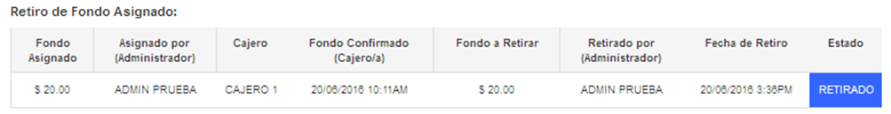

6.	A continuación se debe desasignar el cajero. Para esto, presionar el botón de “Menú” ubicado en la parte inferior derecha, y presionar el botón “Funciones Gerente”. Después, presionar el botón “Fin de Dia”.

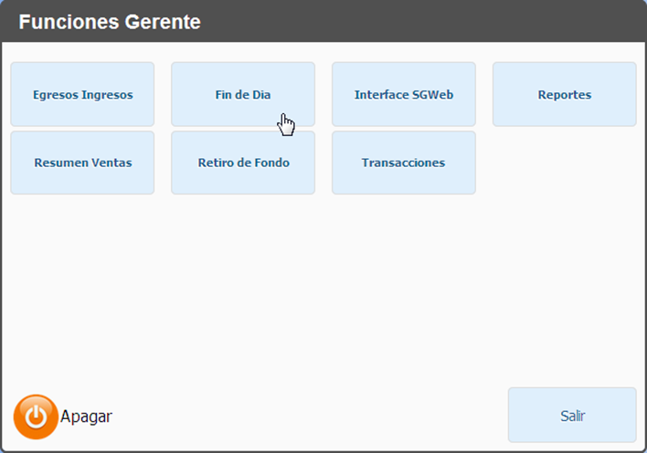

Se presentarán 3 columnas: Cuentas Abiertas, Cuentas por Facturar y Empleado Asignado. Presionar en el cajero que se desea desasignar. No deberá haber ninguna cuenta abierta ni ninguna cuenta por facturar.

6.1.	En el caso de haber cuentas abiertas, estas aparecerán en las columnas correspondientes.

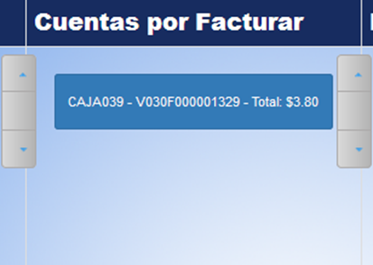

Presionar en la cuenta para ver sus datos.

6.2.	Presionar el botón “Retomar”, e ingresar contraseña de administrador para solucionar las cuentas abiertas.

6.	**Otra manera de desasignar el cajero** es presionando el botón de “Menú” ubicado en la parte inferior derecha, y presionar el botón “Salir del Sistema”.

Desde la pantalla principal, ingresar la contraseña de administrador y presionar el botón “Desasignar Caja”. Como se mencionaba en la manera anterior, no deberá haber ninguna cuenta abierta ni ninguna cuenta por facturar.

Presionar el botón “DESASIGNAR CAJERO”.

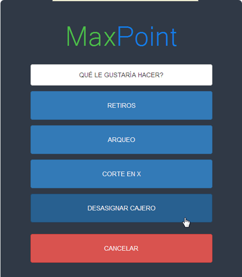

7.	Las transacciones del día aparecerán en pantalla de acuerdo a las formas de pago que se hayan aplicado. 

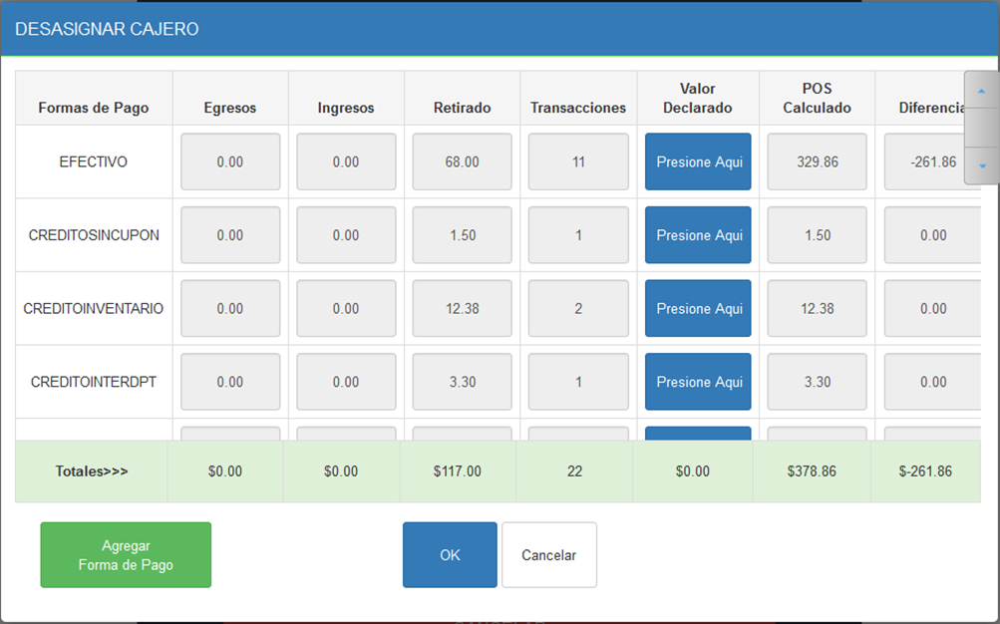

Presionando el botón **“Presione Aqui”** permite ingresar el valor declarado de cada una.

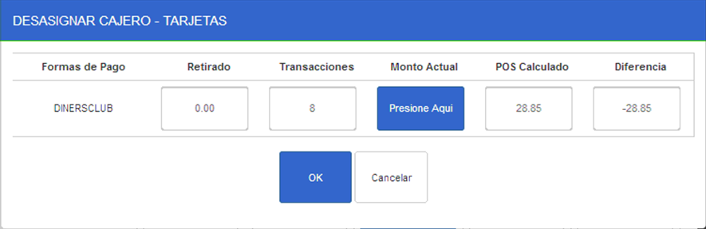

7.1.	En el caso de efectivo, ingresar la cantidad de billetes y de monedas presente en la caja. La barra lateral     ubicada a la derecha permite desplazarse entre las denominaciones de billetes y monedas.

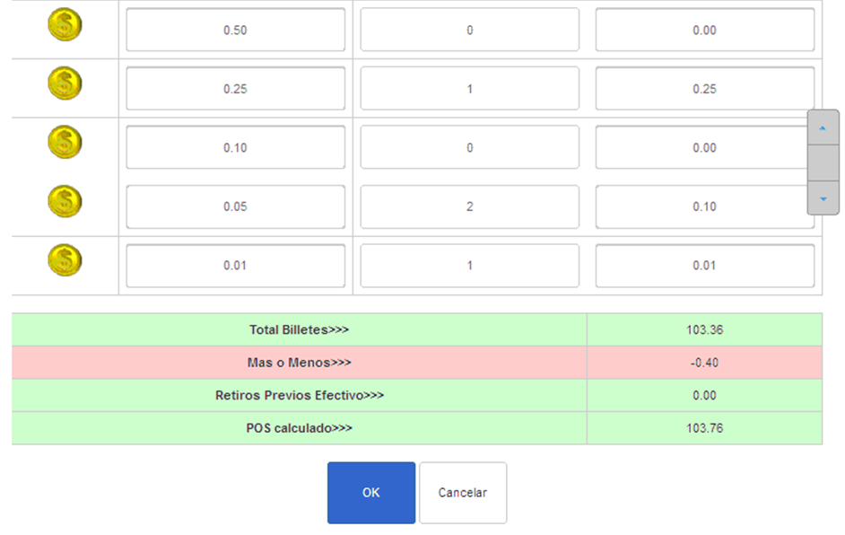

7.2.	En el caso de tarjetas, el valor aparecerá de manera predeterminada y solo será necesario confirmar.

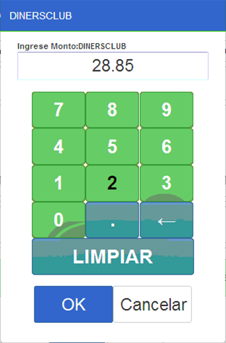

8.	El sistema actualizará los montos.

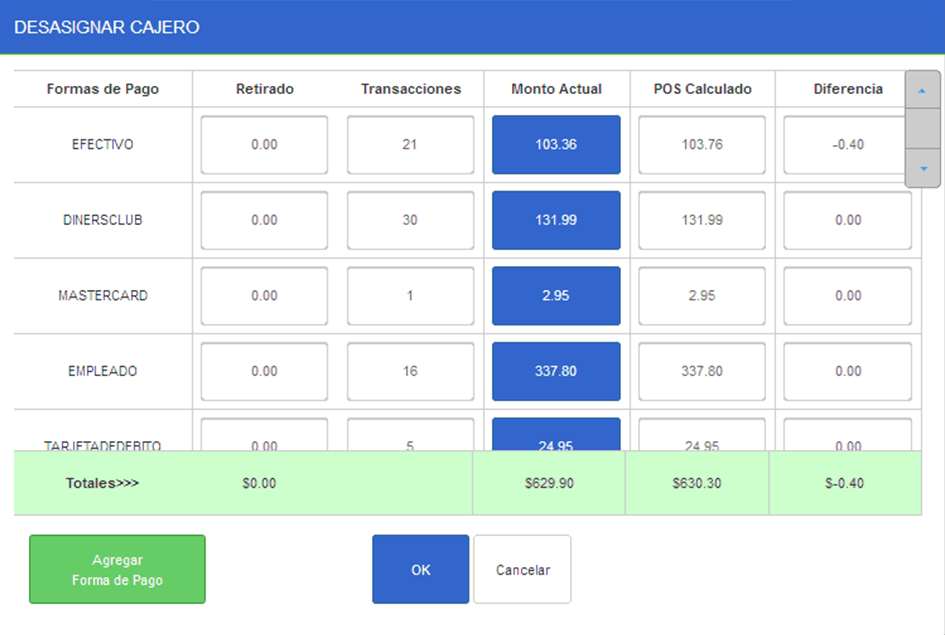

Presionar el botón “OK”. El sistema confirmará si se desea desasignar el cajero. Presionar el botón “SI”.

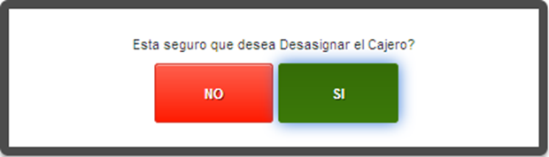

El sistema confirmará que se ha desasignado el cajero de manera exitosa, y se imprimirá un reporte.

El sistema volverá a la pantalla principal.

La venta se subirá al sistema gerente de manera automática.

9.	Una vez que no haya ningún empleado asignado, presionar el botón “Finalizar el Día”.

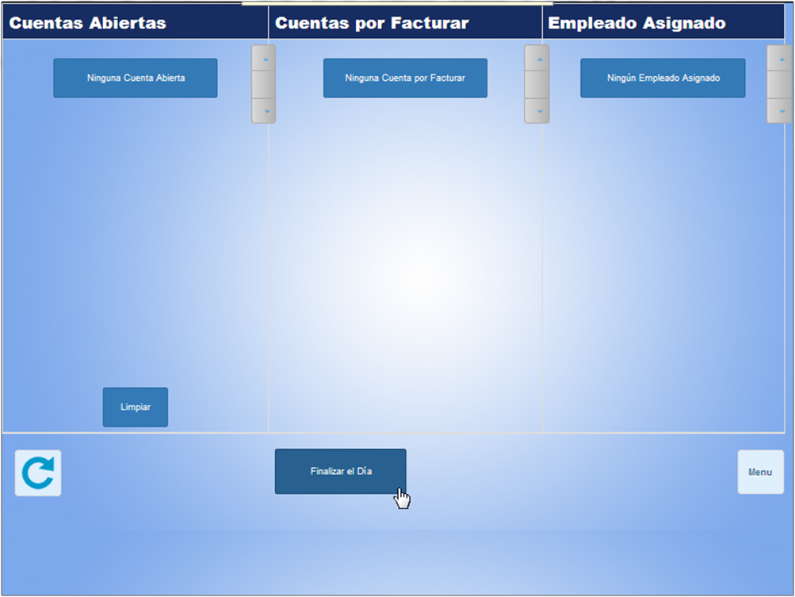

10.	El sistema confirmará si se desea cerrar el periodo.

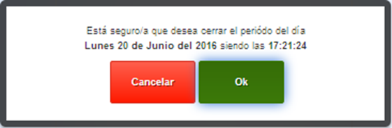

Una vez que el sistema notifique que el periodo ha sido cerrado exitosamente, se imprimirá un reporte de fin del día.

## 3.	Proceso de Venta

**1.**	En la pantalla principal de ventas “Orden Pedido” se presentan las categorías de los productos en la parte inferior, así como los productos de la categoría seleccionada en la parte superior. Para agregar los productos a la orden se debe presionar el botón del producto deseado. Estos irán apareciendo en la lista del lado izquierdo.

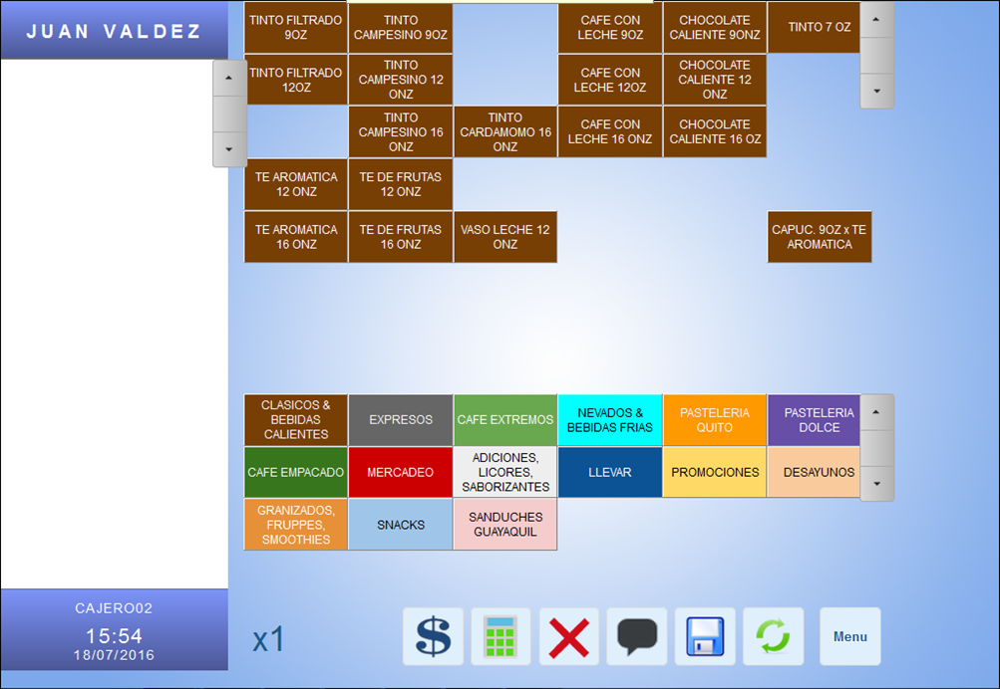

1.1 Botón     sirve para proceder a cobrar la orden del cliente. Debe haber al menos un producto seleccionado para poder proceder a cobrar. 

1.2.	El botón  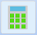   permite seleccionar un producto con cantidad. Al presionar el botón, aparecerá un teclado donde se debe ingresar la cantidad.  Y luego sale  (número de cantidad) A continuación, se debe seleccionar el producto deseado.

1.3.	El botón     permite eliminar el producto seleccionado de la venta. En caso de haber un producto con cantidad mayor a 1, este botón reducirá su cantidad en 1. Para poder proseguir, es necesario ingresar la contraseña del administrador.

1.4.	El botón     sirve realizar comentarios y observaciones. Estos pueden realizarse sobre toda la orden que se va a realizar, cuando la cuenta se encuentra vacía, o sobre un producto ordenado, en el caso de que el producto esté seleccionado.

1.5.	El botón     guarda la orden, permitiendo abrirla más adelante.

1.6.	El botón     permite volver a cargar el menú en caso de que este no se cargue de manera correcta.

1.7.	Presionar el nombre del establecimiento en la parte superior izquierda permite cambiar entre los menús del establecimiento (esto variará dependiendo de cada local).

**2.**	Una vez que los productos han sido seleccionados, se prosigue a cobrar la orden (presionando el botón   (). En el lado izquierdo aparecerán los productos, y así como el desglose y detalle de los precios. 

**3.**	Se pueden cambiar entre las 8 opciones de pago presionando los botones ubicados en la parte derecha. Por defecto, la opción de pago es EFECTIVO.

**3.1.**	

3.1.1.	Utilizar el teclado numérico para ingresar la cantidad pagada. Cuando el pago sea exacto, se puede omitir este paso y presionar directamente el botón Aplicar EFECTIVO y automáticamente el calcula de la Retención del IVA.

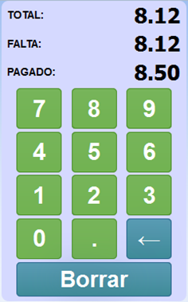

Los botones de al lado del teclado numérico permiten sumar valores de billetes al total pagado. Cada vez que se ingrese un billete adicional, es necesario presionar el botón “+”.

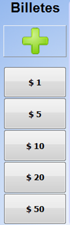

3.1.2.	Presionar el botón “Aplicar EFECTIVO”.

3.1.3.	Finalmente, se deben ingresar los datos del cliente.

Al ingresar la cédula del cliente, los datos del cliente se llenan automáticamente en el caso de que ya se encuentre registrado.

El botón **“OK”** del teclado lleva al siguiente campo.

En el caso de que el cliente no solicite datos, presionar el botón “Consumidor Final” ubicado a la derecha.

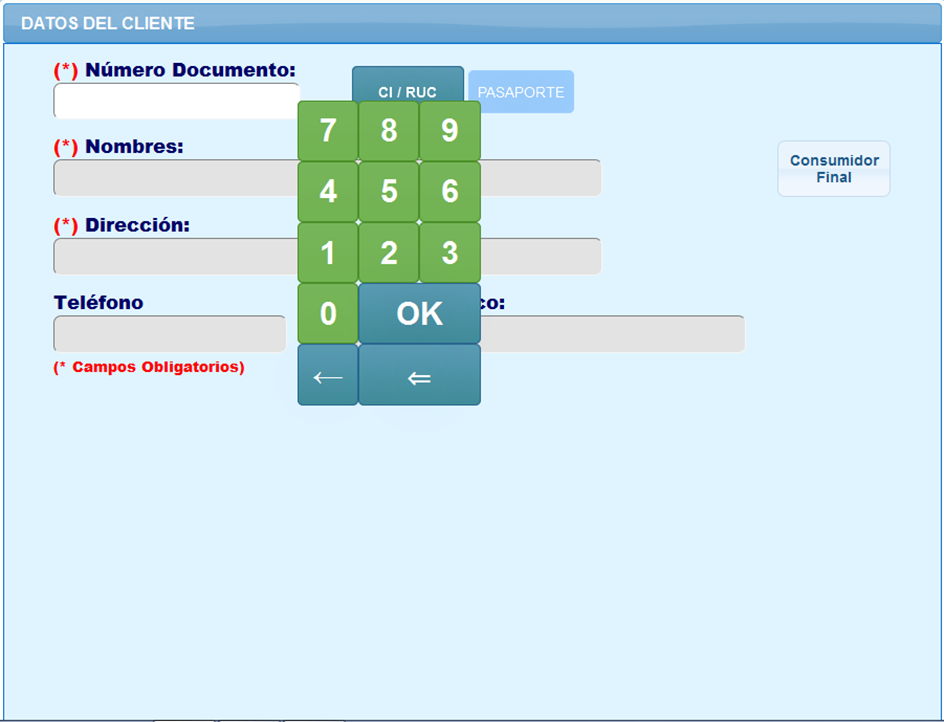

**3.2** 

3.2.1.	Presionar **“Aplicar CREDITO SIN CUPON”**.

3.2.2.	Digitar el nombre o las primeras letras del cliente, y presionar el botón “OK”. Las coincidencias de la búsqueda aparecerán en pantalla.

3.2.3.	Presionar el cliente deseado.

3.2.4.	Confirmar el cliente y el valor a aplicar para finalizar.

**3.3.**	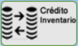

3.3.1.	Presionar **“Aplicar CREDITO INVENTARIO”**.

3.3.2.	Digitar el nombre o las primeras letras del cliente, y presionar el botón “OK”. Las coincidencias de la búsqueda aparecerán en pantalla.

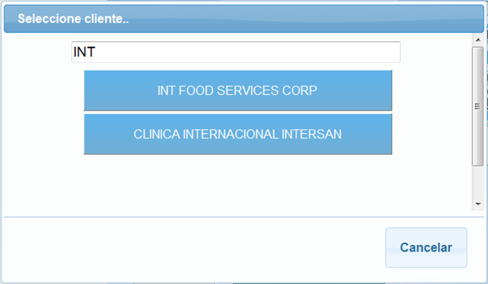

3.3.3.	Presionar el cliente deseado.

3.3.4.	Las cadenas se enlistarán en pantalla. Seleccionar la cadena y, a continuación, la tienda. Presionar el botón “Aceptar” para finalizar.

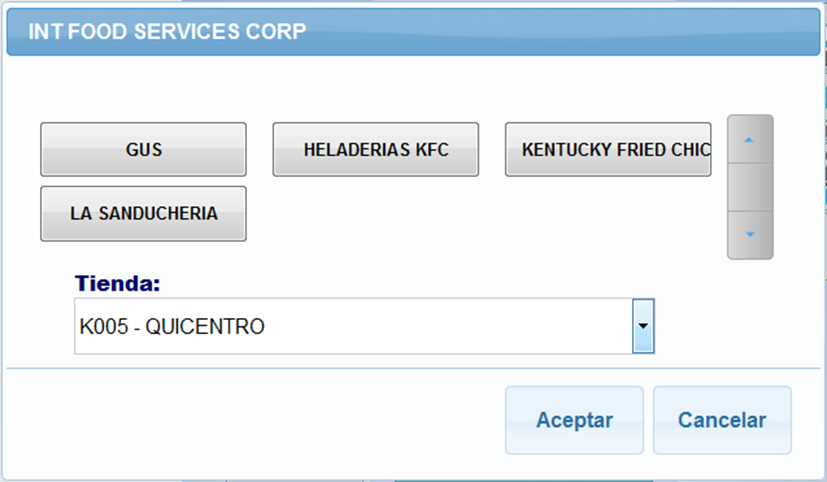

**3.4.**	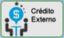

3.4.1.	Presionar **“Aplicar CREDITO EXTERNO”**.

3.4.2.	Digitar el nombre o las primeras letras del cliente, y presionar el botón “OK”. Las coincidencias de la búsqueda aparecerán en pantalla.

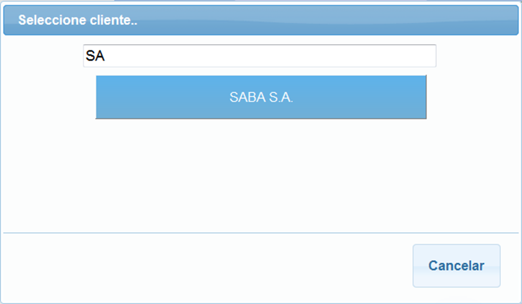

3.4.3.	Presionar el cliente deseado.

3.4.4.	Confirmar el cliente y el valor a aplicar para finalizar.

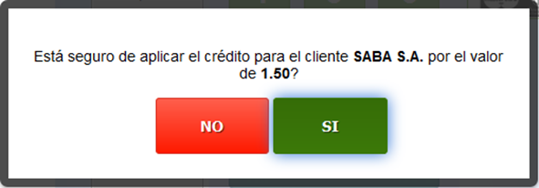

**3.5** 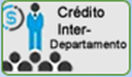

3.5.1.	Presionar **“Aplicar CREDITO INTERDPT”**.

3.5.2.	Digitar el nombre o las primeras letras del cliente, y presionar el botón “OK”. Las coincidencias de la búsqueda aparecerán en pantalla.

3.5.3.	Presionar el cliente deseado.

3.5.4.	El sistema solicitará una observación, donde se debe ingresar el nombre de la persona que está realizando la compra. Presionar el botón “Aceptar” para finalizar.

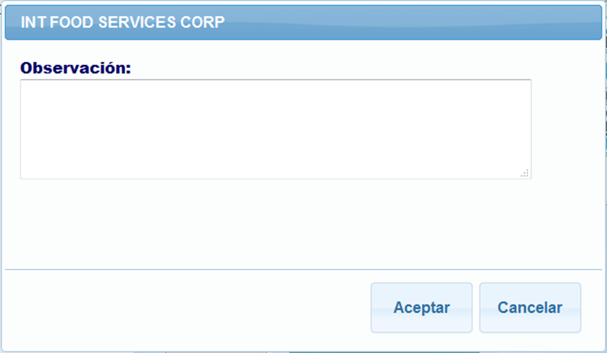

**3.6**  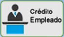

3.6.1.	Presionar **“Aplicar EMPLEADO”**.

3.6.2.	Digitar el nombre o las primeras letras del cliente, y presionar el botón “OK”. Las coincidencias de la búsqueda aparecerán en pantalla.

3.6.3.	Presionar el cliente deseado.

3.6.4.	Confirmar el cliente y el valor a aplicar para finalizar.

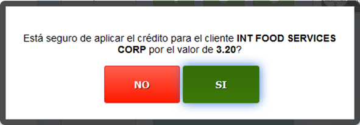

3.6.5.	Finalmente, se deben ingresar los datos del cliente.

Al ingresar la cédula del cliente, los datos del cliente se llenan automáticamente en el caso de que ya se encuentre registrado.

El botón **“OK”** del teclado lleva al siguiente campo.

En el caso de que el cliente no solicite datos, presionar el botón “Consumidor Final” ubicado a la derecha.

**3.7** 

3.7.1.	Presionar **“Aplicar TARJETAS”**.

3.7.2.	Seleccionar el medio autorizado entre las opciones Banda, Datafast y Pinpad.

3.7.2.1.	En el caso de tarjeta de Banda, el sistema solicitará que se deslice la tarjeta. A continuación, los vouchers se imprimirán.

3.7.2.2.	En el caso de Datafast, el sistema solicitará los primeros 6 dígitos de la tarjeta.

3.7.2.3.	***En el caso de Pinpad***

**3.8**  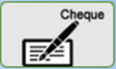

3.8.1.	Presionar **“Aplicar CHEQUE”**.

3.8.2.	Finalmente, se deben ingresar los datos del cliente.

Al ingresar la cédula del cliente, los datos del cliente se llenan automáticamente en el caso de que ya se encuentre registrado.

El botón **“OK”** del teclado lleva al siguiente campo.

En el caso de que el cliente no solicite datos, presionar el botón “Consumidor Final” ubicado a la derecha.

3.9.	En el caso de una orden con pago mixto:

3.9.1.	Seguir los pasos de los medios correspondientes, digitando las cantidades a pagar con cada medio en el teclado numérico antes de presionar el botón de aplicar.

Con los medios de pago CREDITO INVENTARIO, CREDITO EXTERNO, CREDITO INTERDEPARTAMENTARIO y CREDITO EMPLEADO se debe cancelar el valor total de la factura; es decir, no admiten pagos mixtos.

3.10.	En el caso de que se necesite retomar la orden, el botón     en la pantalla para cobrar la orden permite regresar a la pantalla de ventas.

Sin embargo, es posible que se obtenga el siguiente mensaje:

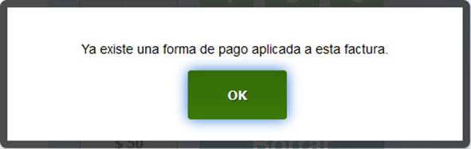

Esto sucede debido a que ya aplicó una forma de pago. En la parte inferior del precio total de la orden se puede observar si está asignada alguna forma de pago. Para solucionar esto, es necesario:

3.10.1.	En el caso de **EFECTIVO**,  presionar el botón de Efectivo y presionar “Cancelar EFECTIVO”. El sistema confirmará si se desea cancelar dicha forma de pago.

3.10.2.	En el caso de **CREDITO SIN CUPON**,  presionar el botón de CxC Producto y presionar “Cancelar CREDITO SIN CUPON”. El sistema confirmará si se desea cancelar dicha forma de pago.

3.10.3.	En el caso de **TARJETA**,  presionar el botón de Tarjetas y presionar “Cancelar TARJETA”. El sistema confirmará si se desea cancelar dicha forma de pago.

3.10.3.1.	En el caso de **TARGETA DE BANDA**, el sistema solicitará que la tarjeta vuelva a deslizarse y que se ingresen los datos de la tarjeta.

3.10.4.	En el caso de **CHEQUE**,  presionar el botón de Cheque y presionar “Cancelar CHEQUE”. El sistema confirmará si se desea cancelar dicha forma de pago.

4.	La orden se imprimirá.

4.1.	En el caso que los vouchers de la compra o anulación con tarjeta de crédito no se imprima, presionar el botón de “Menú” ubicado en la parte inferior derecha. A continuación, presionar el botón “Transacciones”.

4.2.	En la pantalla de Transacciones, presionar nuevamente el botón de “Menú” ubicado en la parte inferior derecha y presionar el botón “Tarjetas”.

4.3.	Las transacciones se listarán en pantalla. La barra lateral     ubicada a la derecha permite desplazarse entre las transacciones. Una vez ubicada la transacción, seleccionarla y presionar el botón “Visualizar”. A continuación, el voucher se mostrará en pantalla.

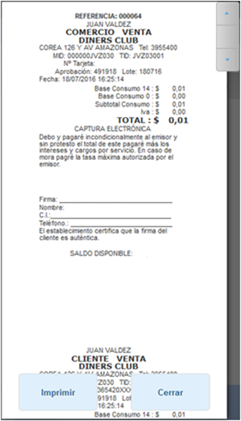

De ser la transacción correcta, presionar el botón “Imprimir”.

4.3.1.	 Si la transacción ha sido anulada, únicamente el voucher de la anulación puede volver a imprimirse. 
* Para revisar las ventas realizadas en el día, ingresar la contraseña de administrador desde el menú principal y presionar el botón **“Desasignar Caja”**.

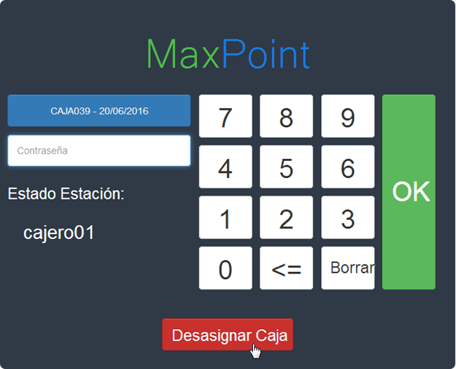

Presionar el botón “CORTE EN X”. El sistema notificará que el reporte se está imprimiendo.

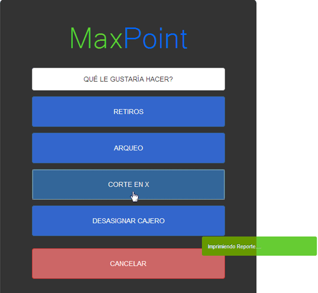

### 3.1	Cupones

1.	Desde la pantalla de ventas, presionar el botón de “Menú” ubicado en la parte inferior derecha, y presionar el botón “Cupones”.

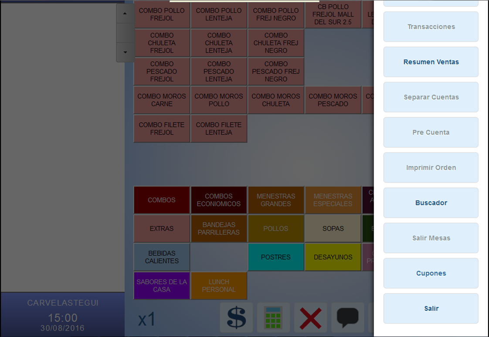

2.	Existen dos maneras de ingresar un cupón:

2.1.	Ingreso automático, presionando el botón “Automático”.

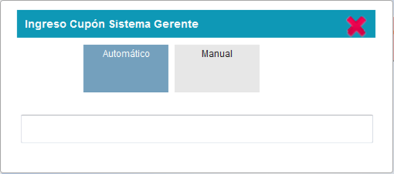

Escanear el código de barras del cupón, ubicado en la parte superior del mismo.

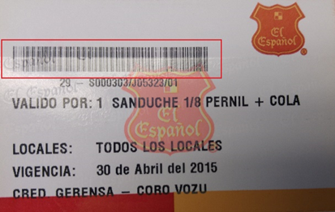

2.2.	Ingreso manual, presionando el botón “Manual”.

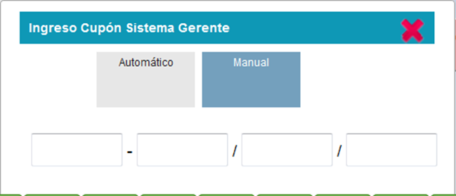

2.2.1.	Ingresar el código ubicado en la parte superior del cupón, tomando en cuenta la separación de los 4 grupos de caracteres (por los símbolos **‘–’ y ‘/’**).

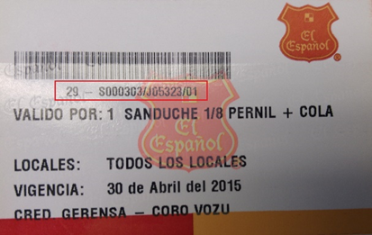

Presionar en cada recuadro para digitar cada grupo de caracteres.

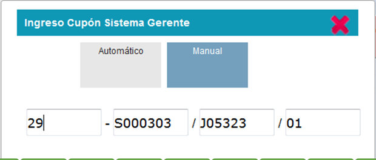

3.	El sistema confirmará el ingreso exitoso del cupón

## 4.	Proceso de Anulación
1.	Desde la pantalla principal, ingresar la contraseña de administrador y presionar el botón “OK” ubicado a la derecha.

2.	Desde el menú principal de ventas, presionar el botón “Menú” ubicado en la parte inferior derecha, y presionar el botón “Transacciones”.

3.	Presionar el botón “Menú” ubicado en la parte inferior derecha, y presionar el botón “Cuentas Cerradas”.
4.	Buscar la transacción utilizando la barra lateral      para desplazarse.

5.	Presionar en la transacción que se desea anular, y presionar el botón “Nota de Crédito”. Se solicitará ingresar la contraseña de administrador.

6.	Seleccionar “Anulación de pedido” en la opción del motivo, e ingresar una observación.

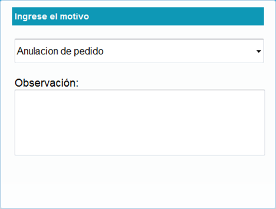

7.	Presionar **“OK”** en el teclado para continuar.

8.	Se mostrarán las formas de pago a anular. Presionando en las formas de pago, se eliminarán y se imprimirá la nota de crédito respectiva (en el caso de tarjeta de banda).
