# MANUAL PARA LA CONFIGURACIÓN DE CREACIÓN Y ACTUALIZACIÓN DE PRODUCTOS DESDE MAXPOINT HACIA SIR

# 
 INTRODUCCIÓN 

 CONFIGURACIÓN CREACIÓN Y ACTUALIZACIÓN DE PRODUCTOS DESDE MAXPOINT HACIA SIR 

**Introducción - **En este manual se detalla la creación y configuración de políticas, procedimientos y funciones para la configuración de “CREACIÓN Y ACTUALIZACIÓN DE PRODUCTOS DESDE MAXPOINT HACIA SIR “

## 1.	CONFIGURACION DE POLÍTICAS

1.	Para ingresar al módulo de **“Administración De Políticas”**, debe dar clic en la opción **“Seguridades”** y en el módulo de **“Políticas”**

2.	 Al dar clic en la opción de   , se desplegará la siguiente pestaña

### 1.2	POLÍTICAS DE CADENA (Selección y Creación de Nueva Colección)
#### 1.2.1 Creación de la Colección
1.	Clic en el ícono **“CADENA”** y luego en el boton de Nueva Colección . 

2.	Al dar click en el boton de la Nueva Colección, se cargar el modal donde registraremos los datos de nuestra nueva collecion. 

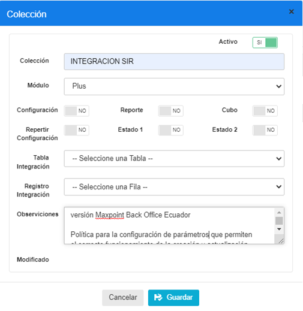

Creamos colección a nivel de cadena con los siguientes datos:

**Nombre de la colección:** INTEGRACION SIR

**Módulo:** Plus

**Observación:** versión Maxpoint Back Office Ecuador 

Politica para la configuración de parametros que permiten el correcto funcionamiento de la creación y actualización de productos. Actualizacion y creacion de los departamentos, clasificaciones y categorias.

3.	En la tabla izquierda de Colecciones buscar la colección previamente creada **“INTEGRACION SIR”**  y la seleccionamos

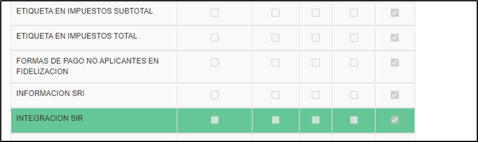

.2. Creación de los Parámetros

*A continuación, se debe crear los siguientes parámetro :  CLIENT ID, CREACION Y ACTUALIZACION PRODUCTOS, ENDPOINT CATEGORIAS, ENDPOINT LOCACIONES, ENDPOINT TOKEN, ENDPOINT DEPARTAMENTOS, PREFIJO PAIS, APLICA INTEGRACION, ID CADENA HOMOLOGA PRODUCTO  y URL BASE.*

Al dar click sobre el icono   , se desplegará una pantalla emergente para crear el parámetro mencionado. Ahora se detallará las configuraciones de los nuevos parametros.

### 1.	PARAMETRO: APLICA INTEGRACION

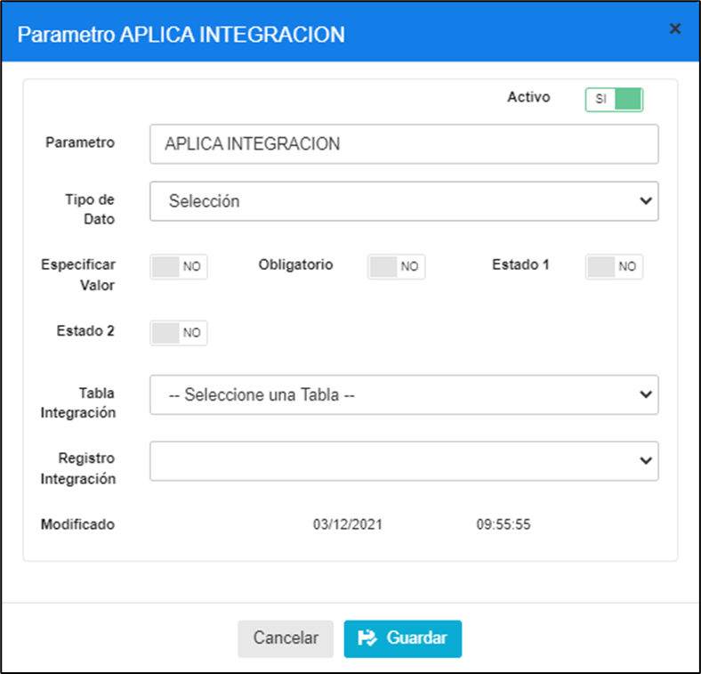

| PARAMETRO          | TIPO DATO   | ESP. VALOR | OBLIGATORIO |
|--------------------|-------------|------------|--------------|
| APLICA INTEGRACION | Selección   | NO         | NO          |

### 2.	PARAMETRO: PREFIJO PAIS

| PARAMETRO          | TIPO DATO   | ESP. VALOR | OBLIGATORIO |
|--------------------|-------------|------------|-------------|
|PREFIJO PAIS        | Caracter    | SI         | SI          |

### 3.	PARAMETRO: CLIENT ID

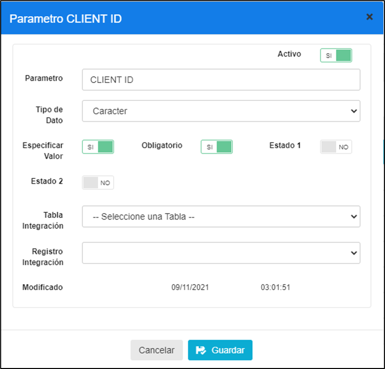

| PARAMETRO          | TIPO DATO   | ESP. VALOR | OBLIGATORIO |
|--------------------|-------------|------------|-------------|
| CLIENT ID          | Caracter    | SI         | SI          |

### 4.	PARAMETRO: CLIENT SECRET

| PARAMETRO          | TIPO DATO   | ESP. VALOR | OBLIGATORIO |
|--------------------|-------------|------------|-------------|
| CLIENT SECRET      | Caracter    | SI         | SI          |

### 5.	PARAMETRO: CREACION Y ACTUALIZACION PRODUCTOS

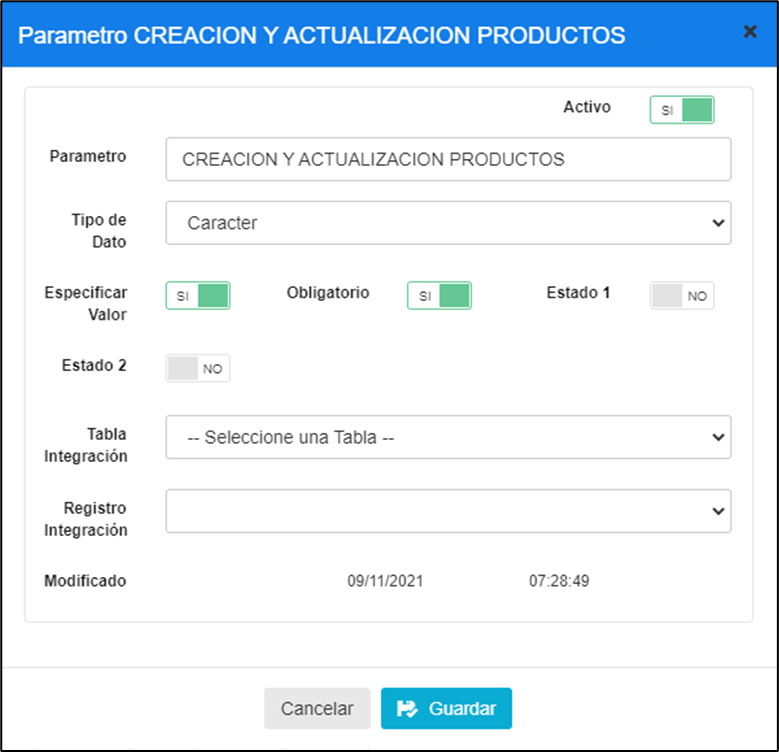

| PARAMETRO          | TIPO DATO   | ESP. VALOR | OBLIGATORIO |
|--------------------|-------------|------------|-------------|
| PARAMETROCREACION Y ACTUALIZACION PRODUCTOS  | Caracter    | SI         | SI          |

### 6.	PARAMETRO: ENDPOINT CATEGORIAS

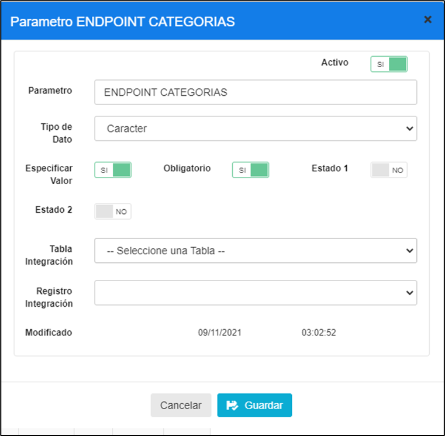

| PARAMETRO          | TIPO DATO   | ESP. VALOR | OBLIGATORIO |
|--------------------|-------------|------------|-------------|
| CENDPOINT CATEGORIAS | Caracter    | SI         | SI          |

### 7.	PARAMETRO: ENDPOINT LOCACIONES

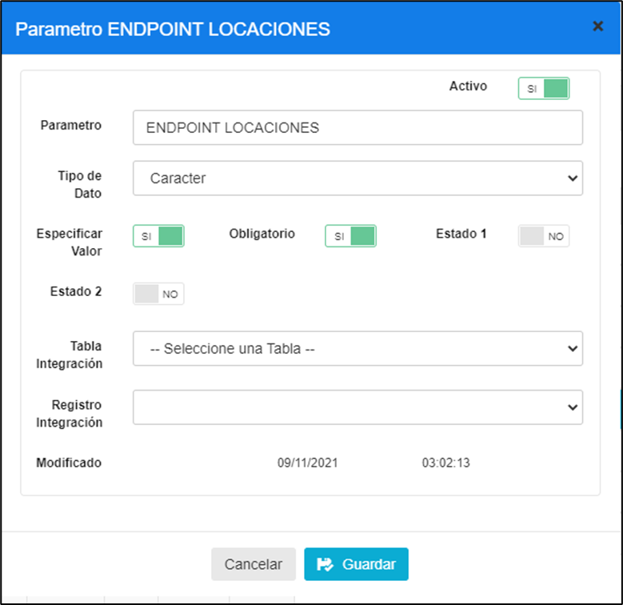

| PARAMETRO          | TIPO DATO   | ESP. VALOR | OBLIGATORIO |
|--------------------|-------------|------------|-------------|
| ENDPOINT LOCACIONES | Caracter    | SI         | SI          |

### 8.	PARAMETRO: ENDPOINT TOKEN

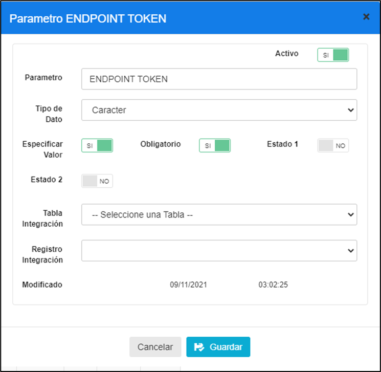

| PARAMETRO          | TIPO DATO   | ESP. VALOR | OBLIGATORIO |
|--------------------|-------------|------------|-------------|
| ENDPOINT TOKEN     | Caracter    | SI         | SI          |

### 9.	PARAMETRO: ENDPOINT DEPARTAMENTOS

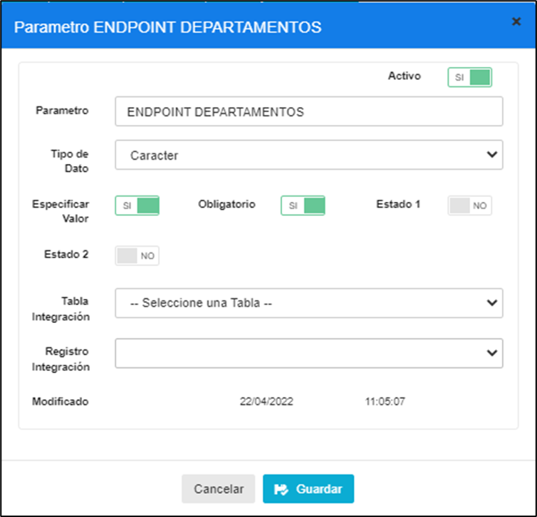

| PARAMETRO          | TIPO DATO   | ESP. VALOR | OBLIGATORIO |
|--------------------|-------------|------------|-------------|
| ENDPOINT DEPARTAMENTOS | Caracter    | SI         | SI          |

### 10.	PARAMETRO: URL BASE

| PARAMETRO          | TIPO DATO   | ESP. VALOR | OBLIGATORIO |
|--------------------|-------------|------------|-------------|
| URL BASE           | Caracter    | SI         | SI          |

### 11.	PARAMETRO: ID CADENA HOMOLOGA PRODUCTO

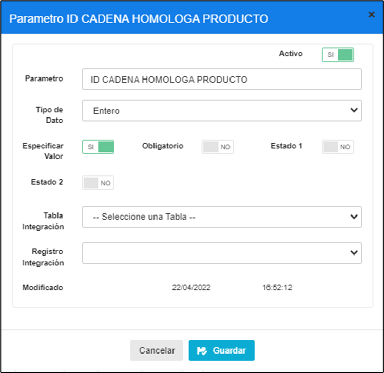

| PARAMETRO          | TIPO DATO   | ESP. VALOR | OBLIGATORIO |
|--------------------|-------------|------------|-------------|
| ID CADENA HOMOLOGA PRODUCTO | Caracter    | SI         | SI          |

## 2. ACTIVACIÓN DE POLÍTICAS
### 2.1 *ACTIVACIÓN DE POLITICAS DE CONFIGURACION POR CADENA*
1.	Para configurar una **política de cadena** es necesario ingresar a la opción Cadena/Cadena, y en esta pantalla a la opción Políticas de Configuración 

2.	Una vez ubicado en la pestaña Políticas de Configuración dar click en el botón “+” en la parte superior derecha de la tabla para añadir los parámetros, IMPORTANTE: repetir este proceso para la COLECCIÓN y sus PARÁMETROS

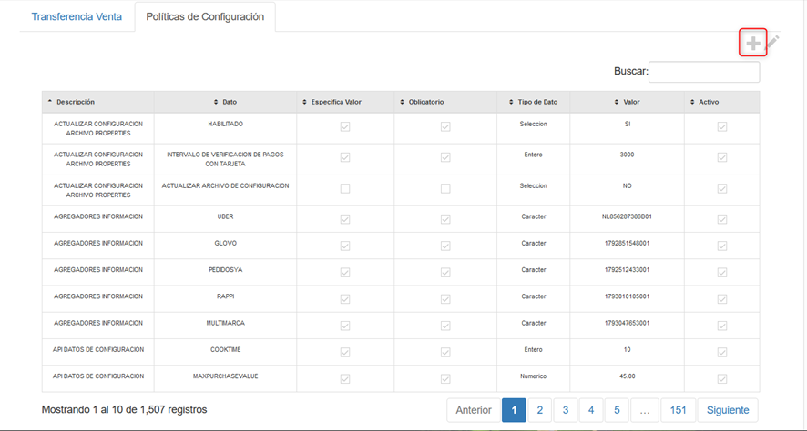

3.	Elegir la Colección **“INTEGRACION SIR”**

3.1  Elegir el Parámetro **“APLICA  INTEGRACION”**

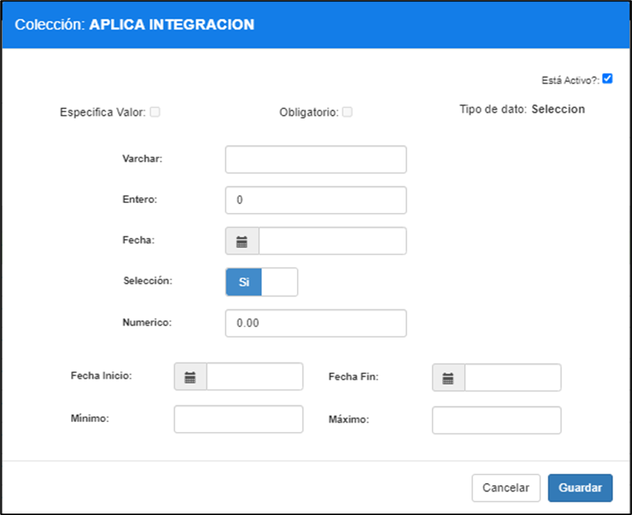

| PARAMETRO          | TIPO DATO   | SELECCION | 
|--------------------|-------------|-----------|
| APLICA INTEGRACION | Seleccion   |      SI   |

 NOTA: Este parámetro nos permite validar si se aplica la integración con SIR(“SI”) o el sistema sigue funcionando solo con la data de MaxPoint(“NO”). 

3.2  Elegir el Parámetro **“PREFIJO PAIS”**

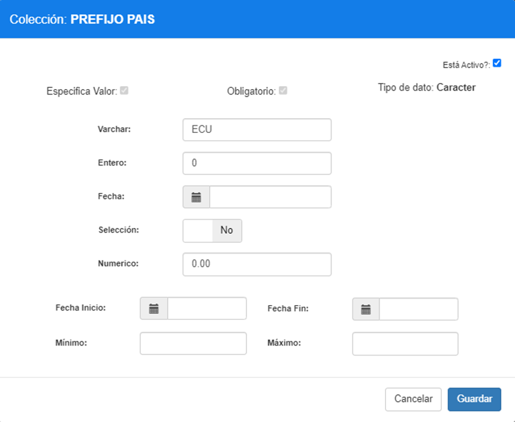

| PARAMETRO     | TIPO DATO | VARCHAR |
|---------------|-----------|---------|
| PREFIJO PAIS  | Caracter  | ECU     |

 NOTA: Poner el prefijo del País al que se aplicara la integración Ejemplo: Ecuador => ECU, Colombia => COL, Chile => CHI, etc 

3.3 Elegir el Parámetro **“CLIENT ID”**

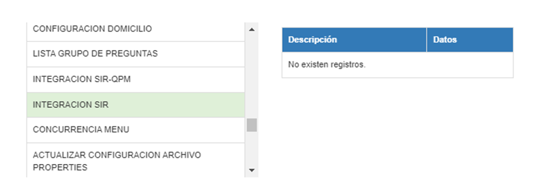

| PARAMETRO     | TIPO DATO | VARCHAR |
|---------------|-----------|---------|
| CLIENT ID     | Caracter  | 1       |

3.4 Elegir el Parámetro **“CLIENT SECRET”**

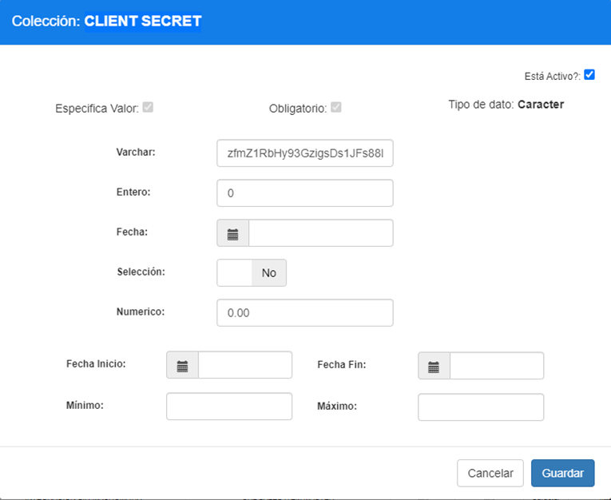

| PARAMETRO     | TIPO DATO | VARCHAR |
|---------------|-----------|---------|
| CLIENT SECRET | Caracter  | zfmZ1RbHy93GzigsDs1JFs88LhG0AEZZ9s8GhYra     |

3.5  Elegir el Parámetro **“URL BASE”**

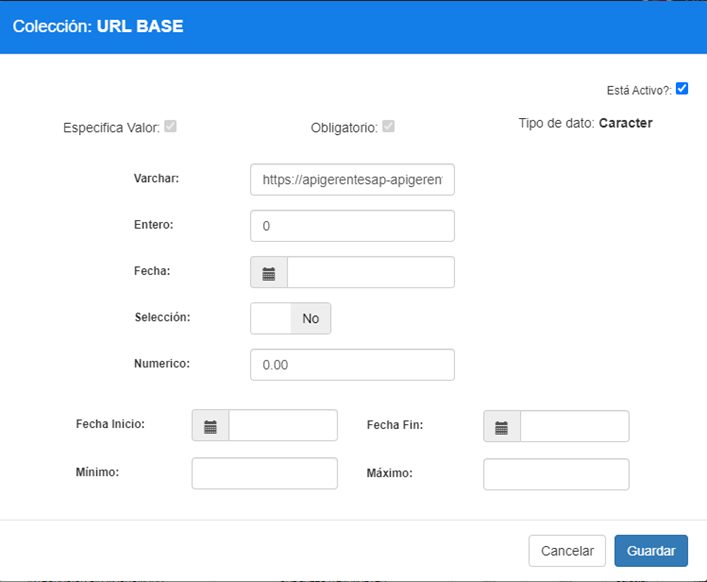

| PARAMETRO     | TIPO DATO | VARCHAR |
|---------------|-----------|---------|
| URL BASE      | Caracter  | https://sirintegration.azurewebsites.net |

3.6 Elegir el Parámetro **“ENDPOINT TOKEN”**

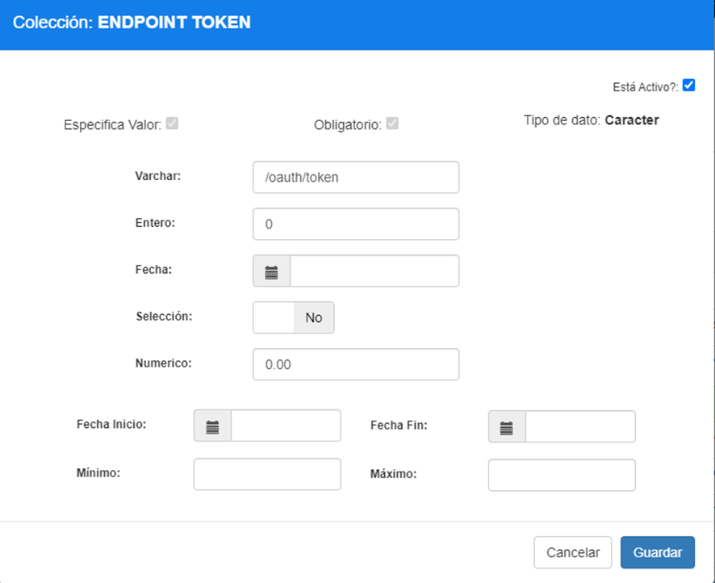

| PARAMETRO     | TIPO DATO | VARCHAR |
|---------------|-----------|---------|
| URL BASE      | Caracter  | /oauth/token |

3.7  Elegir el Parámetro **“ENDPOINT LOCACIONES”**

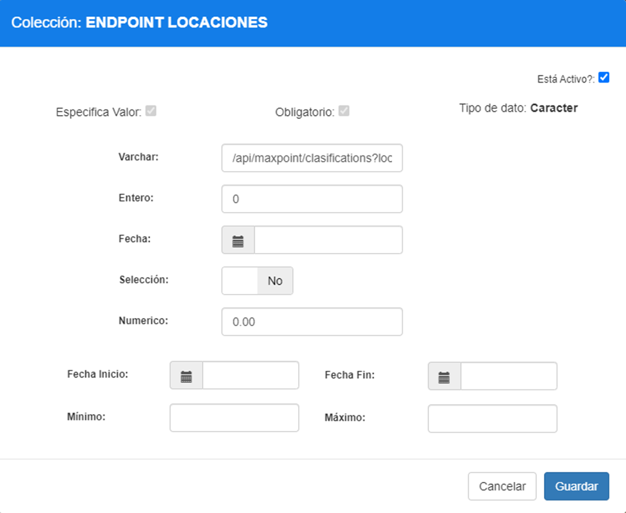

| PARAMETRO     | TIPO DATO | VARCHAR |
|---------------|-----------|---------|
| ENDPOINT LOCACIONES | Caracter  | /api/maxpoint/clasifications?location= |

3.8 Elegir el Parámetro **“ENDPOINT DEPARTAMENTOS”**

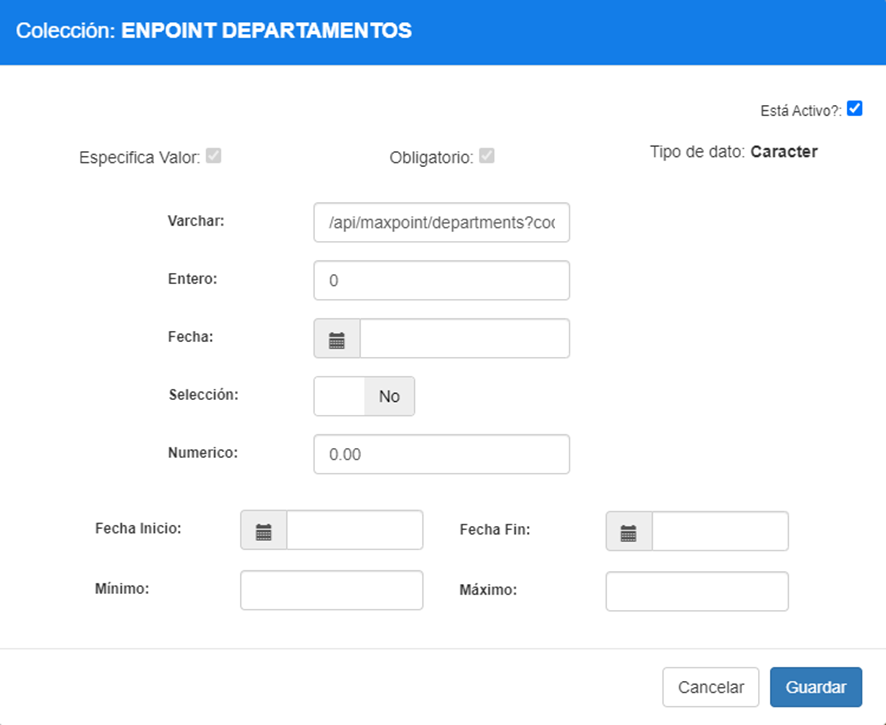

| PARAMETRO     | TIPO DATO | VARCHAR |
|---------------|-----------|---------|
| ENDPOINT LOCACIONES | Caracter  | /api/maxpoint/departments?cod_cadena= |

3.9 Elegir el Parámetro **“ENDPOINT CATEGORIAS”**

| PARAMETRO     | TIPO DATO | VARCHAR |
|---------------|-----------|---------|
| ENDPOINT LOCACIONES | Caracter  | /api/maxpoint/categories?cod_cadena= |

3.10 Elegir el Parámetro **“CREACION Y ACTUALIZACION PRODUCTOS”**

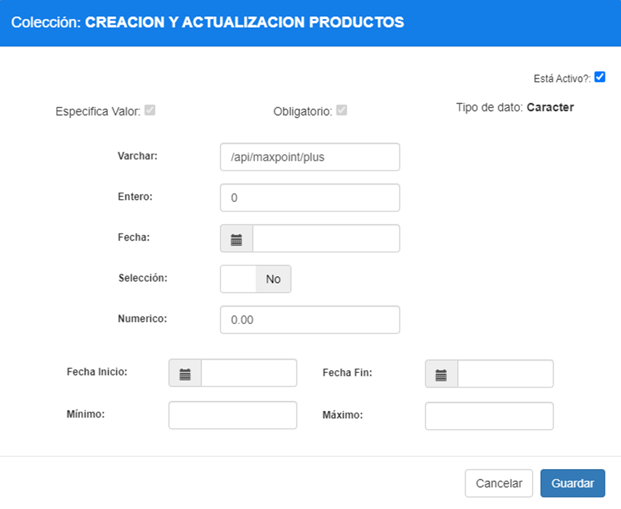

| PARAMETRO     | TIPO DATO | VARCHAR |
|---------------|-----------|---------|
| ENDPOINT LOCACIONES | Caracter  | /api/maxpoint/plus  |

3.11 Elegir el Parámetro **“ID CADENA HOMOLOGA PRODUCTO”**

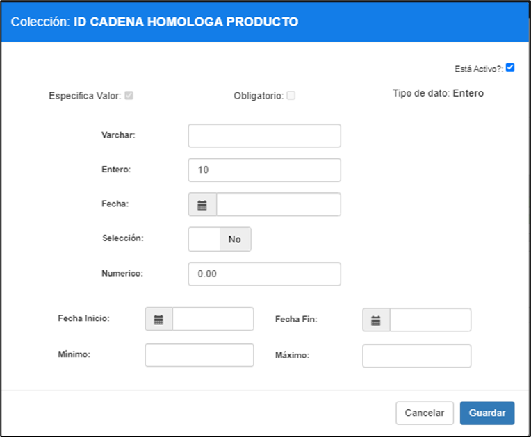

| PARAMETRO     | TIPO DATO | ENTERO  |
|---------------|-----------|---------|
| ENDPOINT LOCACIONES | Caracter  |   |

**OBSERVACIÓN: ESTE PARAMETRO ES OBLIGATORIO PARA LAS CADENAS QUE REALIZAN HOMOLOGACION DE PRODUCTOS HACIA UNA CADENA DESTINO.**

 Nota: este parámetro indica el identificador de la cadena a la cual se le homologara la información del producto a crear. En el ejemplo se homologa a la cadena 10 [KFC] 
