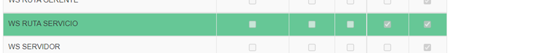
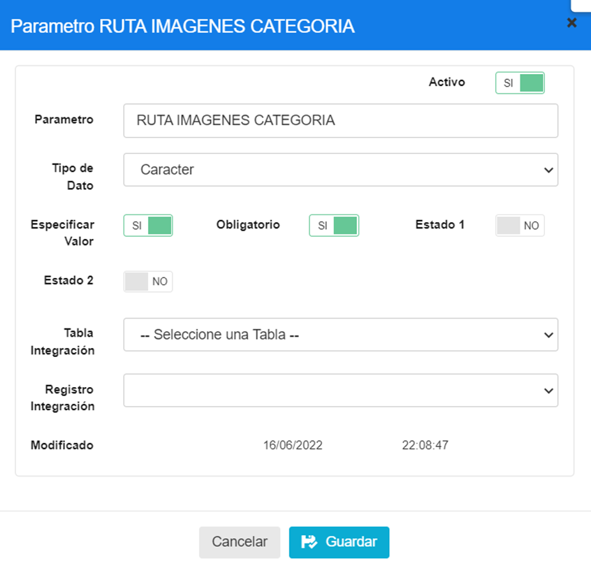
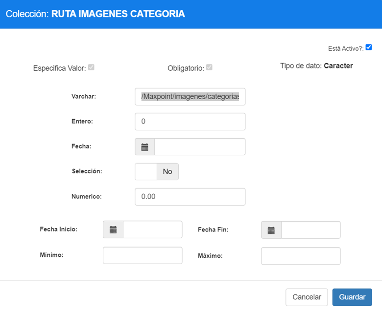
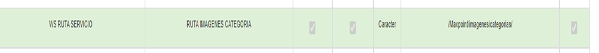

# Manual Política- POLÍTICA PARA FUNCIONALIDAD DE IMÁGENES POR CATEGORÍA

## 1	ANTECEDENTES
Actualmente en el sistema MaxPoint, se tiene la necesidad de guardar imágenes de categorías en un sistema de almacenamiento local para que el proyecto de Api Imágenes de Python detecte ese almacenamiento y se pueda subir al blob storage de azure.

## 2	OBJETIVO GENERAL
Crear y configurar las políticas necesarias para guardar imágenes de categorías de forma local

### 2.1	Objetivos específicos
*  Configurar la política y parámetros a nivel de cadena “RUTA IMAGENES CATEGORIA”

## 3	POLÍTICAS DE CONFIGURACIÓN
### 3.1	Datos Generales
En este manual se detalla cómo realizar la configuración de políticas que permitirán establecer la url para guarda imágenes de categoría de forma local

### 3.2	Pantalla de Políticas
En Azure ingresar al sistema MXP backoffice con credenciales de administrador sistemas y seleccionar la cadena a la cual se realizará las configuraciones.

En el menú que se encuentra en la parte izquierda no dirigimos a la opción **SEGURIDADES** y seleccionamos **POLÍTICAS**, seguidamente presionamos sobre el botón **Ir a Administración Políticas** en el cual abrirá una nueva pestaña en el navegador.

Luego de eso seleccionamos la Colección de Cadena :



Una vez seleccionada se debe CREAR el parámetro :



#### 3.3	Menú
#####  3.3.1	Colección Cadena
Antes de crear las políticas de configuración; como primer paso se debe verificar que no se encuentren creadas, de ser el caso validar que cada colección contenga los parámetros establecidos en este manual. 

En la opción **Cadena** presionar sobre el botón Política de Configuración, se abrirá una modal para su creación ingresando los siguientes datos:

Se debe agregar la política escogiendo el valor de **WS RUTA SERVICIO **Y LUEGO AGREGAR EL PARÁMETRO DE  RUTA IMAGENES CATEGORIA y colocar los siguientes valores en el campo Varchar va para la url siguiente:

 /Maxpoint/imagenes/categorias/

/NombredelproyectoMxP/imágenes/categorías/



Tabla 1. Colección Menú

| N° | Colección               | Descripción                                                                      |
|----|-------------------------|----------------------------------------------------------------------------------|
| 1  | RUTA IMAGENES CATEGORIA | URL PARA GUARDAR IMÁGENES DE FORMA LOCAL ANTES DE SUBIRLAS AL BLOB STORAGE        |

<font color = "yellow"> Nota: NO puede contener espacios en blanco al inicio y final del nombre de la colección; debe ser escrita tal y cual.</font>

Al realizar la configuración de todos los parámetros se debe tener lo siguiente:




```
URL : /pos18/images/categorias/
```
