# MANUAL DE USUARIO POLITICAS CONSULTA Y ACTUALIZACIÓN DE CLIENTES EN API MDM CLIENTES

## 
INTRODUCCIÓN

CONFIGURACIÓN CONSULTA Y ACTUALIZACIÓN DE CLIENTES DESDE MAXPOINT HACIA API MDM CLIENTE

**Introducción -** En este manual se detalla la creación y configuración de políticas, procedimientos y funciones para la configuración de “CONSULTA Y ACTUALIZACIÓN DE CLIENTES DESDE MAXPOINT HACIA API MDM CLIENTE “

### 1.	CONFIGURACION DE POLÍTICAS

1.	Para ingresar al módulo de “Administración De Políticas”, debe dar clic en la opción “Seguridades” y en el módulo de “Políticas”

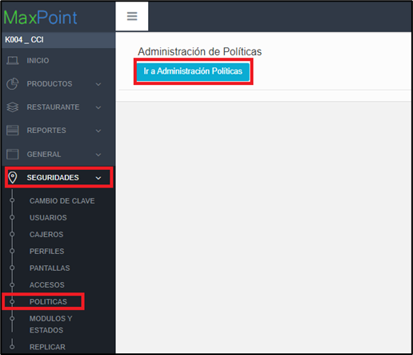

2.	 Al dar clic en la opción de  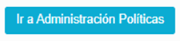 , se desplegará la siguiente pestaña

#### 1.2	POLÍTICAS DE CADENA (Selección y Creación de Nueva Colección)
##### 1.2.1 Creación de la Colección
1.	Clic en el ícono **“CADENA”** y luego en el boton de Nueva Colección 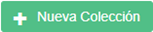. 

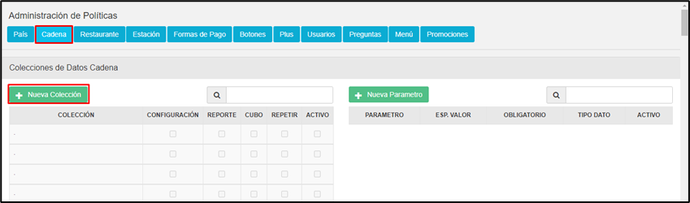

2.	Al dar click en el boton de la Nueva Colección, se cargar el modal donde registraremos los datos de nuestra nueva collecion. 

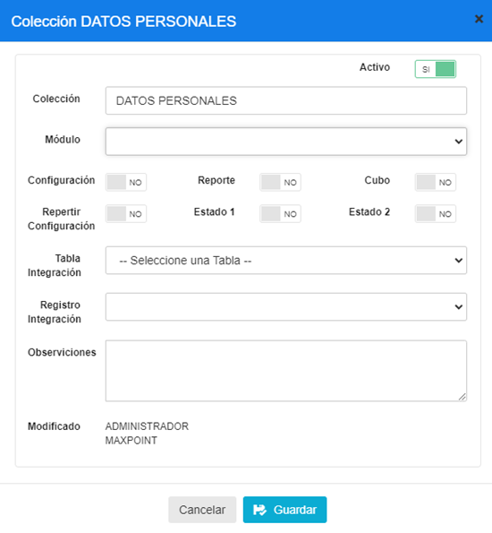

Creamos colección a nivel de cadena con los siguientes datos:

**Nombre de la colección:** DATOS PERSONALES
**Módulo**: 

**Observación**: versión Maxpoint Back Office Ecuador 
Politica para la configuración de parametros que permiten el correcto funcionamiento de la consulta y actualización de clientes y tambien permite agregar el producto que se entrega como beneficio por cadena.

| PARAMETRO | TIPO DATO | ESP. VALOR | OBLIGATORIO |
|-----------|-----------|------------|--------------|
| CANTIDAD  | Entero    | SI         | SI           |

3.	PARAMETRO: PRODUCTO

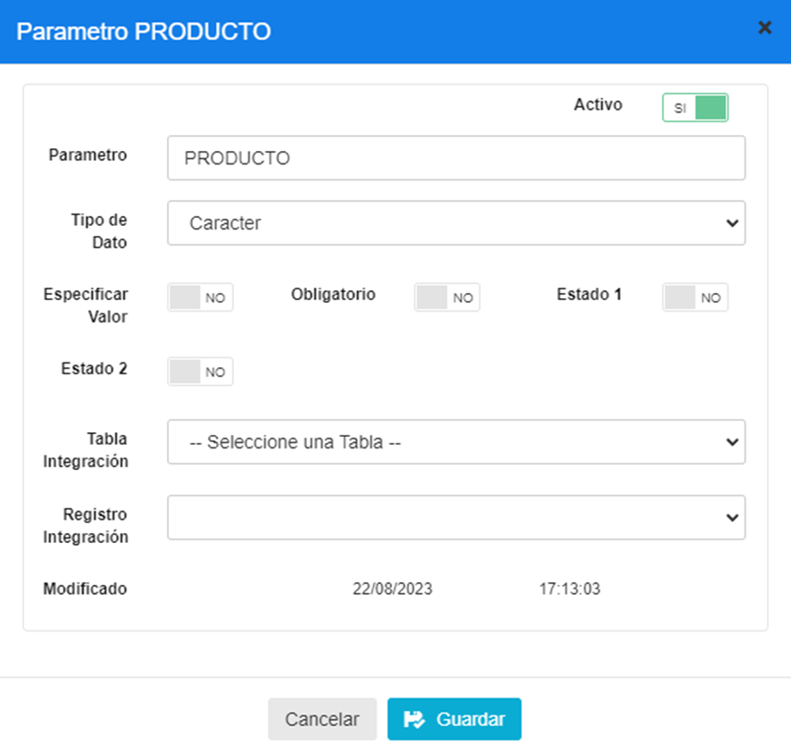

| PARAMETRO | TIPO DATO | ESP. VALOR | OBLIGATORIO |
|-----------|-----------|------------|--------------|
| PRODUCTO  | Caracter  | NO         | NO           |

3.	En la tabla izquierda de Colecciones buscar la colección previamente creada **“DATOS PERSONALES”**  y la seleccionamos

##### 1.2.2. Creación de los Parámetros

A continuación, se debe crear los siguientes parámetro :  BENEFICIO CLIENTE, CANTIDAD, PRODUCTO y URL.

Al dar click sobre el icono   , se desplegará una pantalla emergente para crear el parámetro mencionado. Ahora se detallará las configuraciones de los nuevos parametros.

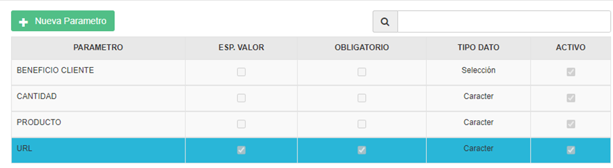

###  1.	PARAMETRO: BENEFICIO CLIENTE

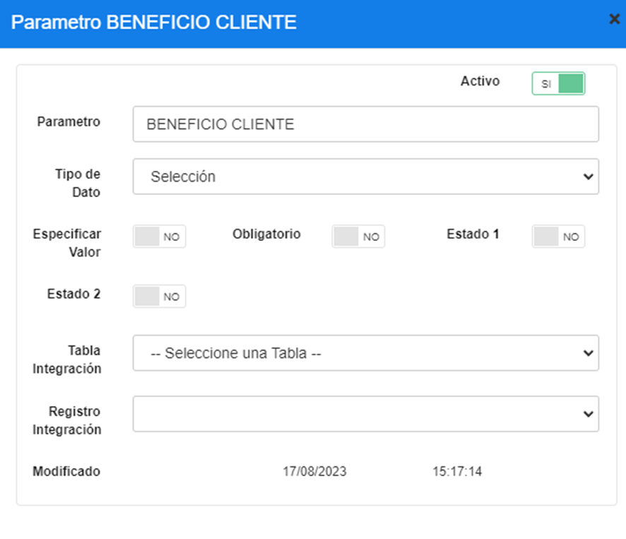

| PARAMETRO         | TIPO DATO | ESP. VALOR | OBLIGATORIO |
|-------------------|-----------|------------|--------------|
| BENEFICIO CLIENTE | Seleccion | NO         | NO           |

### 2.	PARAMETRO: CANTIDAD

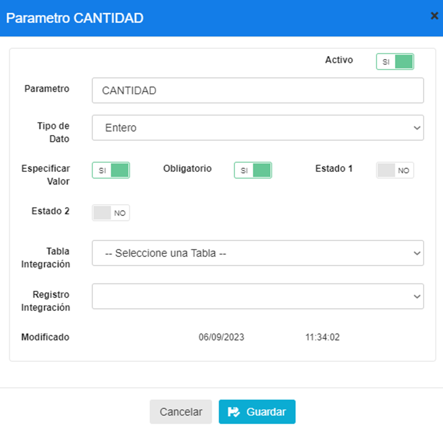

| PARAMETRO         | TIPO DATO | ESP. VALOR | OBLIGATORIO |
|-------------------|-----------|------------|--------------|
| CANTIDAD          | ENTERO    | SI         | SI           |

### 3.	PARAMETRO: PRODUCTO

| PARAMETRO         | TIPO DATO | ESP. VALOR | OBLIGATORIO |
|-------------------|-----------|------------|--------------|
| PRODUCTO          | CARACTER  | NO         | NO           |

### 4.	PARAMETRO: URL

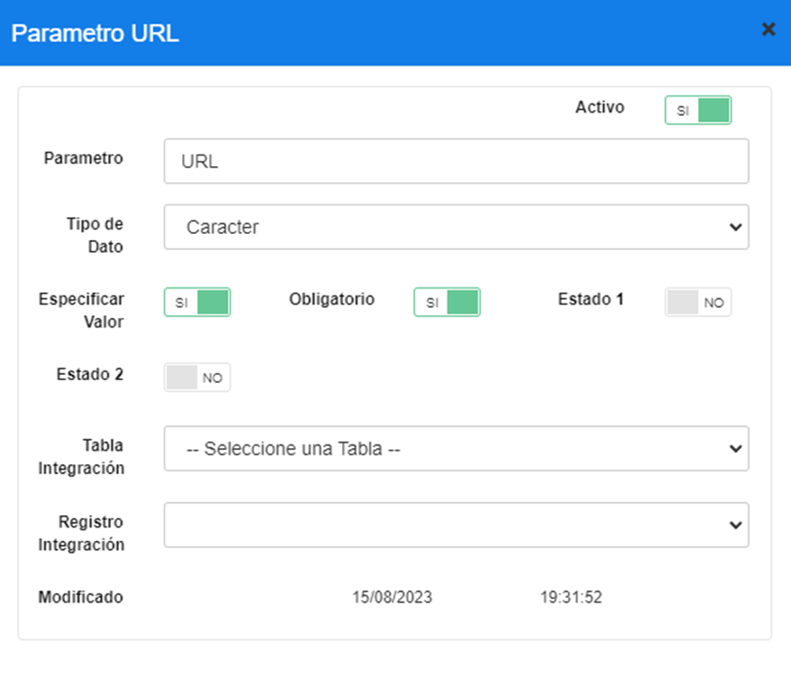

| PARAMETRO         | TIPO DATO | ESP. VALOR | OBLIGATORIO |
|-------------------|-----------|------------|--------------|
| URL               | CARACTER  | SI         | SI           |

## 2. ACTIVACIÓN DE POLÍTICAS
### 2.1	*ACTIVACIÓN DE POLITICAS DE CONFIGURACION POR CADENA*
1.	Para configurar una **política de cadena** es necesario ingresar a la opción Cadena/Cadena, y en esta pantalla a la opción  Políticas de Configuración  

2.	Una vez ubicado en la pestaña Políticas de Configuración dar click en el botón “+” en la parte superior derecha de la tabla para añadir los parámetros, IMPORTANTE: repetir este proceso para la COLECCIÓN y sus PARÁMETROS

3.	Elegir la Colección **“DATOS PERSONALES”**
3.1  Elegir el Parámetro **“BENEFICIO CLIENTE”**.

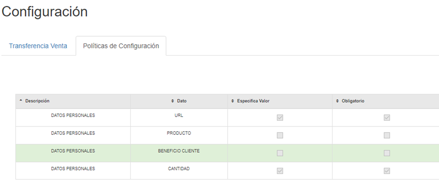

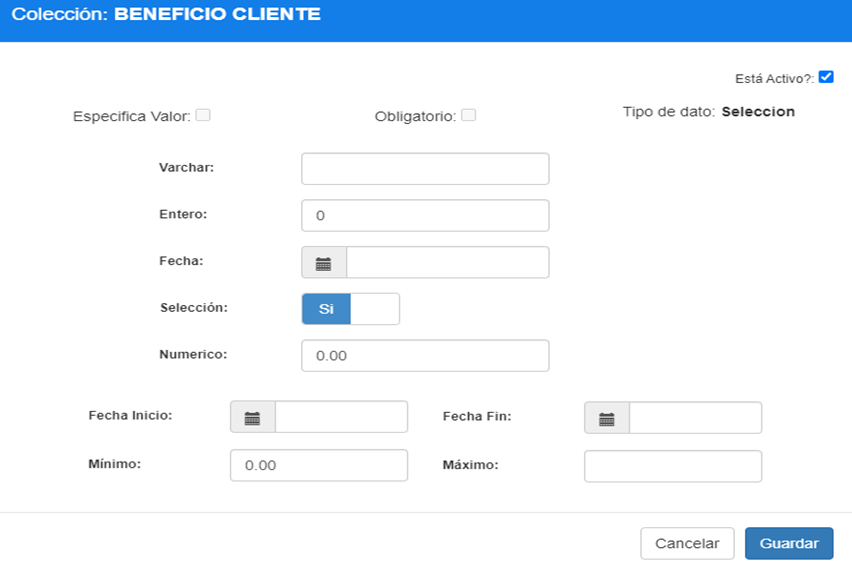

| PARAMETRO        | TIPO DATO  | ESP. VALOR | OBLIGATORIO |
|------------------|------------|------------|--------------|
| BENEFICIO CLIENTE| Seleccion  | SI         | SI           |

 NOTA: Este parámetro nos permite validar si se aplica la integración con API MDM CLIENTE(“SI”) o el sistema sigue funcionando solo con la data de MaxPoint(“NO”). 

3.2  Elegir el Parámetro **“CANTIDAD”** y  presionar en la parte  superior derecha el 
lápiz para editar el parámetro.

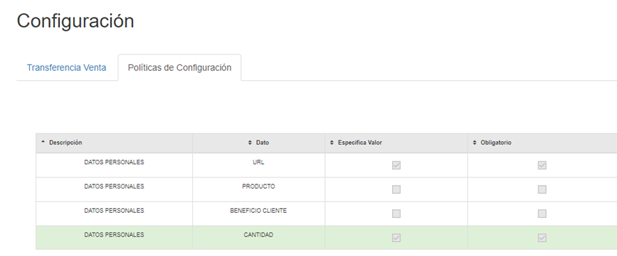

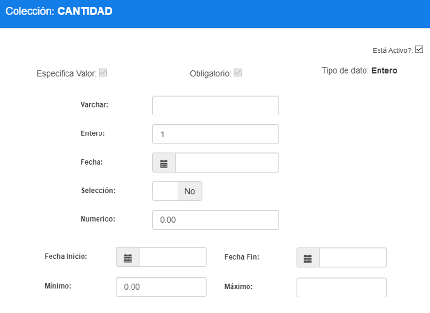

| PARAMETRO | TIPO DATO | ESP. VALOR | OBLIGATORIO |
|-----------|-----------|------------|--------------|
| CANTIDAD  | Entero    | SI         | SI           |

 NOTA: aquí colocar 1 de manera inicial es obligatorio por que es cantidad de beneficios que puede recibir el cliente cuando se agrega el beneficio. 

3.3 Elegir el Parámetro **“PRODUCTO”**

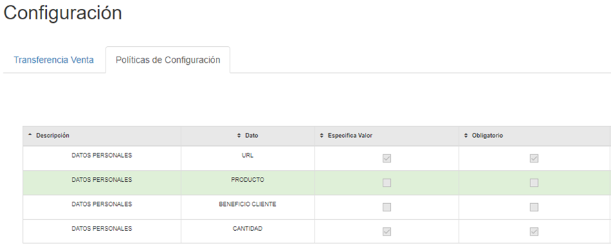

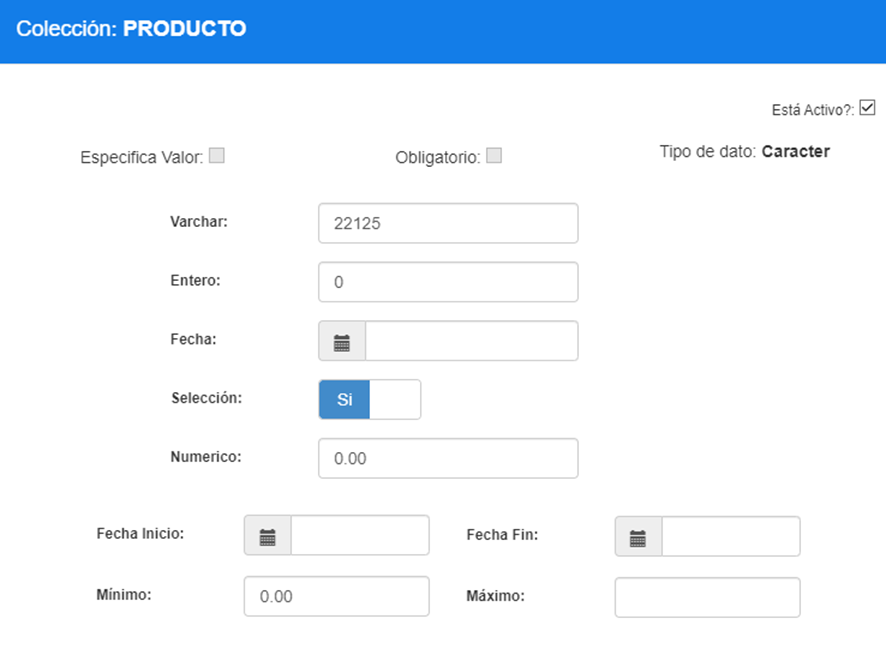

 NOTA: aquí colocar 22125(es un plug_id) de manera inicial es un producto que puede recibir el cliente cuando se agrega el beneficio.  

| PARAMETRO | TIPO DATO | VARCHAR  |
|-----------|-----------|----------|
| PRODUCTO  | CARACTER   | 22125   |  

3.4 Elegir el Parámetro **“URL”**

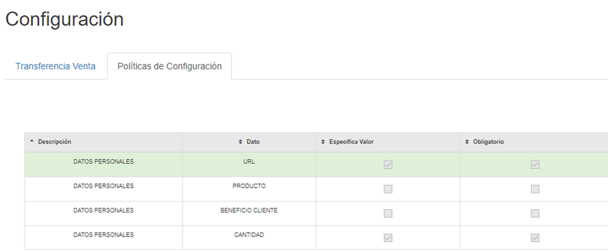

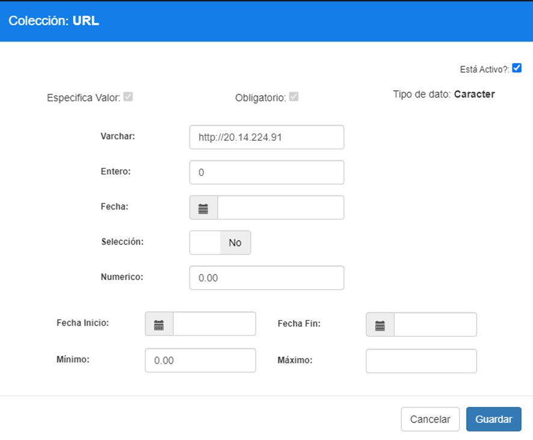

| PARAMETRO | TIPO DATO | VARCHAR             | ESP. VALOR   | OBLIGATORIO |
|-----------|-----------|---------------------|--------------|-------------|
| URL       | Caracter  | http://20.14.224.91 | SI           | SI          |

 Nota: esta URL del API MDM CLIENTE pueda cambiar por que esta es de pruebas. 