# CONFIGURACIÓN DE POLÍTICAS – SEPARACIÓN DE PRESAS

## 1	ANTECEDENTES
Actualmente en el sistema MaxPoint, se tiene la necesidad de realizar una configuración de políticas a nivel cadena, restaurante y plus que habilitar la funcionalidad de separación de presas.

Es una funcionalidad que se implementó para el proveedor QPM y Macromatix que no soporta payloads con descripciones de productos (plu_descripcion) con caracteres especiales como Ñ, ñ, ü y acentos.

Además, a nivel de QPM y Macromatix (AuditoriaVenta y Payloads), se transformaron los plu_id de Original y Crispy de Clasificacion (Salon, Drive, Domicilio y Llevar) a 24660 y 24661 respectivamente.

Nota. - Los restaurantes envían información de las facturas y notas de crédito a QPM, un proveedor de inventario y ventas.

## 2	OBJETIVO GENERAL
Crear y configurar las políticas de cadena, restaurante y plus para habilitar la funcionalidad de separación de presas junto con las relacionadas al proceso para eliminar caracteres especiales de los payloads enviados a QPM y transformar plu_id a nivel de QPM y Macromatix.

### 2.1	Objetivos específicos
* Habilitar y configurar la política “NUMERO DE PRESAS” a nivel de plus para establecer la cantidad total de presas incluidas en el producto seleccionado.

* Habilitar y configurar la política “SEPARACION DE PRESAS” a nivel de cadena y restaurante. 

    o	En caso de estar habilitada y configurada únicamente a nivel de cadena, será esta configuración la que será usada.

    o	En caso de estar habilitada a nivel de cadena y restaurante, será usada la configuración realizada a nivel de restaurante.

## 3	POLÍTICAS DE CONFIGURACIÓN (Conteo de Presas)
### 3.1	Datos Generales
En este manual se detalla cómo realizar la configuración de políticas que permitirán establecer los parámetros a ser utilizados para el uso de la funcionalidad de separación de presas.

### 3.2	Pantalla de Políticas
Se ingresará en sistema MXP BackOffice con credenciales de administrador sistemas y seleccionar la cadena a la cual se realizará las configuraciones.

En el menú que se encuentra en la parte izquierda no dirigimos a la opción **SEGURIDADES** y seleccionamos **POLÍTICAS**, seguidamente presionamos sobre el botón **Ir a Administración Políticas** en el cual abrirá una nueva pestaña en el navegador.

### 3.3	Plus
### 3.3.1	Colección Plus
Antes de crear las políticas de configuración; como primer paso se debe verificar que no se encuentren creadas, de ser el caso validar que cada colección contenga los parámetros establecidos en este manual.

Esta política a nivel de Plus deberá ser configurada en todos los Plus que estén sujetos a separación de presas.

En la opción **Plus** presionar sobre el botón **Nueva Colección**, se abrirá una modal para su creación ingresando los siguientes datos:

Tabla 1. Colección Plus

| N°  | Colección          | Descripción                                                                                      |
|-----|--------------------|--------------------------------------------------------------------------------------------------|
| 1   | NUMERO DE PRESAS   | Colección que permite establecer las configuraciones para el uso de la funcionalidad de separación de presas. |

 Nota: NO puede contener espacios en blanco al inicio y final del nombre de la colección; debe ser escrita tal y como se especifica en la tabla 1. 

**Colección:** Nombre de la colección que se especifica en la tabla 1.

**Módulo:** 

**Observaciones:** Una descripción de la función que realizara dicha colección.

Una vez que se haya ingresado y seleccionado la información establecida procedemos a **Guardar.**

### 3.3.2	Colección de Datos Plus
Antes de agregar los parámetros de configuración, como primer paso se debe verificar que no se encuentren creados, de ser el caso validar que cada parámetro contenga los valores establecidos en este manual.

Una vez creada la colección se debe proceder a crear los parámetros de configuración y para ello seleccionamos la colección y presionamos sobre el botón **Nuevo Parámetro** en la cual se abrirá una venta para su creación e ingresamos los siguientes datos:

Tabla 2. Colección de Datos Plus

### Colección: NUMERO DE PRESAS
| N°  | Parámetro          | Esp. Valor | Obligatorio | Tipo Dato |
|-----|--------------------|------------|-------------|-----------|
| 1   | NUMERO DE PRESAS   | SI         | SI          | Entero    |

 Nota: NO puede contener espacios en blanco al inicio y final del parámetro; deben ser escritos tal y como se especifica en la tabla 2. 

**Parámetro:** Nombre del parámetro que se especifica en la tabla 2.

**Tipo de Dato:** Se especifica en la tabla 2.

**Especifica Valor:** Se especifica en la tabla 2

**Obligatorio:** Se especifica en la tabla 2.

Una vez que se haya ingresado y seleccionado la información establecida procedemos a **Guardar**.

### 3.3.3	Plus Colección de Datos
En el menú nos dirigimos a **Productos** y seleccionamos la opción **Nueva Productos**, buscamos el o los menús a ser configurados y seguidamente seleccionamos la pestaña **Políticas de configuración**.

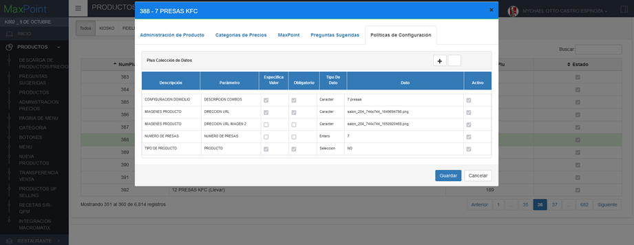

 
Para la configuración se debe presionar sobre el botón agregar “+”; el cual abrirá una ventana, seguidamente buscaremos la colección creada y agregamos el valor en los parámetros solicitados.

### 3.3.4	NUMERO DE PRESAS
En la tabla 3, se especifica los valores que deben ser configurados por cada parámetro colección.

El valor a ingresar dependerá de la cantidad de presas incluidas en el Plu seleccionado (**Ejem**: “10 PRESAS KFC (Salón)” el valor a ingresar es 10), para cada Plu sujeto a separación de presas.

Tabla 3. Valores de los parámetros de colección

### Colección: NUMERO DE PRESAS
| N°  | Parámetro          | Entero                                      |
|-----|--------------------|---------------------------------------------|
| 1   | NUMERO DE PRESAS   | [Agregar el número de presas incluidas en el plu] |

### 3.4	Cadena
### 3.4.1	Colección Cadena
Antes de crear las políticas de configuración; como primer paso se debe verificar que no se encuentren creadas, de ser el caso validar que cada colección contenga los parámetros establecidos en este manual.

Volvemos a la ventana inicial del en MXP BackOffice. En el menú que se encuentra en la parte izquierda no dirigimos a la opción **SEGURIDADES** y seleccionamos **POLÍTICAS**, seguidamente presionamos sobre el botón **Ir a Administración Políticas** en el cual abrirá una nueva pestaña en el navegador.

En la opción **Cadena** presionar sobre el botón **Nueva Colección**, se abrirá una modal para su creación ingresando los siguientes datos:

Tabla 4. Colección Cadena

| N° | Colección          | Descripción                                                                 |
|----|--------------------|-----------------------------------------------------------------------------|
| 1  | SEPARACION DE PRESAS | Colección que permite establecer las configuraciones para el uso de la funcionalidad de separación de presas. |

 Nota: NO puede contener espacios en blanco al inicio y final del nombre de la colección; debe ser escrita tal y como se especifica en la tabla 4. 

### 3.4.2	Colección de Datos Cadena
Antes de agregar los parámetros de configuración, como primer paso se debe verificar que no se encuentren creados, de ser el caso validar que cada parámetro contenga los valores establecidos en este manual.

Una vez creada la colección se debe proceder a crear los parámetros de configuración y para ello seleccionamos la colección y presionamos sobre el botón **Nuevo Parámetro** en la cual se abrirá una venta para su creación e ingresamos los siguientes datos:

Tabla 5. Colección de Datos Cadena

| N° | Colección          | Parámetro | Esp. Valor | Obligatorio | Tipo Dato |
|----|--------------------|-----------|------------|-------------|-----------|
| 1  | SEPARACION DE PRESAS | SEPARADOR | SI         | SI          | Carácter  |

 Nota: NO puede contener espacios en blanco al inicio y final del parámetro; deben ser escritos tal y como se especifica en la tabla 5. 

**Parámetro:** Nombre del parámetro que se especifica en la tabla 5.

**Tipo de Dato:** Se especifica en la tabla 5.

**Especifica Valor:** Se especifica en la tabla 5.

**Obligatorio:** Se especifica en la tabla 5.

Una vez que se haya ingresado y seleccionado la información establecida procedemos a **Guardar**.

### 3.4.3	Cadena Colección de Datos
En el menú nos dirigimos a **Cadena** y seleccionamos la opción **Cadena**. En la nueva ventana, iremos a la pestaña **Políticas de Configuración**.

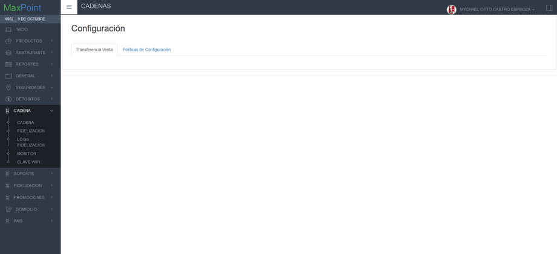

Para la configuración se debe presionar sobre el botón agregar “+”; el cual abrirá una ventana, seguidamente buscaremos la colección creada y agregamos el valor en los parámetros solicitados.

### 3.4.4	SEPARADOR
En la tabla 3, se especifica los valores que deben ser configurados por cada parámetro colección.

El valor a ingresar corresponde tiene como objeto especificar las palabras claves de los plu para la separación de presas y los porcentajes de distribución para la cadena.

 Nota: Cada Cadena puede tener sus propios porcentajes de distribución. A efectos de ejemplo, se coloca en la tabla una distribución a 50/50. 

El valor indicado en “Min” se aplicará al primer separador y el valor “Max” se aplicará al segundo separador.

Tabla 6. Valores de los parámetros de colección

### Colección: SEPARACION DE PRESAS

| N° | Parámetro | Carácter   |
|----|-----------|------------|
| 1  | SEPARADOR | ORIGINAL,CRISPY |

| N° | Parámetro | Decimal (Min y Max) |
|----|-----------|---------------------|
| 1  | SEPARADOR | 0.50                |

### 3.5	Restaurante
### 3.5.1	Colección Restaurante
Antes de crear las políticas de configuración; como primer paso se debe verificar que no se encuentren creadas, de ser el caso validar que cada colección contenga los parámetros establecidos en este manual.

Volvemos a la ventana inicial del en MXP BackOffice. En el menú que se encuentra en la parte izquierda no dirigimos a la opción **SEGURIDADES** y seleccionamos **POLÍTICAS**, seguidamente presionamos sobre el botón **Ir a Administración Políticas** en el cual abrirá una nueva pestaña en el navegador.

En la opción **Restaurante** presionar sobre el botón **Nueva Colección**, se abrirá una modal para su creación ingresando los siguientes datos:

Tabla 7. Colección Restaurante

| N° | Colección          | Descripción                                                                                          |
|----|--------------------|------------------------------------------------------------------------------------------------------|
| 1  | SEPARACION DE PRESAS | Colección que permite establecer las configuraciones para el uso de la funcionalidad de separación de presas. |

 Nota: NO puede contener espacios en blanco al inicio y final del nombre de la colección; debe ser escrita tal y como se especifica en la tabla 7. 

### 3.5.2	Colección de Datos Restaurante
Antes de agregar los parámetros de configuración, como primer paso se debe verificar que no se encuentren creados, de ser el caso validar que cada parámetro contenga los valores establecidos en este manual.

Una vez creada la colección se debe proceder a crear los parámetros de configuración y para ello seleccionamos la colección y presionamos sobre el botón **Nuevo Parámetr**o en la cual se abrirá una venta para su creación e ingresamos los siguientes datos:

Tabla 8. Colección de Datos Restaurante

| N° | Colección           | Parámetro  | Esp. Valor | Obligatorio | Tipo Dato |
|----|---------------------|------------|------------|-------------|-----------|
| 1  | SEPARACION DE PRESAS | SEPARADOR | SI         | SI          | Carácter  |

 Nota: NO puede contener espacios en blanco al inicio y final del parámetro; deben ser escritos tal y como se especifica en la tabla 8. 

**Parámetro:** Nombre del parámetro que se especifica en la tabla 8.

**Tipo de Dato:** Se especifica en la tabla 8.

**Especifica Valor:** Se especifica en la tabla 8.

**Obligatorio:** Se especifica en la tabla 8.

Una vez que se haya ingresado y seleccionado la información establecida procedemos a **Guardar**.

### 3.5.3	Restaurante Colección de Datos

En el menú nos dirigimos a **Restaurante** y seleccionamos la opción **Restaurante**. A continuación, hacemos doble clic en el restaurante a configurar y en la nueva ventana, iremos a la pestaña **Políticas de Configuración**.

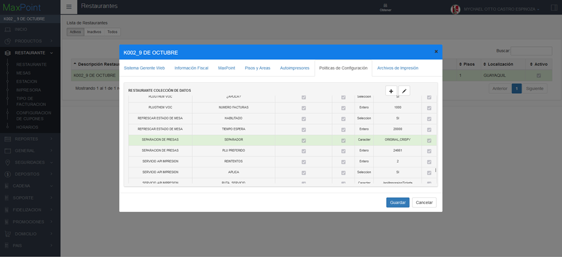

Para la configuración se debe presionar sobre el botón agregar “+”; el cual abrirá una ventana, seguidamente buscaremos la colección creada y agregamos el valor en los parámetros solicitados.

### 3.5.4	SEPARADOR
En la tabla 3, se especifica los valores que deben ser configurados por cada parámetro colección.

El valor a ingresar corresponde tiene como objeto especificar las palabras claves de los plu para la separación de presas.

 Nota: Cada Restaurante puede tener sus propios porcentajes de distribución. A efectos de ejemplo, se coloca en la tabla una distribución a 50/50. 

El valor indicado en “Min” se aplicará al primer separador y el valor “Max” se aplicará al segundo separador.

Tabla 9. Valores de los parámetros de colección

### Colección: SEPARACION DE PRESAS

| N° | Parámetro | Carácter         |
|----|-----------|------------------|
| 1  | SEPARADOR | ORIGINAL,CRISPY  |

| N° | Parámetro | Decimal (Min y Max) |
|----|-----------|---------------------|
|  1 | SEPARADOR | 0.50                |

## 4	POLÍTICAS DE CONFIGURACIÓN (QPM)
### 4.1	Datos Generales
En este manual se detalla cómo crear las políticas y parámetros de estas a nivel de cadena, que permitirán integrarse con la funcionalidad.

### 4.2	Pantalla de Políticas
Ingresar al sistema MaxPoint BackOffice con credenciales de administrador sistemas.

En el menú que se encuentra en la parte izquierda no dirigimos a la opción **SEGURIDADES** y seleccionamos **POLÍTICAS**, seguidamente presionamos sobre el botón **Ir a Administración Políticas** en el cual abrirá una nueva pestaña en el navegador como se muestra en la Figura 1.

Figura 1. *Administración de Políticas Maxpoint*

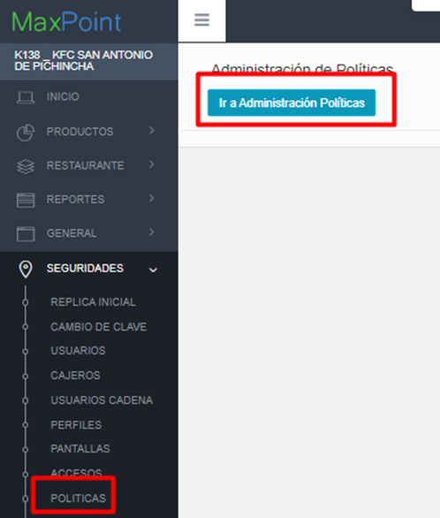

### 4.3	Cadena
### 4.3.1	Colección Cadena “INTEGRACION QPM”
Antes de crear las políticas de configuración; como primer paso se debe verificar si la política **INTEGRACION QPM,** ya se encuentra creada. De ser el caso validar que la colección contenga los parámetros establecidos en este manual.

Si alguna de las políticas NO existe, se debe crearla así:

#### Política INTEGRACION QPM

En la opción **Cadena** presionar sobre el botón **Nueva Colección**, se abrirá una modal para su creación ingresando los siguientes datos:

Tabla 10. Colección de Datos Cadena

| N° | Colección        | Observaciones       |
|----|------------------|---------------------|
| 1  | INTEGRACION QPM  |                     |

 Nota: NO puede contener espacios en blanco al inicio y final del nombre de la colección; debe ser escrita tal y como se especifica en la tabla 10. 

**Colección:** Nombre de la colección que se especifica en la tabla 10.

**Módulo:** No aplica.

**Repetir Configuración:** NO

**Observaciones:** 

Una vez que se haya ingresado y seleccionado la información establecida procedemos a **Guardar** como se muestra en la Figura 2.

Figura 2. *Creación de la política “INTEGRACION QPM”*

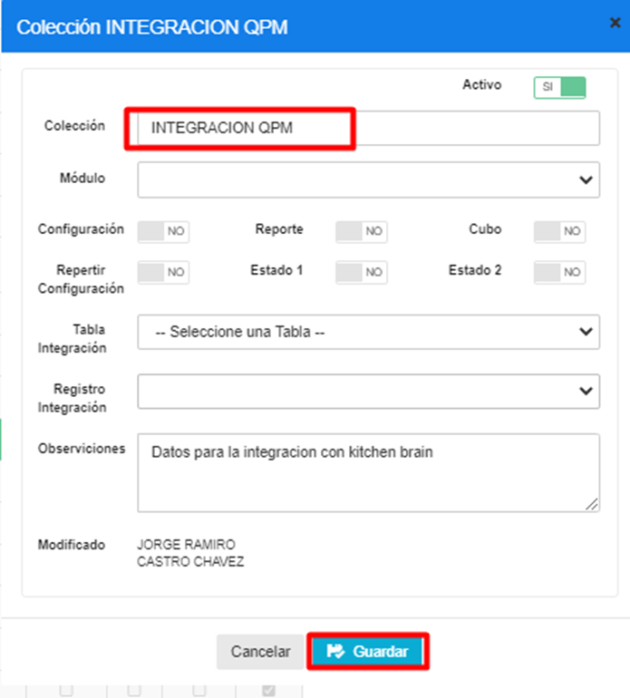

### 4.3.2	Parámetro de Colección (Nuevo)
Antes de agregar los parámetros de configuración mostrados en la tabla 11, se debe verificar si ya encuentren creados. De ser el caso validar que cada parámetro contenga los valores establecidos en este manual.

Si alguno de los parámetros NO existe dentro de la ***Colección*** especificada en la Tabla 11, se debe crearla así:

Seleccionamos la colección y presionamos sobre el botón **Nuevo Parámetro** en la cual se abrirá una venta para su creación y para cada Parámetro ingresamos los siguientes datos:

Tabla 11. Datos Parámetros de Colección de Datos Cadena

| N° | Colección        | Parámetro                   | Tipo Dato | Esp. Valor | Obligatorio | Estado 1 | Estado 2 |
|----|------------------|-----------------------------|-----------|------------|-------------|----------|----------|
| 1  | INTEGRACION QPM  | CARACTERES ADMITIDOS REGEX  | CARACTER  | SI         | SI          | NO       | NO       |

 Nota: NO puede contener espacios en blanco al inicio y final del parámetro; deben ser escritos tal y como se especifica en la tabla 11.

**Parámetro:** Nombre del parámetro que se especifica en la tabla 11.

**Tipo de Dato:** Se especifica en la tabla 11.

**Especificar Valor:** Se especifica en la tabla 11.

**Obligatorio:** Se especifica en la tabla 11.

**Estado 1:** Se especifica en la tabla 11.

**Estado 2:** Se especifica en la tabla 11.

Una vez que se haya ingresado y seleccionado la información establecida procedemos a **Guardar.**

Se deben crear todos los parámetros de configuración establecidos en la tabla 11. Se presentan los modales de configuración de cada parámetro a continuación:

Figura 3. *Creación del parámetro “CARACTERES ADMITIDOS REGEX”*

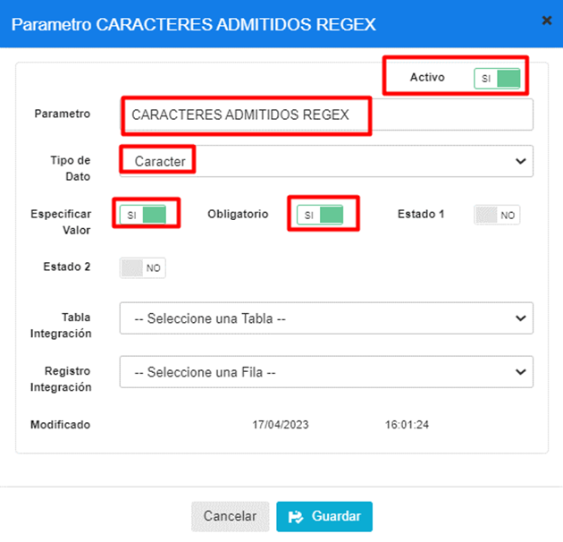

### 4.3.3	Cadena Colección de Datos
En el menú principal del BackOffice de MaxPoint, nos dirigimos a **Cadena** y seleccionamos la opción **CADENA**, seguidamente seleccionamos la pestaña **Políticas de configuración** ver Figura 4. 

Figura 4. *Configuración de valores de los parámetros de las políticas*

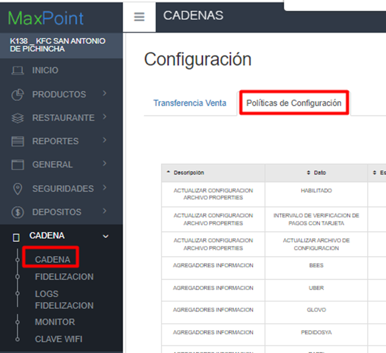

Para la configuración se debe presionar sobre el botón agregar “+”; el cual abrirá una ventana, seguidamente buscaremos la colección creada y agregamos el valor en los parametros solicitados. 

Para cada uno de los parametros como “CARACTERES ADMITIDOS REGEX” y llenar sus valores como se muestra en la tabla 12 a continuación:

Tabla 12. Parámetros de la colección

| N° | Dato                       | Valor        |
|----|----------------------------|--------------|
| 1  | CARACTERES ADMITIDOS REGEX | [a-zA-Z0-9 ] |

Si se ha realizado correctamente, se debe mostrar así ver Figura 5.

Figura 5. *Parámetros y valores de la política INTEGRACION QPM*

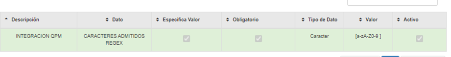

### 4.3.4	Colección Cadena “TRANSFORMACION DE PLUS” (Nuevo)
Antes de crear las políticas de configuración; como primer paso se debe verificar si la política TRANSFORMACION DE PLUS, ya se encuentra creada. De ser el caso validar que la colección contenga los parámetros establecidos en este manual.

Si alguna de las políticas NO existe, se debe crearla así:

### Política TRANSFORMACION DE PLUS

En la opción Cadena presionar sobre el botón Nueva Colección, se abrirá una modal para su creación ingresando los siguientes datos:

Tabla 13. Colección de Datos Cadena

| N° | Colección                | Observaciones             |
|----|--------------------------|---------------------------|
| 1  | TRANSFORMACION DE PLUS   |                            |

 Nota: NO puede contener espacios en blanco al inicio y final del nombre de la colección; debe ser escrita tal y como se especifica en la Tabla 13. 

**Colección:** Nombre de la colección que se especifica en la Tabla 13.

**Módulo:** No aplica.

**Repetir Configuración**: NO

**Observaciones:** 

Una vez que se haya ingresado y seleccionado la información establecida procedemos a **Guardar** como se muestra en la Figura 6.

Figura 6. *Creación de la política “TRANSFORMACION DE PLUS”*

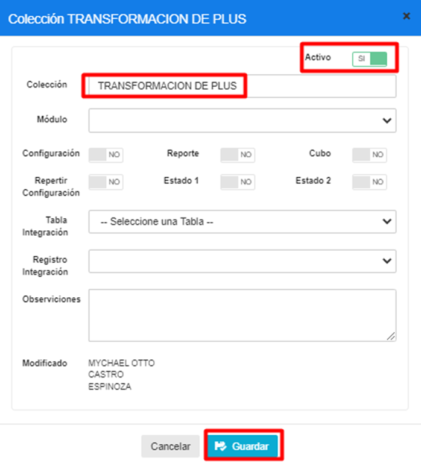

### 4.3.5	Parámetro de Colección 
Antes de agregar los parámetros de configuración mostrados en la tabla 14, se debe verificar si ya encuentren creados. De ser el caso validar que cada parámetro contenga los valores establecidos en este manual.

Si alguno de los parámetros NO existe dentro de la Colección especificada en la Tabla 14, se debe crearla así:

Seleccionamos la colección y presionamos sobre el botón Nuevo Parámetro en la cual se abrirá una venta para su creación y para cada Parámetro ingresamos los siguientes datos:

Tabla 14. Datos Parámetros de Colección de Datos Cadena

| N° | Colección               | Parámetro | Tipo Dato | Esp. Valor | Obligatorio | Estado 1 | Estado 2 |
|----|-------------------------|-----------|-----------|------------|-------------|----------|----------|
| 1  | TRANSFORMACION DE PLUS  | ORIGINAL  | ENTERO    | SI         | SI          | NO       | NO       |
| 2  | TRANSFORMACION DE PLUS  | CRISPY    | ENTERO    | SI         | SI          | NO       | NO       |

 Nota: NO puede contener espacios en blanco al inicio y final del parámetro; deben ser escritos tal y como se especifica en la tabla 14. 

**Parámetro:** Nombre del parámetro que se especifica en la tabla 14.

**Tipo de Dato:** Se especifica en la tabla 14.

**Especificar Valor**: Se especifica en la tabla 14.

**Obligatorio:** Se especifica en la tabla 14.

**Estado 1:** Se especifica en la tabla 14.

**Estado 2:** Se especifica en la tabla 14.

Una vez que se haya ingresado y seleccionado la información establecida procedemos a **Guardar**.

Se deben crear todos los parámetros de configuración establecidos en la tabla 14. Se presentan los modales de configuración de cada parámetro a continuación:

Figura 7. *Creación del parámetro “CRISPY”*

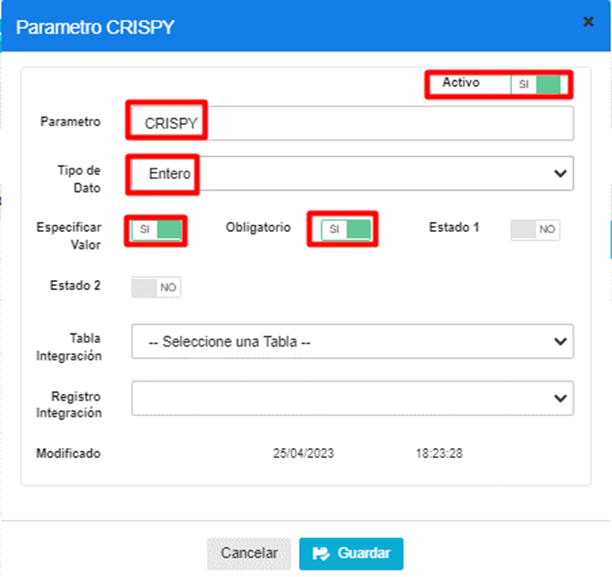

Figura 8. *Creación del parámetro “ORIGINAL”*

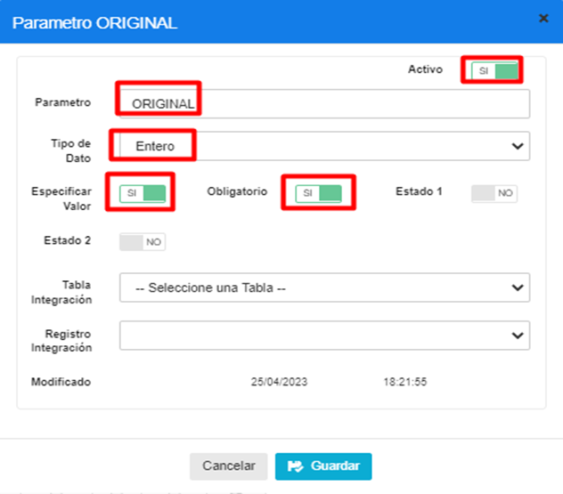

### 4.3.6	Cadena Colección de Datos
En el menú principal del BackOffice de MaxPoint, nos dirigimos a **Cadena** y seleccionamos la opción **CADENA**, seguidamente seleccionamos la pestaña **Políticas de configuración** ver Figura 9. 

Figura 9.  Configuración de valores de los parámetros de las políticas

Para la configuración se debe presionar sobre el botón agregar “+”; el cual abrirá una ventana, seguidamente buscaremos la colección creada y agregamos el valor en los parametros solicitados. 

Para cada uno de los parametros como “ORIGINAL” y llenar sus valores como se muestra en la tabla 15 a continuación:

Tabla 15. Parámetros de la colección

| N° | Dato      | Valor |
|----|-----------|-------|
| 1  | ORIGINAL  | 24660 |
| 2  | CRISPY    | 24661 |

Si se ha realizado correctamente, se debe mostrar así ver Figura 10.

Figura 10. *Parámetros y valores de la política TRANSFORMACION DE PLUS*

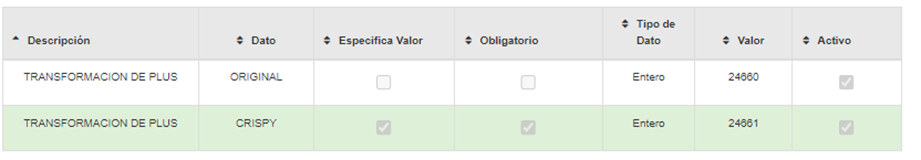

 Nota: Esta configuración de PLUS está estandarizada para Ecuador con los plu_id utilizados en este país, si se requiere trasladar este proceso para otro país tener en cuenta que los plu_id son diferentes y la configuración en los equipos QPM también requeriría cambios. 

### 4.4	Plus
### 4.4.1	Colección Plus “ACTIVAR PARA CONTEO DE PRESAS” (Nuevo)
Antes de crear las políticas de configuración; como primer paso se debe verificar si la política **ACTIVAR PARA CONTEO DE PRESAS**, ya se encuentra creada. De ser el caso validar que la colección contenga los parámetros establecidos en este manual.

Si alguna de las políticas NO existe, se debe crearla así:

### Política ACTIVAR PARA CONTEO DE PRESAS

En la opción **Plus** presionar sobre el botón **Nueva Colección**, se abrirá una modal para su creación ingresando los siguientes datos:

Tabla 16. Colección de Datos Plus

| N° | Colección                    | Observaciones                        |
|----|------------------------------|--------------------------------------|
| 1  | ACTIVAR PARA CONTEO DE PRESAS|                                      |

 Nota: NO puede contener espacios en blanco al inicio y final del nombre de la colección; debe ser escrita tal y como se especifica en la tabla 16. 

**Colección:** Nombre de la colección que se especifica en la tabla 16.

**Módulo:** No aplica.

**Configuración:** NO.

**Reporte:** NO

**Cubo:** NO

**Repetir Configuración:** NO

**Estado 1:** NO

**Estado 2:** NO

**Observaciones:** 

Una vez que se haya ingresado y seleccionado la información establecida procedemos a **Guardar** como se muestra en la Figura 11.

Figura 11. *Creación de la política “ACTIVAR PARA CONTEO DE PRESAS”*

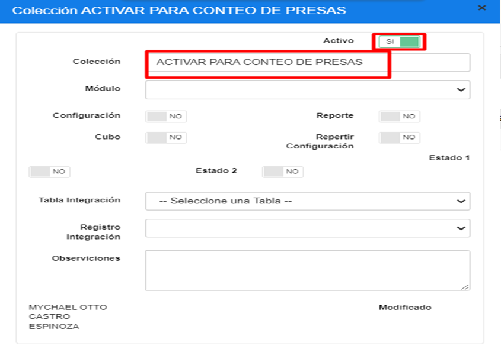

### 4.4.2	Parámetro de Colección 
Antes de agregar los parámetros de configuración mostrados en la tabla 17, se debe verificar si ya encuentren creados. De ser el caso validar que cada parámetro contenga los valores establecidos en este manual.

Si alguno de los parámetros NO existe dentro de la Colección especificada en la Tabla 17, se debe crearla así:

Seleccionamos la colección y presionamos sobre el botón Nuevo Parámetro en la cual se abrirá una venta para su creación y para cada Parámetro ingresamos los siguientes datos:

Tabla 17. Datos Parámetros de Colección de Datos Cadena

| N° | Colección                    | Parámetro       | Tipo Dato | Esp. Valor | Obligatorio | Estado 1 | Estado 2 |
|----|------------------------------|-----------------|-----------|------------|-------------|----------|----------|
| 1  | ACTIVAR PARA CONTEO DE PRESAS| LISTADO PLUS    | CARACTER  | SI         | SI          | NO       | NO       |

 Nota: NO puede contener espacios en blanco al inicio y final del parámetro; deben ser escritos tal y como se especifica en la tabla 17. 

**Parámetro:** Nombre del parámetro que se especifica en la tabla 17.

**Tipo de Dato:** Se especifica en la tabla 17.

**Especificar Valor:** Se especifica en la tabla 17.

**Obligatorio:** Se especifica en la tabla 17.

**Estado 1:** Se especifica en la tabla 17.

**Estado 2:** Se especifica en la tabla 17.

Una vez que se haya ingresado y seleccionado la información establecida procedemos a **Guardar**.

Se deben crear todos los parámetros de configuración establecidos en la tabla 17. Se presentan los modales de configuración de cada parámetro a continuación:

Figura 12. *Creación del parámetro “LISTADO PLUS”*

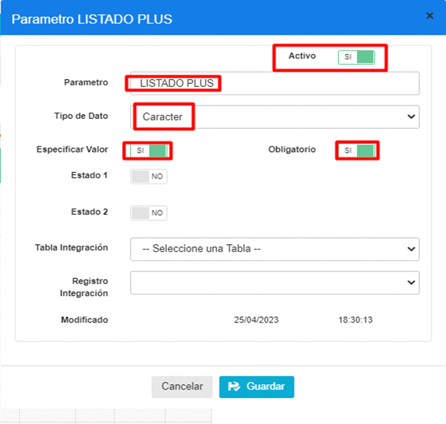

### 4.4.3	Plus Colección de Datos
En el menú principal del BackOffice de MaxPoint, nos dirigimos a **Productos** y seleccionamos la opción **Nueva Productos**, ver Figura 13, acto seguido buscamos los plu que se especifican en la Tabla 18, para configurarlos.

Figura 13.  *Configuración de valores de los parámetros de las políticas*

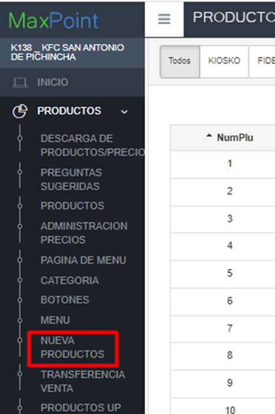

Para la configuración se debe buscar los plus 3763 ORIGINAL (Llevar), 3785 ORIGINAL (Domicilio), 1874 ORIGINAL (Salon), 3903 ORIGINAL (Drive), luego damos doble click sobre el plu, nos dirigimos a la pestaña **“Políticas de Configuración”** presionar sobre el botón agregar “+”; el cual abrirá una ventana, seguidamente buscaremos la colección creada y agregamos el valor en los parametros solicitados. 

Para cada uno de los parametros como “LISTADO PLUS” y llenar sus valores como se muestra en la Tabla 18 a continuación:

Tabla 18. Parámetros de la colección

| N° | Plu  | Dato         | Valor    |
|----|------|--------------|----------|
| 1  | 3763 | LISTADO PLUS | ORIGINAL |
| 2  | 3785 | LISTADO PLUS | ORIGINAL |
| 3  | 1874 | LISTADO PLUS | ORIGINAL |
| 4  | 3903 | LISTADO PLUS | ORIGINAL |
| 5  | 2518 | LISTADO PLUS | CRISPY   |
| 6  | 3764 | LISTADO PLUS | CRISPY   |
| 7  | 3786 | LISTADO PLUS | CRISPY   |
| 8  | 3904 | LISTADO PLUS | CRISPY   |

Si se ha realizado correctamente, se debe mostrar así ver Figura 14.

Nota: Esta configuración de PLUS está estandarizada para Ecuador con los plu_id utilizados en este país, si se requiere trasladar este proceso para otro país tener en cuenta que los plu_id son diferentes y la configuración en los equipos QPM también requeriría cambios.

Figura 14. *Parámetros y valores de la política ACTIVAR PARA CONTEO DE PRESAS*

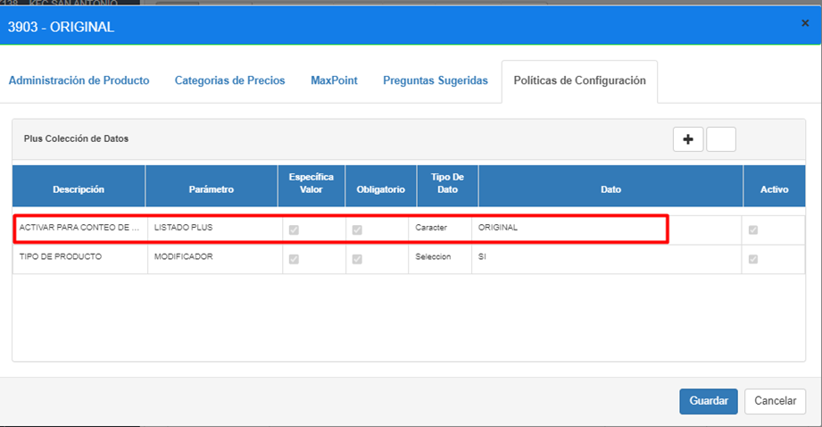

## 5	CONFIGURACIÓN ADICIONAL
En el menú nos dirigimos a **Productos** y seleccionamos la opción **Pregunta Sugerida**. A continuación, debemos verificar que las recetas asociadas a los Plu configurados con la política “NUMERO DE PRESAS”, posean como cantidad mínima y máxima, el valor 1 como se muestra en la siguiente imagen.

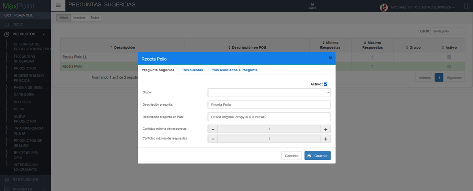

Se requiere verificar que se encuentre activa la política “VISUALIZAR CANTIDAD DE PRODUCTOS CON PRECIO 0”, parámetro “¿VISUALIZAR CANTIDAD?” para la visualización de la selección de las cantidades de presas, tanto en la ventana de pedidos como en el ticket de la orden. A continuación, se detalla el proceso de creación de la política mencionada.

### 5.1	Restaurante
### 5.1.1	Colección Restaurante
Antes de crear las políticas de configuración; como primer paso se debe verificar que no se encuentren creadas, de ser el caso validar que cada colección contenga los parámetros establecidos en este manual.

Volvemos a la ventana inicial del en MXP BackOffice. En el menú que se encuentra en la parte izquierda no dirigimos a la opción **SEGURIDADES** y seleccionamos **POLÍTICAS**, seguidamente presionamos sobre el botón **Ir a Administración Políticas** en el cual abrirá una nueva pestaña en el navegador.

En la opción **Restaurante** presionar sobre el botón **Nueva Colección**, se abrirá una modal para su creación ingresando los siguientes datos:

Tabla 19. Colección Restaurante

| N° | Colección                                            | Descripción                                                                                                 |
|----|------------------------------------------------------|-------------------------------------------------------------------------------------------------------------|
| 1  | VISUALIZAR CANTIDAD DE PRODUCTOS CON PRECIO 0        | Colección que permite visualizar los ítems con valor 0 en la ventana de orden pedido y en el ticket de la orden. |

 Nota: NO puede contener espacios en blanco al inicio y final del nombre de la colección; debe ser escrita tal y como se especifica en la tabla 19. 

### 5.1.2	Colección de Datos Restaurante
Antes de agregar los parámetros de configuración, como primer paso se debe verificar que no se encuentren creados, de ser el caso validar que cada parámetro contenga los valores establecidos en este manual.

Una vez creada la colección se debe proceder a crear los parámetros de configuración y para ello seleccionamos la colección y presionamos sobre el botón **Nuevo Parámetro** en la cual se abrirá una venta para su creación e ingresamos los siguientes datos:

Tabla 20. Colección de Datos Restaurante

| N° | Colección                                           | Parámetro                     | Esp. Valor         | Obligatorio | Tipo Dato |
|----|-----------------------------------------------------|-------------------------------|--------------------|-------------|-----------|
| 1  | VISUALIZAR CANTIDAD DE PRODUCTOS CON PRECIO 0       | ¿VISUALIZAR CANTIDAD?        | SI                 | SI          | Entero    |

 Nota: NO puede contener espacios en blanco al inicio y final del parámetro; deben ser escritos tal y como se especifica en la tabla 20. 

**Parámetro:** Nombre del parámetro que se especifica en la tabla 20.

**Tipo de Dato:** Se especifica en la tabla 20.

**Especifica Valor:** Se especifica en la tabla 20.

**Obligatorio:** Se especifica en la tabla 20.

Una vez que se haya ingresado y seleccionado la información establecida procedemos a **Guardar**.

### 5.1.3	Restaurante Colección de Datos
En el menú nos dirigimos a **Restaurante** y seleccionamos la opción **Restaurante**. A continuación, hacemos doble clic en el restaurante a configurar y en la nueva ventana, iremos a la pestaña **Políticas de Configuración**.

Para la configuración se debe presionar sobre el botón agregar “+”; el cual abrirá una ventana, seguidamente buscaremos la colección creada y agregamos el valor en los parámetros solicitados.

### 5.1.4	¿VISUALIZAR CANTIDAD?
El valor a ingresar corresponde tiene como objeto especificar true o false para mostrar o no el ítem (1 para true, 0 para false).

Tabla 21. Valores de los parámetros de colección

### Colección: VISUALIZAR CANTIDAD DE PRODUCTOS CON PRECIO 0

| N° | Parámetro              | Entero |
|----|------------------------|--------|
| 1  | ¿VISUALIZAR CANTIDAD? | 1      |
