# Manual - Productos al Peso MP V1.8

## 1 ANTECEDENTES 
En el sistema MAXPOINT actualmente se puede leer productos a través de un código de barras,  previamente configurados como productos al peso, en dicho código de barras viene ya establecida 
la cantidad y precio. 

En ciertas tiendas tienen la necesidad de vender productos al peso a cualquier producto, así como también poder digitar su cantidad en gramos.   

## 2 OBJETIVOS 
✔ Lectura de productos al peso mediante código de barras. 

## 3 Procedimiento 
### 3.1 Datos Generales 
En este manual se detalla cómo realizar la configuración para aplicar productos al peso: 

✔ Crear una política a nivel de Plus. 

✔ La política debe ser llamada **PRODUCTOS AL PESO.**  

✔ El parámetro de dicha política debe ser llamado **¿Es Producto al Peso?** 

✔ Tipo de dato: **Selección** 

✔ Especifica valor: **SI** 

✔ Obligatorio: **SI**   

✔ Atar la colección a los productos deseados.

 Nota: *Esta configuración se la debe realizar en Azure y luego replicar hacia la tienda.* 

### 3.2 Colección Productos al Peso. 
Ingresar al sistema MAXPOINT BackOffice con credenciales de administrador y seleccionar 
la cadena a la cual pertenece el restaurante a configurar. 

Antes de configurar la colección **PRODUCTOS AL PESO** al plu, debemos verificar que dicha colección este creada, para ello en el menú que se encuentra en la parte izquierda no digerimos a la opción **SEGURIDADES** y seleccionamos **POLÍTICAS,** seguidamente presionamos sobre el botón **Ir a Administración Políticas** en el cual abrirá una nueva pestaña en el navegador. 

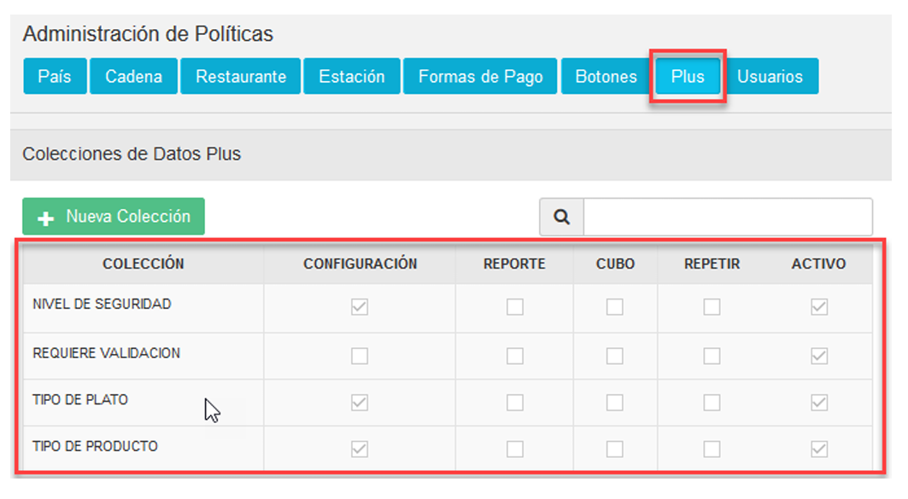

### 3.2.1 Creación de Colección 
En la opción **Plus** presionar sobre el botón **Nueva Colección** en la cual se abrirá una modal para su creación. 

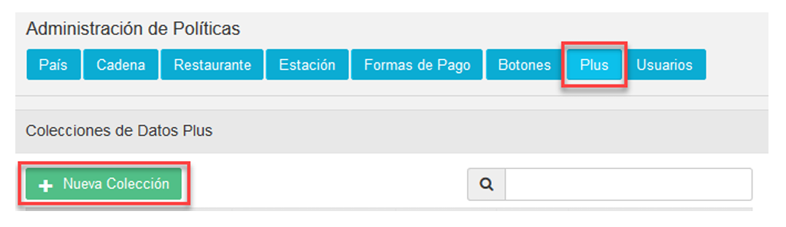

Para la creación de la colección se debe ingresar los siguientes datos: 

**Nombre Colección**: PRODUCTOS AL PESO 

**Módulo**: Plus 

**Observaciones**: Una descripción de la función que realizara dicha colección. 

Una vez que se haya ingresado y seleccionado la información establecida procedemos a 
**Guardar.**

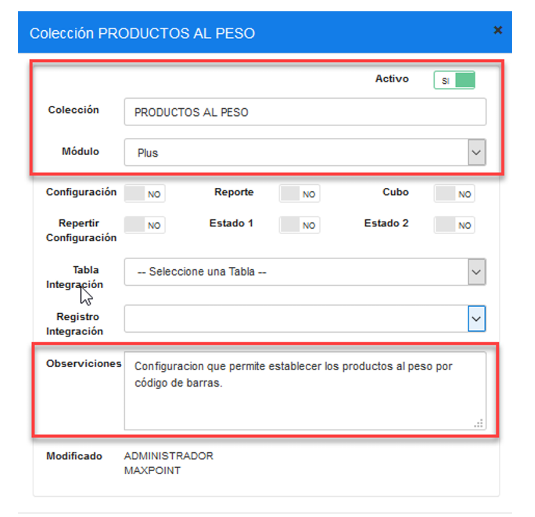

### 3.2.2 Creación Parámetro de Colección 

Una vez creada la colección se debe proceder a crear los parámetros de configuración a 
continuación se detallan el tipo de parámetro a ser creado: 

1. ¿Es Producto al Peso?  
Para ello seleccionamos la colección que hemos creamos y presionamos sobre el botón 
**Nuevo Parámetro** (derecha), en la cual se abrirá una modal para su creación. 

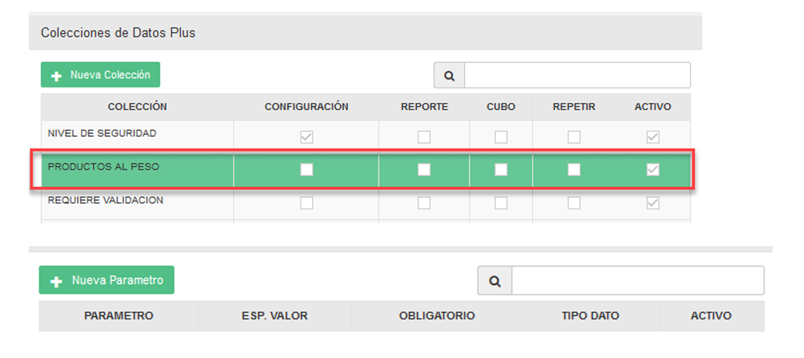

**¿Es Producto al Peso?** Este parámetro permitirá validar si el plu es un producto 
configurado al peso. 

Para la creación del parámetro de configuración se debe ingresar los siguientes datos: 

**Parámetro:** ¿Es Producto al Peso? 

**Tipo de Dato:** Selección. 

**Especifica Valor:** SI 

**Obligatorio:** SI 

Una vez que se haya ingresado y seleccionado la información establecida procedemos a 
**Guardar**. 

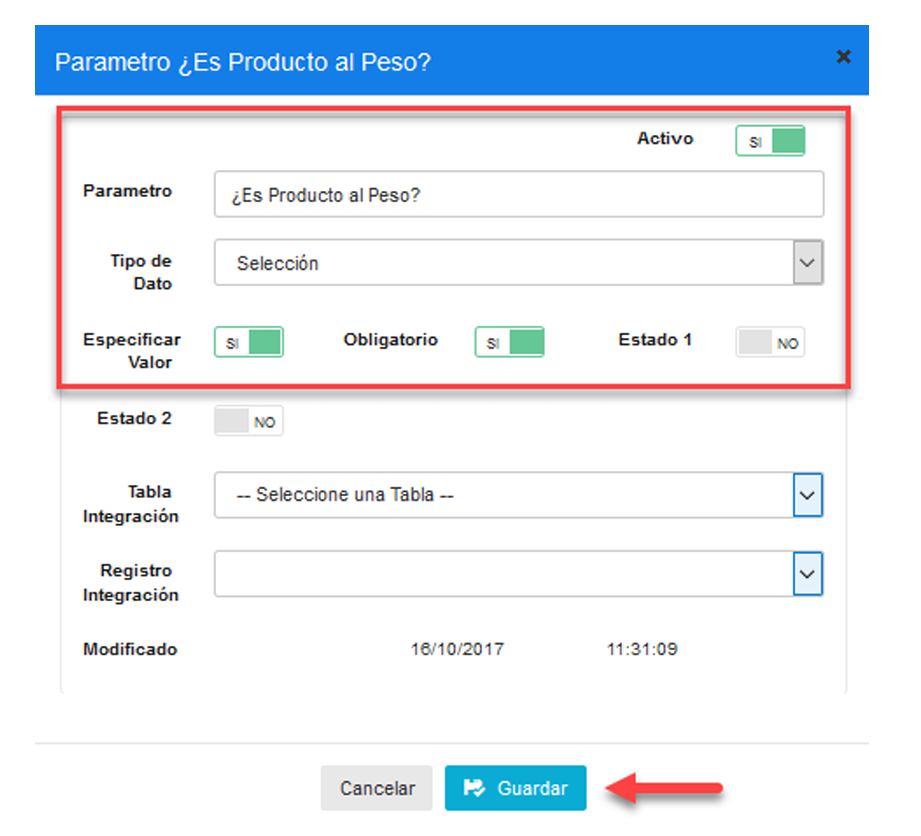

Una vez creado los parámetros necesarios de configuración se debe tener lo siguiente:

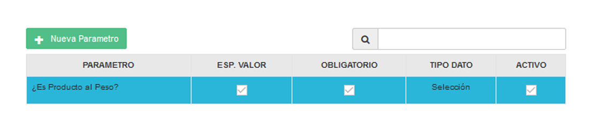

### 3.3 Configuración de Plus 
Una vez que se verifico que exista o se creó la colección PRODUCTOS AL PESO procedemos a realizar la configuración al plus que se deseen. 

Nota: Los productos a ser configurados no deben tener preguntas sugeridas.

Existen tres tipos de escenarios para la configuración que son: 

1. Productos al peso por código de barras mediante configuración de colección. 

2. Otros productos al peso por código de barras. 

3. Productos por código de barras. 

**Productos al peso por código de barras mediante configuración de colección. -** En esta 
opción es necesaria la configuración de la colección PRODUCTOS AL PESO, consiste en la 
lectura de un producto al peso mediante un código de barras, en el cual su cantidad 
(gramos) y su precio viene ya establecido en la etiqueta del código de barras de dicho 
producto. 

No debe estar configurado el código de barras al producto. 

**Otros productos al peso por código de barras. -** En esta opción no es necesaria la 
configuración de la colección PRODUCTOS AL PESO, consiste en la lectura de un producto 
al peso mediante un código de barras, en el cual su cantidad es ingresada en gramos 
manualmente y en unidades manual o automáticamente. 

 Es necesario que el código de barras este configurado en el producto. 

**Productos por código de barras. -** Consiste en la lectura de un producto mediante un 
código de barras, en el cual su cantidad es por unidad.  

 Es necesario que el código de barras este configurado en el producto. 

A continuación, un ejemplo: 

En el menú nos dirigimos a **PRODUCTOS** y seleccionamos la opción **NUEVA PRODUCTOS**, 
seguidamente buscamos y seleccionamos el plu al cual se realizará la configuración. 

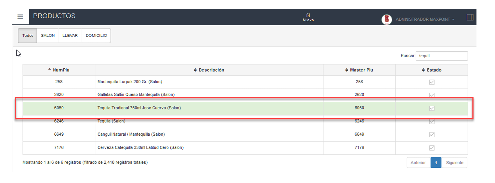

### 3.3.1 Productos al peso por código de barras mediante configuración de colección 

Con un doble click se abrirá una modal con la información del plu, seleccionamos la 
pestaña **MaxPoint.** 

1. Opción **Peso en Gramos** colocamos en **SI.** 

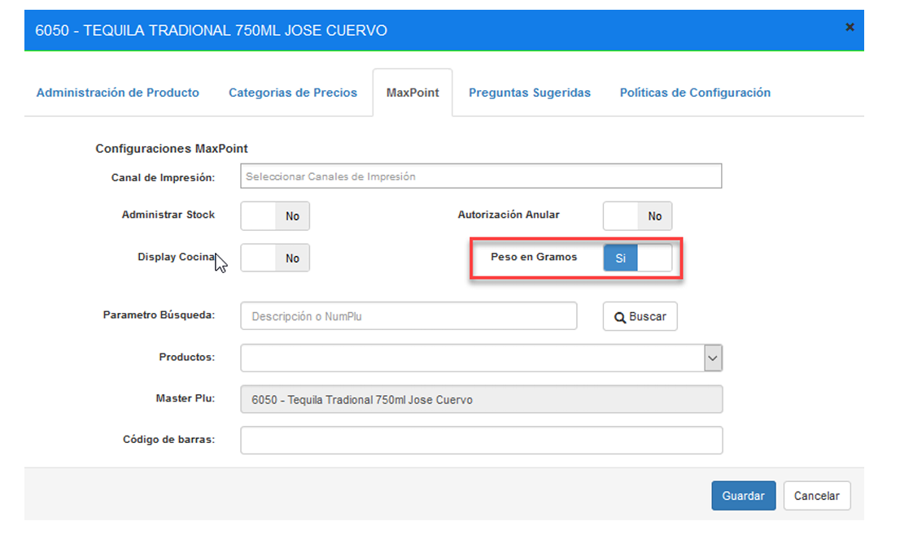

Ahora seleccionamos la pestaña **Políticas de Configuración** 

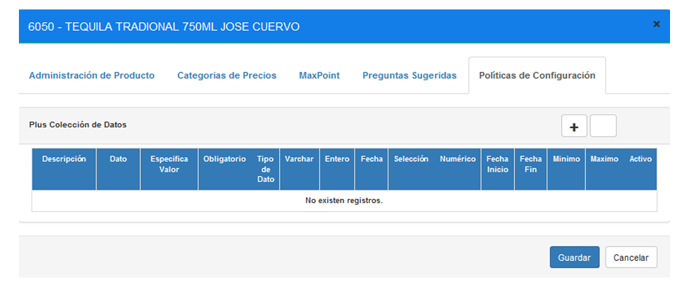

Para agregar la política de configuración **PRODUCTOS AL PESO**, presionamos sobre el 
símbolo “+”, en el cual se nos abrirá una pequeña modal. 

Buscamos la colección **PRODUCTOS AL PESO** (izquierda) y la seleccionamos, a su vez en la en la parte derecha aparecerá la opción **“¿Es Producto al Peso?”** y la seleccionamos. 

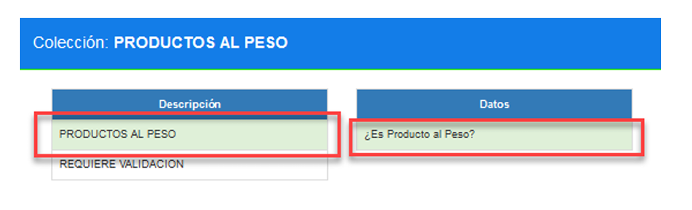

Para configurar qué el plu es un producto al peso, en la opción Selección debe cambiar al estado a **SI**, seguidamente presionar el botón **Guardar.**

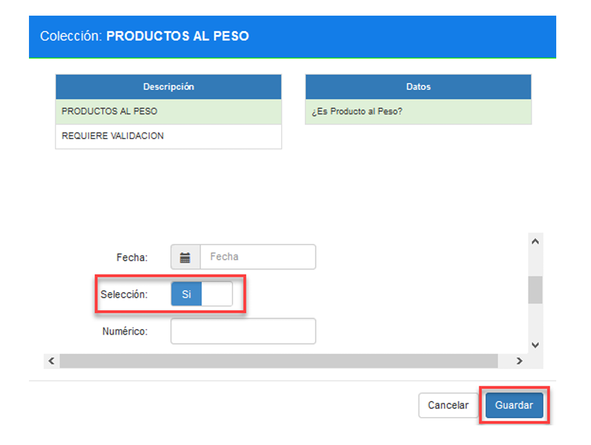

Una vez ya configurada la colección al restaurante deberá aparecer de la siguiente manera, para cerrar la modal presionar **Cancelar.** 

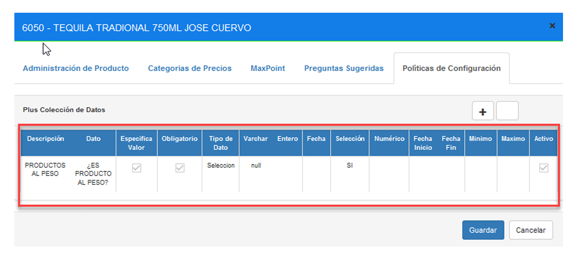

Si se desea modificar seleccionamos la colección y presionar sobre el botón editar. 

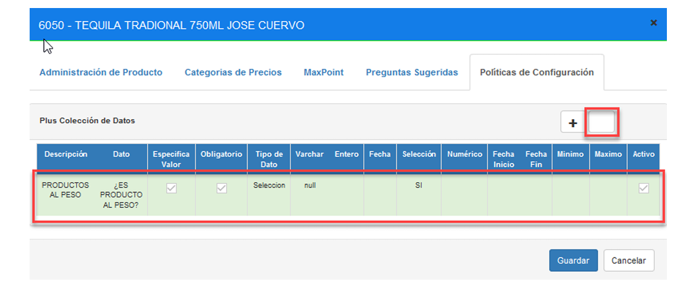

Aquí se podrá modificar el estado de la colección es decir de activo a inactivo o viceversa, al tipo de dato selección SI o NO según el caso, seguidamente presionar **Guardar.**

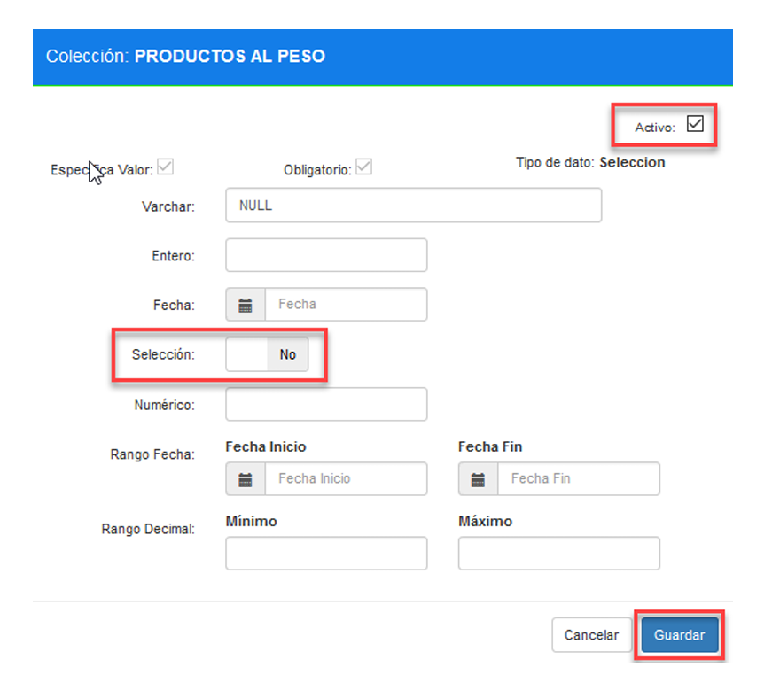

### 3.3.2 Otros Productos al Peso por código de barras 

Con un doble click se abrirá una modal con la información del plu, seleccionamos la 
pestaña **MaxPoint.** 

1. Opción **Peso en Gramos** colocamos en **SI.**

2. Opción **Código de barras** ingresamos el código de barras del producto 
seleccionado. 

Seguidamente presionar **Guardar.** 

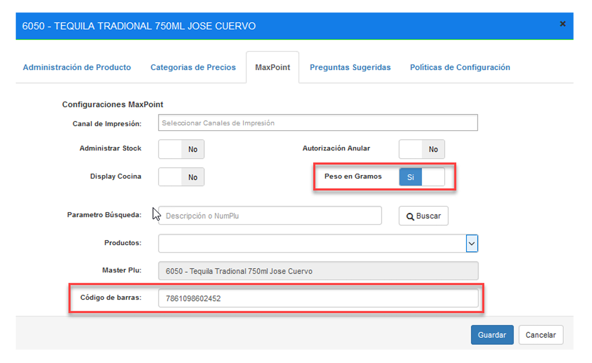

 Nota: En esta opción la configuración de la política no es necesaria, pero si se desea configurar deber ser con la opción selección en NO.  

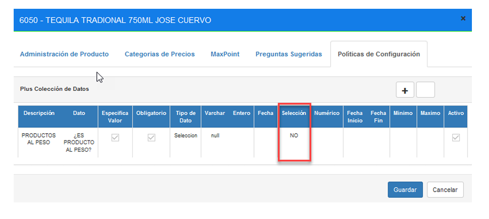

### 3.3.3 Productos Por Código de Barras 
Con un doble click se abrirá una modal con la información del plu, seleccionamos la 
pestaña **MaxPoint.** 

1. Opción **Código de barras** ingresamos el código de barras del producto 
seleccionado. 

Seguidamente presionar **Guardar**. 

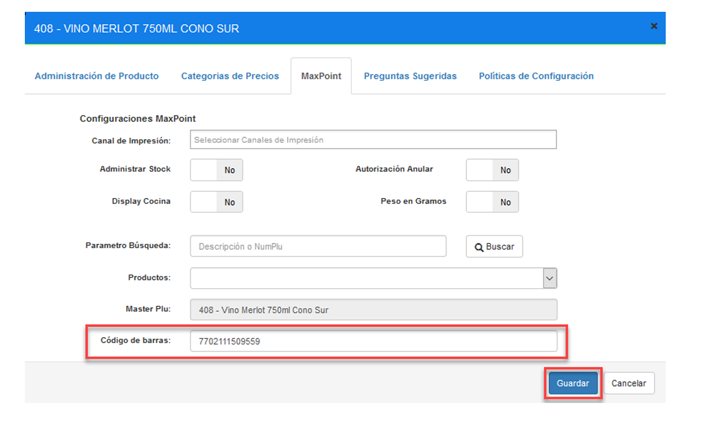

### 3.4 Replicar 
Como último paso realizar la respectiva réplica de la configuración aplicada en Azure hacia la tienda. 

### 3.5 Pruebas 
Realizar las respectivas pruebas en el punto de venta (dependiendo de la configuración aplicada al producto).  

### 3.6 Diagrama de Flujo  

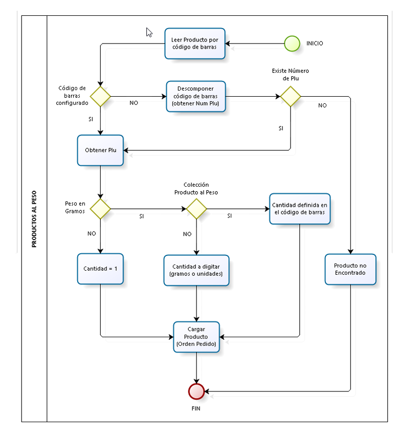