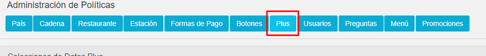
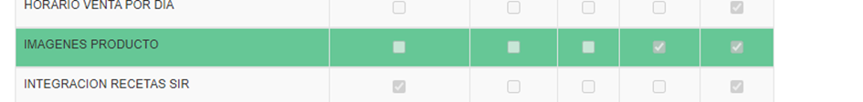
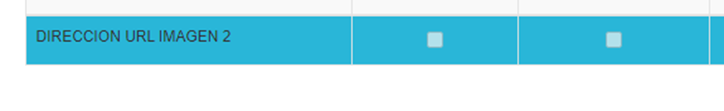

# CREACIÓN DE PARAMETRO A POLITICA PARA SUBIR SEGUNDA IMAGEN 

* Paso 1

En el apartado de políticas a nivel de PLUS seleccionamos la política IMAGENES PRODUCTO

**Plus:**

**Política:**

* Paso 2 

En esta política añadimos el parámetro DIRECCION URL IMAGEN 2 de tipo carácter, con esto ya podemos hacer uso de la pantalla para subir dos imágenes por producto.

