# MANUAL PARA LA CONFIGURACIÓN DE LA SINCRONIZACIÓN DE PRECIOS DESDE MAXPOINT HACIA SIR

## 
 INTRODUCCION 

 CONFIGURACIÓN DE LA SINCRONIZACIÓN DE PRECIOS DE LOS PRODUCTOS DESDE MAXPOINT HACIA SIR 

**Introducción -** En este manual se detalla la creación y configuración de políticas, procedimientos y funciones para la configuración de “DE LA SINCRONIZACIÓN DE PRECIOS DE LOS PRODUCTOS DESDE MAXPOINT HACIA SIR“

## 1.	CONFIGURACION DE POLÍTICAS

1.	Para ingresar al módulo de **“Administración De Políticas”**, debe dar clic en la opción **“Seguridades”** y en el módulo de **“Políticas”**

2. Al dar clic en la opción de  , se desplegará la siguiente pestaña

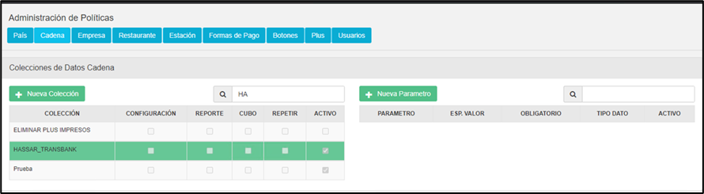

### 1.2	*POLÍTICAS DE CADENA (Selección y Creación de Nueva Colección)*
#### 1.2.1 Selección de la Coleccion

1.	En la tabla izquierda de Colecciones buscar la colección llamada **“INTEGRACION SIR”**  y la seleccionamos

#### 1.2.2. Creación de los Parámetros

A continuación, se debe crear los siguientes parámetro :  *CLIENT ID, CLIENT SECRET, ENDPOINT TOKEN, PREFIJO PAIS, APLICA INTEGRACION, ENDPOINT ACTUALIZACION PRECIOS  y URL BASE.*

Al dar click sobre el icono   , se desplegará una pantalla emergente para crear el parámetro mencionado. Ahora se detallará las configuraciones de los nuevos parametros.

 NOTA: Pueden existir parametros creados debido a desarrollos anterior, para este desarrollo el parametro nuevo es: ENDPOINT ACTUALIZACION PRECIOS.
Pero los parametros previamente mencionados son todos necesarios. 

1.	**PARAMETRO: APLICA INTEGRACION**

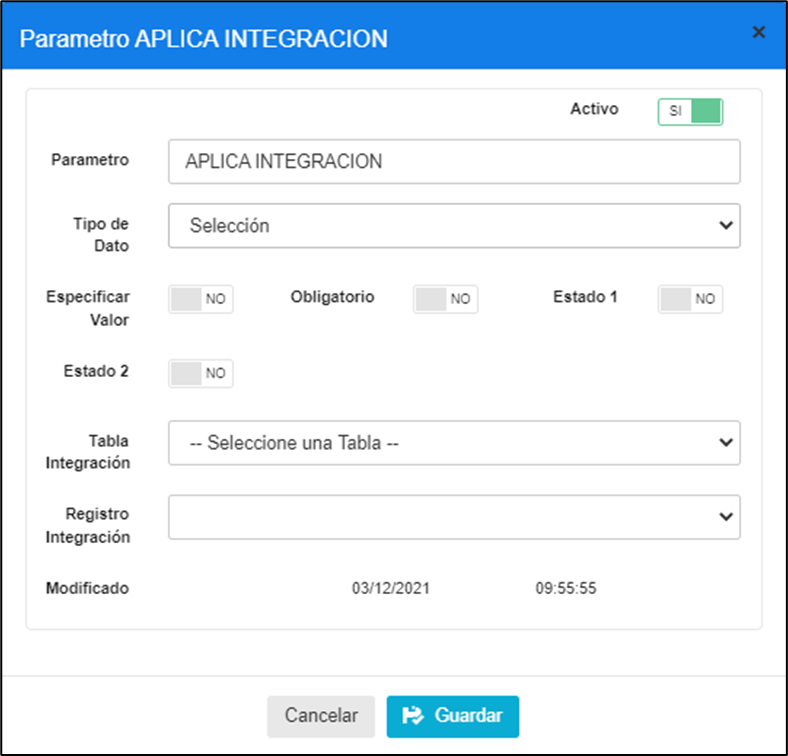

| PARAMETRO          | TIPO DATO | ESP. VALOR | OBLIGATORIO |
|--------------------|-----------|------------|--------------|
| APLICA INTEGRACION | Selección | NO         | NO           |

 NOTA:Este parametro es opcional si no se encuentra o esta con valor NO la funcionalidad de sincronizacion de precios no estara disponible, pero si esta con valor de SI, la funcionalidad si estara disponible. 

2.	**PARAMETRO: PREFIJO PAIS**

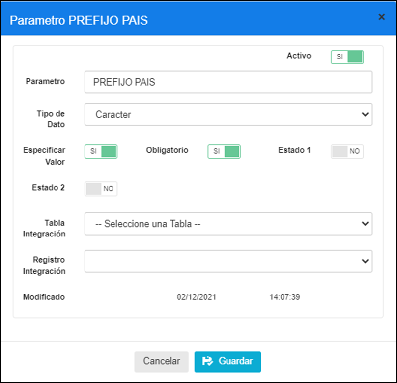

| PARAMETRO    | TIPO DATO | ESP. VALOR | OBLIGATORIO |
|--------------|-----------|------------|--------------|
| PREFIJO PAIS | Caracter  | SI         | SI           |

3.	**PARAMETRO: CLIENT ID**

| PARAMETRO | TIPO DATO | ESP. VALOR | OBLIGATORIO |
|-----------|-----------|------------|--------------|
| CLIENT ID | Caracter  | SI         | SI           |

4.	**PARAMETRO: CLIENT SECRET**

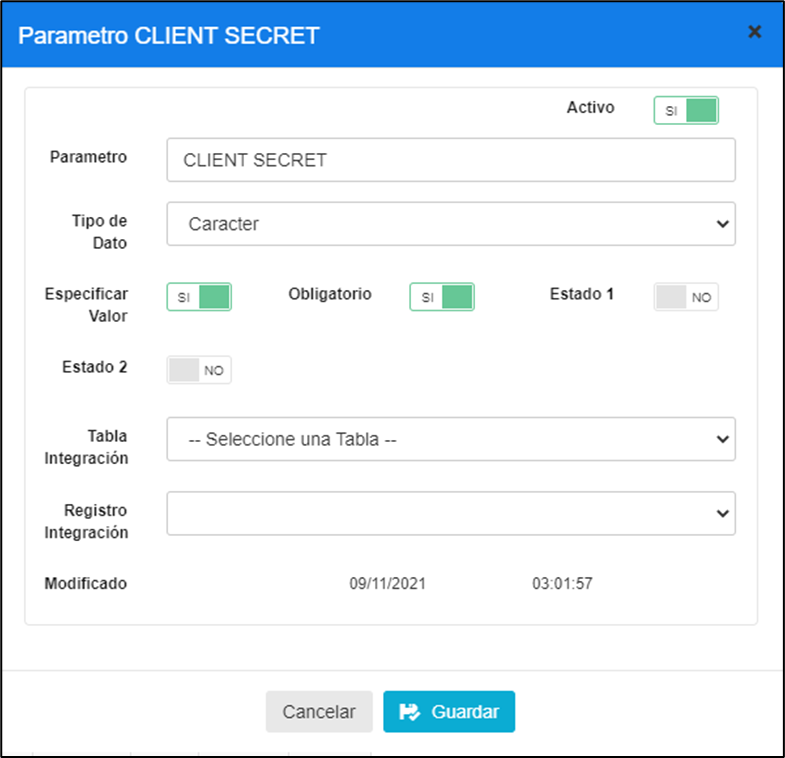

| PARAMETRO     | TIPO DATO | ESP. VALOR | OBLIGATORIO |
|---------------|-----------|------------|--------------|
| CLIENT SECRET | Caracter  | SI         | SI           |

5.	**PARAMETRO: ENDPOINT ACTUALIZACION PRECIOS**

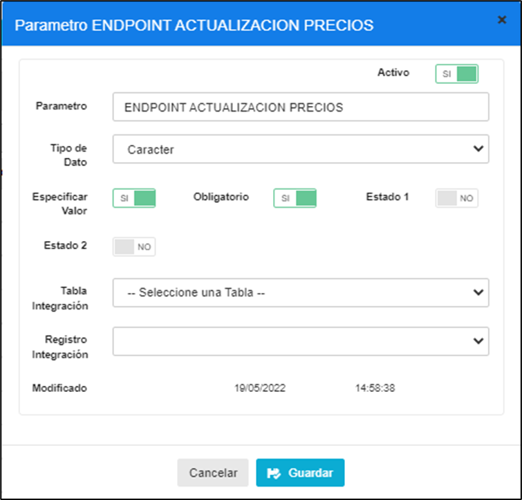

| PARAMETRO                       | TIPO DATO | ESP. VALOR | OBLIGATORIO |
|--------------------------------|-----------|------------|--------------|
| ENDPOINT ACTUALIZACION PRECIOS | Caracter  | SI         | SI           |

6.	**PARAMETRO: ENDPOINT TOKEN**

| PARAMETRO       | TIPO DATO | ESP. VALOR | OBLIGATORIO |
|----------------|------------|------------|--------------|
| ENDPOINT TOKEN | Caracter   | SI         | SI          |

7.	**PARAMETRO: URL BASE**

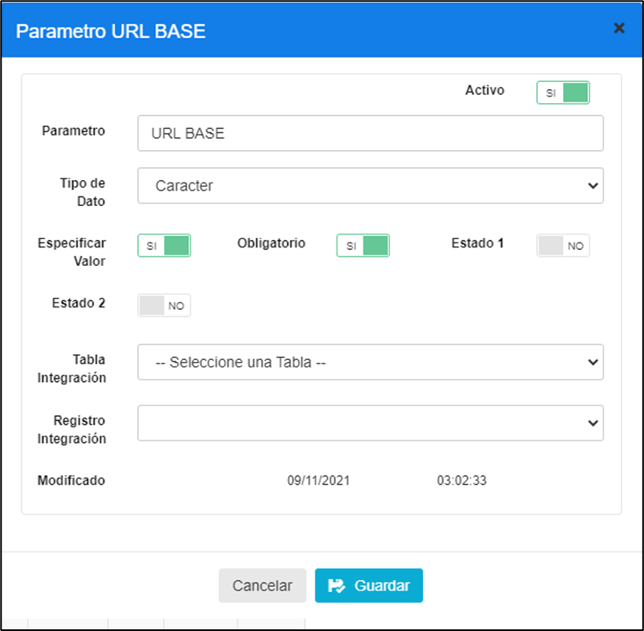

| PARAMETRO | TIPO DATO | ESP. VALOR | OBLIGATORIO |
|-----------|-----------|------------|-------------|
| EURL BASE | Caracter  | SI         | SI          |

## 2. ACTIVACIÓN DE POLÍTICAS

### 2.1	*ACTIVACIÓN DE POLITICAS DE CONFIGURACION POR CADENA*
1.	Para configurar una **política de cadena** es necesario ingresar a la opción Cadena/Cadena, y en esta pantalla a la opción  Políticas de Configuración 

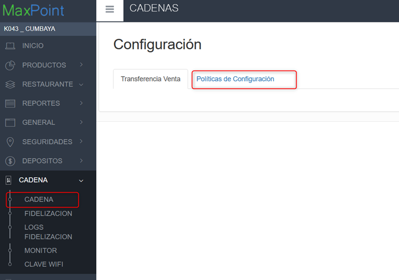

2.	Una vez ubicado en la pestaña Políticas de Configuración dar click en el botón “+” en la parte superior derecha de la tabla para añadir los parámetros, IMPORTANTE: repetir este proceso para la COLECCIÓN y sus PARÁMETROS

3.	Elegir la Colección **“INTEGRACION SIR”**
3.1  Elegir el Parámetro **“APLICA  INTEGRACION”**

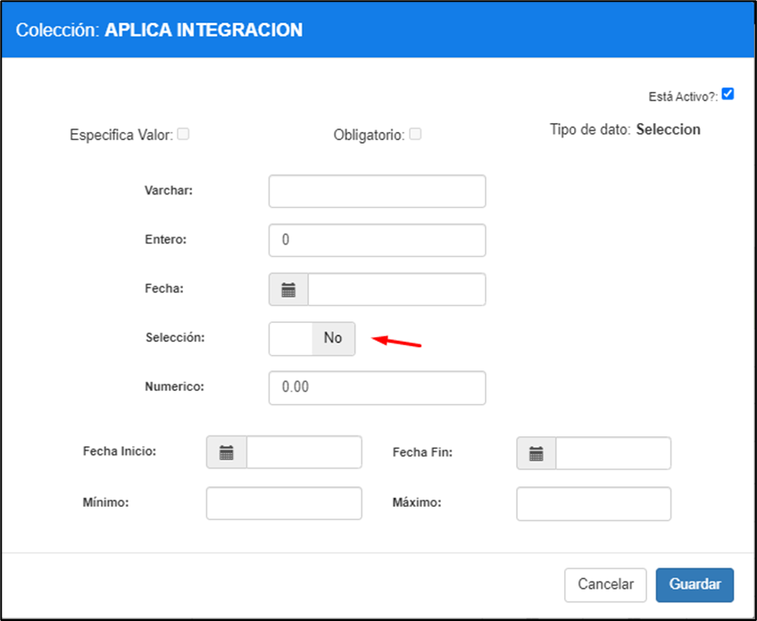

| PARAMETRO          | TIPO DATO | SELECCION |
|--------------------|------------|----------|
| APLICA INTEGRACION | Seleccion  | NO       | 

 NOTA: Este parámetro nos permite validar si se aplica la integración con SIR o el sistema sigue funcionando solo con la data de MaxPoint. 

3.2  Elegir el Parámetro **“PREFIJO PAIS”**

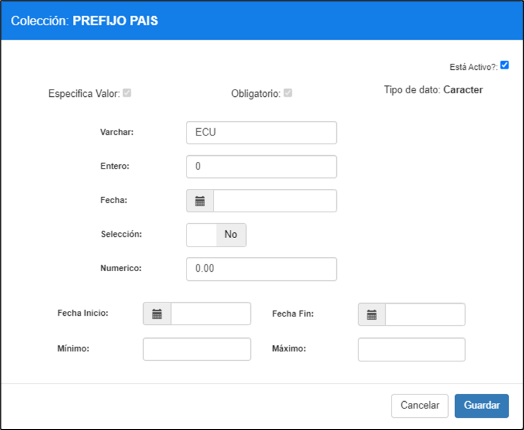

| PARAMETRO   | TIPO DATO | VARCHAR  | 
|-------------|------------|---------|
| PREFIJO PAIS | Caracter  | ECU     |

 NOTA: Poner el prefijo del País al que se aplicara la integración Ejemplo: Ecuador => ECU, Colombia => COL, Chile => CHI, etc 

3.3 Elegir el Parámetro **“CLIENT ID”**

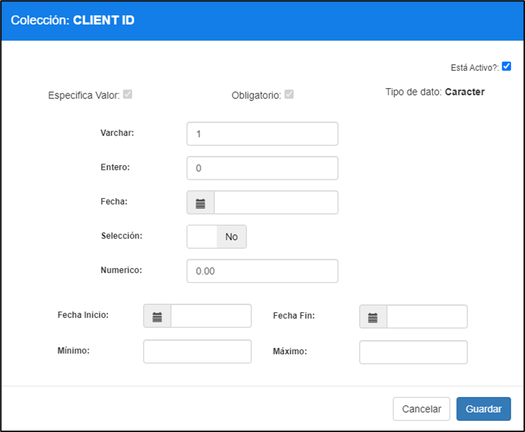

| PARAMETRO   | TIPO DATO | VARCHAR  | 
|-------------|-----------|---------|
| CLIENT ID   | Caracter  | 1        |

3.4 Elegir el Parámetro **“CLIENT SECRET”**

| PARAMETRO   | TIPO DATO | VARCHAR  | 
|-------------|-----------|---------|
| CLIENT SECRET | Caracter  | zfmZ1RbHy93GzigsDs1JFs88LhG0AEZZ9s8GhYra  |

3.5  Elegir el Parámetro **“URL BASE”**

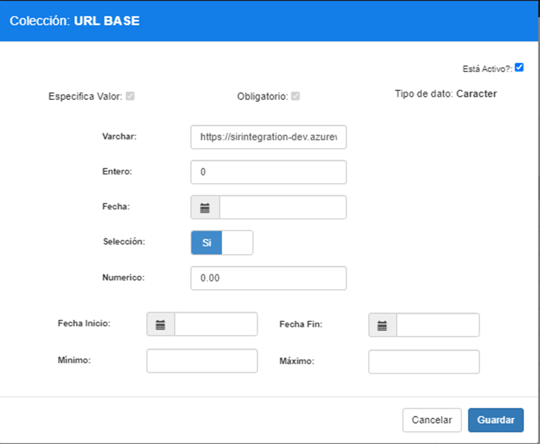

| PARAMETRO   | TIPO DATO | VARCHAR  | 
|-------------|-----------|---------|
| URL BASE    | Caracter  | https://sirintegration.azurewebsites.net (producción) |
|  |      | https://sirintegrationpaises-dev.azurewebsites.net (ambiente pruebas) |

3.6 Elegir el Parámetro **“ENDPOINT TOKEN”**

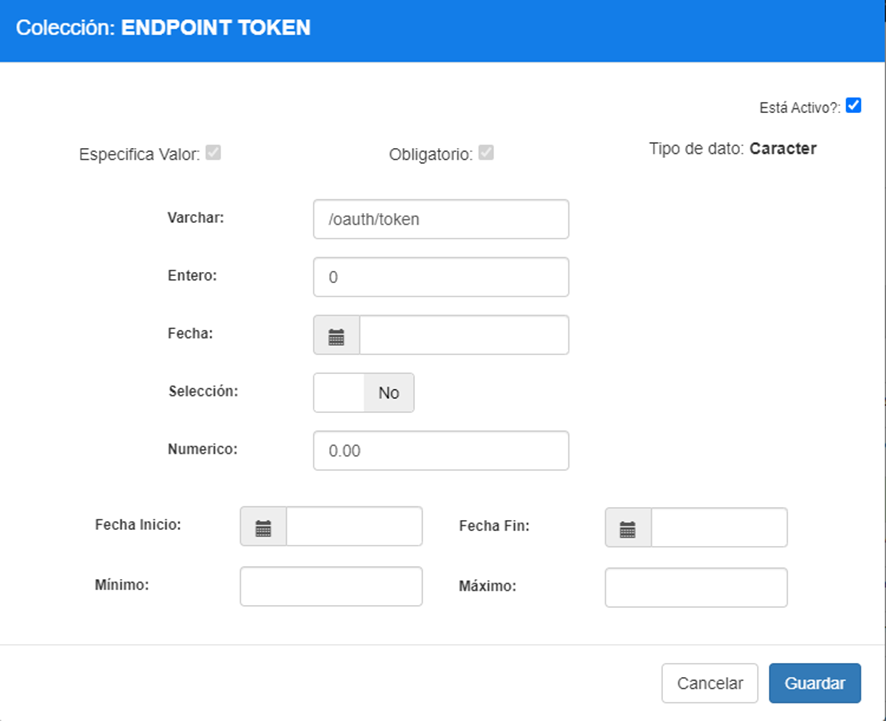

| PARAMETRO   | TIPO DATO | VARCHAR  | 
|-------------|-----------|---------|
| ENDPOINT TOKEN | Caracter  | /oauth/token |

3.7 Elegir el Parámetro **“ENDPOINT ACTUALIZACION PRECIOS”**

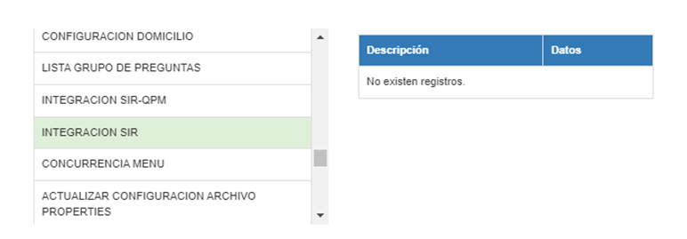

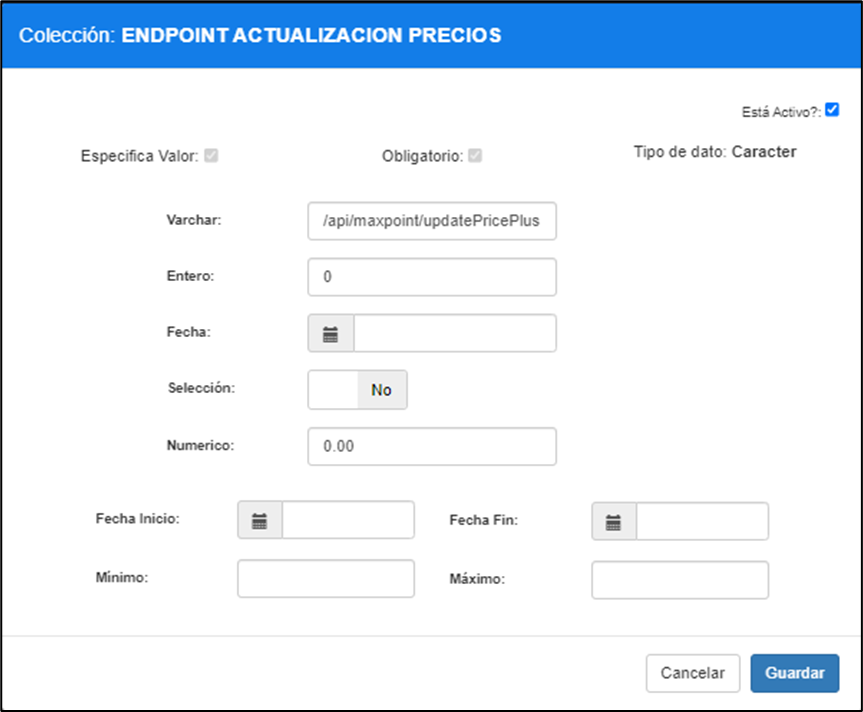

| PARAMETRO   | TIPO DATO | VARCHAR  | 
|-------------|-----------|---------|
| ENDPOINT TOKEN | Caracter  | /api/maxpoint/updatePricePlus |