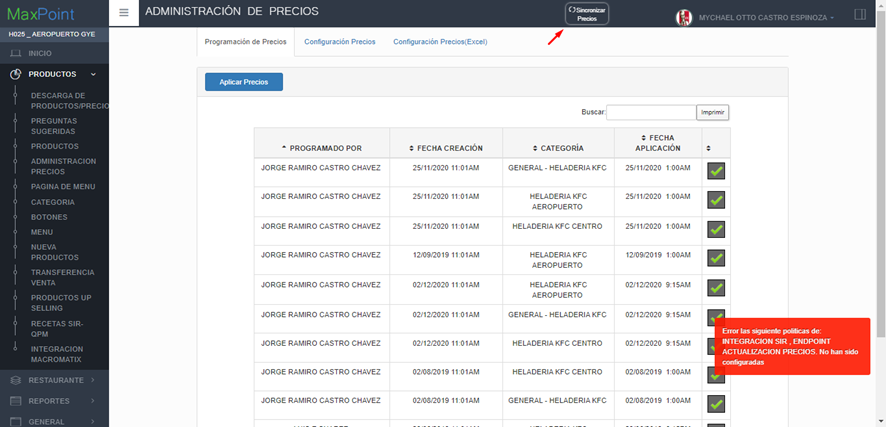
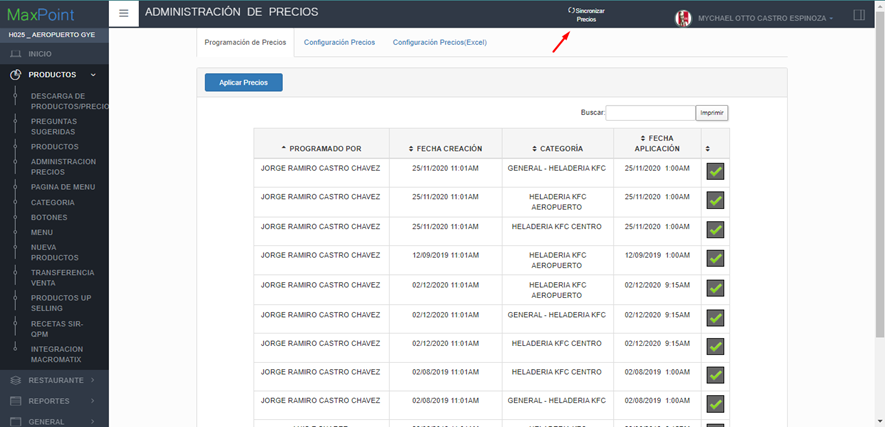
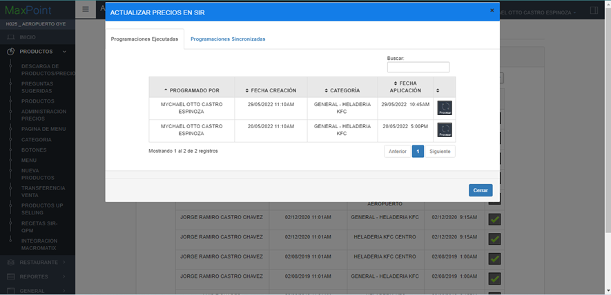
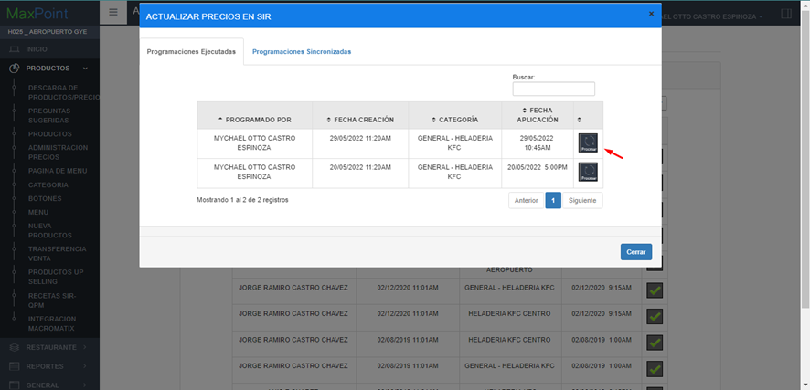
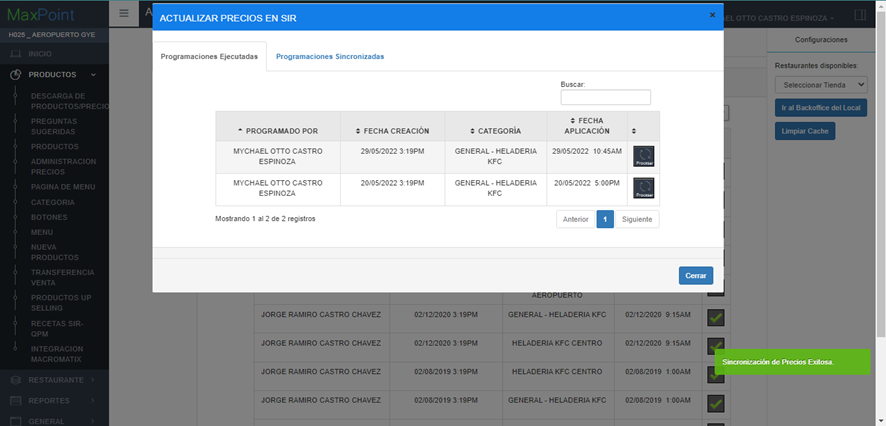
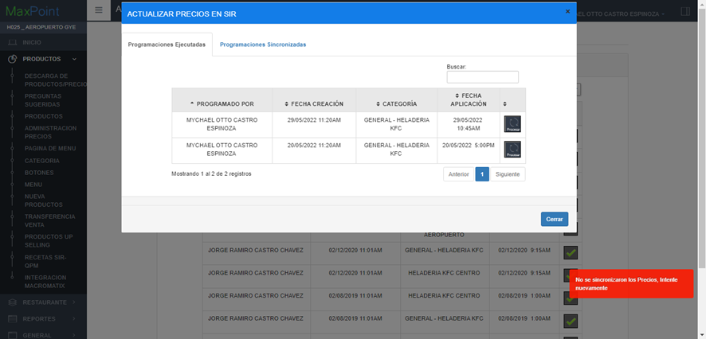

# MANUAL DE SINCRONIZACIÓN DE PRECIOS, DESDE MAXPOINT HACIA SIR.

## 
 INTRODUCCION 

 Sincronización de Precios desde MaxPoint hacia SIR 

**Introducción -** Este manual indica al usuario las diferentes alertas y validaciones que se realizan en el proceso de la sincronización de precios desde MaxPoint hacia SIR.

## 1.	INGRESO A LA PANTALLA ADMINISTRACIÓN PRECIOS

### 1.1	ESCENARIO CON PARAMETRO DE APLICA INTEGRACION EN NO
1.	Para ingresar se debe dar click en la opción “PRODUCTOS”, luego “ADMINISTRACIÓN PRECIOS” y se cargara la pantalla con las programaciones de precios. Si la política “INTEGRACION SIR” y el parámetro “APLICA INTEGRACION” no existen o el parámetro “APLICA INTEGRACION” esta con valor “NO”, el sistema NO mostrara el botón de “Sincronizar Precios”, caso contrario el sistema deberá mostrar el botón de “Sincronizar Precios”

### 1.3 ESCENARIO CON PARAMETRO DE APLICA INTEGRACION EN SI

1.	Para ingresar se debe dar click en la opción “PRODUCTOS”, luego “ADMINISTRACION PRECIOS” y se cargara la pantalla con las programaciones de precios. Al dar click sobre el botón de “Sincronizar Precios” y si las políticas y sus parámetros no han sido configurados correctamente, se mostrara un mensaje con los parámetros que faltan por configurar.

2.	Si las políticas se encuentran configuradas correctamente podrá ingresar a la pantalla de “ADMINISTRACION PRECIOS” y visualizar el modal de “ACTUALIZAR PRECIOS EN SIR”, como muestra la siguiente imagen.

 *Nota: “En esta pantalla se cargan dos pestañas la primera se llama Programaciones ejecutadas y la segunda se llama Programaciones sincronizadas, la primera corresponde a todas las programaciones que ya fueron ejecutadas a nivel de MaxPoint y la segunda corresponde a todas las programaciones que ya fueron ejecutadas a nivel de MaxPoint y fueron sincronizadas con SIR”* 

## 2.	SINCRONIZACION DE PRECIOS
### 2.1 ESCENARIO DE EXITOSO
1.	Dar click sobre el botón “Sincronizar Precios”.

2.	Mostrará la ventana modal donde el usuario podrá realizar la sincronización de los precios desde MaxPoint hacia SIR.

3.	Deberá darle click en el botón que indica “Procesar”.

4.	Cuando los precios actuales sean enviados a SIR y responda que OK el sistema muestra el mensaje correspondiente a la transacción “Sincronización de Precios Exitosa.”.

### 2.2 ESCENARIO FALLIDO
1.	Repetir los pasos de la CREACION EXITOSA hasta el paso 3.

2.	Si hubo un error al consumir el servicio que actualiza los precios del producto en SIR, mostrara el mensaje correspondiente 

