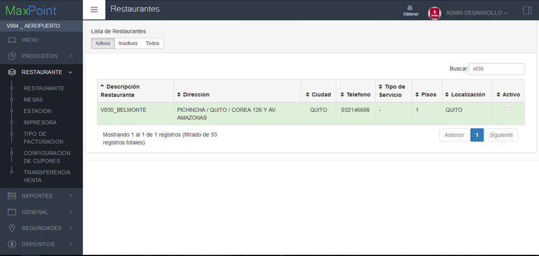
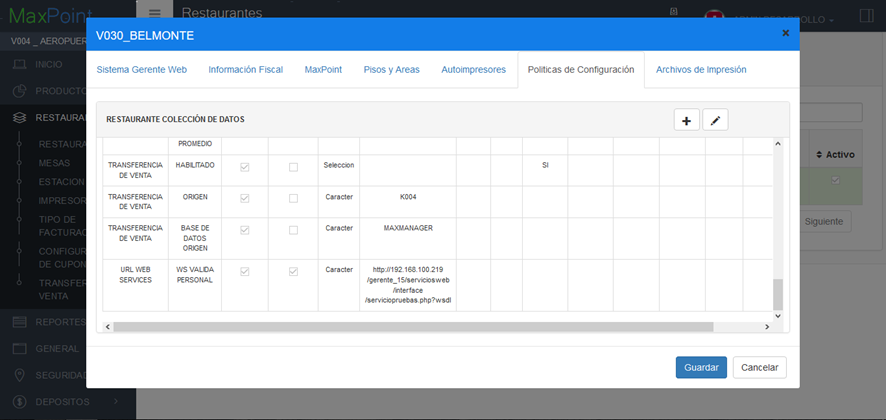
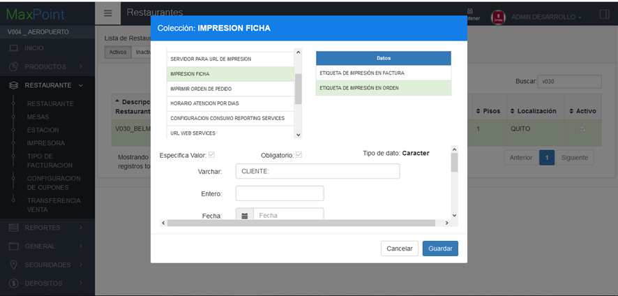
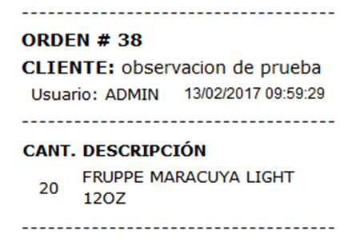

# MANUAL USUARIO Configuración de Impresión de Comentarios en la Orden de Pedido

Para el funcionamiento correcto de los comentarios en la orden de pedido, se debe seguir los siguientes pasos para configurar la información que se necesita para que funcione el proceso.

1.	En el módulo de RESTAURANTES en la pantalla RESTAURANTE, buscamos el restaurante que vamos a agregar esta propiedad, y damos doble clic para abrir la venta.

2.	Clic en la pestaña POLÍTICAS DE CONFIGURACIÓN, damos clic en el botón **+**.

3.	Buscamos la política IMPRESIÓN FICHA y seleccionamos la opción ETIQUETA DE IMPRESIÓN DE ORDEN. Luego nos ubicamos en la etiqueta VARCHAR y llenamos el texto con la descripción que deseamos que aparezca en cada comentario.

 **Nota: Si la colección IMPRESIÓN FICHA no existe para la cadena, por favor solicitar a soporte que se cree.**  

Después de realizar esta configuración el formato de la orden de pedido tendría la siguiente estructura.

  

 Ilustración 1. 

  

Política ha Habilitar 