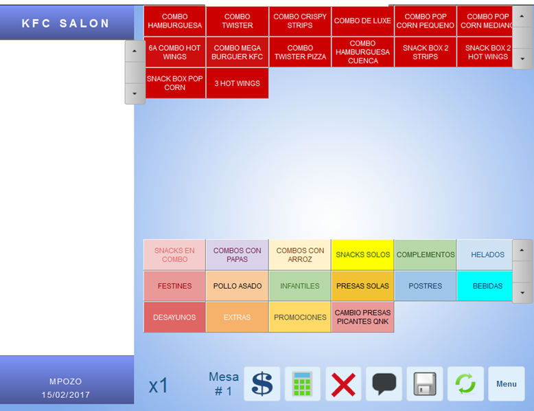
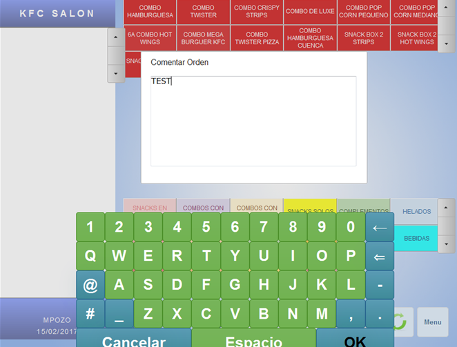
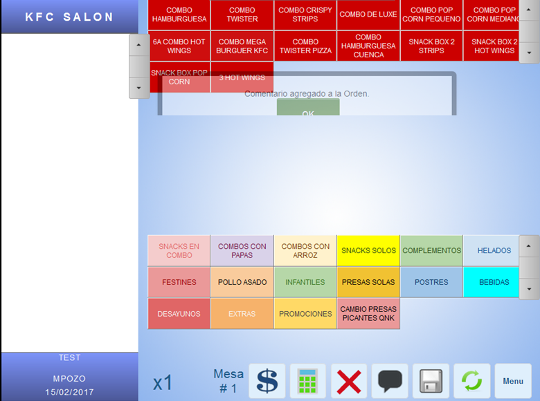
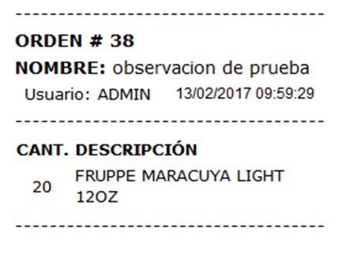

# MANUAL USUARIO - Proceso para agregar Comentario sobre una Orden de Pedido

Para la correcta impresión del comentario sobre la orden de pedido se debe seguir el manual de configuración de impresión de comentario.

### Procedimiento:

1.	Antes de agregar productos a una orden, el usuario tiene la posibilidad de agregar un comentario a la orden de pedido presionando el botón  . 

Una vez que los productos se agregaron a la orden, cualquier comentario que se agregue se atará al producto seleccionado en el detalle más no a la orden de pedido.

2.	En la ventana que aparece, con el teclado agregamos el comentario que deseamos que aparezca, por ejemplo el nombre del cliente, y presionamos el botón OK.

3.	Aparecerá un alerta de confirmación y en la parte inferior izquierda de la pantalla aparecerá el comentario.

El ticket de despacho tendría la siguiente estructura.

  

 *Ilustración 1.* 

  
