# Configuración Transferencia de Venta

## 1 ANTECEDENTES 
Actualmente en el sistema MaxPoint punto de venta, existe la opción de realizar 
transferencia de venta únicamente en locales KFC que tengan HELADERÍAS; ahora 
también se desea realiza la transferencia entre marcas como es el caso de BASKIN 
ROBBINS y CINNABON. 

## 2 OBJETIVO GENERAL 
Generar transferencia de venta entre marcas. 

### 2.1Objetivos específicos 
* Crear políticas de configuración para realizar la transferencia de venta. 

* Enviar por transferencia el desglose de la venta (bruta, neta, cero e IVA). 

* Generar interface de venta. 

## 3 POLÍTICAS DE CONFIGURACIÓN 
### 3.1 Datos Generales 
En este manual se detalla cómo realizar la configuración de políticas a nivel de cadena y 
formas de pago, que permitirán realizar la transferencia de venta entre marcas. 
Antes de iniciar la configuración se describen los datos importantes que sebe tener en 
cuenta:

* Origen, se denomina al restaurante o cadena que envía la transferencia de venta. 

* Destino, se denomina al restaurante o cadena que recibe la transferencia de venta. 

* Todas las políticas descritas en este manual, deben ser creadas en el origen y 
destino. 

* La descripción de la forma de pago establecida para transferencia de venta debe ser 
igual en el origen y destino. 

* El tipo de la forma de pago establecida para transferencia de venta debe ser 
Efectivo. 

* La forma de pago no será visible en el punto de venta. 

### 3.2 Pantalla de Políticas 
Ingresar al sistema MP backoffice con credenciales de administrador sistemas y seleccionar 
la cadena a la cual se realizará las configuraciones. 

En el menú que se encuentra en la parte izquierda no dirigimos a la opción 
**SEGURIDADES** y seleccionamos **POLÍTICAS**, seguidamente presionamos sobre el 
botón **Ir a Administración Políticas** en el cual abrirá una nueva pestaña en el navegador. 

**Nota:** Antes de crear las políticas de configuración debemos verificar que dichas 
colecciones no se encuentren creadas, de ser el caso validar que cada colección contenga 
los parámetros establecidos en este manual.

### 3.3 Cadena 
### 3.3.1 Colección Cadena 

Tabla 1. Datos Colección Cadena

| N° | Colección          | Descripción                                                                                                                                                           |
|----|--------------------|----------------------------------------------------------------------------------------------------------------------------------------------------------------------|
| 1  | TIPO DE TRANSFERENCIA | Configuración que permite establecer el tipo de transferencia de venta que aplicará una cadena, por ejemplo para KFC y HELADERIA será en efectivo, mientras que BASKIN ROBBINS y CINNABON será por forma de pago. |

En la opción **Cadena** presionar sobre el botón **Nueva Colección**, se abrirá una modal para 
su creación ingresando los siguientes datos: 

**Nota:** NO puede contener espacios en blanco al inicio y final del nombre de la colección; 
debe ser escrita tal y como se especifica en la tabla 1. 

**Colección:** Nombre de la colección que se especifica en la tabla 1. 

**Módulo:** No aplica. 

**Observaciones:** Una descripción de la función que realizara dicha colección. 

Una vez que se haya ingresado y seleccionado la información establecida procedemos a 
**Guardar**.

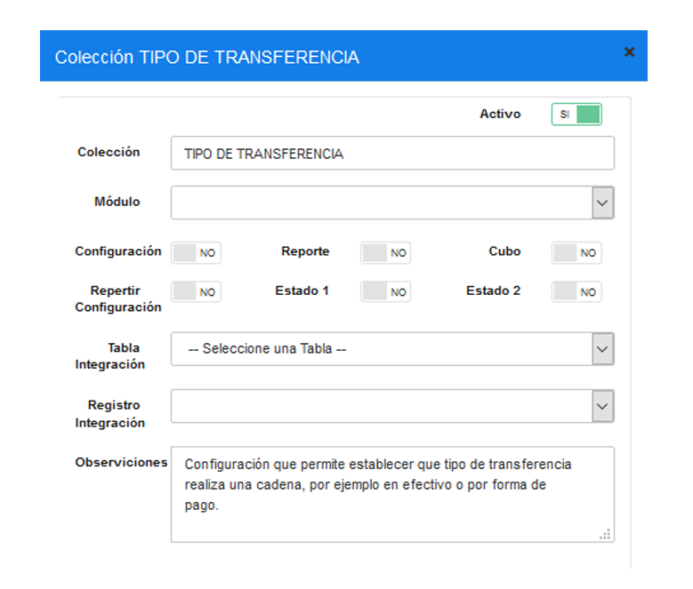

### 3.3.2 Parámetro de Colección  
Tabla 2. Datos Parámetros de Colección Cadena

| N° | Colección          | Parámetro           | Esp. Valor | Obligatorio | Tipo Dato | Selección |
|----|--------------------|---------------------|------------|-------------|-----------|-----------|
| 1  | TIPO DE TRANSFERENCIA | EN EFECTIVO         | SI         | SI          |           |           |
| 2  | TIPO DE TRANSFERENCIA | POR FORMA DE PAGO   | SI         |             |           | SI        |
| 3  | TIPO DE TRANSFERENCIA | APLICA TRANSFERENCIA | SI         | SI          |           | SI        |

Una vez creada la colección se debe proceder a crear los parámetros de configuración y 
para ello seleccionamos la colección y presionamos sobre el botón **Nuevo Parámetro** 
(derecha), en la cual se abrirá una modal para su creación.

Presionar sobre el botón **Nuevo Parámetro**, se abrirá una modal para su creación 
ingresando los siguientes datos: 

**Nota:** NO puede contener espacios en blanco al inicio y final del parámetro; deben ser 
escritos tal y como se especifica en la tabla 2. 

**Parámetro:** Nombre del parámetro que se especifica en la tabla 2.

**Tipo de Dato:** Se especifica en la tabla 2. 

**Especifica Valor:** Se especifica en la tabla 2 

**Obligatorio:** Se especifica en la tabla 2 

Una vez que se haya ingresado y seleccionado la información establecida procedemos a 
**Guardar**. 

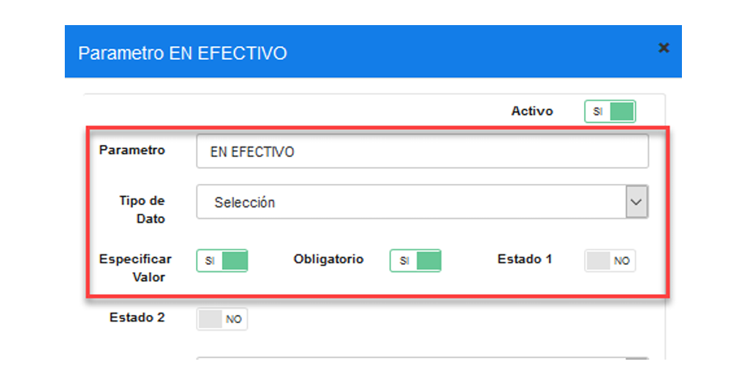

Se deben crear todos los parámetros de configuración establecidos en la tabla 2, Una vez 
creado se debe tener lo siguiente:

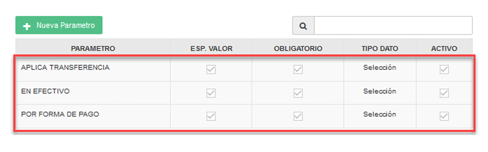

### 3.4 Formas de Pago 
### 3.4.1 Colección Formas de Pago 
Tabla 3. Datos Colección Formas de Pago

| N° | Colección          | Descripción |
|----|--------------------|-------------|
| 1  | TIPO DE TRANSFERENCIA | Configuración que permite establecer el tipo de transferencia de venta que aplicará una cadena, por ejemplo para KFC y HELADERIA será en efectivo, mientras que BASKIN ROBBINS y CINNABON será por forma de pago. |

En la opción Formas de Pago presionar sobre el botón Nueva Colección, se abrirá una 
modal para su creación ingresando los siguientes datos: 

**Nota: NO puede contener espacios en blanco al inicio y final del nombre de la colección; 
debe ser escrita tal y como se especifica en la tabla 3. 

**Colección:** Nombre de la colección que se especifica en la tabla 3. 

**Módulo:** Forma Pago. 

**Observaciones:** Una descripción de la función que realizara dicha colección. 

Una vez que se haya ingresado y seleccionado la información establecida procedemos a 
**Guardar**.

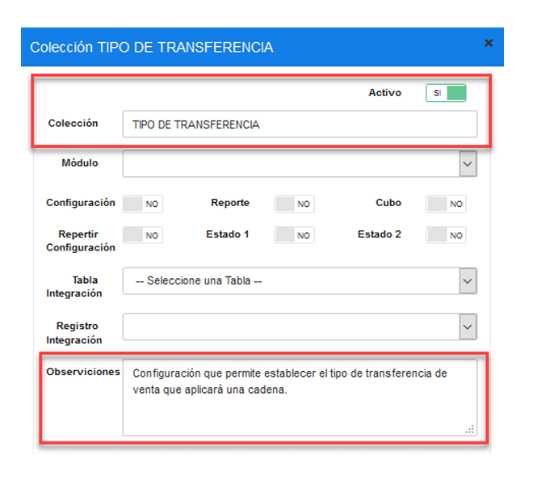

### 3.4.2 Parámetro Formas de Pago 
Tabla 4. Datos Parámetro Formas de Pago
| N° | Colección          | Parámetro          | Esp. Valor Obligatorio | Tipo Dato |
|----|--------------------|--------------------|------------------------|-----------|
| 1  | TIPO DE TRANSFERENCIA | POR FORMA DE PAGO | SI                     | SI        |

Una vez creada la colección se debe proceder a crear los parámetros de configuración y 
para ello seleccionamos la colección y presionamos sobre el botón **Nuevo Parámetro** 
(derecha), en la cual se abrirá una modal para su creación.

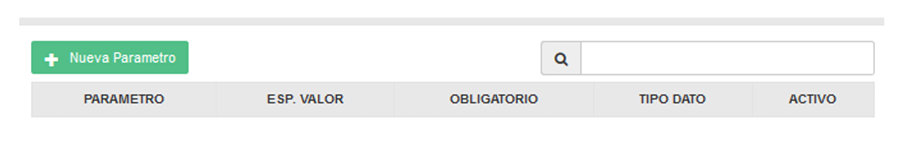

Presionar sobre el botón Nuevo Parámetro, se abrirá una modal para su creación 
ingresando los siguientes datos: 

**Nota:** NO puede contener espacios en blanco al inicio y final del parámetro; deben ser 
escritos tal y como se especifica en la tabla 4. 

**Parámetro:** Nombre del parámetro que se especifica en la tabla 4 

**Tipo de Dato:** Se especifica en la tabla 4 

**Especifica Valor:** Se especifica en la tabla 4 

**Obligatorio:** Se especifica en la tabla 4 

Una vez que se haya ingresado y seleccionado la información establecida procedemos a 
**Guardar**.

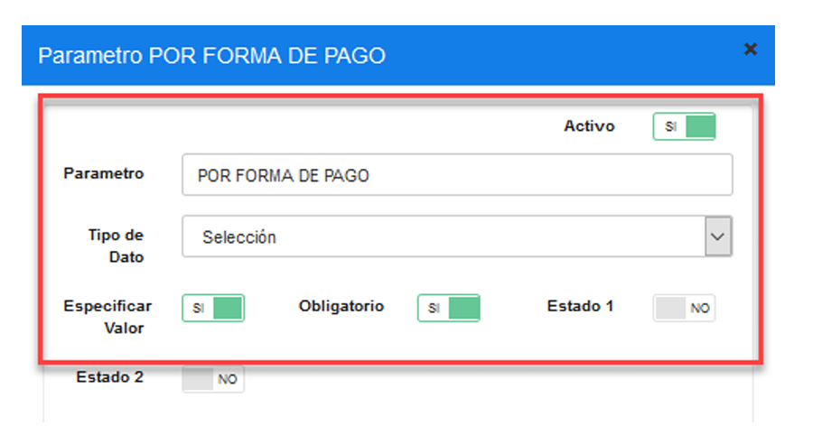

Se deben crear todos los parámetros de configuración establecidos en la tabla 4, Una vez 
creado se debe tener lo siguiente:

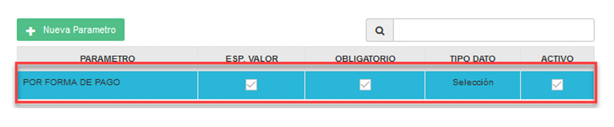

### 3.5 Cadena Colección de Datos 
En el menú nos dirigimos a **CADENA** y seleccionamos la opción **CADENA**, en la parte 
izquierda se cargará una pantalla y seguidamente seleccionamos la pestaña **Políticas de 
configuración.**

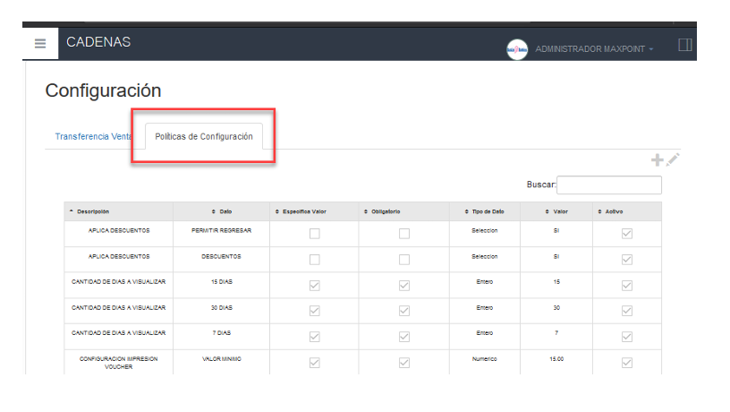

### 3.5.1 Configuración Origen  

 Nota: Antes de configurar las políticas se debe tener el claro qué tipo de trasferencia 
aplicará la cadena, por ejemplo, si la transferencia de venta se la realizará en efectivo o por 
otra forma de pago, para este caso la cadena origen Baskin Robbins aplica por forma de 
pago.

Para realizar la configuración se debe presionar sobre el botón agregar “+”; el cual abrirá 
una modal, seguidamente buscaremos la colección creada y la seleccionamos.

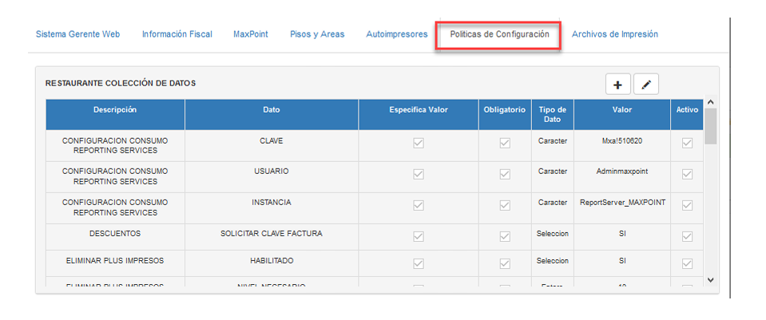  

Para habilitar la configuración se debe presionar sobre el botón agregar “+”; el cual abrirá 
una modal, seguidamente buscaremos la colección creada y la seleccionamos.

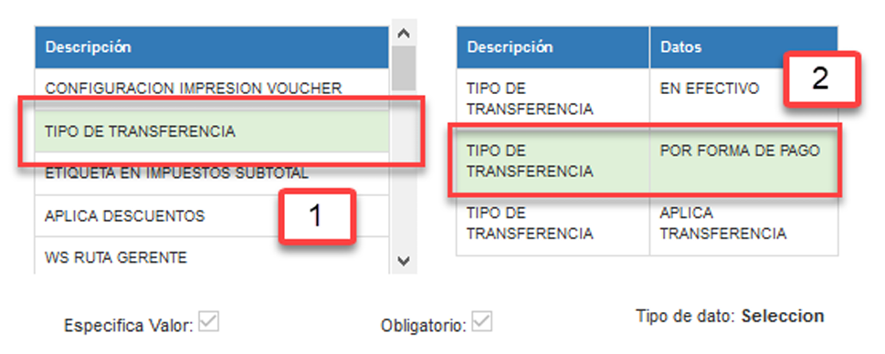  

Aquí se debe configurar el **tipo de dato Selección a SI**, seguidamente presionar **Guardar**. 

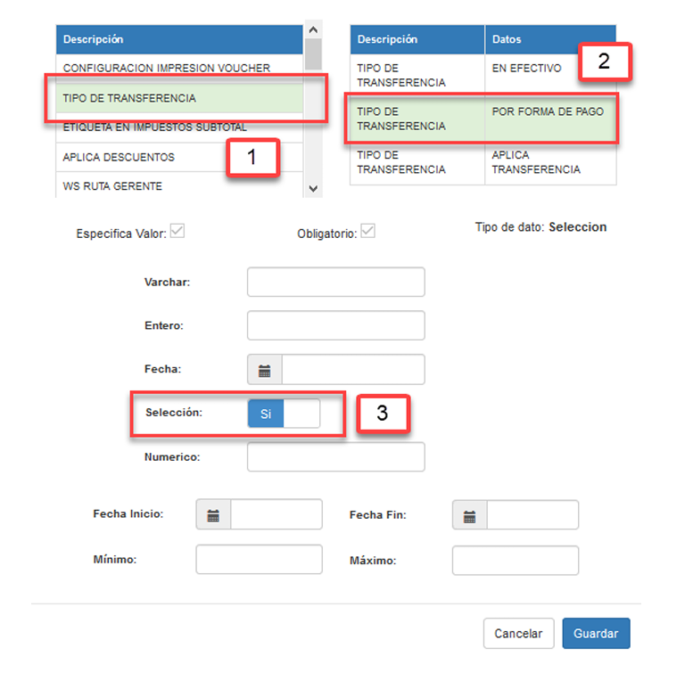  

Se debe realizar la misma configuración para la política “APLICA TRANSFERENCIA”. 

En el origen se debe de configurar únicamente una de las dos políticas “EN EFECTIVO” o 
“POR FORMA DE PAGO” dependiendo de la configuración que requiera la cadena. 
En el caso que se haya configurado las dos políticas, una de ellas debe ser deshabilitada.  

Una vez configurada la política se debe tener lo siguiente.

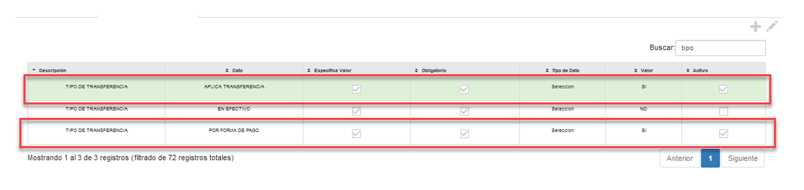 

### 3.5.2 Configuración Destino 

  **Nota:** Antes de configurar las políticas se debe tener el claro qué tipo de trasferencia 
aplicará la cadena, por ejemplo, si la transferencia de venta se la realizará en efectivo o por 
otra forma de pago, para este caso la cadena destino Cinnabon aplica por forma de pago.    

Para realizar la configuración se debe presionar sobre el botón agregar “+”; el cual abrirá 
una modal, seguidamente buscaremos la colección creada y la seleccionamos. 

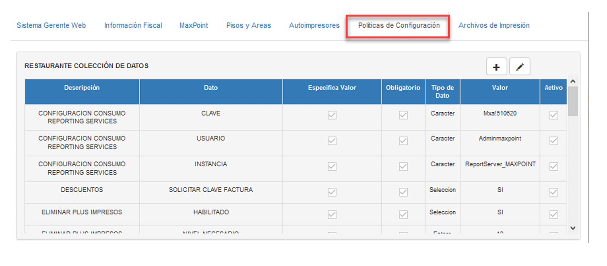 

Para habilitar la configuración se debe presionar sobre el botón agregar “+”; el cual abrirá 
una modal, seguidamente buscaremos la colección creada y la seleccionamos. 

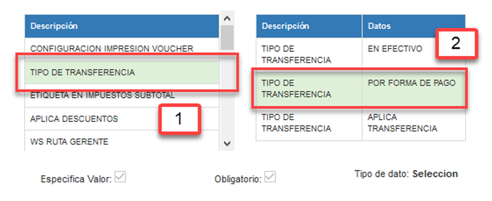 

Aquí se debe configurar el **tipo de dato Selección a SI**, seguidamente presionar **Guardar**. 

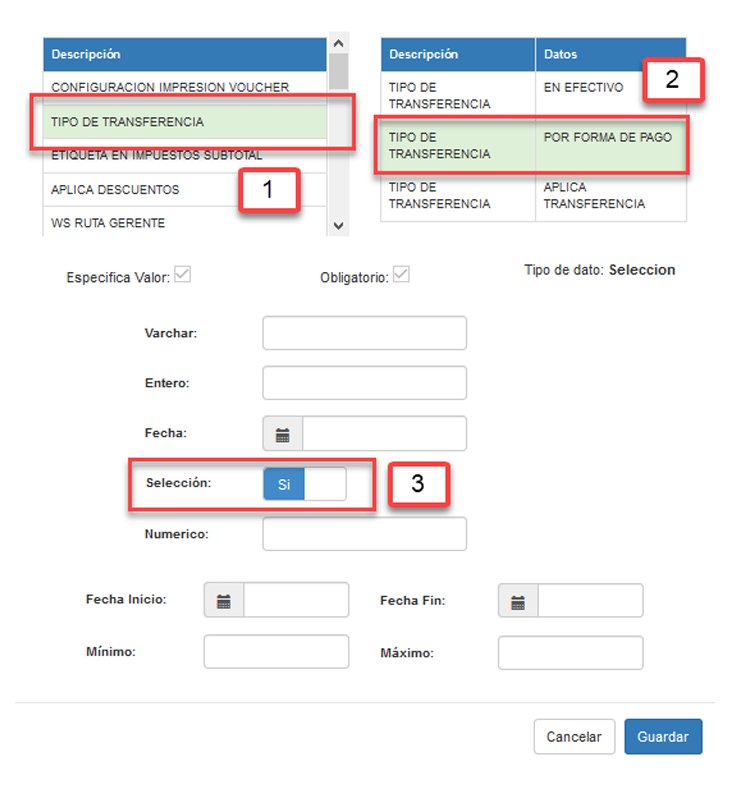 

Se debe realizar la misma configuración para la política “APLICA TRANSFERENCIA”.

En el destino se debe de configurar únicamente una de las dos políticas “EN EFECTIVO” o 
“POR FORMA DE PAGO” dependiendo de la configuración que requiera la cadena.

En el caso que se haya configurado las dos políticas, una de ellas debe ser deshabilitada.  

Una vez configuradas las políticas se debe tener lo siguiente

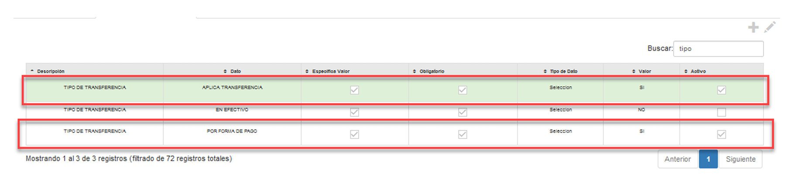

### 3.6 Formas de Pago Colección de Datos 
En el menú nos dirigimos a **GENERA**L, desplegamos la opción **FORMAS DE PAGO** y 
seleccionamos **DEFINICIÓN**, en la parte izquierda se cargará una pantalla con el listado 
de las formas de pago que actualmente tiene la cadena.

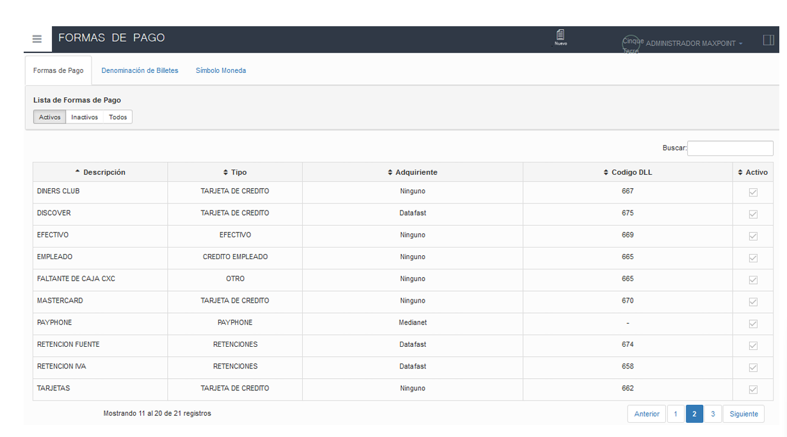

Crear la forma de pago establecida para la transferencia de venta. 

En este caso los datos son los siguientes: 

Tabla 5. Datos Forma de Pago Transferencia

| N° | Campo                         |Valor                    | Observación                                                                                                  |
|----|------------------------------|--------------------------|--------------------------------------------------------------------------------------------------------------|
| 1  | Descripción                  | CINNABON         | El nombre de la forma de pago dependerá de la cadena y no debe contener espacios en blanco ni caracteres especiales. |
| 2  | Tipo Medio de Pago           | EFECTIVO                 |  En transferencia de venta, la forma de pago creada debe ser del tipo Efectivo.                              |
| 3  | Adquiriente                  | Ninguno                  | No aplica ningún tipo adquiriente.                                                                           |
| 4  | Código Respuesta DLL Gerente | Código creado en el SG.  | El código dependerá de la cadena y el nombre con el cual haya sido creada en el SG.                          | 
| 5  | Tipo de Facturación          | PLAN MARKET              | En transferencia de venta, toda forma de pago debe ser tipo Plan Market.                                     |

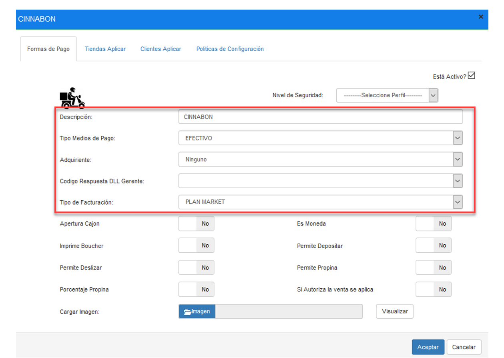

Una vez creada la forma de pago debemos editarla para configurar la política de 
configuración, con un doble clic se abrirá una modal y seleccionamos la pestaña **Políticas de configuración**.

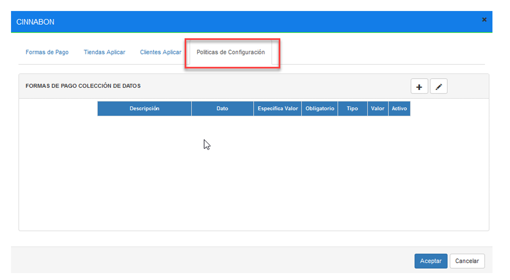

Para habilitar la política se debe presionar sobre el botón agregar “+”; el cual abrirá una 
modal, seguidamente buscaremos la colección creada, la seleccionamos y marcamos el **tipo de dato Selección a SI** , seguidamente presionar **Guardar**.

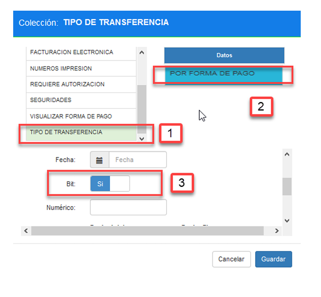

Una vez configuradas las políticas se debe tener lo siguiente 

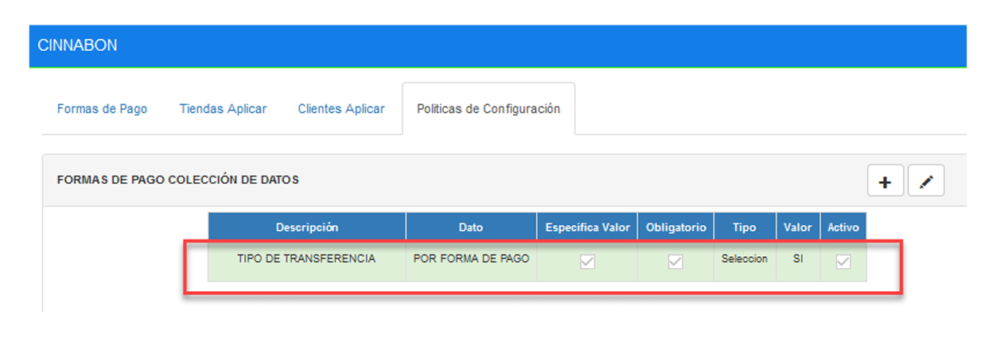

**Nota:** La descripción de la forma de pago deber ser idéntica tanto en el origen como 
destino, también debe estar configurada la política. 
En el caso que el tipo de transferencia sea en efectivo, esta política no debe ser configurada. 

## 4 REPLICAR 
Como siguiente paso se debe realizar las respectiva replica de todas las configuraciones 
hacia la tienda.

