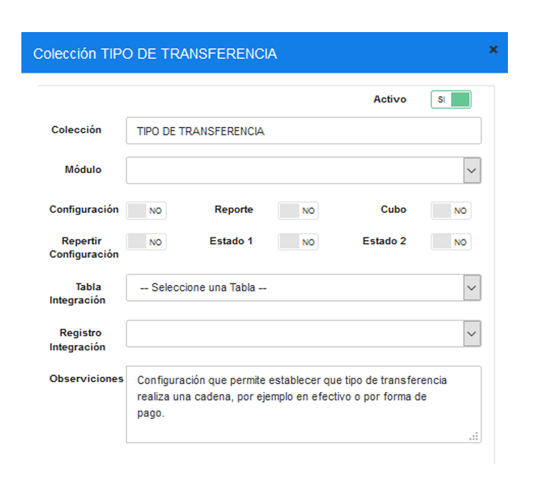
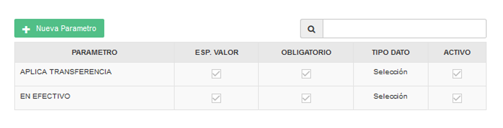
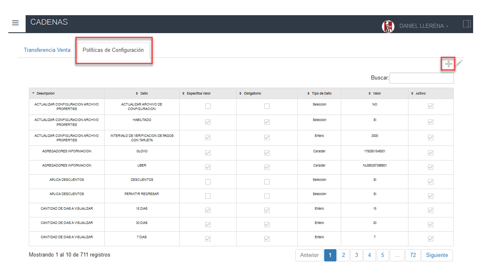
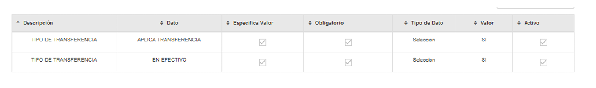
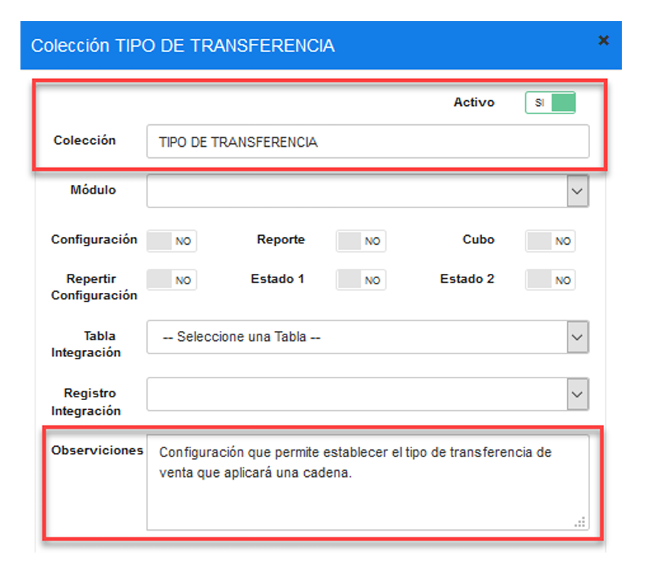
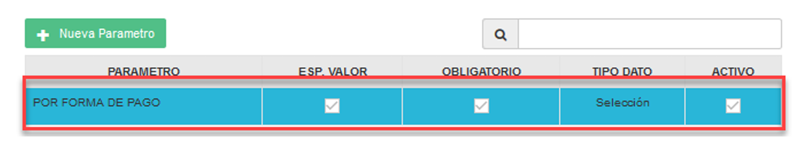
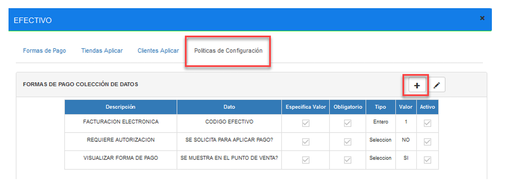
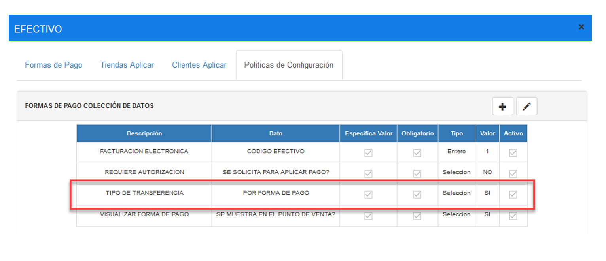

# Manual - Configuración Transferencia de Venta Heladerías

## 1 ANTECEDENTES 
Actualmente en el sistema MaxPoint punto de venta, existe la opción de realizar 
transferencia de venta en efectivo entre los locales KFC que tengan HELADERÍAS. 

## 2 OBJETIVO GENERAL 
Desmontar el cajero de heladería cuando no exista venta, pero que sí contenga transferencia 
de venta en efectivo recibida del local. 

### 2.1 Objetivos específicos 
* Crear una política de configuración a nivel de cadena para aplicar la transferencia 
de venta.

* Crear una política de configuración a nivel de formas de pago para realizar la 
transferencia de venta en efectivo. 

* Permitir desmontar el cajero y generar interface de venta. 

## 3 POLÍTICAS DE CONFIGURACIÓN 
### 2.1 Datos Generales 
En este manual se detalla cómo realizar la configuración de políticas a nivel de cadena y 
formas de pago, que permitirán desmontar el cajero en heladería cuando este no exista 
venta, pero que si contenga una transferencia del local. 

Antes de iniciar la configuración se describen los datos importantes que deben tener en 
cuenta: 

* Destino, se denomina al restaurante que recibe la transferencia de venta (Heladería).

* Todas las políticas descritas en este manual, deben ser creadas únicamente en el 
destino. 

* La forma de pago establecida para transferencia de venta en heladerías es Efectivo.

* En cada periodo y por cada usuario asignado a la estación de heladería se insertará 
un registro en la cabecera factura con valor $ 0.00 con el fin de poder desmontar el 
cajero cuando no exista venta.

### 3.2 Pantalla de Políticas 
Ingresar al sistema MP backoffice con credenciales de administrador sistemas y seleccionar la cadena a la cual se realizará las configuraciones. 

En el menú que se encuentra en la parte izquierda no dirigimos a la opción 
**SEGURIDADES** y seleccionamos **POLÍTICAS**, seguidamente presionamos sobre el 
botón **Ir a Administración Políticas** en el cual abrirá una nueva pestaña en el navegador. 

## Cadena 
### 3.3.1 Colección Cadena 
Antes de crear las políticas de configuración; como primer paso se debe verificar que no se 
encuentren creadas, de ser el caso validar que cada colección contenga los parámetros 
establecidos en este manual. 

En la opción **Cadena** presionar sobre el botón Nueva Colección, se abrirá una modal para 
su creación ingresando los siguientes datos: 

Tabla 1. Datos Colección Cadena

| N°  | Colección             | Descripción                                                                                                                                                                                     |
|-----|-----------------------|-------------------------------------------------------------------------------------------------------------------------------------------------------------------------------------------------|
| 1   | TIPO DE TRANSFERENCIA | Configuración que permite establecer el tipo de transferencia de venta que aplicará una cadena, por ejemplo para KFC y HELADERIA será en efectivo.                                             |

  **Nota:** NO puede contener espacios en blanco al inicio y final del nombre de la colección; 
debe ser escrita tal y como se especifica en la tabla 1.   

**Colección:** Nombre de la colección que se especifica en la tabla 1. 

**Módulo:** No aplica. 

**Observaciones:** Una descripción de la función que realizara dicha colección. 

Una vez que se haya ingresado y seleccionado la información establecida procedemos a 
**Guardar**.

 

### 3 3.3.2 Parámetro de Colección  
Antes de agregar los parámetros de configuración, como primer paso se debe verificar que 
no se encuentren creados, de ser el caso validar que cada parámetro contenga los valores 
establecidos en este manual. 

Una vez creada la colección se debe proceder a crear los parámetros de configuración y 
para ello seleccionamos la colección y presionamos sobre el botón **Nuevo Parámetro** en la 
cual se abrirá una venta para su creación e ingresamos los siguientes datos: 

Tabla 2. Datos Parámetros de Colección Cadena

 | N°  | Colección               | Parámetro                      | Esp. Valor | Obligatorio | Tipo Dato | 
|-----|-------------------------|--------------------------------|------------|-------------|-----------| 
| 1   | TIPO DE TRANSFERENCIA   | APLICA TRANSFERENCIA           | SI         | SI          | Selección | 
| 2   | TIPO DE TRANSFERENCIA   | EN EFECTIVO                    | SI         | SI          | Selección | 

**Nota:** NO puede contener espacios en blanco al inicio y final del parámetro; deben ser 
escritos tal y como se especifica en la tabla 2.  

**Parámetro:** Nombre del parámetro que se especifica en la tabla 2. 

**Tipo de Dato:** Se especifica en la tabla 2. 

**Especifica Valor:** Se especifica en la tabla 2. 

**Obligatorio:** Se especifica en la tabla 2. 

Una vez que se haya ingresado y seleccionado la información establecida procedemos a 
**Guardar**. 

Se deben crear todos los parámetros de configuración establecidos en la tabla 2 y se debe 
tener lo siguiente:

### 3.3.3 Cadena Colección de Datos 
En el menú nos dirigimos a **CADENA** y seleccionamos la opción CADENA, en la parte 
izquierda se cargará una pantalla y seguidamente seleccionamos la pestaña **Políticas de 
configuración**. 

Para la configuración se debe presionar sobre el botón agregar “+”; el cual abrirá una 
ventana, seguidamente buscaremos la colección creada y agregamos el valor en los 
parametros solicitados. 

### 3.3.4 Tipo de Transferencia 
En la tabla 3, se especifica los valores que deben ser configurados por cada parámetro 
colección. 

Tabla 3. Valores de los parámetros de colección

# Colección: TIPO DE TRANSFERENCIA 
| N° | Parámetro           | Tipo Dato | Valor a ingresar | 
|----|---------------------|-----------|------------------| 
| 1  | APLICA TRANSFERENCIA | Selección |                  | 
| 2  | EN EFECTIVO          | Selección | SÍ               | 

Al realizar la configuración de todos los parámetros se debe tener lo siguiente: 

### 3.4 Formas de Pago 
3.4.1 Colección Formas de Pago 
Antes de crear las políticas de configuración; como primer paso se debe verificar que no se 
encuentren creadas, de ser el caso validar que cada colección contenga los parámetros 
establecidos en este manual. 

En la opción **Formas de Pago** presionar sobre el botón Nueva Colección, se abrirá una 
modal para su creación ingresando los siguientes datos: 

Tabla 4. Datos Colección Formas de Pago

| N° | Colección            | Descripción                                                                                                       |
|----|----------------------|-------------------------------------------------------------------------------------------------------------------|
| 1  | TIPO DE TRANSFERENCIA | Configuración que permite establecer el tipo de transferencia de venta que aplicará una cadena. Por ejemplo, para KFC y HELADERIA será en efectivo, mientras que BASKIN ROBBINS y CINNABON será por forma de pago. |

**Nota:**  NO puede contener espacios en blanco al inicio y final del nombre de la colección; 
debe ser escrita tal y como se especifica en la tabla 3.  

**Colección:** Nombre de la colección que se especifica en la tabla 4. 

**Módulo:** Forma Pago. 

**Observaciones:** Una descripción de la función que realizara dicha colección. 

Una vez que se haya ingresado y seleccionado la información establecida procedemos a 
**Guardar**.

### 3.4.2 Parámetros Formas de Pago 
Antes de agregar los parámetros de configuración, como primer paso se debe verificar que 
no se encuentren creados, de ser el caso validar que cada parámetro contenga los valores 
establecidos en este manual. 

Una vez creada la colección se debe proceder a crear los parámetros de configuración y 
para ello seleccionamos la colección y presionamos sobre el botón **Nuevo Parámetro** en la 
cual se abrirá una modal para su creación e ingresamos los siguientes datos: 

Tabla 5. Datos Parámetro Formas de Pago

| N° | Colección            | Parámetro         | Esp. Valor | Obligatorio | Tipo Dato |
|----|----------------------|-------------------|-------------|-------------|-----------|
| 1  | TIPO DE TRANSFERENCIA | POR FORMA DE PAGO | SI          | SI          |           |

### 3.4.3 Forma de Pago Colección de Datos 
En el menú nos dirigimos a **GENERAL**, desplegamos la opción **FORMAS DE PAGO** y 
seleccionamos **DEFINICIÓN**, en la parte izquierda se cargará una pantalla con el listado 
de las formas de pago que actualmente tiene la cadena. 

Buscar la forma de pago **EFECTIVO**, con un doble click se abrirá una venta y 
seleccionamos la pestaña Políticas de **configuración**.

Para la configuración se debe presionar sobre el botón agregar “+”; el cual abrirá una 
ventana, seguidamente buscaremos la colección creada y agregamos el valor en los 
parametros solicitados. 

### 3.4.4 Tipo de Transferencia – Por Forma de Pago 
En la tabla 6, se especifica los valores que deben ser configurados por cada parámetro 
colección. 

Tabla 6. Valores de los parámetros de colección 

# Colección: TIPO DE TRANSFERENCIA 
| N° | Parámetro         | Tipo Dato | Valor a ingresar |
|----|-------------------|-----------|------------------|
| 1  | POR FORMA DE PAGO | Selección | SÍ               |

Al realizar la configuración de todos los parámetros se debe tener lo siguiente: 

## 4 REPLICAR 
Como siguiente paso se debe realizar las respectiva replica de todas las configuraciones 
hacia la tienda. 