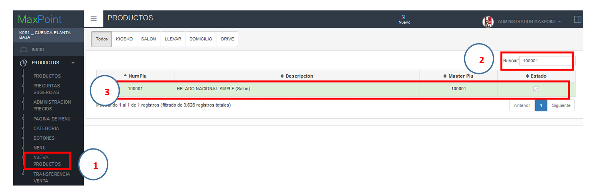
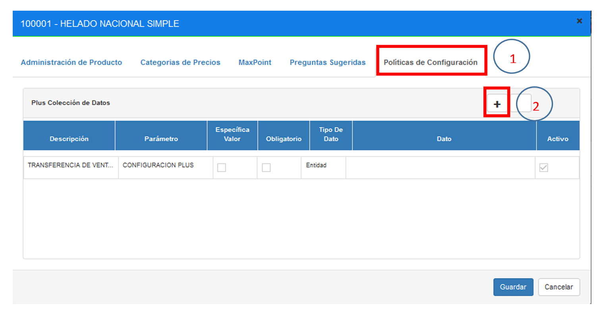
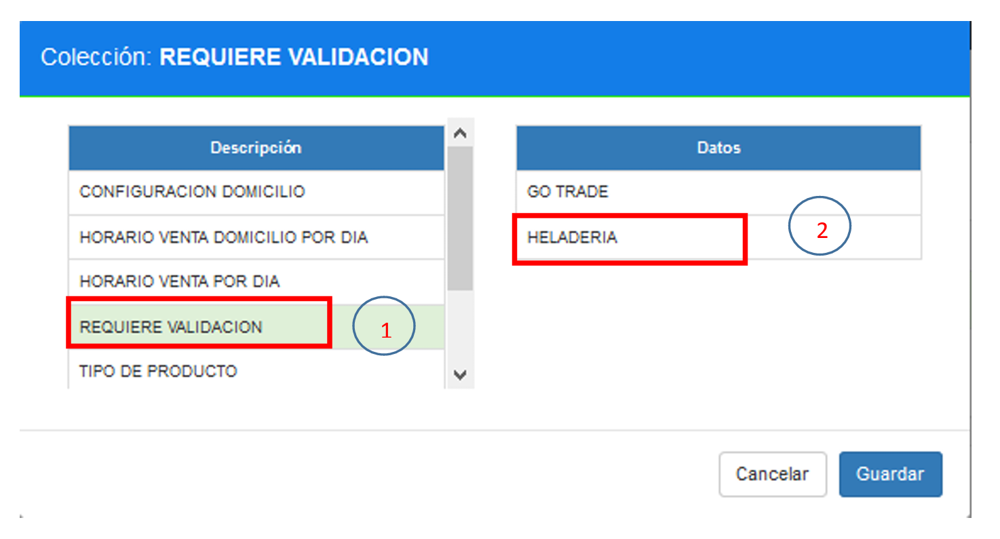
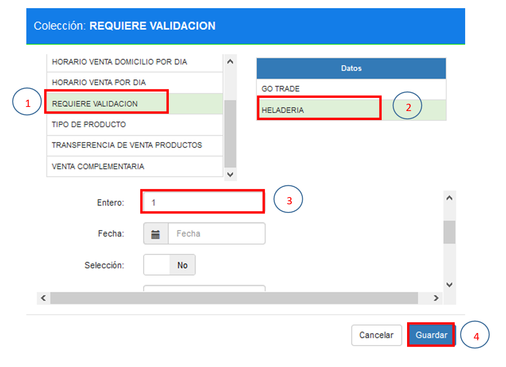

# CONFIGURACIÓN DE VALIDACIÓN DE WEB SERVICES HELADERÍA

## 1 OBJETIVOS 
* Conocer la validación de venta de productos de transferencia. Se realiza los 
siguientes pasos:  

✔  Verifica si el plus está configurado para preguntar por la validación, si está configurado el 
plus con la bandera de validación, consulta un web services para verificar, si el cajero está 
activo. Si el cajero está activo entonces permite la venta; caso contrario evita la venta del 
producto 

## 2 NUEVA PRODUCTOS - BACKEND 
### 2.1 Configuración 
En la pantalla de configuración nueva productos buscamos los productos relacionados de 
heladería para configurar la política de validación de transferencia. 

 

Una vez ubicado el producto de transferencia se debe configurar la política de requisito de validación. 

 

Buscamos la configuración de política requiere validación, y seleccionamos el parámetro de heladería;

Una vez seleccionada la validación de heladería completar la variable entera con el 
parámetro 1, esto habilitara la consulta al web services de validación de venta.

