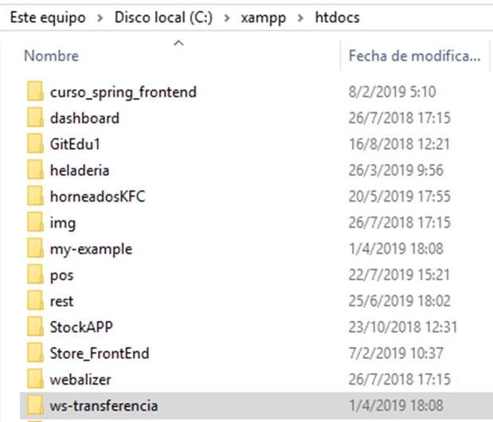
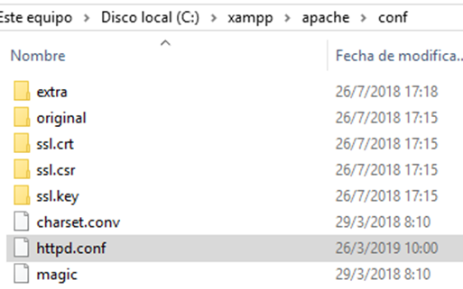
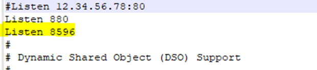
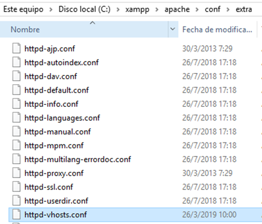
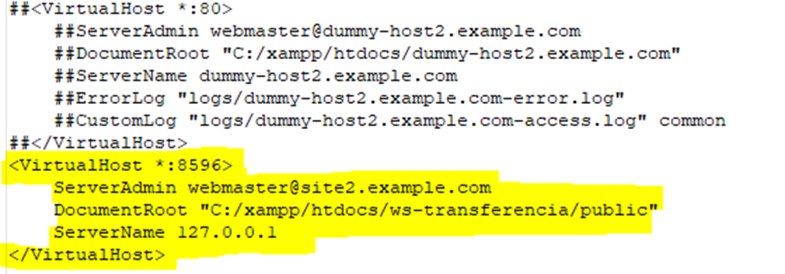
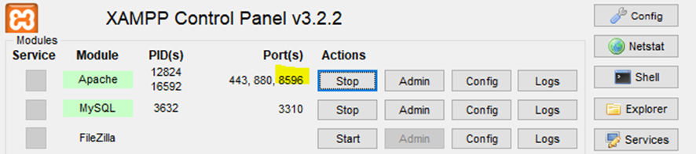

# Manual de configuración xampp para transferencia de venta

## 1	 DESCRIPCIÓN
Este manual se ha desarrollado para detallar el proceso de configuración del servidor xampp para poder realizar transferencia de venta

## 2	PROCEDIMIENTO
### 2.1	Copiar carpeta ws-transferencia
Copiar sitio ws-transferencia en la carpeta htdocs, estos son los nuevos archivos de transferencia de venta. 

Una vez copiado el sitio, se debe desintalar el servicio jar de transferencia de venta.

2.2	Configuración del servidor
Levantar el puerto 8596 en el servidor xampp. Dirigirse a xampp/apache/conf/httpd.conf

Buscar la configuración Listen en el archivo httpd.conf y digitar Listen 8596

De esta manera se configura el servidor xampp para levantar el puerto 8596 para el funcionamiento de transferencia de venta.

### 2.3	Configuración de proyecto
Direccionar el puerto 8596 a la carpeta de transferencia de venta. Esto se debe configurar el siguiente archivo C:/xampp/apache/conf/extra/httpd-vhosts.conf

Se debe copiar la siguiente línea para direccionar el puerto 8596 a la carpeta de xampp 

Guardar la configuración y reiniciar el xampp se debe validar que el puerto se active al reiniciar.

